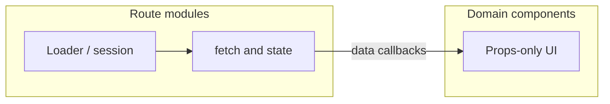

# EduAI Core — UI Skeleton & Frontend Tests (Implementation Plan)

**Audience:** Engineering teammates executing the sprint  
**Scope:** [`apps/core`](apps/core) only (per team decision)  
**Goal:** Every **domain** component renders in isolation via props; Vitest tests cover render + empty/missing data. No new API wiring in this phase.

---

## 1. What we are building (and not building)

| In scope | Out of scope |
|----------|----------------|
| Props, exported types, layout/structure for **32 domain components** | AI Tutor / Question Maker apps |
| Co-located `*.test.tsx` under [`apps/core/app/tests/unit/`](apps/core/app/tests/unit/) | Backend/route handler changes |
| Extract `fetch` / hooks **out of** the 4 components that still own I/O | New features (topics UI, Analytics nav, etc.) |
| Empty-state / loading / error UI via props | E2E (Playwright lives in repo root; separate effort) |

**shadcn primitives** ([`apps/core/app/components/ui/`](apps/core/app/components/ui/) — 57 files): treat as **vendor-complete**. Do not refactor unless a primitive is broken. Optional: one shared smoke test file if time permits (not blocking acceptance).

---

## 2. Component audit (source of truth)

**Status legend**

- **exists** — File present, used on a real route (may still contain fetch/hooks → skeleton will strip I/O)
- **stubbed** — Placeholder, demo, or unwired (`#` nav, hardcoded demo, zero imports)
- **missing** — No component file for a product area (none required for current Core routes)

**Roles:** `ADMIN` | `PROFESSOR` | `TA` | `STUDENT` (session-gated pages allow all authenticated roles unless noted)

### 2.1 Domain components (skeleton + tests required)

| UI Component | Applies To (Role / View) | Backend Endpoint | Status | Tests today |
|--------------|--------------------------|------------------|--------|-------------|
| `login-form` | Public — `/auth/login` | `POST /api/auth/sign-in/email` (route action) | exists | yes |
| `register-form` | Public — `/auth/register` | `POST /api/auth/sign-up/email` | exists | yes |
| `app-sidebar` | Authenticated shell — dashboard, chat, courses, settings, admin | None (nav only); ADMIN links → `/admin/*` | exists (partial **stubbed** nav: Analytics, Reports → `#`) | no |
| `site-header` | Authenticated + marketing layouts | None | exists | no |
| `site-navigation` | Public — `/team` | None | exists | no |
| `site-footer` | Public — `/team` | None | exists | no |
| `animated-background` | Public — `/team` | None | exists | no |
| `team-member-card` | Public — `/team` | None | exists | no |
| `project-goals` | Public — `/` (landing) | None | exists | no |
| `nav-main` | Sidebar — all authenticated views | None | exists | no |
| `nav-secondary` | Sidebar | None (**stubbed** `url: "#"`) | stubbed | no |
| `nav-documents` | Sidebar (commented out in sidebar) | None | stubbed / unwired | no |
| `nav-user` | Sidebar — session user menu | `POST /api/auth/sign-out` (via route) | exists | no |
| `chat-welcome` | All — `/chat` | None | exists | no |
| `chat-message` | All — `/chat` | None (message props) | exists | no |
| `chat-input` | All — `/chat` | None (callbacks props) | exists | no |
| `chat-typing-indicator` | All — `/chat` | None | exists | no |
| `suggested-prompts` | All — `/chat` | None | exists | no |
| `markdown-renderer` | Chat + materials | None | exists | no |
| `system-prompt-settings` | All — `/chat` | `POST /api/chat` (save prompt — today in **route**) | exists | no |
| `api-key-settings` | Chat (if surfaced) | localStorage via `useApiKeys` (**hook in component today**) | exists — **refactor** | no |
| `course-materials-upload` | All — `/courses/:courseId` | `GET/POST /api/courses/:courseId/materials` (**fetch in component**) | exists — **refactor** | no |
| `course-selector` | Unwired | `GET /api/courses` (**fetch in component**) | exists — **refactor** | no |
| `users-table` | **ADMIN** — `/admin/users` | `GET/PATCH/DELETE /api/users` (route owns fetch) | exists | no |
| `user-form-dialog` | **ADMIN** — `/admin/users` | `POST/PATCH /api/users` | exists | no |
| `providers-table` | **ADMIN** — `/admin/ai-models` | `GET/PATCH/DELETE /api/ai-providers` | exists | no |
| `provider-form-dialog` | **ADMIN** — `/admin/ai-models` | `POST/PATCH /api/ai-providers` | exists | no |
| `ai-models-table` | **ADMIN** — `/admin/ai-models` | `GET/PATCH/DELETE /api/ai-models` | exists | no |
| `model-form-dialog` | **ADMIN** — `/admin/ai-models` | `POST/PATCH /api/ai-models`; `GET /api/ollama-models` (**fetch in component**) | exists — **refactor** | no |
| `section-cards` | None (shadcn demo) | None | stubbed / orphan | no |
| `chart-area-interactive` | None (shadcn demo) | None | stubbed / orphan | no |
| `data-table` | None (shadcn demo) | None | stubbed / orphan | no |

### 2.2 Route-owned UI (not separate components — document only)

These views live in [`apps/core/app/routes/`](apps/core/app/routes/) and **call APIs directly** today. Skeleton work does **not** add new route components unless you split for testability later.

| View / Route | Roles | Primary endpoints |
|--------------|-------|-------------------|
| `/dashboard` | All authenticated | None (loader session only) |
| `/chat` | All authenticated | `GET /api/courses`, `GET /api/chats/:id`, `POST /api/chat` |
| `/courses` | List: all; create: **ADMIN**; edit: **ADMIN** / owner **PROFESSOR** | `GET/POST/PATCH /api/courses` |
| `/courses/:courseId` | Materials enforced server-side | `GET/POST .../materials` |
| `/settings` | All authenticated | Better Auth API keys under `/api/auth/*` |
| `/admin/users` | **ADMIN** | `/api/users` CRUD |
| `/admin/ai-models` | **ADMIN** | `/api/ai-providers`, `/api/ai-models` |

**API with no Core UI yet:** `GET/POST/DELETE /api/courses/:courseId/topics` — **missing** product surface; out of this sprint unless explicitly added.

### 2.3 shadcn / chat primitives (reference row)

| UI Component | Applies To | Backend Endpoint | Status |
|--------------|------------|------------------|--------|
| `components/ui/*` (57 files) | Shared primitives | None | exists (library) |

---

## 3. Target architecture (presentational boundary)



**Skeleton contract (every domain component):**

1. **`ComponentNameProps`** exported (or co-located `types.ts` for large forms)
2. **No** `fetch`, `useChat`, `useApiKeys`, or route loaders inside the component file
3. **Callbacks** for user actions: `onSubmit`, `onDelete`, `onToggle`, etc.
4. **Empty states:** render stable UI when `items={[]}`, `user={undefined}`, `course={null}`, `isLoading={false}` without throwing
5. **Barrel export** (optional): [`apps/core/app/components/index.ts`](apps/core/app/components/index.ts) for teammate imports in tests — add only if team wants single import path

**Refactor priority (embedded I/O today):**

1. [`course-materials-upload.tsx`](apps/core/app/components/course-materials-upload.tsx)
2. [`course-selector.tsx`](apps/core/app/components/course-selector.tsx)
3. [`chat/api-key-settings.tsx`](apps/core/app/components/chat/api-key-settings.tsx)
4. [`admin/model-form-dialog.tsx`](apps/core/app/components/admin/model-form-dialog.tsx)

Move I/O to parent routes; pass `materials`, `courses`, `apiKeys`, `ollamaModels`, and handlers as props.

**Orphan demos (`section-cards`, `chart-area-interactive`, `data-table`):** either delete in a follow-up PR or skeleton as static presentational demos with tests marking `data-testid="demo"` — team choice; default **leave unwired**, add minimal render tests so they do not rot.

---

## 4. Test strategy (match existing Core patterns)

**Runner:** Vitest + jsdom — [`apps/core/vitest.config.ts`](apps/core/vitest.config.ts)  
**Setup:** [`apps/core/app/tests/setup.ts`](apps/core/app/tests/setup.ts) (`jest-dom`, `ResizeObserver` mock)  
**Reference tests:** [`LoginForm.test.tsx`](apps/core/app/tests/unit/LoginForm.test.tsx), [`RegisterForm.test.tsx`](apps/core/app/tests/unit/RegisterForm.test.tsx)

**Naming:** `apps/core/app/tests/unit/<ComponentName>.test.tsx` (PascalCase file matching component)

**Each domain component test file — minimum 2 describes:**

```ts
describe('ComponentName — rendering', () => { /* happy path with minimal props */ });
describe('ComponentName — missing data', () => { /* empty arrays, null entity, no user */ });
```

**Patterns:**

- `render(<Component {...minimalProps} />)` + `screen.getByRole` / `getByText`
- No network: never hit real `/api/*`
- Wrap with small test providers only when unavoidable (`SidebarProvider` for nav components — mirror route layout)
- For dialog/table components: pass `open={true}` / fixture rows so portals render in jsdom

**Coverage target:** 32 domain component test files (30 new + 2 existing). Run: `cd apps/core && npm run test`

---

## 5. Work breakdown (suggested teammate lanes)

| Lane | Components | Deliverable |
|------|------------|-------------|
| **A — Auth & marketing** | `login-form`, `register-form`, `site-*`, `animated-background`, `team-member-card`, `project-goals` | Props for `fieldErrors`, `isSubmitting`; tests for error + empty labels |
| **B — Shell / nav** | `app-sidebar`, `nav-main`, `nav-secondary`, `nav-documents`, `nav-user`, `site-header` | Props: `user`, `navItems`, `activePath`; stubbed `#` links render but are visually distinct; tests per role (hide admin links for non-ADMIN) |
| **C — Chat** | All under `components/chat/` | Extract settings/key state to props; tests for empty messages, no model selected, disabled input |
| **D — Courses** | `course-materials-upload`, `course-selector` | Props-only + tests: no materials, upload disabled, empty course list |
| **E — Admin** | 6 files under `components/admin/` | Props: `users`, `providers`, `models`, dialog `open`, loading; tests for empty tables and form validation display |
| **F — Orphans (optional)** | `section-cards`, `chart-area-interactive`, `data-table` | Static render tests only |

**Suggested order:** D → E → C → B → A → F (highest I/O coupling first).

---

## 6. Acceptance criteria mapping

| Criterion | How we verify |
|-----------|----------------|
| All EduAI **Core domain** components render in isolation | Storybook not required; each has RTL test with minimal props |
| Frontend tests pass for full component surface | `cd apps/core && npm run test` green; 32/32 domain files |
| No API/hooks in components | Grep gate: `fetch(`, `useApiKeys`, `useChat` absent under `app/components/` except `ui/` |
| Graceful missing data | Every test file includes `missing data` describe block |

---

## 7. Definition of done (per component PR)

- [ ] `*Props` type exported
- [ ] Component is presentational (I/O in route or parent)
- [ ] `*.test.tsx` added/updated with rendering + missing-data cases
- [ ] `npm run test` and `npm run typecheck` pass in `apps/core`
- [ ] Audit table row updated (Status → **exists (skeleton)** )

---

## 8. Handoff artifacts for the team

1. **This plan** — implementation guide  
2. **Audit table (Section 2.1)** — copy into Notion/Linear; update Status column as PRs merge  
3. **API reference** — [`apps/core/app/routes.ts`](apps/core/app/routes.ts) + handlers in [`apps/core/app/routes/api/`](apps/core/app/routes/api/) for wiring phase *after* skeleton  

**Estimated volume:** ~30 new test files, ~4 component refactors with route touch-ups, 2–4 PRs by lane if parallelized.

---

## 9. Post-skeleton (explicitly later)

- Wire `course-selector` into `/chat` or `/courses`  
- Topics admin UI for `/api/courses/:courseId/topics`  
- Replace `#` sidebar links or remove stubbed nav items  
- Extensions (AI Tutor / Question Maker) — separate audit if scope expands
