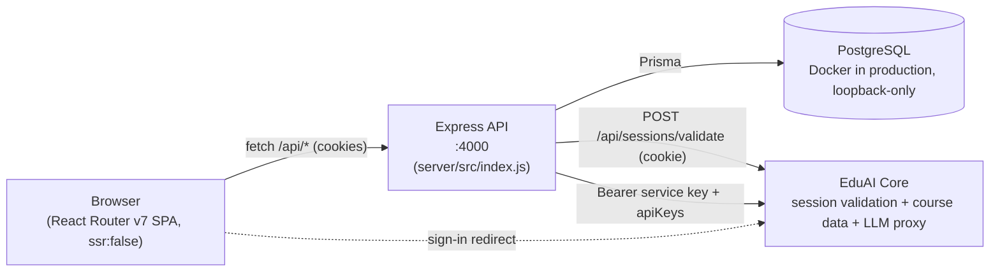
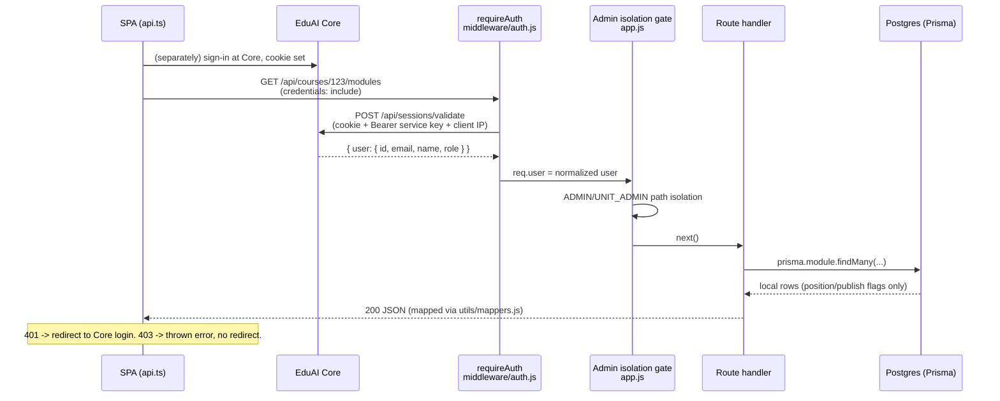
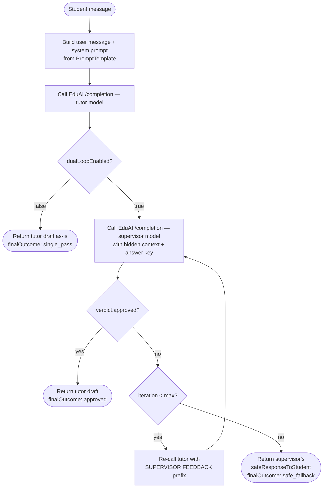
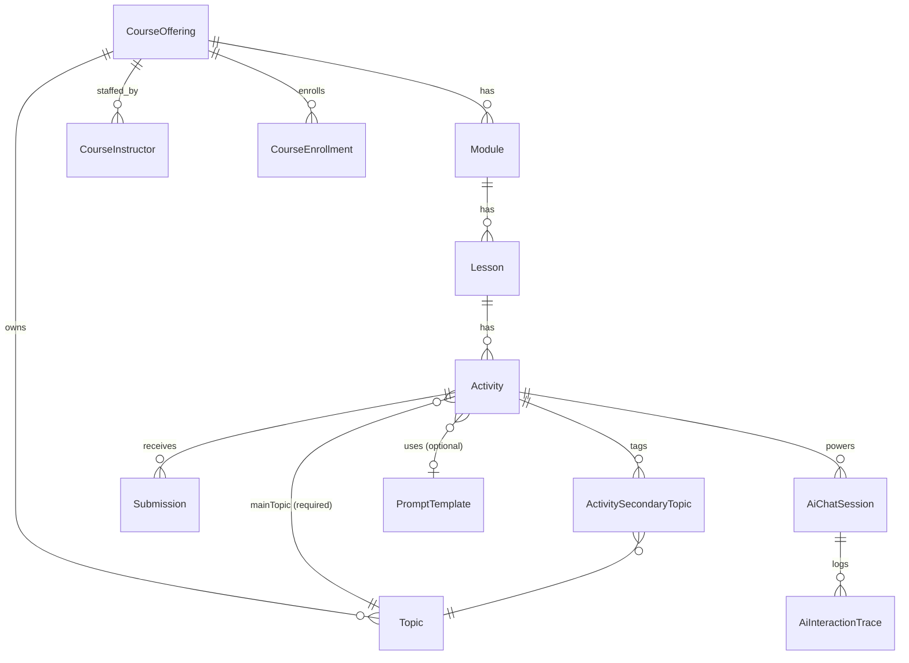

# AI Tutor — Architecture

This document describes the runtime architecture, request lifecycle, and the cross-cutting subsystems
that maintainers must understand before changing core code paths. For product-level / non-technical
context (user roles, features, workflows), see [`SYSTEM_OVERVIEW.md`](SYSTEM_OVERVIEW.md).

> Inline code comments reference this document by stable section anchors. Renaming sections will
> break those references — prefer adding a new section over renaming an existing one.

---

## High-Level Topology

The platform is composed of independent processes that communicate over HTTP. The frontend
is a static SPA; nothing about it is server-rendered.



There is no separate "EduAI" AI service in this deployment — **EduAI Core is both the identity
provider and the LLM proxy**. AI Tutor's own database (`CourseOffering` and everything under it) holds
no course metadata of its own; course fields, publish state, and enrollment are read through live from
Core on (almost) every request. See [Data Model Overview](#data-model-overview-prisma) and
[Authentication Flow](#authentication-flow) below.

| Component | Process | Source | Default Port |
| --- | --- | --- | --- |
| SPA | Static assets served by Apache in production; `vite dev` locally | `app/` | `3001` (pinned in `vite.config.ts`, regardless of how `vite dev` is invoked) |
| API | Node/Express, a systemd-managed process in current production (see [`docs/DEPLOYMENT.md`](DEPLOYMENT.md) for the two coexisting production mechanisms, one of which still uses PM2) | `server/src/index.js` | `4000` |
| DB | PostgreSQL (Docker locally) | `docker-compose.yml` (dev/legacy); a dedicated non-Docker `ai_tutor_prod` role/db in current production | `127.0.0.1:54321` locally |
| Core | External service (this monorepo's `apps/core`) | not in this app's tree | `3000` (dev default) |

See [`DEPLOYMENT.md`](DEPLOYMENT.md) for exactly what runs where in production — it differs from a
casual reading of the Dockerfile.

---

## Provider Stack at App Root

The SPA's React tree is wrapped by five providers, in this exact order, in
[`app/root.tsx`](../app/root.tsx):

```tsx
<AuthProvider initialUser={null}>
  <BugReportProvider>
    <TourProvider>
      <AssistiveModeProvider>
        <UiPreferencesProvider>
          <ThemeSyncInitializer />
          <Outlet />
        </UiPreferencesProvider>
      </AssistiveModeProvider>
    </TourProvider>
  </BugReportProvider>
</AuthProvider>
```

(`ThemeProvider` and `Toaster` wrap this whole tree one level further out, in `Layout()` — they render
for every user including the pre-auth home page, so they stay outside `AuthProvider`.)

**Ordering is load-bearing.** Do not rearrange without understanding the dependencies:

| Provider | Source | Why this position |
| --- | --- | --- |
| `AuthProvider` | [`app/hooks/useLocalUser.tsx`](../app/hooks/useLocalUser.tsx) | Outermost. On mount it calls `GET /api/me` (with retry, since a fresh dev-stack API may not be listening yet) and exposes the session user via context. Every other provider and route loader assumes auth state is resolvable. |
| `BugReportProvider` | [`app/components/bug-report/BugReportProvider.tsx`](../app/components/bug-report/BugReportProvider.tsx) | Wraps everything inside it because `useBugReportCapture` monkey-patches `window.fetch` and `console.{log,warn,error}` on mount. It must be live before any user-facing flow starts producing logs a bug report might want to capture. |
| `TourProvider` | [`app/components/TourProvider.tsx`](../app/components/TourProvider.tsx) | Consumes `useLocation` / `useNavigate` and drives DOM-level highlighting via `driver.js`; depends on the route subtree being mounted. |
| `AssistiveModeProvider` | [`app/components/settings/assistive-mode.tsx`](../app/components/settings/assistive-mode.tsx) | Reads its preference from `localStorage` (this is a client-only SPA — there is no server-resolved initial value to hand it) and toggles `<html data-assistive>`. |
| `UiPreferencesProvider` | [`app/components/settings/ui-preferences.tsx`](../app/components/settings/ui-preferences.tsx) | Same `localStorage`-backed pattern, for density and reduced-motion (`data-density` / `data-reduce-motion`). |

If `AuthProvider` is moved inside `BugReportProvider`, the patched `fetch` runs before the
auth bootstrap and can capture noise from unauthenticated `/api/me` calls in every bug report.
If `TourProvider` is moved outside the route tree, `useLocation` will throw.

---

## Authentication Flow

**There is no local login, no JWT, and no Better Auth instance anywhere in this app.** Session
validation is delegated entirely to EduAI Core. If you find a doc, comment, or environment-variable
list that mentions Better Auth, `genericOAuth`, `EDUAI_DISCOVERY_URL`, `EDUAI_CLIENT_ID`, or a
`server/src/auth.js` file for this app, it describes an earlier design this app no longer has — there
is no such file under `server/src/`.

What actually happens:

1. The browser signs in against **Core**, not this app. AI Tutor's own home page (`/`) has no
   credential form; when there's no session it redirects to Core's login (`getCoreLoginUrl()` in
   `app/lib/coreUrl.ts`), and the user comes back to AI Tutor already carrying Core's session cookie.
2. Every request from the SPA sets `credentials: 'include'` (`app/lib/api.ts`), so the browser attaches
   that cookie automatically.
3. `middleware/auth.js`'s `requireAuth` runs on every `/api/*` request (except `/api/health`,
   `POST /api/logout`, and `/api/internal/*`). It forwards the incoming `Cookie` header, plus this
   server's own `EDUAI_API_KEY` as a `Bearer` header and the caller's real IP as
   `X-EduAI-Client-Ip`, to Core's `POST /api/sessions/validate`. Core's JSON response supplies
   `req.user = { id, email, name, role }` (with an unrecognized role normalized down to `STUDENT`).
   **The role check happens on every request** — there is no session-cached role that could go stale.
4. `GET /api/me` additionally promotes a base `STUDENT` role to the effective role `TA` when the
   caller's Core course list shows them teaching at least one course as a TA
   (`server/src/routes/authentication.js`). This is the *global effective role* surfaced to the
   frontend; it is intentionally distinct from a caller's live enrollment role on one *specific*
   course (see `viewerEnrollmentRole` in the lesson breadcrumb response) — a global-effective TA can
   still be a plain `STUDENT` on a course they aren't assisting with, and several routes (answer
   submission, the three AI-tutoring endpoints) check the per-course role, not the global one, for
   exactly that reason.
5. `POST /api/logout` proxies to Core's own `/api/auth/sign-out` server-to-server (bypassing the
   browser's CORS restrictions on a cross-origin sign-out call), using the service key. It is exempt
   from `requireAuth` so signing out an already-invalid session is a no-op, not a 401.
6. On the frontend, a 401 from any `/api/*` call redirects to Core's login page
   (`window.location.href = getCoreLoginUrl()` inside `http()` in `app/lib/api.ts`); a 403 is
   surfaced as a normal thrown error instead — the caller is already authenticated, so bouncing them
   back to login would just loop.



### Role model

Five roles, defined in `@eduai/types`' `UserRole` plus the local `"TA"` overlay
(`app/lib/rbac/permissions.ts`): `ADMIN`, `UNIT_ADMIN`, `INSTRUCTOR`, `TA`, `STUDENT`. `TA` is never a
role Core assigns to the platform account directly — it exists only as the derived overlay described
above. `UNIT_ADMIN` scopes to a set of `authorizedUnits` (Core departments); everything else is either
platform-wide (`ADMIN`) or resolved per course from a live Core enrollment/instructor check.

### Live course authorization, not a cached mirror

`CourseInstructor` and `CourseEnrollment` exist locally, but they are a **sync mirror, not the source
of authorization truth**. Every staff-only write and every AI-tutoring/answer-submission request
re-checks the caller's *live* Core role via `services/liveCoursePrincipal.js` /
`services/enrollmentSync.js` before proceeding — a stale local row cannot grant access after a Core-side
revocation. The local tables exist so ordinary reads (course lists, rosters) don't have to make a Core
round trip on every request; they're refreshed on a short TTL (30s) and on-demand.

---

## AI Dual-Loop Architecture

Located in [`server/src/services/aiGuidance.js`](../server/src/services/aiGuidance.js). Three
exported entry points (`generateTeachResponse`, `generateGuideResponse`, `generateCustomResponse`)
all funnel through `generateWithSupervisor()` -> `supervisedGenerate()`. See
[`two-agent-supervisor-system.md`](two-agent-supervisor-system.md) for the complete design, including
the JSON verdict contract, the iteration loop, and how a supervisor JSON-parse failure is actually
handled (it is *not* a tutor-only recovery pass, contrary to an earlier version of that doc).

### The loop, at a glance



### Modes

| Mode (API) | Endpoint | Prompt template slug | Purpose |
| --- | --- | --- | --- |
| `teach` | `POST /api/activities/:id/teach` | `learning-prompt` | Open-ended explanation around a topic. |
| `guide` | `POST /api/activities/:id/guide` | `exercise-prompt` | Socratic hints for a specific question (uses `config.question/options/answer`). |
| `custom` | `POST /api/activities/:id/custom` | (uses `activity.customPrompt` directly) | Per-activity instructor-authored prompt. |

### Non-streaming

The EduAI/Core `/completion` call is made with `streaming: false`. The frontend's chat UI shows a
"Thinking…" indicator and swaps in the full response once the whole tutor↔supervisor exchange
settles — there is no token-by-token streaming anywhere in this pipeline.

---

## Data Model Overview (Prisma)

Source of truth: [`server/prisma/schema.prisma`](../server/prisma/schema.prisma). This section
calls out the relationships and invariants that the rest of the codebase relies on.

### Course content tree



Notable invariants:

- **`CourseOffering` is a pure anchor row.** It carries only `id`, `coreOfferingId` (unique, required),
  `createdAt`, `updatedAt`. Title, description, department, dates, `isPublished`, term, year, and
  `aiInstructions` are **not columns on this table** — they are Core-owned and resolved live on every
  read through `services/courseResolver.js` + `mapCourseOffering()` in `utils/mappers.js`. A course
  never exists without a `coreOfferingId`; there is no such thing as a native, Core-less offering.
- **Publish state for a course is never stored locally either.** `resolveIsPublished()` /
  `isCoursePublishedLive()` in `courseResolver.js` read Core's `isPublished` field and **fail closed**
  (`false`) when Core is unreachable or the offering isn't in the resolved batch — an unpublished-or-
  unknown course is never shown to a student as a fallback. Modules and lessons, by contrast, *do*
  store their own `isPublished` column locally; only the course level is Core-owned.
- **`Activity.mainTopicId` is non-nullable.** Every activity must have exactly one main topic.
  Secondary topics are M:N via `ActivitySecondaryTopic`.
- **`Activity.config` is a free-form `Json` column** carrying `question`, `options`, `answer`,
  `hints`, and `questionType` (`MCQ` or `SHORT_TEXT`). Mappers normalize `options` to
  `{ choices: string[] }` on the wire even though the column may store a bare array.
- **Three per-activity mode flags** — `enableTeachMode`, `enableGuideMode`, `enableCustomMode` —
  control which `/teach|/guide|/custom` endpoints are available for that activity. At least one must
  stay `true`; both the client editor and the server re-validate this.
- **`Submission.attemptNumber`** is a simple monotonically-increasing per-student counter
  (`@@unique([userId, activityId, attemptNumber])`); rows are not overwritten on resubmit.
- **`AiChatSession` has no uniqueness constraint on `(userId, activityId, mode)`** — the model's only
  unique column is `chatId` (the Core chat id). A student can hold multiple sessions per
  (activity, mode) over time; that's what the chat-history panel lists.
- **`CourseInstructor` / `CourseEnrollment` are a Core sync mirror**, not authorization truth — see
  [Live course authorization](#live-course-authorization-not-a-cached-mirror) above.

### System settings

`SystemSetting` is a flat key/value table (`server/src/services/systemSettings.js`). Two keys are in
active use:

| Key | Used for |
| --- | --- |
| `EDUAI_API_KEY` | Admin-settable override for the service key used on outbound EduAI/Core calls. Encrypted at rest (AES-256-GCM) when `ENCRYPTION_KEY` is configured; falls back to plaintext with a console warning outside production, and fails closed (refuses to write) in production with no `ENCRYPTION_KEY` set. Falls back to the `EDUAI_API_KEY` env var when unset. **This DB-stored override is never used to authenticate *to* Core** (`serviceAuthHeader()` always uses the raw env var) — only Core's own env key is what Core's mutation guard validates against. |
| `AI_MODEL_POLICY` | JSON blob: the tutor/supervisor model allow-list, defaults, `dualLoopEnabled`, `maxSupervisorIterations`. Managed via `/api/admin/settings/ai-model-policy`; see `services/aiModelPolicy.js`. |

### No Better Auth tables

There are no `User`, `Session`, `Account`, or `Verification` tables in this schema. Identity is owned
entirely by Core; every local row that needs to reference a user stores a bare `userId` string (Core's
CUID) with no local foreign key.

---

## Tour System Contract

Tours are powered by [driver.js](https://driverjs.com) and orchestrated by
[`app/components/TourProvider.tsx`](../app/components/TourProvider.tsx) plus the engine in
[`app/lib/tours/`](../app/lib/tours/). Three tours are defined
(`app/lib/tours/tour-definitions.ts`): `student-journey`, `student-lesson-help`, and
`unit-admin-orientation` — the last is staff-voiced and scoped to exactly the `/dashboard` and
`/instructor` routes it walks.

The contract that route components must honor:

| Attribute | Purpose | Example |
| --- | --- | --- |
| `data-tour="<step-id>"` | Marks an element as the target for a tour step. The step's `target` selector in `tour-definitions.ts` is `[data-tour="<step-id>"]`. | `<header data-tour="student-dashboard-header">` |
| `data-tour-route="<href>"` | On a "selectable" card, tells the engine which route to follow next when this card is highlighted. Read via `readRouteFromElement()` in `tour-utils.ts` and stored in `selectedCourseRoute` / `selectedModuleRoute` / `selectedLessonRoute` on the session context. | `data-tour-route={`/student/courses/${course.id}`}` |
| `emptyTarget` (in the step definition, not a DOM attribute) | An optional selector for an empty-state sentinel. When it appears before the real target, the step and everything downstream that depends on it are skipped immediately instead of stalling on the full 4s timeout. | A course with no modules yet. |

**Removing or renaming `data-tour`/`data-tour-route` silently breaks the tour** — `waitForElement()`
in `tour-utils.ts` will time out after 4s and the step will be skipped via
`moveSessionAfterMissingTarget`. There is no compile-time guard; grep for the value before deleting
markup.

---

## Bug Report Capture

Implementation: [`app/hooks/useBugReportCapture.ts`](../app/hooks/useBugReportCapture.ts),
mounted exactly once via `BugReportProvider`.

On mount the hook **monkey-patches global APIs**:

- `console.log`, `console.warn`, `console.error` — wrappers push entries onto a ring buffer
  (max 200), then call the original.
- `window.fetch` — wrapper times the request and pushes `{ method, url, status, durationMs, timestamp }`
  onto a network ring buffer (max 100). The original `fetch` is invoked unchanged so app behavior is
  unaffected; response bodies are not captured.

On unmount the originals are restored. **Do not mount this provider more than once** — `patchedRef`
guards against a double-patch in the same render but does not protect against multiple
`BugReportProvider` instances.

Screenshots are produced by lazily importing `html2canvas` only when the user opens the bug-report
dialog. The result is cached for 5 seconds (`SCREENSHOT_CACHE_WINDOW_MS`) so reopening the dialog
quickly does not re-render the page, and is captured as JPEG (not PNG) to stay under Core's screenshot
size cap.

The dialog reads `consoleLogs`, `networkLogs`, and `screenshot` via `getCapturedData()` and posts
them to `POST /api/bug-reports` along with the page URL, user agent, and the
`courseOfferingId/moduleId/lessonId/activityId` context that route components set on the
provider via `setContext()`.

---

## Frontend↔Backend Coupling Seams

These are the most common source of "everything compiles but the page is blank" bugs. There is
**no shared TypeScript type generation** across the boundary; the contract is maintained by hand
(though the frontend does decode every response against a Zod schema in `app/lib/api-schemas.ts` at
the wire boundary, which turns a drifted shape into a thrown parse error instead of a silent
`undefined`).

### 1. `app/lib/api.ts` ↔ `server/src/utils/mappers.js`

The mappers in `mappers.js` define the JSON shape the server sends. The TypeScript types in
`app/lib/types.ts` and the Zod schemas in `app/lib/api-schemas.ts` must mirror those shapes by hand.

When you change a mapper:

1. Update the matching type in `app/lib/types.ts` and the matching schema in `app/lib/api-schemas.ts`.
2. Update the call site in `app/lib/api.ts` if the new field is part of a request payload.
3. Update any consumer that destructures the old shape.

### 2. `shared/schemas/aiGuidance.js` request schemas

The Zod schemas in [`shared/schemas/aiGuidance.js`](../shared/schemas/aiGuidance.js)
(`TeachRequestSchema`, `GuideRequestSchema`, `CustomRequestSchema`,
`ActivityFeedbackRequestSchema`) are imported by the server's activity routes for validation. The
frontend's `api.sendTeachMessage` / `sendGuideMessage` / `sendCustomMessage` payload shapes in
`app/lib/api.ts` must keep field names and types aligned. Renaming `apiKey` -> `apiToken` on either
side would 400 every AI request.

### 3. Tour DOM selectors

Covered above in [Tour System Contract](#tour-system-contract). Steps in
`app/lib/tours/tour-definitions.ts` reference DOM by `[data-tour="..."]` selectors, matched at
runtime via `document.querySelector` — there is no static checking.

---

## Further Reading

- Product / feature overview: [`SYSTEM_OVERVIEW.md`](SYSTEM_OVERVIEW.md)
- Deployment (systemd/Apache in current production, PM2 in the legacy path), Docker layout: [`docs/DEPLOYMENT.md`](DEPLOYMENT.md)
- Two-agent supervisor design: [`docs/two-agent-supervisor-system.md`](two-agent-supervisor-system.md)
- API endpoint reference: [`docs/api-reference.md`](api-reference.md)
- RBAC endpoint map: [`docs/rbac-endpoints-ai-tutor.md`](rbac-endpoints-ai-tutor.md)
- Contributor workflow + git hooks: [`../CONTRIBUTING.md`](../CONTRIBUTING.md)
