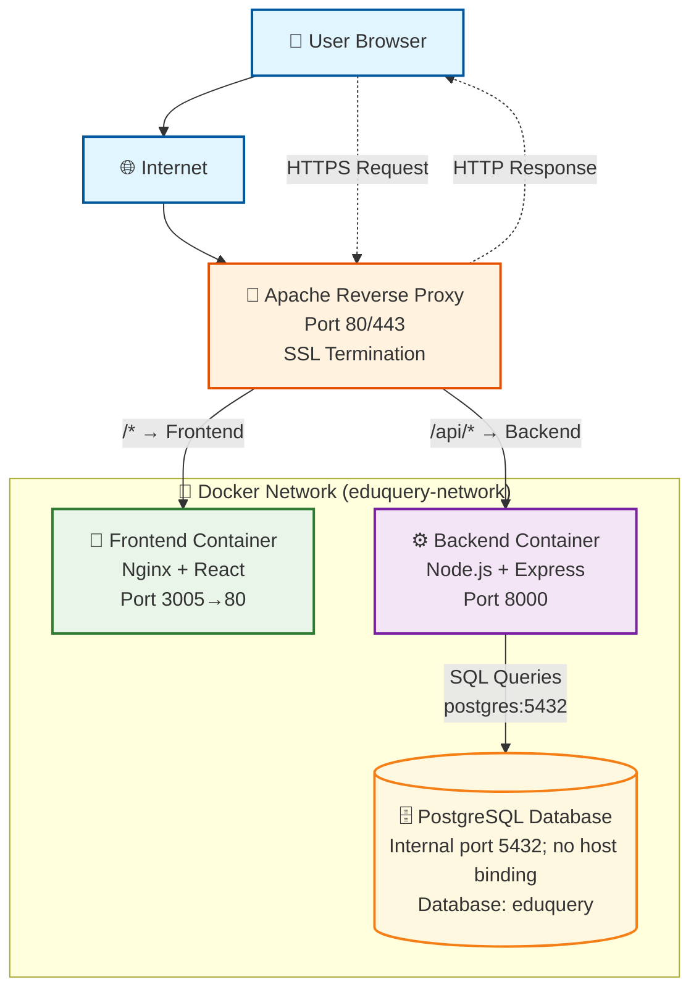
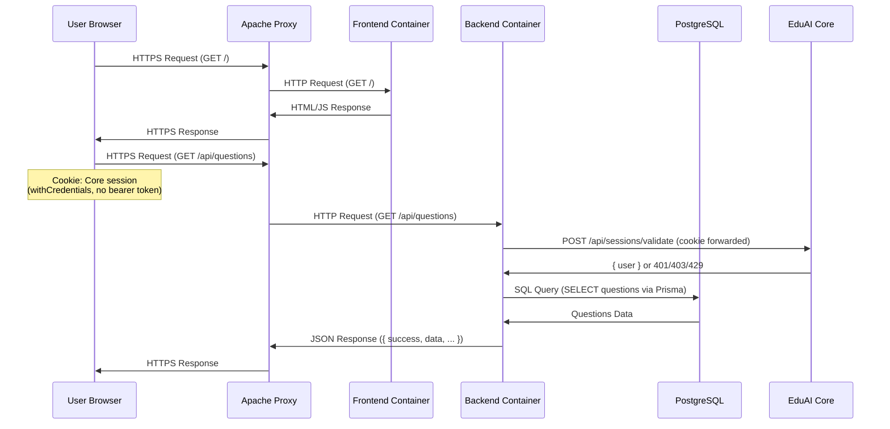

# Question Maker - Architecture Documentation

This document describes the technical architecture of the Question Maker application: how it is
deployed (Apache/Docker/Postgres — largely unchanged since this doc was first written) and how the
application itself is put together (which has changed substantially — no local accounts, Prisma
instead of Sequelize, and Canvas credentials now live in Core). Read `app/backend/src/app.js` and
`app/backend/prisma/schema.prisma` as the actual source of truth; this is a map, not a spec.

## Application architecture (current)

- **No local accounts.** Question Maker never issues a JWT or stores a password. The browser holds
  a Core session cookie; every request is authenticated by forwarding that cookie to Core's
  `POST /api/sessions/validate` (`src/middleware/auth.js`, `requireAuth`/`authenticateToken`). QM
  keeps only a thin local `User` row (id/email/name) for FK integrity — `services/authService.js`
  upserts it on first sight of a Core user, memoized per-process for `USER_ROW_CACHE_TTL_MS`.
- **Prisma, not Sequelize.** The data model lives in `app/backend/prisma/schema.prisma` (13 models:
  `User`, `Course`, `CourseAccess`, `Topics`, `QuestionMetadata`, `Variants`, `Assessments`,
  `AssessmentSections`, `SectionVariants`, `CanvasCourseMapping`, `VariantSelectionCursor`,
  `CanvasBankMapping`, `CanvasBankQuestionMapping`). Migrations under `prisma/migrations/` are applied
  with `prisma migrate deploy`; the old Sequelize `schema/` directory no longer exists.
- **Course is a thin anchor, not a full record.** A `Course` row is just `{ userId, coreCourseId }` —
  `name`/`code`/`department`/`term`/`year`/`description` are Core-owned and read through on every
  response (`services/courseListService.js`). Access to a course is resolved from **Core enrollment
  data**, not local ownership: `middleware/courseAccess.js` ranks callers `admin(4) > unit(3) >
  instructor(2) > ta(1) > student(0)` and fails closed when Core is unreachable.
- **Canvas credentials live in Core**, not in this database. QM proxies every Canvas call through
  Core's `/api/canvas/*` routes (`services/canvasService.js` + `services/coreApiService.js`); there is
  no `CanvasIntegration` table in `schema.prisma` and no encrypted-credential storage on this side.
  `utils/encryption.js` (AES-256-GCM) still exists but is dead code in production (its only caller is
  its own unit test) — the one-time migration script that copied any pre-existing QM-stored tokens
  into Core uses its own separate implementation instead
  (`scripts/lib/canvasCredentialReencrypt.js`); see [features/ENCRYPTION.md](features/ENCRYPTION.md).
- **AI calls are admission-controlled.** Every route that reaches EduAI (`middleware/aiAdmission.js`)
  reserves a caller-scoped provider-call budget and a shared operation deadline *before* touching the
  database or making an upstream call, on top of a per-caller `express-rate-limit` window.
- **A per-question advisory lock serializes mutations.** `services/questionMutationFence.js` wraps
  every question/variant write in a Postgres `pg_advisory_xact_lock`, so approving a variant and
  pushing it to Core (`services/variant-publish.js`) cannot race a concurrent edit.

## System Architecture Overview

```
Internet → Apache (Reverse Proxy) → Docker Containers
                                    ├── Frontend (Nginx + React)
                                    ├── Backend (Node.js API)
                                    └── Database (PostgreSQL)
```

## Component Details

### 1. Apache Reverse Proxy
**Role**: Entry point, SSL termination, request routing
**Configuration**: `/etc/httpd/conf.d/question-maker.conf`
**Ports**: 80 (HTTP), 443 (HTTPS)

**Routing Logic:**
- `/api/*` → Backend container (port 8000)
- `/*` → Frontend container (port 3005)

### 2. Frontend Container
**Base Image**: nginx:alpine
**Build Process**: Multi-stage Docker build
**Port**: 3005 (external) → 80 (internal)
**Technology Stack**: React + Vite + Nginx

**Build Stages:**
1. **Builder Stage**: Node.js 18 Alpine
   - Installs dependencies
   - Builds React app with Vite
   - Outputs static files to `/app/dist`

2. **Production Stage**: nginx:alpine
   - Copies built files from `/app/dist` to `/usr/share/nginx/html`
   - Serves static files via Nginx
   - Handles React Router with `try_files`
   - Includes API proxy configuration (fallback, not used in production)

### 3. Backend Container
**Base Image**: node:18-alpine
**Port**: 8000
**Technology Stack**: Node.js + Express.js
**Database**: PostgreSQL (separate container)

**Features:**
- RESTful API endpoints
- Authentication middleware
- Database connection pooling
- Health check endpoint

### 4. Database Container
**Base Image**: postgres:15-alpine
**Port**: 5432 (internal only; no host binding in production Compose)
**Database**: eduquery
**User**: postgres

**Features:**
- Persistent data storage
- Health checks
- Initialization scripts support

## Network Architecture

### Docker Network
**Name**: eduquery-network
**Type**: Bridge network
**Purpose**: Container-to-container communication

### Port Mapping
```
Host Port → Container Port → Service
3005     → 80            → Frontend (Nginx)
8000     → 8000          → Backend (Node.js)
—        → 5432          → Database (PostgreSQL; internal-only)
```

### Internal Communication
```
Browser → Apache → Frontend: http://localhost:3005/*
Browser → Apache → Backend: http://localhost:8000/api/*
Frontend Container → Backend Container: http://backend:8000 (via Docker network, fallback only)
Backend Container → Database Container: postgres:5432 (via Docker network)
```

**Note**: In production, API requests from the browser go through Apache proxy. The frontend container's Nginx also has API proxying configured, but it's not used since Apache handles routing.

## Data Flow

### 1. User Request Flow
```
User Browser
    ↓ HTTPS Request
Apache Reverse Proxy
    ↓ Route Decision
    ├── /api/* → Backend Container
    └── /* → Frontend Container
```

### 2. API Request Flow
```
User Browser
    ↓ HTTPS Request (POST /api/auth/login)
Apache Reverse Proxy
    ↓ HTTP Request (routes /api/* to backend)
Backend Container
    ↓ SQL Query
PostgreSQL Container
    ↓ User Data
Backend Container
    ↓ JSON Response (JWT Token)
Apache Reverse Proxy
    ↓ HTTPS Response
User Browser
    ↓ Stores token in localStorage
```

### 3. Static Asset Flow
```
Frontend Container (Nginx)
    ↓ Static File
Apache
    ↓ HTTPS Response
User Browser
```

## Security Architecture

### 1. Network Isolation
- **Docker Network**: Isolates containers from host
- **Port Mapping**: Only necessary ports exposed
- **Internal Communication**: Containers communicate via Docker network

### 2. Authentication Flow

Question Maker has no login form and issues no token. The browser already holds a Core session
cookie (set when the user signed into EduAI Core); every QM request forwards that cookie and Core
is the sole authority on whether it's valid.

```
Browser (has Core session cookie)
    ↓ Any QM request, cookie attached
Backend (middleware/auth.js: requireAuth)
    ↓ POST {cookie} → Core: /api/sessions/validate
Core
    ↓ { user } or 401/403/429
Backend
    ↓ upsert local User FK row (services/authService.js), attach req.user
Route handler
    ↓ per-course access from Core enrollment (middleware/courseAccess.js)
    ↓ JSON response
Browser
```

A 401 from an `/api/*` route redirects the browser to Core's login with a `redirect` back to this
extension (`app/frontend/src/services/api.ts` axios interceptor); non-API routes never see this app
without a valid cookie because `QmAppGate` (`src/components/auth/QmAppGate.tsx`) blocks rendering
until `/auth/me` succeeds.

### 3. CORS Handling
- **Problem**: Cross-origin requests blocked
- **Solution**: Apache proxy eliminates CORS
- **Result**: All requests appear same-origin

## Deployment Architecture

### 1. Build Process
```
Source Code
    ↓ Git Clone
Server
    ↓ Docker Build
    ├── Frontend Image (Nginx + React)
    └── Backend Image (Node.js)
    ↓ Docker Compose Up
Running Containers
```

### 2. Configuration Management
```
Environment Variables
    ↓ .env file
Docker Compose
    ↓ Container Environment
Application Containers
```

### 3. Data Persistence
```
PostgreSQL Data
    ↓ Docker Volume
Host Filesystem
    ↓ Persistent Storage
Container Restart
    ↓ Data Preserved
```

## Performance Considerations

### 1. Frontend Optimization
- **Static Assets**: Served by Nginx with caching headers
- **Build Optimization**: Vite production build
- **Asset Compression**: Gzip enabled in Nginx
- **CDN Ready**: Static assets can be moved to CDN

### 2. Backend Optimization
- **Connection Pooling**: Database connections reused
- **Health Checks**: Container health monitoring
- **Restart Policy**: Automatic container restart
- **Resource Limits**: Can be added to containers

### 3. Database Optimization
- **Persistent Storage**: Data survives container restarts
- **Health Checks**: Database availability monitoring
- **Connection Limits**: PostgreSQL connection management

## Monitoring and Logging

### 1. Container Logs
```bash
# View logs
docker compose logs frontend
docker compose logs backend
docker compose logs postgres

# Follow logs
docker compose logs -f frontend
```

### 2. Apache Logs
```bash
# Error logs
sudo tail -f /var/log/httpd/error_log

# Access logs
sudo tail -f /var/log/httpd/access_log
```

### 3. Health Monitoring
```bash
# Container status
docker compose ps

# Health checks
curl -f http://localhost:3005/
curl -f http://localhost:8000/
curl -f http://questionmaker.ok.ubc.ca/api/
```

## Scalability Considerations

### 1. Horizontal Scaling
- **Frontend**: Multiple Nginx containers behind load balancer
- **Backend**: Multiple API containers with shared database
- **Database**: Read replicas for read-heavy workloads

### 2. Vertical Scaling
- **Resource Limits**: CPU and memory limits per container
- **Database Tuning**: PostgreSQL configuration optimization
- **Caching**: Redis for session storage and caching

### 3. Load Balancing
- **Apache**: Can be replaced with dedicated load balancer
- **Docker Swarm**: Container orchestration
- **Kubernetes**: Full container orchestration platform

## Backup and Recovery

### 1. Database Backup
```bash
# Create backup
docker exec eduquery-postgres pg_dump -U postgres eduquery > backup.sql

# Restore backup
docker exec -i eduquery-postgres psql -U postgres eduquery < backup.sql
```

### 2. Configuration Backup
```bash
# Backup Docker Compose files
cp docker-compose.yml docker-compose.yml.backup
cp .env .env.backup

# Backup Apache configuration
sudo cp /etc/httpd/conf.d/question-maker.conf question-maker.conf.backup
```

### 3. Disaster Recovery
1. **Container Recovery**: `docker compose up -d`
2. **Data Recovery**: Restore from database backup
3. **Configuration Recovery**: Restore configuration files

## Technology Stack Summary

### Frontend
- **Framework**: React 19
- **Build Tool**: Vite
- **Web Server**: Nginx (production static build)
- **Styling**: Tailwind CSS + `@eduai/ui` (the shared cross-app design system)
- **Routing**: React Router 7, course-centric (`/courses/:courseId/...`)

### Backend
- **Runtime**: Node.js 18+ (ESM)
- **Framework**: Express
- **ORM**: Prisma (`app/backend/prisma/schema.prisma`)
- **Database**: PostgreSQL
- **Authentication**: None issued locally — Core session cookie, validated per-request against Core
- **API**: RESTful, JSON envelopes (`{ success, data, ... }` or the paginated `{ success, data, total, page, pageSize }` shape, #1044)

### Infrastructure
- **Containerization**: Docker + Docker Compose
- **Reverse Proxy**: Apache HTTP Server
- **Operating System**: Linux (UBC Server)
- **Domain**: questionmaker.ok.ubc.ca

## Architecture Diagram



## Request Flow Diagram



---

**Deployment**: Production (Apache reverse proxy + Docker Compose, per [docs/deployment/README.md](deployment/README.md))
