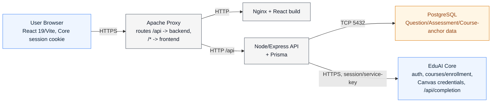

# Question Maker — Developer Guide

Concise technical guide for contributors. This mirrors current app behavior and complements the
end-user guide in `app/frontend/src/pages/HelpPage.tsx`.

## System Architecture (high level)

Question Maker has no accounts of its own and no direct connection to Canvas. Core is the source of
truth for identity, course/enrollment data, AI provider keys, and Canvas credentials; QM owns
question/variant/assessment authoring data and reaches everything else through Core.

## Backend (`app/backend`)

- **Data model**: `prisma/schema.prisma` — `User` (thin FK row, id/email/name only), `Course` (a bare
  `{userId, coreCourseId}` anchor — name/code/term/year are Core-owned and read through at request
  time), `CourseAccess` (a refreshable local mirror of the caller's Core enrollment, used for SQL-level
  list filtering), `Topics`, `QuestionMetadata`, `Variants`, `Assessments`, `AssessmentSections`,
  `SectionVariants`, `CanvasCourseMapping`, `CanvasBankMapping`, `CanvasBankQuestionMapping`,
  `VariantSelectionCursor` (round-robin state for the variant-assembly workflow). There is no
  `CanvasIntegration` model — Canvas credentials live in Core.
- **Middleware** (`src/middleware/`):
  - `auth.js` — `requireAuth`/`authenticateToken` validates the forwarded session cookie against
    Core's `POST /api/sessions/validate` and populates `req.user` with Core's user shape.
  - `courseAccess.js` — resolves a caller's per-course access level (`admin > unit > instructor > ta
    > student`) from Core enrollment/unit data, never from local ownership (#1114); fails closed when
    Core is unreachable. `resourceAccess.js` does the same for routes addressed by a variant/question/
    assessment id instead of a course id.
  - `aiAdmission.js` — every AI-touching route reserves a caller-scoped provider-call budget and a
    shared operation deadline before doing any DB or upstream work, layered on an `express-rate-limit`
    window.
  - `csrfOrigin.js` — rejects a cookie-authenticated unsafe request whose Origin/Referer/
    Sec-Fetch-Site doesn't match a trusted origin (a verified `Authorization: Bearer <EDUAI_API_KEY>`
    bypasses this, for server-to-server calls).
  - `canvasRequestContext.js` — publishes an `AbortSignal` (via `AsyncLocalStorage`) that cancels an
    in-flight Canvas→Core proxy call when the browser disconnects.
  - `errorHandler.js` — maps Prisma error codes (`P2002`/`P2003`/`P2025`) and known error shapes to
    HTTP responses; logs only an allowlisted set of fields (`utils/safeLogging.js`), never raw error
    messages or request bodies.
- **Services** (`src/services/`), one per domain:
  - Questions/variants: `questionService.js` (CRUD, MCQ normalization, extraction save flow,
    ordering), `questionMutationFence.js` (wraps every question/variant write in a per-question
    Postgres advisory lock so an approval and a concurrent edit can't race).
  - Assessments/sections: `assessmentService.js`, `assessmentSectionService.js`.
  - Assessment variant workflow: `assessmentVariantService.js` (baseline readiness, bank-variant
    generation, structure/metadata-similarity assembly, AI judge review), `assessmentVariantUtils.js`,
    `assessmentVariantMetadataScoring.js`.
  - AI: `aiService.js` (OCR extraction orchestration — chunking, dedupe, retry), `eduaiService.js`
    (the Core AI client — chat/completion, question generation, model catalog, connectivity probe),
    `extractionUtils.js` (pure text-chunking/dedupe helpers), `modelCatalog.js` (campus vs. cloud model
    ranking).
  - Course/Core sync: `courseListService.js` (RBAC-scoped course listing + Core read-through
    projection), `ensureCourseAnchor.js` (advisory-lock-guarded idempotent course-anchor create,
    shared by POST /api/course, auto-import, and ADMIN catalog materialization), `topicSyncService.js`,
    `importTaughtCoursesService.js` (auto-imports a caller's taught Core courses on `/auth/me` and
    course-list reads), `coreApiService.js` (thin fetch client for every Core HTTP call),
    `coreWiringService.js` (pushes an approved variant to Core as a `Question`, resolving/creating
    topics as needed).
  - Publish-to-Core orchestration: `variant-publish.js` (push, link, and roll back an approval on
    failure — a variant left approved with no `coreQuestionId` can never be reverted, so this is
    written to make that state unreachable), `variant-push-gate.js` (the one-line policy: push when
    approved and not yet linked).
  - Canvas: `canvasService.js` (quiz/bank import & export, all Canvas HTTP routed through Core),
    `questionBankService.js` (Core-backed question banks; QM's local rows only ever reference them by
    Core's bank id).
  - Bug reports: none locally — `routes/bug-reports.js` proxies straight to Core's bug-report API with
    the service key; there is no local `BugReport` model or `bugReportService.js`.
  - Encryption: `utils/encryption.js` (AES-256-GCM) — its only remaining caller is its own unit test;
    the one-time Canvas-credential migration script uses a separate, standalone implementation
    (`scripts/lib/canvasCredentialReencrypt.js`), not this file. See
    [features/ENCRYPTION.md](features/ENCRYPTION.md).
- **Routes** (`src/routes/`, all mounted in `src/app.js`):
  - `/api` — `routes/auth.js` (`GET /auth/me`, `POST /auth/logout`), `routes/bug-reports.js`
    (`POST /bug-reports`, `GET/PATCH /admin/bug-reports*`)
  - `/api/course` (`routes/course.js`)
  - `/api/topics` (`routes/topics.js` — read-only Core/local sync-status report)
  - `/api/questions` + `/api/questions/*` (`routes/questions.js`, `routes/variants.js`)
  - `/api/assessments` (`routes/assessments.js`)
  - `/api/assessment-variant` (`routes/assessmentVariant.js`)
  - `/api/eduai` (`routes/eduai.js`)
  - `/api/canvas` (`routes/canvas.js`)
  - `/api/internal` (`routes/internal.js` — service-key only, Core→QM cascade delete)

## Frontend (`app/frontend`)

- App wiring: `src/main.tsx`, `src/App.tsx` (React Router 7, lazy-loaded route chunks).
  - Real routes: `/dashboard`, `/courses`, `/courses/:courseId` (tabbed: Overview / Questions / Banks
    / Assessments / Canvas), `/courses/:courseId/questions/new`,
    `/courses/:courseId/questions/:questionId/edit`, `/courses/:courseId/banks/:bankId`,
    `/courses/:courseId/assessments/:assessmentId`,
    `/courses/:courseId/assessments/:assessmentId/variants`, `/library`, `/settings`, `/help`,
    `/admin/bug-reports` (ADMIN only). No `/login` route exists — `QmAppGate` blocks the whole app tree
    until Core's `/auth/me` resolves.
- State/providers: `contexts/AuthContext.tsx`, `GuidedTourContext.tsx`, `BugReportContext.tsx`.
- API client: `services/api.ts` (axios, `withCredentials: true`, redirects to Core login on a
  session-expired `401`).
- Domain services: `services/authService.ts`, `questionService.ts`, `assessmentService.ts`,
  `assessmentVariantService.ts`, `courseService.ts`, `eduaiService.ts`, `canvasService.ts`,
  `questionBankService.ts`, `topicsService.ts`, `bugReportApi.ts`, `pagination.ts`
  (`fetchAllPages` — walks a server-paginated endpoint's pages), `aiReviewHistoryStorage.ts`.
  - `services/apiKeyStorage.ts` stores AI provider keys **in Core** (`/api/eduai/provider-settings`,
    session-cookie authenticated) with an account-scoped, AES-GCM-encrypted `localStorage` fallback
    for when Core is unreachable.
- Key screens: `pages/CourseSelectionPage.tsx`, `pages/CourseDetailPage.tsx` (replaced the old
  `Homepage.tsx`), `pages/QuestionComposerPage.tsx` (a full-page create/variant/edit composer — the
  route-based entry point for "add a new question to the course" from `CourseDetailPage.tsx` and for
  "create a variant from the bank" from `CourseDetailPage.tsx`/`BankDetailPage.tsx`),
  `pages/AssessmentBuilderPage.tsx`, `pages/AssessmentVariantPage.tsx`, `pages/BankDetailPage.tsx`,
  `pages/QuestionBankPage.tsx` (the cross-course `/library`), `pages/HelpPage.tsx`,
  `pages/BugReportsAdminPage.tsx`.
  - `components/questions/AddQuestionDialog.tsx` (routed through `components/questions/
    QuestionModal.tsx`) still exists and is still actively used — not fully replaced by the composer:
    in `mode="view"` it's the question-detail viewer used from `CourseDetailPage.tsx`,
    `BankDetailPage.tsx`, and `AssessmentBuilderPage.tsx`; in `mode="create"`/`"variant"` it's still
    the in-context way to add a question or a variant directly while building an assessment
    (`AssessmentBuilderPage.tsx`'s "Add question" button). `QuestionComposerPage.tsx` replaced it only
    for the course-level "add a new question to the bank" and bank-level "create a variant" entry
    points, which now navigate to the composer route instead of opening the dialog.

## Main Product Flows (Code Pointers)

### 1) Auth (Core session bootstrap)
- UI: `contexts/AuthContext.tsx` calls `authService.getCurrentUser()` on mount; `components/auth/
  QmAppGate.tsx` gates the whole route tree on that resolving.
- Backend: `routes/auth.js` → `services/authService.js` (`findOrCreateUser`).
- Notes:
  - There is no registration or password flow. A user's first QM request creates their local `User`
    FK row; no demo courses are seeded.
  - `GET /api/auth/me` also derives `isBugReportAdmin` (role === "ADMIN"), `authorizedUnits` (for
    UNIT_ADMIN), and a `questionMakerRole: "TA"` flag for a platform-STUDENT caller who is a live
    course TA in Core.

### 2) Course selection + onboarding
- UI:
  - `pages/CourseSelectionPage.tsx` (role-scoped grid — ADMIN/UNIT_ADMIN/instructor views).
  - `pages/CourseDetailPage.tsx` — the course workspace; the course is resolved from the `:courseId`
    URL param via `hooks/useCourseFromRoute.ts`, not from a picker/local-state selection.
- Backend:
  - `routes/course.js` for anchor CRUD, access resolution (`GET /:id/access`), Core link/sync.
  - `services/importTaughtCoursesService.js` auto-imports a caller's Core-taught courses on
    `/auth/me` and `GET /api/course`.
  - `routes/eduai.js` for the EduAI-facing course/topic proxy endpoints.

### 3) Guided tour
- UI: triggered from the top nav and Help page; `contexts/GuidedTourContext.tsx` + `tour/`.
- Behavior: can auto-start; navigates between `/courses` and a course's `?tab=` as part of tour step
  actions.

### 4) Questions and variants (manual + AI)
- UI: `pages/QuestionComposerPage.tsx` (modes `create` / `variant` / `edit`, driven by the route).
- Backend: `routes/questions.js` + `routes/variants.js` → `services/questionService.js`.
  - AI generation: `routes/eduai.js` (`POST /generate-questions`) → `services/eduaiService.js` →
    Core `POST /api/completion`.

### 5) Upload file → OCR → extract questions
- UI: `components/question-bank/QuestionUploadDialog.tsx` — `pdfjs-dist` (text layer) with a
  `tesseract.js` fallback for images/scanned pages, both lazy-loaded. `pages/CourseDetailPage.tsx`
  supports background extraction (`handleExtractInBackground`): the dialog closes immediately, a
  toast tracks progress, and `hooks/use-ocr-history.ts` records the job (`jobId` +
  `onExtractionComplete` thread the result back so the history entry reaches `success`/`error`
  instead of staying stuck at `processing`).
- Backend: `POST /api/questions/extract` (`services/aiService.js` → block-aware chunking →
  `eduaiService.generateQuestions` with an extraction-specific system prompt) and
  `POST /api/questions/extract/save` (persist to the question bank, optionally creating an
  assessment/section).

### 6) Build assessments
- UI: `pages/CourseDetailPage.tsx` (Assessments tab) + `pages/AssessmentBuilderPage.tsx`; section
  workflows in `components/assessments/*`.
- Backend: `routes/assessments.js` → `assessmentService.js`, `assessmentSectionService.js`.

### 7) Canvas integration (import + export)
- UI:
  - Export: `components/canvas/CanvasExportDialog.tsx`.
  - Import a quiz: `components/canvas/CanvasImportDialog.tsx`.
  - Sync a Classic Canvas question bank: `components/canvas/CanvasBankSyncDialog.tsx`.
  - Course-level status: `pages/course-detail/CourseCanvasTab.tsx`.
- Backend: `routes/canvas.js` → `services/canvasService.js` → Core's `/api/canvas/*` proxy routes (QM
  never talks to Canvas directly; `middleware/canvasRequestContext.js` cancels the Core call if the
  browser disconnects).
- Notes:
  - Export and document-export paths are guarded against draft (unreviewed) variants.
  - Import supports skipped-question reporting for unsupported Canvas question types.
  - A Canvas course maps 1:1 to a local course (`CanvasCourseMapping`); export/import both refuse a
    `canvasCourseId` that doesn't match the stored mapping.

### 8) Document export (TXT + Word)
- UI: `pages/CourseDetailPage.tsx` / `pages/AssessmentBuilderPage.tsx` export handlers use
  `utils/assessmentExport.ts` (`docx` package for `.docx`). Both formats are generated client-side and
  downloaded — no backend involvement.

### 9) Assessment variant workflow (parallel exams + AI judge)
- UI: `pages/AssessmentVariantPage.tsx` — a 4-step wizard (Baseline → Generate → Assemble → AI review).
- Backend: `routes/assessmentVariant.js` → `services/assessmentVariantService.js`.
- Capabilities:
  - Mark a baseline reference exam (`blueprintConfig.studyRole`).
  - Generate at least one AI variant per base question (all slots or only the ones still missing one).
  - Assemble a parallel exam matching the baseline's structure — same base question per slot, a
    different (non-draft, unless drafts are explicitly allowed) variant when one exists — or by
    metadata-similarity matching against the whole bank.
  - Run an AI judge review scoring conceptual equivalence, difficulty, structural validity, answer
    correctness, topic alignment, and variant distinctness; export the result as JSON or `.docx`.

### 10) Bug reporting and admin triage
- UI: floating report button/modal from `contexts/BugReportContext.tsx` (`BugReportDialog` from
  `@eduai/ui`); admin review at `pages/BugReportsAdminPage.tsx`.
- Backend: `routes/bug-reports.js` proxies straight to Core (`POST /api/bug-reports`,
  `GET/PATCH /api/admin/bug-reports*`) with `source: "QUESTION_MAKER"`. There is no local bug-report
  table or service — Core owns the data.
- Notes:
  - Captures recent console/network diagnostics and a screenshot in the browser
    (`hooks/useBugReportCapture.ts`).
  - Admin triage access is **role-based** (`req.user.role === "ADMIN"`), not email-based —
    `BUG_REPORT_ADMIN_EMAILS` is not read by the bug-report routes.

## Environment / Config notes

- Backend config is centralized in `src/config/settings.js`.
- Important env variables for current features:
  - `EDUAI_API_URL`, `EDUAI_API_KEY` (required whenever `CORE_URL` is configured — checked at
    startup by `assertCoreServiceKeyConfigured`), `EDUAI_IGNORED_COURSE_CODES`
  - `QM_MAX_EXTRACT_TEXT_CHARS`, `QM_MAX_EXTRACT_CHUNKS`, `QM_MAX_EXTRACT_PROVIDER_CALLS`,
    `QM_EXTRACT_DEADLINE_MS` — OCR extraction budgets
  - `QM_AI_RATE_LIMIT_WINDOW_MS`, `QM_AI_RATE_LIMIT_MAX`, `QM_AI_OPERATION_DEADLINE_MS` — AI admission
    budgets (`middleware/aiAdmission.js`)
  - `ENCRYPTION_KEY` — required in production for the legacy Canvas-credential migration script (see
    [features/ENCRYPTION.md](features/ENCRYPTION.md))
  - `BUG_REPORT_ADMIN_EMAILS` is **not used**; see the note above.

## Integrations

- **EduAI Core**:
  - Backend proxy client in `services/eduaiService.js` (chat/completion, question generation, model
    catalog, provider-key test) and `services/coreApiService.js` (courses, enrollments, topics, Canvas
    proxy, provider settings).
  - Frontend model/key UX in `services/eduaiService.ts` + `services/apiKeyStorage.ts`.
- **Canvas LMS**: import/export via `services/canvasService.js`, which never talks to Canvas directly
  — every call is a proxy through Core. Credentials are stored and encrypted in Core.
