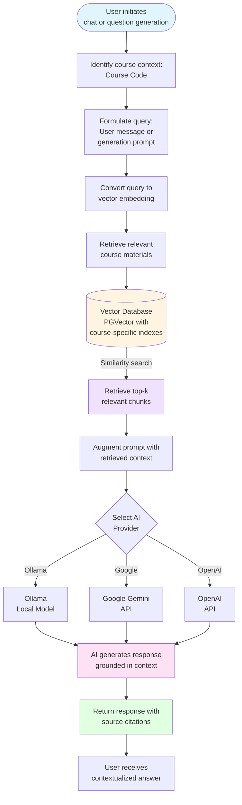

> **Scope note:** this diagram (like [rag-system-overview.md](rag-system-overview.md)) describes
> EduAI Core's retrieval/embedding pipeline conceptually — nothing in
> `apps/extensions/question-maker/` implements RAG, embeddings, or a vector store. Question Maker's
> backend (`app/backend/src/services/eduaiService.js`) only sends `courseId`/`courseCode` on each
> chat/generation call to Core's `POST /api/completion` and lets Core decide what to retrieve.

