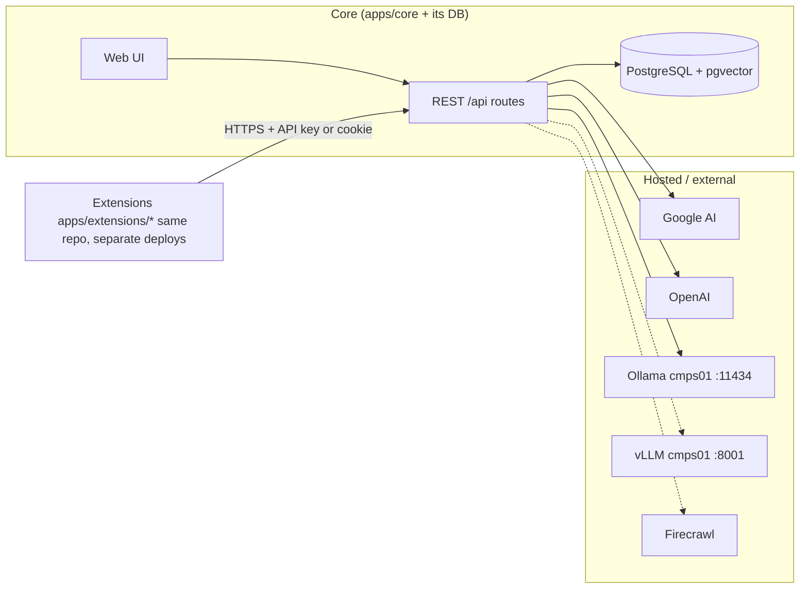
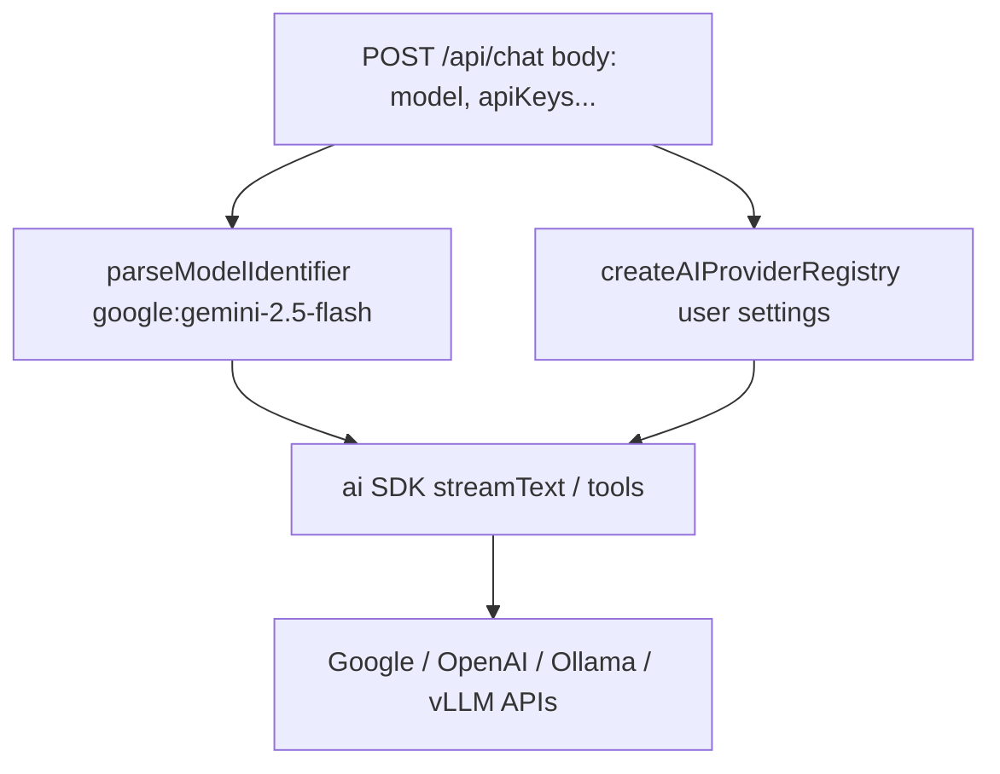
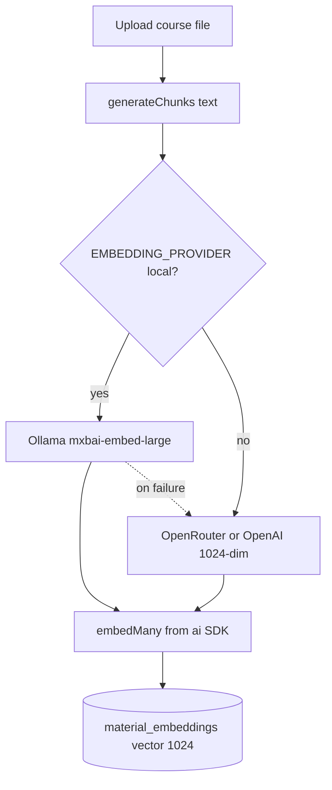
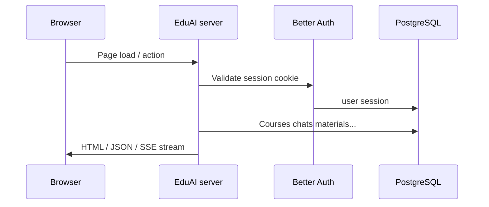
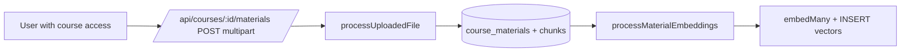
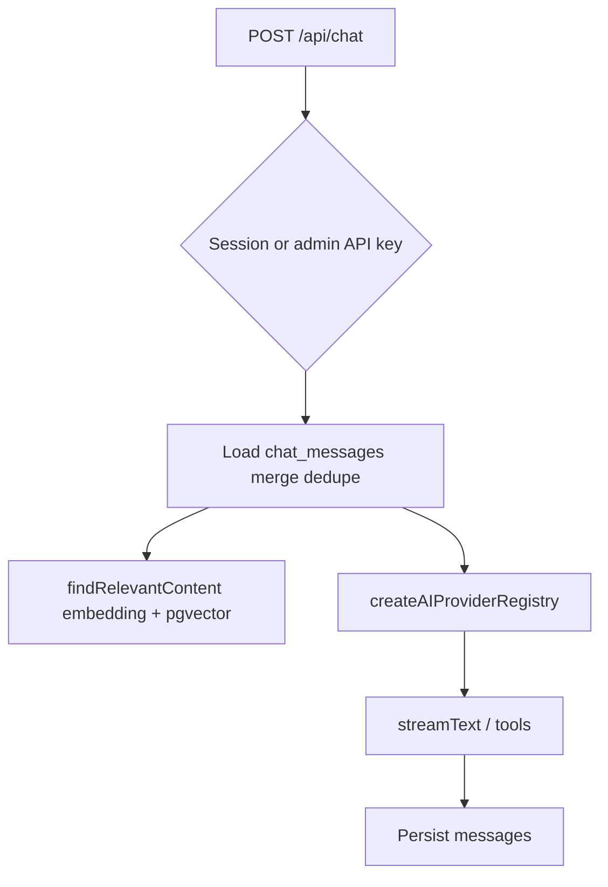
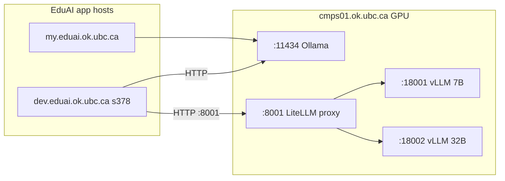

# EduAI — Architecture guide

**Last updated:** 2026-07-15

This document explains **what runs inside this repo (Core)** versus **what lives outside it (hosted services & integrations)**, how **AI providers and keys** work (including `OPENROUTER_API_KEY` / `GOOGLE_GENERATIVE_AI_API_KEY` for embeddings), and how the **codebase fits together**. Use it as the single place to orient yourself; export to PDF when you want a printable copy (see [Saving as PDF](#10-saving-as-pdf)).

---

## Table of Contents

1. [Simple terms: Core vs. hosted](#1-simple-terms-core-vs-hosted)
2. [What is the "Vercel AI SDK" here?](#2-what-is-the-vercel-ai-sdk-here)
3. [Provider config (two different paths)](#3-provider-config-two-different-paths)
4. [Key cheat sheet](#4-key-cheat-sheet)
5. [End-to-end flows (diagrams)](#5-end-to-end-flows-diagrams)
  - [5.3 Chat with course context](#sec-53-chat-with-course-context)
6. [Chat & RAG pipeline (detailed)](#6-chat--rag-pipeline-detailed)
7. [Codebase walkthrough (where to look)](#7-codebase-walkthrough-where-to-look)
  - [7.1 Database (centralized schema)](#71-database-centralized-schema)
  - [7.2 RBAC (role model & permissions)](#72-rbac-role-model--permissions)
8. [Extension data flows](#8-extension-data-flows)
9. [Extension auth pipeline](#9-extension-auth-pipeline)
10. [Saving as PDF](#10-saving-as-pdf)
11. [One-page mental model](#11-one-page-mental-model)

---

## 1. Simple terms: Core vs. hosted

This is a **Turborepo monorepo**: Core and the extensions are all code inside *this* repository (`apps/core`, `apps/extensions/ai-tutor`, `apps/extensions/question-maker`) — but each is still a **separately deployable app** with its own server process and, other than Core's data, its own database. "Extension" describes a deployment/ownership boundary, not a repo boundary.


| Term in this doc             | Meaning                                                                                                                                                                                                                                                                                                                                         |
| ---------------------------- | ----------------------------------------------------------------------------------------------------------------------------------------------------------------------------------------------------------------------------------------------------------------------------------------------------------------------------------------------- |
| **Core (owned)**             | The EduAI application at `apps/core` in this repo: the web UI, all `/api/`* routes, PostgreSQL data, auth, RAG (chunking + vectors + search), chat persistence. You deploy and operate it.                                                                                                                                                      |
| **Hosted / external**        | Services you call over the network but do *not* ship as code anywhere in this repo: Google AI, OpenAI, Ollama, vLLM (optional on cmps01), optional Firecrawl, etc. They hold the actual language/embedding models.                                                                                                                              |
| **Extensions (integrators)** | AI Tutor and Question Maker, at `apps/extensions/`* in this same repo. They **call Core's HTTP API** via the service key (`EDUAI_API_KEY`) or shared session cookies, run as their own processes with their own DBs, and are built/deployed independently of Core — see [Section 7](#7-codebase-walkthrough-where-to-look) for the full layout. |





---

## 2. What is the "Vercel AI SDK" here?

In this project you will see npm packages:

- `ai` — the main Vercel AI SDK runtime. It gives unified helpers such as `streamText`, `generateText`, `embed`, and `embedMany` so application code talks to models in a consistent way.
- `@ai-sdk/google`, `@ai-sdk/openai`, `ollama-ai-provider` — **provider adapters** for chat. **vLLM** uses the OpenAI adapter against a local OpenAI-compatible base URL (`/v1/chat/completions`).

Think of it as two layers:

1. **SDK (`ai`)** — "run this model with these messages" or "turn these strings into embedding vectors."
2. **Provider (`@ai-sdk/...`)** — "when the SDK needs Google, call Google's endpoints with this API key."

You do **not** deploy "Vercel" yourself; these are **libraries** published by Vercel that run inside **your Node server**.

---

## 3. Provider config (two different paths)

There are **two separate uses** of AI in this codebase. They use keys differently.

### A) Chat / completion models (`provider:model`)

**Purpose:** Answer the user with streaming or JSON responses, optionally with tools (RAG).

**Where configured:** `app/lib/ai/providers.ts` builds a **provider registry** from **per-request settings** (`apiKeys` in the JSON body for `/api/chat`, or equivalent from the logged-in user's saved settings in the UI). Only providers that are **enabled** and have a **key** (when required) get wired into the registry.




Model IDs look like `google:gemini-2.5-flash` or `ollama:gpt-oss:120b` — provider name, colon, then model id (`parseModelIdentifier` in `providers.ts`).

### B) Embeddings for RAG (course materials)

**Purpose:** Turn each **chunk of course text** into a **1024-dimensional vector** stored in Postgres (`material_embeddings`), and embed **user queries** at search time for similarity search.

**Where configured:** `app/lib/ai/embedding.ts` — provider resolution (logged as `[embedding]`).

- If `EMBEDDING_PROVIDER=local` (dev server default), embeddings use **Ollama** (`OLLAMA_BASE_URL` + `mxbai-embed-large`); on failure, fall back to cloud.
- Cloud path (`EMBEDDING_PROVIDER=cloud` or unset): **OpenRouter** `openai/text-embedding-3-small` @ 1024 dims → **OpenAI** direct with `dimensions: 1024`.
- Legacy `EMBEDDING_DIMENSION=3072`: OpenRouter/Google Gemini path (pre–LOCAL-EMBEDDINGS).
- If no provider is available, ingestion/search **throws an error**.

**Important:** Embedding calls **do not** use the `apiKeys` object from the chat request. They **only** read `process.env`.

**Decision record:** [docs/rag-ai/LOCAL-EMBEDDINGS.md](rag-ai/LOCAL-EMBEDDINGS.md). **Team guide:** [docs/rag-ai/EMBEDDINGS.md](rag-ai/EMBEDDINGS.md).




---

## 4. Key cheat sheet


| Key / variable                                            | Used for                                                                                                        | Comes from                                                                          |
| --------------------------------------------------------- | --------------------------------------------------------------------------------------------------------------- | ----------------------------------------------------------------------------------- |
| `OPENROUTER_API_KEY`                                      | **Embeddings** via OpenRouter (preferred when set)                                                              | Server `.env` only (`embedding.ts`)                                                 |
| `GOOGLE_GENERATIVE_AI_API_KEY`                            | **Embeddings** direct Gemini when OpenRouter unset                                                              | Server `.env` only (`embedding.ts`)                                                 |
| `OPENAI_API_KEY`                                          | Embeddings fallback if neither above set                                                                        | Server `.env` only                                                                  |
| `apiKeys.google.apiKey` (and similar) in `/api/chat` body | **Chat** completions for that request                                                                           | Client/request (often admin/API); merged with UI session settings in app code paths |
| `OLLAMA_BASE_URL`                                         | Ollama on **cmps01** for **chat** (`:11434`)                                                                    | Env + optional override in user settings                                            |
| `VLLM_BASE_URL`                                           | vLLM OpenAI-compatible API on **cmps01** (`:8001`, `VLLM_PORT`)                                                 | Env + optional override; see [cmps01 inference](#cmps01-gpu-inference-host)         |
| `VLLM_API_KEY`                                            | Placeholder for vLLM (often `vllm-local`)                                                                       | Env                                                                                 |
| `BETTER_AUTH_`*                                           | Sessions and API keys for EduAI accounts                                                                        | Env                                                                                 |
| `FIRECRAWL_API_KEY`                                       | Optional web search tool                                                                                        | Env (see README)                                                                    |
| `EDUAI_API_KEY`                                           | Shared secret for **server-to-server** calls from AI Tutor / Question Maker into Core (`Authorization: Bearer`) | Env, same value set in Core and in each extension's server `.env`                   |
| `CORE_URL`                                                | Core's base URL, used by extension servers for session validation and course/topic/enrollment import calls      | Env (extension apps only, e.g. `http://localhost:3000` in dev)                      |


Same Google account key *could* theoretically work for both embeddings and chat if you pass it in both places — but **the code paths are separate**: embeddings **will not** pick up chat body keys.

---

## 5. End-to-end flows (diagrams)

### 5.1 Request lifecycle (browser)




### 5.2 RAG material upload → vectors




Main files: `app/routes/api/courses.materials.$.ts`, `app/lib/ai/file-processing.ts`, `app/lib/ai/embedding.ts`.


### 5.3 Chat with course context




Main file: `app/routes/api/chat.ts`. For branch-level detail (hybrid vs tools, `modelSupportsTools`, keyword gating).

### 5.4 Extension calling Core

Extensions call Core via the shared session cookie (OAuth) or the `Authorization: Bearer <EDUAI_API_KEY>` service key.

---

## 6. Chat & RAG pipeline

**Full flowchart, code map, and maintenance notes:** [docs/rag-ai/CHAT_RAG_PIPELINE.md](rag-ai/CHAT_RAG_PIPELINE.md)

Related team docs (latency, routing, dev server): [docs/rag-ai/README.md](rag-ai/README.md).

Section [5.3](#sec-53-chat-with-course-context) shows the high-level chat path. **POST /api/chat** actually runs **two different RAG strategies**, chosen from the `AIModel.supportsTools` flag in the database (via `modelSupportsTools` in `providers.ts`):


| Path             | When                                                      | How course context is retrieved                                                                                                                                                                                                                                     |
| ---------------- | --------------------------------------------------------- | ------------------------------------------------------------------------------------------------------------------------------------------------------------------------------------------------------------------------------------------------------------------- |
| **Hybrid RAG**   | `supportsTools === false` (e.g. some local/Ollama models) | If a course is selected **and** the last user message matches keyword heuristics (`course`, `chapter`, `explain`, …), `findRelevantContent` runs **once before** `streamText` and excerpts are injected into the **system** prompt. No tool loop.                   |
| **Tool calling** | `supportsTools === true` (typical cloud models)           | `streamText` registers `getInformation`, `webSearch`, and `fetchPage`. Course RAG runs **only when the model calls `getInformation`**, which executes `findRelevantContent` and returns chunks as **tool output** (up to `maxSteps` internal round-trips per turn). |


Retrieval itself is always the same function: `**findRelevantContent`** in `embedding.ts` (server env embeddings + pgvector over `material_embeddings`). That is independent of which chat provider the user picked in the UI.

### cmps01 GPU inference host

Local **chat** models run on **[cmps01.ok.ubc.ca](http://cmps01.ok.ubc.ca)** (shared UBC GPU server). EduAI app servers call cmps01 over **HTTP** — they do not run inference inside the Node process.


| Service    | Port (host) | Provider id in EduAI | Role                                                                                                                                                                                |
| ---------- | ----------- | -------------------- | ----------------------------------------------------------------------------------------------------------------------------------------------------------------------------------- |
| **Ollama** | **11434**   | `ollama`             | Default local path; GGUF models; hybrid + tool paths per `supportsTools`                                                                                                            |
| **vLLM**   | **8001**    | `vllm`               | **LiteLLM proxy** (`network_mode: host`) → backends `127.0.0.1:18001` (7B) / `:18002` (32B AWQ); OpenAI-compatible `/v1`; see `[infra/cmps01/README.md](../infra/cmps01/README.md)` |


**Embeddings for RAG** are still **cloud** (OpenRouter / Google / OpenAI env keys) — not served from cmps01 today. See [EMBEDDINGS.md](rag-ai/EMBEDDINGS.md).




**Network (dev → cmps01):**

- **HTTP :11434** (Ollama) — allowed from s378.
- **HTTP :8001** (LiteLLM / vLLM) — open dev → cmps01 (Jun 2026). Backends `:18001`/`:18002` are host-local only; IT does **not** need `:8002`.
- **SSH :22** (s378 → cmps01) — **not** available (connection timed out in testing). Do **not** rely on SSH port-forward from dev to cmps01; use direct HTTP once 8001 is open.

**Setup / ops:** [rag-ai/VLLM.md](rag-ai/VLLM.md) · [infra/cmps01/README.md](../infra/cmps01/README.md) · [HOW_TO_USE_DEV_SERVER.md](rag-ai/HOW_TO_USE_DEV_SERVER.md)

**Code:** `app/lib/ai/providers.ts` (`ollama`, `vllm`); local inference enabled when `OLLAMA_BASE_URL` / `VLLM_BASE_URL` are set in server `.env`.

---

## 7. Codebase walkthrough (where to look)

This section is the **source of truth for repository layout**. The root [`README.md`](../README.md) keeps only a skim-level tree and links here for detail.

Monorepo layout (Turborepo, npm workspaces):

```text
EduAI/
├── apps/
│   ├── core/                        → EduAI Core (walkthrough below): RAG chat, auth, central API + Postgres
│   └── extensions/
│       ├── ai-tutor/                → React Router v7 SPA (app/) + Express/Prisma server (server/), own DB
│       │                              Session validated via Core; service key for server-to-server
│       └── question-maker/          → Question bank / assessments
│           └── app/
│               ├── backend/         → Express/Sequelize API, own DB
│               └── frontend/        → Vite/React authoring UI
├── packages/
│   ├── ui/                          → @eduai/ui — shared shadcn + design-system components
│   └── types/                       → @eduai/types — UserRole, EnrollmentRole, canvas material types
├── eduai-design-system/             → Tokens, guidelines, Figma kit exports
├── infra/
│   └── cron/                        → Backup / data-lifecycle scripts + cron.env
├── scripts/                         → Repo-level setup and audit utilities (e.g. mobile-audit)
├── docs/                            → Architecture and planning (this file, rag-ai/, implementations/, …)
├── turbo.json                       → Turborepo task pipeline
├── docker-compose.dev.yml           → Dev-only Postgres containers (apps run on the host)
├── CHANGELOG.md                     → Unified changelog across apps
└── TESTS.md                         → Canonical test inventory across apps
```

Core's high-level layout (`apps/core`):

```
app/
  routes.ts              → URL → route module map (single source of truth for paths)
  routes/                → Pages + api handlers (*.tsx / *.ts)
  components/            → UI (dashboard, chat, admin tables, …)
  lib/
    auth/                → Better Auth server + guards (requireAdmin, requireServiceKey)
    ai/
      providers.ts       → Registry + PROVIDER_CONFIGS + model id parsing
      embedding.ts       → Chunks, embed/embedMany, pgvector search (env keys only)
      file-processing.ts → Extract text from PDFs/docs
    prisma.server.ts     → DB client
    courses/             → Course API helpers + Zod schemas
docs/
  ARCHITECTURE.md        → This file
  rag-ai/
    CHAT_RAG_PIPELINE.md → POST /api/chat + hybrid vs tool RAG (detailed)
    EMBEDDINGS.md        → Vectors in Postgres vs cloud embed API, keys, debugging
    README.md            → Index of RAG, latency, and routing team docs
  ...                    → Other documents
```

### Routes worth memorizing

Defined in `app/routes.ts`:


| Pattern                                                    | Role                  |
| ---------------------------------------------------------- | --------------------- |
| `/api/auth/*`                                              | Better Auth           |
| `/api/chat`                                                | Main chat + RAG tools |
| `/api/chats/:chatId`                                       | Chat metadata         |
| `/api/courses`, `/api/courses/:id`, topics, materials      | Courses & RAG upload  |
| `/api/ai-providers/*`, `/api/ai-models/*`                  | Catalog admin         |
| `/api/users/*`                                             | Admin users           |
| `/dashboard`, `/chat`, `/courses`, `/settings`, `/admin/*` | UI                    |


### 7.1 Database (centralized schema)

Core owns **one Postgres database** (`apps/core/prisma/schema.prisma`) that is the single source of truth for identity, courses, and RBAC across the whole platform. Prisma models cover users/sessions, courses, materials/chunks/embeddings, chats/messages, the AI catalog, API keys, and `ExternalUser` for proxy delegation.

Two pieces of that schema back the platform-wide permission model:

- `**Discipline`** — the canonical list of subject codes (`COSC`, `MATH`, `CHEM`, …). `Course.department` is a validated FK into `Discipline.code`, and a `UNIT_ADMIN`'s `User.authorizedUnits: String[]` stores the same codes. Writes to either field are checked against `Discipline` (`isValidDisciplineCode` / `areValidDisciplineCodes`) so a casing typo can't silently scope an admin into a unit that doesn't exist.
- `**Enrollment**` — a single unified table (`@@unique([courseId, userId])`, `role: EnrollmentRole`, `isActive`) replacing the old `CourseEnrollment` + `CourseTA` split. A user has at most one course-level role per course; promoting a student to TA (or TA to instructor) is an `UPDATE` on the existing row, not a new one.

Extensions (AI Tutor, Question Maker) do **not** own competing copies of this data — see [§8](#8-extension-data-flows) for how they mirror or link back to it.

### 7.2 RBAC (role model & permissions)

Two role concepts, deliberately kept separate:


| Concept              | Enum                                        | Scope                                                                                                                                                                   |
| -------------------- | ------------------------------------------- | ----------------------------------------------------------------------------------------------------------------------------------------------------------------------- |
| `**UserRole`**       | `ADMIN | UNIT_ADMIN | INSTRUCTOR | STUDENT` | Platform-level identity. Default on registration: `STUDENT`. A `TA` is **not** a `UserRole` — every TA is a `STUDENT` who holds a course-level `EnrollmentRole=TA` row. |
| `**EnrollmentRole`** | `STUDENT | TA | INSTRUCTOR`                 | Per-`Enrollment` row, course-scoped. Drives what a user can do *inside a specific course* regardless of their platform `UserRole`.                                      |


All course-scoped authorization resolves through one shared function, `resolveCourseAccess(user, courseId) → Promise<AccessLevel | null>` (`app/lib/auth/course-access.server.ts`; AI Tutor and Question Maker implement the same contract in their own stacks — `docs/implementations/rbac-matrix.md` §3), first match wins:

1. `user.role === 'ADMIN'` → `{ level: 'admin', rank: 4 }`
2. `user.role === 'UNIT_ADMIN'` and `course.department` is one of `user.authorizedUnits` (a `null` department never matches) → `{ level: 'unit', rank: 3 }`
3. Active `Enrollment` with `role='INSTRUCTOR'` → `{ level: 'instructor', rank: 2 }`
4. Active `Enrollment` with `role='TA'` → `{ level: 'ta', rank: 1 }`
5. Active `Enrollment` with `role='STUDENT'` → `{ level: 'student', rank: 0 }`
6. Otherwise → `null` (also when the course doesn't exist or is soft-deleted)

Route handlers gate on the returned level rather than comparing role strings directly, using the predicates in `app/lib/rbac/index.ts` (`canEditCourse`, `canManageStudents`, `canUploadMaterial`, …). A `student` access level additionally requires `Course.isPublished === true`; instructors, TAs, unit admins, and admins bypass that publish gate. Every course must retain at least one active `INSTRUCTOR` enrollment — an operation that would drop the count to zero is rejected (`409 INSTRUCTOR_FLOOR_VIOLATION`), including for `ADMIN`.

**Full per-operation permission tables and current-vs-target enforcement audit:** [docs/implementations/rbac-matrix.md](implementations/rbac-matrix.md).

---

## 8. Extension data flows

### Course data — one-way import, not round-trip sync

Core is the **authoritative source** for courses, topics, and enrollments. Extensions mirror this data locally; nothing is pushed back to Core during an import.

**AI Tutor course import**

Import is **automatic**. The server calls `GET /api/courses` on Core using the service key on every `GET /api/me` (login) and every `GET /api/courses` list fetch (`importTaughtCoursesFromCore` / `importEnrolledCoursesFromCore` in `server/src/services/importTaughtCoursesService.js`), creating or reconciling a local `CourseOffering` row keyed by `externalId` = the Core course's CUID. Topics and enrollments are synced in the same flow, and publish state is reconciled against Core's `isPublished` flag. These calls are idempotent, so re-running them on every request is safe. The old manual `POST /courses/import-external` endpoint still exists in the API but is no longer reachable from the UI. A background job (`server/src/jobs/reconcile.js`) also reconciles offerings independently of any request.

`CourseOffering.isPublished` is mirrored from Core's `Course.isPublished` on every reconcile pass (`reconcileOfferingFromCore`) — students only see a course in AI Tutor once the instructor publishes it in Core. 

```
Core (source of truth)          AI Tutor
────────────────────────        ─────────────────────────────────────
courses  →  GET /api/courses  →  CourseOffering { externalId: coreId }
topics   →  GET /api/courses/:id/topics  →  Topic rows
enrollments → GET /api/courses/:id/enrollments → CourseEnrollment rows
```

**Question Maker course import & link - TO BE UPDATED ONCE ISSUE #727** 

QM maintains its own `Course` table for instructor-created question banks. Like AI Tutor, the instructor-taught course list is imported automatically: every `GET /api/course` list fetch calls `importTaughtCoursesFromCore` (`app/backend/src/services/importTaughtCoursesService.js`) — no manual step required to see courses that exist in Core.

Linking a QM course to a specific Core course (for topic sync and Canvas export targeting) is a separate, persistent FK (`coreCourseId`) rather than a full mirror. It is mostly established automatically — `ensureCoreCourseLink` (`app/backend/src/services/coreCourseLinkService.js`) matches on course code during enrollment-fetch and topic-push flows — with `PATCH /api/course/:id/link-core` remaining as a manual fallback for cases the code-match can't resolve. After linking:

- `POST /api/course/:id/sync-topics` pulls topics from Core into QM.
- Approved question variants can be pushed to Core via `POST /api/questions`.

### Service key pattern (`EDUAI_API_KEY`)

All server-to-server calls from extensions to Core are authenticated with a shared secret, **not** a user session cookie. The key is sent as `Authorization: Bearer <EDUAI_API_KEY>` and validated by `requireServiceKey()` in Core.

Endpoints that accept the service key:

- `GET /api/courses` — used by AI Tutor course import
- `GET /api/courses/:id/topics` — used by AI Tutor topic sync
- `GET /api/courses/:id/enrollments` — used by AI Tutor enrollment sync
- `POST /api/bug-reports` — used by AI Tutor and QM bug report submission
- `POST /api/questions` — used by QM variant push

The service key path is always checked **before** the admin/session path in these endpoints so extensions never need admin credentials.

---

## 9. Extension auth pipeline

Extensions (AI Tutor, Question Maker) do **not** maintain their own user accounts, passwords, or sessions. Core is the single identity provider.

### Session validation pattern

Every authenticated request to an extension is validated by forwarding the browser session cookie to Core:

```
Browser → Extension (cookie) → POST /api/sessions/validate (Core) → { user } → Extension route handler
```

Core validates the cookie against Better Auth's session store and returns `{ user: { id, email, name, image, role } }` or `401`. The extension middleware (`requireAuth`) populates `req.user` from this response and normalizes unknown roles to `STUDENT` (least privilege).

### Login redirect

When an unauthenticated request hits a non-API extension path, the middleware redirects to:

```
{CORE_URL}/login?redirect={encodeURIComponent(extensionUrl + req.originalUrl)}
```

Core's login page validates the `?redirect=` URL against an allow-list (localhost or `*.eduai.ok.ubc.ca`) before using it, preventing open-redirect attacks.

### Role enforcement

After `requireAuth` populates `req.user`, route handlers use `requireRole(allowed)` to gate access:

```js
// single role
router.get('/admin/users', requireRole('ADMIN'), handler);

// multiple roles
router.get('/topics', requireRole(['PROFESSOR', 'TA']), handler);
```

`requireRoles` (AI Tutor) and `authenticateToken` (Question Maker) are backward-compat aliases.

### Local user rows (Question Maker only)

QM maintains a thin local `users` table (CUID string PK, no password) solely for FK integrity (`courses`, `canvas_integrations`, `canvas_course_mappings`). The `findOrCreateUser(coreUser)` function in `authService.js` upserts this row on every successful session validation, seeding default courses for first-time logins.

### Key files


| File                                                                     | Role                                           |
| ------------------------------------------------------------------------ | ---------------------------------------------- |
| `apps/core/app/api/sessions/validate/route.ts`                           | Core session validation endpoint               |
| `apps/core/app/lib/guards.server.ts`                                     | `validateRedirectUrl` open-redirect protection |
| `apps/extensions/ai-tutor/server/src/middleware/auth.js`                 | AT session middleware + RBAC                   |
| `apps/extensions/question-maker/app/backend/src/middleware/auth.js`      | QM session middleware + RBAC                   |
| `apps/extensions/question-maker/app/backend/src/services/authService.js` | `findOrCreateUser` — local FK row maintenance  |


For the full migration plan and rationale see `[docs/implementations/auth-pipeline-centralization-plan.md](implementations/auth-pipeline-centralization-plan.md)`.

**Onboarding a new extension?** See [`docs/EXTENSION_ONBOARDING.md`](EXTENSION_ONBOARDING.md) for the step-by-step guide covering middleware setup, login redirect, role enforcement, and API connectivity.

---

## 10. Saving as PDF

This file is Markdown so it stays diff-friendly in git. To get a **PDF**:

1. **VS Code / Cursor:** Install a "Markdown PDF" style extension and export `docs/ARCHITECTURE.md`, **or**
2. Open the preview / GitHub-rendered view and use **Print → Save as PDF**, **or**
3. **Pandoc** (if installed):
  `pandoc docs/ARCHITECTURE.md -o EduAI-architecture.pdf`

Mermaid diagrams render in GitHub and many Markdown previews; some PDF tools need a Mermaid-capable renderer — if diagrams are missing in PDF, use a browser print from a viewer that supports Mermaid (e.g. GitHub page).

---

## 11. One-page mental model

**Core** (`apps/core`) is one app + one DB, and the schema/RBAC source of truth for the whole platform ([§7.1](#71-database-centralized-schema), [§7.2](#72-rbac-role-model--permissions)). **Hosted APIs** supply brains (chat + embeddings). **Embeddings for RAG** always use **server env** (`OPENROUTER_API_KEY` or `GOOGLE_GENERATIVE_AI_API_KEY` preferred). **Chat** uses the **AI SDK + provider registry** with keys from **request/UI settings** (cloud + `ollama:` / `vllm:` on cmps01). **Extensions** (AI Tutor, Question Maker) live in this same monorepo under `apps/extensions/`* but deploy as separate apps with their own DBs; they call Core's APIs with the service key or a forwarded session cookie, and their course/topic/enrollment data now syncs **automatically** (on login and course-list fetches) — no manual "import" step. **cmps01** serves local chat over HTTP (**11434** Ollama, **8001** vLLM when deployed).