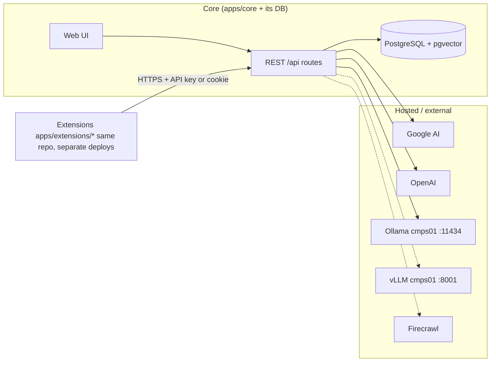
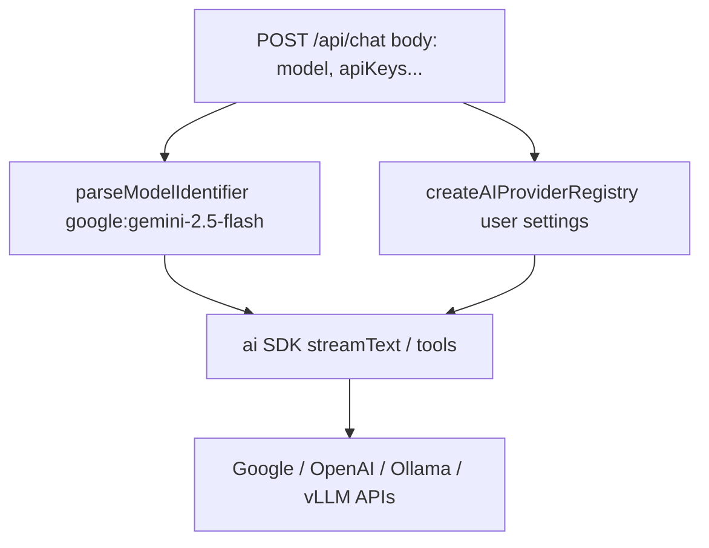
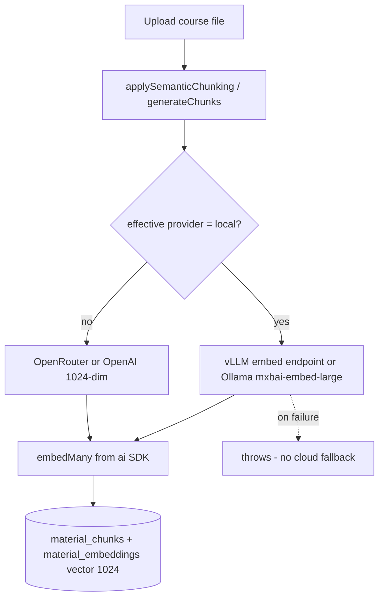
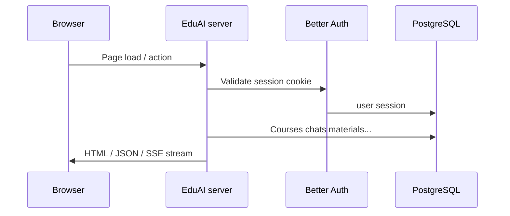
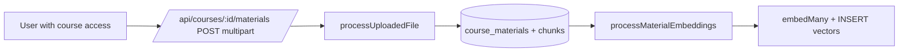
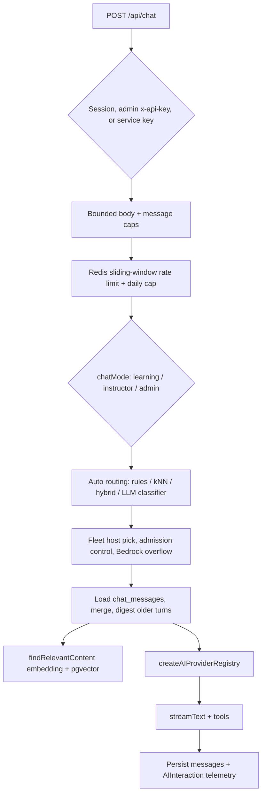
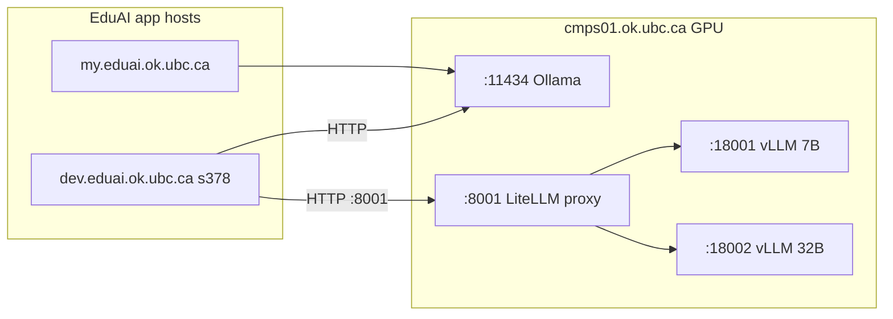

# EduAI — Architecture guide

**Last updated:** 2026-08-31 (verified against the code on `docs/root-refresh`)

This document explains **what runs inside this repo (Core)** versus **what lives outside it (hosted services & integrations)**, how **AI providers and keys** work (including `OPENROUTER_API_KEY` / `OPENAI_API_KEY` for embeddings), and how the **codebase fits together**. Use it as the single place to orient yourself; export to PDF when you want a printable copy (see [Saving as PDF](#10-saving-as-pdf)).

---

## Table of Contents

1. [Simple terms: Core vs. hosted](#1-simple-terms-core-vs-hosted)
2. [What is the "Vercel AI SDK" here?](#2-what-is-the-vercel-ai-sdk-here)
3. [Provider config (two different paths)](#3-provider-config-two-different-paths)
4. [Key cheat sheet](#4-key-cheat-sheet)
5. [End-to-end flows (diagrams)](#5-end-to-end-flows-diagrams)
  - [5.3 Chat with course context](#sec-53-chat-with-course-context)
  - [5.5 Cross-origin mutation guard (CSRF)](#55-cross-origin-mutation-guard-csrf)
6. [Chat & RAG pipeline (detailed)](#6-chat--rag-pipeline-detailed)
7. [Codebase walkthrough (where to look)](#7-codebase-walkthrough-where-to-look)
  - [7.1 Database (centralized schema)](#71-database-centralized-schema)
  - [7.2 RBAC (role model & permissions)](#72-rbac-role-model--permissions)
8. [Extension data flows](#8-extension-data-flows)
9. [Extension auth pipeline](#9-extension-auth-pipeline)
10. [Saving as PDF](#10-saving-as-pdf)
11. [One-page mental model](#11-one-page-mental-model)

---

## 1. Simple terms: Core vs. hosted

This is a **Turborepo monorepo**: Core and the extensions are all code inside *this* repository (`apps/core`, `apps/extensions/ai-tutor`, `apps/extensions/question-maker`) — but each is still a **separately deployable app** with its own server process and, other than Core's data, its own database. "Extension" describes a deployment/ownership boundary, not a repo boundary.


| Term in this doc             | Meaning                                                                                                                                                                                                                                                                                                                                         |
| ---------------------------- | ----------------------------------------------------------------------------------------------------------------------------------------------------------------------------------------------------------------------------------------------------------------------------------------------------------------------------------------------- |
| **Core (owned)**             | The EduAI application at `apps/core` in this repo: the web UI, all `/api/`* routes, PostgreSQL data, auth, RAG (chunking + vectors + search), chat persistence. You deploy and operate it.                                                                                                                                                      |
| **Hosted / external**        | Services you call over the network but do *not* ship as code anywhere in this repo: Google AI, OpenAI, Ollama, vLLM (optional on cmps01), optional Firecrawl, etc. They hold the actual language/embedding models.                                                                                                                              |
| **Extensions (integrators)** | AI Tutor and Question Maker, at `apps/extensions/`* in this same repo. They **call Core's HTTP API** via the service key (`EDUAI_API_KEY`) or shared session cookies, run as their own processes with their own DBs, and are built/deployed independently of Core — see [Section 7](#7-codebase-walkthrough-where-to-look) for the full layout. |





---

## 2. What is the "Vercel AI SDK" here?

In this project you will see npm packages:

- `ai` — the main Vercel AI SDK runtime. It gives unified helpers such as `streamText`, `generateText`, `embed`, and `embedMany` so application code talks to models in a consistent way. Core pins **AI SDK v4** (`ai@^4`); AI Tutor's frontend uses **AI SDK v5** (`ai@^5`) independently.
- `@ai-sdk/google`, `@ai-sdk/openai`, `@ai-sdk/openai-compatible`, `ollama-ai-provider` — **provider adapters** for chat. **vLLM** and **OpenCode Zen** use the OpenAI(-compatible) adapter against their own base URL (`/v1/chat/completions`). **Amazon Bedrock** is served by a hand-rolled provider in `app/lib/ai/routing/bedrock/` (no `@ai-sdk/amazon-bedrock` dependency) and is overflow-only.

Think of it as two layers:

1. **SDK (`ai`)** — "run this model with these messages" or "turn these strings into embedding vectors."
2. **Provider (`@ai-sdk/...`)** — "when the SDK needs Google, call Google's endpoints with this API key."

You do **not** deploy "Vercel" yourself; these are **libraries** published by Vercel that run inside **your Node server**.

---

## 3. Provider config (two different paths)

There are **two separate uses** of AI in this codebase. They use keys differently.

### A) Chat / completion models (`provider:model`)

**Purpose:** Answer the user with streaming or JSON responses, optionally with tools (RAG).

**Where configured:** `app/lib/ai/providers.ts` builds a **provider registry** (`createAIProviderRegistry`) from **per-request settings** (`apiKeys` in the JSON body for `/api/chat`, merged with the logged-in user's saved `UserProviderSettings`). Only providers that are **enabled** and have a **key** (when required) get wired into the registry. Static provider metadata (`PROVIDER_CONFIGS`, `parseModelIdentifier`, `mergeLocalInferenceFromEnv`) lives in `app/lib/ai/provider-types.ts`; model *capability* helpers that read the `AIModel` catalog (`getChatModelCapabilities`, `resolveModelContextWindow`, `resolveMaxOutputTokens`, `estimateToolDefinitionTokens`) live in `app/lib/ai/providers.server.ts`.

**Supported provider ids** (`SupportedProvider` in `provider-types.ts`):

| Id | Name | Key required? | Notes |
| --- | --- | --- | --- |
| `openai` | OpenAI | yes (BYOK) | `OPENAI_API_KEY` is the env-var name, but chat keys come from the request/user settings |
| `google` | Google AI | yes (BYOK) | Gemini models |
| `ollama` | Ollama | no | Deployment-managed base URL (`OLLAMA_BASE_URL`), SSRF-guarded |
| `vllm` | vLLM | no | OpenAI-compatible `/v1`; `VLLM_BASE_URL` + `VLLM_API_KEY`, SSRF-guarded |
| `opencode` | OpenCode Go | yes (BYOK) | Fixed endpoint `https://opencode.ai/zen/go/v1` — never client-configurable |
| `bedrock` | Amazon Bedrock | no (server env) | **Overflow-only** (#1441). `AWS_BEARER_TOKEN_BEDROCK` + `BEDROCK_REGION`. A client-supplied `bedrock:*` model is rejected with `400 BEDROCK_NOT_SELECTABLE`; it is excluded from `getAvailableProviders()` and from `LOCAL_INFERENCE_PROVIDERS`. |

Both local-inference providers resolve their base URL through an SSRF guard (`resolveAllowedOllamaBaseUrl` / `resolveAllowedVllmBaseUrl`): a client-supplied host that fails the guard falls back to the deployment default with a logged error, and a misconfigured deployment default disables just that provider rather than crashing registry creation.




Model IDs look like `google:gemini-2.5-flash` or `ollama:gpt-oss:120b` — provider name, colon, then model id (`parseModelIdentifier` in `providers.ts`).

### B) Embeddings for RAG (course materials)

**Purpose:** Turn each **chunk of course text** into a **1024-dimensional vector** stored in Postgres (`material_embeddings`), and embed **user queries** at search time for similarity search.

**Where configured:** `app/lib/ai/embedding.ts` (provider clients, logged as `[embedding]`) and `app/lib/ai/embedding-config.ts` (settings resolution).

The effective provider/model is resolved **per course** by `resolveEffectiveEmbeddingSettings`: the `Course.embeddingProvider` / `Course.embeddingModel` columns win when set, otherwise `EMBEDDING_PROVIDER` / `OLLAMA_EMBEDDING_MODEL` (or `VLLM_EMBEDDING_MODEL`, or `OPENROUTER_EMBEDDING_MODEL`) from the server env. Allowed models are whitelisted (`ALLOWED_LOCAL_EMBEDDING_MODELS` / `ALLOWED_CLOUD_EMBEDDING_MODELS`).

- **Local** (`EMBEDDING_PROVIDER=local` or `ollama`; the dev-server default): uses an OpenAI-compatible vLLM embedding endpoint when `VLLM_EMBEDDING_BASE_URL` is set, otherwise **Ollama** (`OLLAMA_BASE_URL` + `mxbai-embed-large`).
  **There is no silent cloud fallback.** A local failure throws with a message telling the operator to fix the local service or switch the course to `cloud` — index and query must stay in the same model space.
- **Cloud** (`EMBEDDING_PROVIDER=cloud` or unset) at the default `EMBEDDING_DIMENSION=1024`: **OpenRouter** `openai/text-embedding-3-small` @ 1024 dims → **OpenAI** direct with `dimensions: 1024` → OpenRouter's default model. Throws if none is configured.
- **Legacy** `EMBEDDING_DIMENSION=3072`: OpenRouter → Google `gemini-embedding-001` → OpenAI (pre–LOCAL-EMBEDDINGS).
- Every embedding request has a per-attempt deadline (`EMBEDDING_REQUEST_TIMEOUT_MS`, default 30 s) and is retried at most twice on transient errors.

**Important:** Embedding calls **do not** use the `apiKeys` object from the chat request. They **only** read `process.env` and the per-course columns.

**Current guide:** [docs/rag-ai/EMBEDDINGS.md](rag-ai/EMBEDDINGS.md).




---

## 4. Key cheat sheet


| Key / variable                                            | Used for                                                                                                        | Comes from                                                                          |
| --------------------------------------------------------- | --------------------------------------------------------------------------------------------------------------- | ----------------------------------------------------------------------------------- |
| `EMBEDDING_PROVIDER` / `EMBEDDING_DIMENSION`              | Selects the embedding path (`local` \| `cloud`) and the expected vector length (default `1024`)                 | Server `.env`; per-course override in `Course.embeddingProvider` / `embeddingModel` |
| `OPENROUTER_API_KEY`                                      | **Embeddings** via OpenRouter (preferred on the cloud path)                                                      | Server `.env` only (`embedding.ts`)                                                 |
| `OPENAI_API_KEY`                                          | **Embeddings** direct OpenAI (`text-embedding-3-small`, `dimensions: 1024`)                                     | Server `.env` only                                                                  |
| `GOOGLE_GENERATIVE_AI_API_KEY`                            | **Embeddings** direct Gemini — legacy `EMBEDDING_DIMENSION=3072` path only                                      | Server `.env` only (`embedding.ts`)                                                 |
| `VLLM_EMBEDDING_BASE_URL` / `VLLM_EMBEDDING_MODEL`        | OpenAI-compatible **local** embedding endpoint (preferred over Ollama when set)                                  | Server `.env`; SSRF-guarded against `VLLM_TRUSTED_BASE_URLS`                        |
| `apiKeys.google.apiKey` (and similar) in `/api/chat` body | **Chat** completions for that request                                                                           | Client/request; merged with the user's stored `UserProviderSettings`                |
| `OLLAMA_BASE_URL`                                         | Ollama on **cmps01** for **chat** (`:11434`) and for local embeddings                                           | Env; a client-supplied override must pass the SSRF guard                            |
| `VLLM_BASE_URL`                                           | vLLM OpenAI-compatible API on **cmps01** (`:8001`)                                                              | Env; see [cmps01 inference](#cmps01-gpu-inference-host)                             |
| `VLLM_API_KEY`                                            | vLLM bearer token (`vllm-local` only for loopback/dev)                                                          | Env                                                                                 |
| `CMPS01_INTERNAL_KEY` / `CMPS01_INTERNAL_BASE_URL`        | Shared secret + allowlisted origin for the nginx edge in front of cmps01                                        | Env; the key is attached only to deployment-owned URLs, never client-supplied ones  |
| `FLEET_CONFIG_PATH` (or `VLLM_FLEET_*`)                   | Multi-host fleet registry for chat routing                                                                      | Env / `fleet.config.json` (gitignored)                                              |
| `AWS_BEARER_TOKEN_BEDROCK` / `BEDROCK_REGION` / `BEDROCK_MODEL_ID` | Amazon Bedrock **overflow** target when local GPU admission is exhausted                              | Server env only — never accepted from a client                                      |
| `BETTER_AUTH_SECRET` / `BETTER_AUTH_URL` / `COOKIE_DOMAIN` | Sessions, API keys, and the cross-subdomain cookie for EduAI accounts                                          | Env                                                                                 |
| `ENCRYPTION_KEY`                                          | AES-256-GCM key for stored Canvas instructor tokens                                                             | Env (Core and QM hold *separate* keys)                                              |
| `REDIS_URL`                                               | Shared sliding-window rate limits for `/api/chat` + `/api/completion`, and the (dormant) BullMQ AI-job queue    | Env                                                                                 |
| `FIRECRAWL_API_KEY`                                       | Optional web search tool                                                                                        | Env (see README)                                                                    |
| `EDUAI_API_KEY`                                           | Shared secret for **server-to-server** calls from AI Tutor / Question Maker into Core (`Authorization: Bearer`) | Env, same value set in Core and in each extension's server `.env`                   |
| `CORE_URL`                                                | Core's base URL, used by extension servers for session validation and course/topic/enrollment import calls      | Env (extension apps only, e.g. `http://localhost:3000` in dev)                      |


Same Google account key *could* theoretically work for both embeddings and chat if you pass it in both places — but **the code paths are separate**: embeddings **will not** pick up chat body keys. The full variable-by-variable inventory is [`docs/ENVIRONMENT.md`](ENVIRONMENT.md).

---

## 5. End-to-end flows (diagrams)

### 5.1 Request lifecycle (browser)




### 5.2 RAG material upload → vectors




Main files: `app/routes/api/courses.materials.$.ts`, `app/lib/ai/file-processing.ts`, `app/lib/ai/embedding.ts`.


### 5.3 Chat with course context




Main file: `app/routes/api/chat.ts`. For branch-level detail (hybrid vs tools, `supportsTools`, the RAG inject gate, chat modes) see [`docs/rag-ai/CHAT_RAG_PIPELINE.md`](rag-ai/CHAT_RAG_PIPELINE.md).

### 5.4 Extension calling Core

Extensions call Core via the forwarded browser session cookie or the `Authorization: Bearer <EDUAI_API_KEY>` service key. See §9 for the full pipeline.

### 5.5 Cross-origin mutation guard (CSRF)

Core's **root middleware** (`app/root.tsx`) is the single chokepoint every route matches. For any unsafe method (`POST`/`PATCH`/`PUT`/`DELETE`) that carries a cookie, it requires same-site provenance — an `Origin` (or, failing that, `Referer`, or `Sec-Fetch-Site: same-origin`) matching the trusted origin set (`BETTER_AUTH_URL`'s origin plus the request's own origin). A request that cannot prove it, and does not present a valid `EDUAI_API_KEY`, is rejected with `403 { "error": "CROSS_ORIGIN_MUTATION" }`.

**Consequence for integrators:** a server-to-server write to Core that forwards only the user's cookie will be blocked. Pair the cookie with the service key, or send the service key alone. Both extensions run the mirror-image guard on their own side (`requireSameOriginMutation` in AI Tutor, `csrfOriginGuard` in Question Maker).

The same middleware also applies security headers (static headers, prod HSTS, a locked-down `default-src 'none'` CSP) to every non-HTML response, and 404s any URL ending in `.data` (React Router's single-fetch transport, which this app does not enable).

---

## 6. Chat & RAG pipeline

**Full flowchart, code map, and maintenance notes:** [docs/rag-ai/CHAT_RAG_PIPELINE.md](rag-ai/CHAT_RAG_PIPELINE.md)

Related current RAG, routing, performance, and dev-server docs: [docs/rag-ai/README.md](rag-ai/README.md).

Section [5.3](#sec-53-chat-with-course-context) shows the high-level chat path. **POST /api/chat** serves three **chat modes** and, within learning mode, **two RAG strategies** chosen from the `AIModel.supportsTools` flag in the database (via `getChatModelCapabilities` in `providers.server.ts`).

**Chat modes** (`app/lib/agent-tools/chat-mode.ts`; the request's `chatMode` field, defaulting to `learning` for anything unrecognized):

| Mode | Route | Who | Tools |
| --- | --- | --- | --- |
| `learning` | `/chat`, `/chat/:chatId` | any signed-in user | `getInformation` (course RAG), `webSearch`, `fetchPage` |
| `instructor` | `/instructor/chat` | instructor access on one **published** course | 4 read-only tools hard-pinned to that course id (`getCourse`, `listCourseEnrollments`, `listCourseTopics`, `getCourseTopic`) |
| `admin` | `/admin/chat` | `ADMIN` session only | 63-tool platform registry (25 read / 38 write); writes need a two-turn `confirmed: true` handshake |

**Learning-mode RAG strategies:**

| Path             | When                                                      | How course context is retrieved                                                                                                                                                                                                                                     |
| ---------------- | --------------------------------------------------------- | ------------------------------------------------------------------------------------------------------------------------------------------------------------------------------------------------------------------------------------------------------------------- |
| **Hybrid RAG**   | `supportsTools === false` (e.g. the small local vLLM/Ollama models) | With a course selected, `findRelevantContent` is **prefetched once before** `streamText`; excerpts are injected into the **system** prompt when the gate in `course-rag-policy.ts` passes (intent heuristics *or* a similarity floor *or* `CHAT_HYBRID_RAG_ALWAYS_WITH_COURSE=1`). No tool loop. |
| **Tool calling** | `supportsTools === true` (typical cloud models)           | Same prefetch + inject gate, **plus** `streamText` registers `getInformation`, `webSearch`, and `fetchPage`. `getInformation` is a *supplemental* fallback the model may call when the preloaded excerpts are insufficient (up to `maxSteps` internal round-trips per turn). |
| **Privileged tools** | `chatMode=admin` or `chatMode=instructor` | Mode-specific tool registry (`lib/agent-tools/`); both require a tool-capable model. Admin course search resolves an explicit course and uses the shared retrieval body. |


Retrieval itself is always the same function: **`findRelevantContent`** in `embedding.ts` (server-configured embeddings + pgvector over `material_embeddings`), optionally reranked against a GIN-backed `content_tsv` column when `RAG_HYBRID_BM25=1`. That is independent of which chat provider the user picked in the UI.

**Also on this path** (all in `app/lib/ai/`), in roughly the order they run:

- **Bounded ingress** (`chat-input.server.ts`) — body-size, message-count, and per/total message-character caps (`413`/`422` before anything is persisted).
- **Rate limiting** (`auth/rate-limit.server.ts`) — a Redis sliding window shared with `/api/completion`, keyed per user (or one shared bucket for direct service-key callers), with a bounded per-process fallback when Redis is down.
- **Daily caps** (`chat-daily-limits.server.ts`) — admin-configurable per-role local-model quotas.
- **Auto routing** (`routing/router.ts`) — `model: "auto"` / `"auto-llm"` picks a tier via rules, embedding kNN, a hybrid vote, or an LLM classifier; the enabled modes are admin-managed (`routing-model-settings.server.ts`).
- **Fleet + admission** (`routing/fleet/`, `admission.server.ts`) — round-robin over healthy GPU hosts with a process-local FIFO admission gate, a stream-startup probe, and failure ejection.
- **Bedrock overflow** (`routing/bedrock/`) — only when local capacity is exhausted, behind a global rate cap.
- **Course-scope guardrail** (`course-scope-guardrail.ts`) — Layer A is an always-on system-prompt policy on course chats; Layer B is a second-pass classifier that runs only when the server flag **and** the course's own `courseScopeGuardrailEnabled` column are both on.
- **ADHD Assist** (`adhd-assist.ts`, `adhd-turn-profile.ts`, `adhd-structured-output.ts`, `adhd-oversight.ts`) — structured-output composition plus an optional second-pass structural audit.
- **Telemetry** (`routing/telemetry.server.ts`) — writes an `AIInteraction` row per turn (tokens, router decision, tier, energy estimate).

### cmps01 GPU inference host

Local **chat** models run on **[cmps01.ok.ubc.ca](http://cmps01.ok.ubc.ca)** (shared UBC GPU server). EduAI app servers call cmps01 over **HTTP** — they do not run inference inside the Node process.


| Service    | Port (host) | Provider id in EduAI | Role                                                                                                                                                                                |
| ---------- | ----------- | -------------------- | ----------------------------------------------------------------------------------------------------------------------------------------------------------------------------------- |
| **Ollama** | **11434**   | `ollama`             | Default local path; GGUF models; hybrid + tool paths per `supportsTools`                                                                                                            |
| **vLLM**   | **8001**    | `vllm`               | **LiteLLM proxy** (`network_mode: host`) → backends `127.0.0.1:18001` (7B) / `:18002` (32B AWQ); OpenAI-compatible `/v1`; see `[infra/cmps01/README.md](../infra/cmps01/README.md)` |


**Embeddings for RAG** can use the configured local CMPS/Ollama path or cloud OpenRouter/OpenAI keys, depending on server/course settings. They are separate from chat provider keys. See [EMBEDDINGS.md](rag-ai/EMBEDDINGS.md).




**Network (dev → cmps01):**

- **HTTP :11434** (Ollama) — allowed from s378.
- **HTTP :8001** (LiteLLM / vLLM) — open dev → cmps01 (Jun 2026). Backends `:18001`/`:18002` are host-local only; IT does **not** need `:8002`.
- **SSH :22** (s378 → cmps01) — **not** available (connection timed out in testing). Do **not** rely on SSH port-forward from dev to cmps01; use direct HTTP once 8001 is open.

**Setup / ops:** [rag-ai/VLLM.md](rag-ai/VLLM.md) · [infra/cmps01/README.md](../infra/cmps01/README.md) · [HOW_TO_USE_DEV_SERVER.md](rag-ai/HOW_TO_USE_DEV_SERVER.md)

**Code:** `app/lib/ai/providers.ts` (`ollama`, `vllm`); local inference enabled when `OLLAMA_BASE_URL` / `VLLM_BASE_URL` are set in server `.env`.

---

## 7. Codebase walkthrough (where to look)

This section is the **source of truth for repository layout**. The root [`README.md`](../README.md) keeps only a skim-level tree and links here for detail.

Monorepo layout (Turborepo, npm workspaces):

```text
EduAI/
├── apps/
│   ├── core/                        → EduAI Core (walkthrough below): RAG chat, auth, central API + Postgres
│   └── extensions/
│       ├── ai-tutor/                → React Router v7 SPA (app/) + Express/Prisma server (server/), own DB
│       │                              Session validated via Core; service key for server-to-server
│       ├── question-maker/          → Question bank / assessments
│       │   └── app/
│       │       ├── backend/         → Express/Prisma API, own DB
│       │       └── frontend/        → Vite/React authoring UI
│       └── example-extension/       → Minimal Express extension demonstrating Core auth patterns (dev reference)
├── packages/
│   ├── ui/                          → @eduai/ui — shared shadcn + design-system components
│   └── types/                       → @eduai/types — UserRole, EnrollmentRole, canvas material types
├── eduai-design-system/             → Tokens, guidelines, Figma kit exports
├── infra/
│   ├── cron/                        → Backup / data-lifecycle shell scripts + cron.env
│   ├── s378/                        → Shared dev-server go-live scripts, systemd units, Apache vhosts, Discord dev bot
│   ├── production/                  → Production env templates, systemd units, Apache vhosts, preflight
│   ├── cmps01/                      → GPU-host edge proxy (nginx + LiteLLM) compose and templates
│   └── aws-bedrock-guardrails/      → CDK stack for the Bedrock overflow guardrails
├── scripts/                         → Repo-level setup, perf, PICT, and audit utilities
├── tests/
│   ├── e2e/                         → Full-platform Playwright suites
│   └── models/                      → PICT combinatorial models (.pict) + generated .cases.json
├── docker/                          → Dockerfiles for the containerized test suites and the pinned PICT image
├── tools/                           → Standalone helpers (e.g. the GPU energy-meter sidecar)
├── docs/                            → Architecture and planning (this file, rag-ai/, implementations/, …)
├── turbo.json                       → Turborepo task pipeline
├── docker-compose.dev.yml           → Dev-only Postgres + Redis containers (apps run on the host)
├── docker-compose.test.yml          → Containerized unit/integration suites
├── docker-compose.e2e.yml           → Containerized end-to-end stack
├── lefthook.yml                     → Git hooks (format/lint on commit)
├── CHANGELOG.md                     → Unified changelog across apps
└── TESTS.md                         → Canonical test inventory across apps
```

Core's high-level layout (`apps/core`):

```
app/
  routes.ts              → URL → route module map (single source of truth for paths)
  root.tsx               → Root middleware: CSRF/origin guard, security headers, shell providers
  routes/                → Pages + api handlers (*.tsx / *.ts)
  components/            → UI (dashboard, chat, admin tables, assistive shell, …)
  hooks/api/             → Client-side data-fetching hooks
  lib/
    auth/                → Better Auth server + guards (requireAdmin, requireInviter,
                           requireServiceKey, enforceAdminIfApiKey) + course-access resolver
    rbac/                → Pure permission predicates + nav derivation
    agent-tools/         → Admin / instructor / learning chat tool registries
    agent-readiness/     → manifest.ts — machine-readable /api/* inventory
    ai/
      providers.ts       → createAIProviderRegistry
      provider-types.ts  → PROVIDER_CONFIGS + model id parsing (client-safe)
      providers.server.ts→ AIModel catalog capabilities, context windows, token budgets
      embedding.ts       → Chunking, embed/embedMany, pgvector search
      embedding-config.ts→ Per-course + env embedding settings resolution
      routing/           → Auto router (rules/kNN/LLM), fleet registry, Bedrock overflow, telemetry
      file-processing.ts → Extract text from PDFs/DOCX/PPTX
      tools/             → webSearch + fetchPage
    canvas/              → Canvas client, encryption, sync, roster, materials, quizzes
    queue/               → BullMQ producer/worker plumbing (dormant pre-MVP)
    courses/, questions/, question-banks/, topics/, invitations/, disciplines/
    prisma.server.ts     → DB client
prisma/                  → schema.prisma, migrations, seeds
scripts/                 → Core-only CLIs (cron-worker, re-embed, smoke tests, research evals)
loadtest/                → k6 harness, mock LLM, Grafana/InfluxDB compose
docs/                    → Core-local notes (api-hook-wiring, chat-history, RBAC UI assignment)
```

Platform-wide documents (this file, `rag-ai/`, `implementations/`, …) live in the **repo-root** `docs/`, not under `apps/core`.

### Routes worth memorizing

Defined in `app/routes.ts` (121 `/api/*` method+path pairs are catalogued in `app/lib/agent-readiness/manifest.ts`):


| Pattern                                                    | Role                  |
| ---------------------------------------------------------- | --------------------- |
| `/api/auth/*`                                              | Better Auth handler   |
| `/api/sessions/validate`                                   | Extension session validation (service key required) |
| `/api/chat`, `/api/chat/cancel`                            | Main chat + RAG tools; stream cancellation |
| `/api/completion`                                          | Stateless completion for extensions |
| `/api/chats`, `/api/chats/:chatId`, `…/messages`           | Chat persistence      |
| `/api/courses`, `/api/courses/facets`, `/api/courses/:id`  | Courses (paginated; `?ids=`, `?search=`, `?status=`, `?term=`, `?department=`) |
| `/api/courses/:courseId/{materials,canvas-materials,topics,banks,chats,tas,enrollments}` | Course-scoped resources |
| `/api/courses/:courseId/{re-embed,embedding-settings,topic-analysis}` | RAG index management |
| `/api/courses/:id/{publish,unpublish,rag-settings,response-style}` | Course configuration |
| `/api/canvas/*`                                            | Canvas connect/sync/roster/quizzes/question-banks |
| `/api/ai-providers/*`, `/api/ai-models/*`, `/api/routing-model-settings` | AI catalog + routing admin |
| `/api/users/*`, `/api/invitations`, `/api/policies`        | Admin users, invitations, policy flags |
| `/api/admin/{bug-reports,cron-jobs,chat-daily-limits,bedrock-settings}` | Admin operations |
| `/api/{me,preferences,user-provider-settings}`             | User self-service     |
| `/api/{health,ai-status,dashboard/stats,disciplines}`      | Status + reference data |
| `/dashboard`, `/chat`, `/courses`, `/settings`, `/help`, `/admin/*`, `/instructor/chat`, `/unit-admin/*` | UI |


### 7.1 Database (centralized schema)

Core owns **one Postgres database** (`apps/core/prisma/schema.prisma`, ~50 models) that is the single source of truth for identity, courses, and RBAC across the whole platform. Grouped by concern:

| Area | Models |
| --- | --- |
| Identity & auth | `User`, `Session`, `Account`, `Verification`, `apikey`, `PasswordHistory`, `Invitation`, `ExternalUser` |
| Courses & access | `Discipline`, `Course`, `Enrollment`, `CourseTopic`, `CourseTopicSource` |
| Materials & RAG | `CourseMaterial`, `MaterialUploadBlob`, `MaterialChunk`, `MaterialEmbedding` (pgvector), `CourseReEmbedJob`, `CanvasMaterialExclusion` |
| Chat | `Chat`, `ChatMessage`, `AssistiveEvent`, `AIInteraction` |
| AI catalog & config | `AIProvider`, `AIModel`, `UserProviderSettings`, `UserPreference`, `SystemConfig` |
| Question bank | `Question`, `QuestionSecondaryTopic`, `QuestionBank`, `QuestionBankMembership` |
| Canvas | `CanvasIntegration` (AES-256-GCM token), `CanvasRosterMember` |
| Observability | `AuditLog`, `SystemLog`, `LogRetentionPolicy` |
| Operations | `CronJobRun`, `CronJobScheduleOverride`, `IdempotencyRecord`, `AiJob`, `BugReport` |

Two pieces of that schema back the platform-wide permission model:

- `**Discipline`** — the canonical list of subject codes (`COSC`, `MATH`, `CHEM`, …). `Course.department` is a validated FK into `Discipline.code`, and a `UNIT_ADMIN`'s `User.authorizedUnits: String[]` stores the same codes. Writes to either field are checked against `Discipline` (`isValidDisciplineCode` / `areValidDisciplineCodes`) so a casing typo can't silently scope an admin into a unit that doesn't exist.
- `**Enrollment**` — a single unified table (`@@unique([courseId, userId])`, `role: EnrollmentRole`, `isActive`) replacing the old `CourseEnrollment` + `CourseTA` split. A user has at most one course-level role per course; promoting a student to TA (or TA to instructor) is an `UPDATE` on the existing row, not a new one.

Extensions (AI Tutor, Question Maker) do **not** own competing copies of this data — see [§8](#8-extension-data-flows) for how they mirror or link back to it.

### 7.2 RBAC (role model & permissions)

Two role concepts, deliberately kept separate:


| Concept              | Enum                                        | Scope                                                                                                                                                                   |
| -------------------- | ------------------------------------------- | ----------------------------------------------------------------------------------------------------------------------------------------------------------------------- |
| `**UserRole`**       | `ADMIN | UNIT_ADMIN | INSTRUCTOR | STUDENT` | Platform-level identity. Default on registration: `STUDENT`. A `TA` is **not** a `UserRole` — every TA is a `STUDENT` who holds a course-level `EnrollmentRole=TA` row. |
| `**EnrollmentRole`** | `STUDENT | TA | INSTRUCTOR`                 | Per-`Enrollment` row, course-scoped. Drives what a user can do *inside a specific course* regardless of their platform `UserRole`.                                      |


All course-scoped authorization resolves through one shared decision in `app/lib/auth/course-access.server.ts` (AI Tutor and Question Maker implement the same contract in their own stacks — `docs/implementations/rbac-matrix.md` §3). Three entry points share that one decision and differ only in how much of the course row they return:

| Function | Returns | Use when |
| --- | --- | --- |
| `resolveCourseAccessGate(user, courseId)` | `{ course: GateCourse \| null, access }` — a 5-column projection | **Default.** Lets a handler tell `404` (course null) from `403` (access null) without a second query |
| `resolveCourseAccessWithCourse(user, courseId)` | `{ course: Course \| null, access }` — the full row | Only when the handler serializes the course or reads wide columns (RAG/embedding/response-style config) |
| `resolveCourseAccess(user, courseId)` | `AccessLevel \| null` | The shared cross-app contract shape; delegates to the gate |

First match wins:

1. `user.role === 'ADMIN'` → `{ level: 'admin', rank: 4 }`
2. `user.role === 'UNIT_ADMIN'` and `course.department` is one of `user.authorizedUnits` (a `null` department never matches) → `{ level: 'unit', rank: 3 }`
3. Active `Enrollment` with `role='INSTRUCTOR'` → `{ level: 'instructor', rank: 2 }`
4. Active `Enrollment` with `role='TA'` → `{ level: 'ta', rank: 1 }`
5. Active `Enrollment` with `role='STUDENT'` → `{ level: 'student', rank: 0 }`
6. Otherwise → `null` (also when the course doesn't exist or is soft-deleted)

Route handlers gate on the returned level rather than comparing role strings directly, using the predicates in `app/lib/rbac/index.ts` (`canEditCourse`, `canManageStudents`, `canUploadMaterial`, `canDeleteMaterial`, `canManageTopics`, …). A `student` access level additionally requires `Course.isPublished === true`; instructors, TAs, unit admins, and admins bypass that publish gate. Every course must retain at least one active `INSTRUCTOR` enrollment — an operation that would drop the count to zero is rejected (`409 INSTRUCTOR_FLOOR_VIOLATION`), including for `ADMIN`.

Three cross-cutting helpers in the same module close the gaps route guards can't:

- `buildCourseListFilter(user)` — the Prisma `WHERE` for `GET /api/courses`. The publish gate is applied **per enrollment role**, so a platform `STUDENT` who TAs a course sees that course unpublished but sees only published courses where they are enrolled as a student.
- `stripAnswerForStudents(question, access)` — removes `answer` / `correctAnswers` at the serialization layer for every `student`-level caller, independent of route guards.
- `wantsIncludeDeleted(request, user)` — the `ADMIN`-only `?includeDeleted=true` forensics opt-in; a no-op for every other role.

**Policy flags.** Some capabilities are additionally gated by admin-managed boolean flags (`app/lib/policy.server.ts`, surfaced at `GET /api/policies` and consumed by extensions too): `auth.allowPublicRegistration`, `unitAdmins.canInvite`, `unitAdmins.canViewUnitChats`, `instructors.canViewCourseChats`, `instructors.canManageEnrollments`, `tas.canManageTopics`. `app/lib/rbac/permissions.ts` resolves *which* flag governs a given access level (`resolvePolicyGate`, `courseChatViewPolicyKey`, `manageEnrollmentsPolicyKey`) so the server gate and the UI mirror cannot drift.

**Route-level guards** (`app/lib/auth/guards.server.ts`): `requireAdmin` (re-checks `isActive` against the DB, not just the cached session role), `requireInviter` (ADMIN, or UNIT_ADMIN with `unitAdmins.canInvite`; a service-key caller is admitted only as a capped UNIT_ADMIN-tier inviter), `requireServiceKey`, `enforceAdminIfApiKey` (an `x-api-key` header is admin-only), and `validateRedirectUrl` (open-redirect protection).

**Full per-operation permission tables and current-vs-target enforcement audit:** [docs/implementations/rbac-matrix.md](implementations/rbac-matrix.md).

---

## 8. Extension data flows

### Course data — anchor + live read-through (#1072)

Core is the **authoritative source** for courses, topics, and enrollments. Extensions keep only a minimal **anchor row** per course (a local id plus Core's course id) — no course field (title, description, department, dates, publish state, term/year, name/code) is copied or mirrored locally. Every field read goes live through Core on each request; there is no cache (deferred to #1083). Enrollments and topics are a separate mechanism and are still synced into each extension's local tables, unaffected by this change.

**AI Tutor course read-through**

Anchor provisioning is automatic. The server calls `GET /api/courses` on Core using the service key on every `GET /api/me` (login) and every `GET /api/courses` list fetch (`importTaughtCoursesFromCore` / `importEnrolledCoursesFromCore` in `server/src/services/importTaughtCoursesService.js`), creating a local `CourseOffering` anchor row (`coreOfferingId` only — required and unique) for any Core course not yet linked. Enrollments are synced in the same flow. The old manual `POST /courses/import-external` endpoint still exists in the API but is no longer reachable from the UI. An admin opening a Core course with no local anchor yet materializes one on the spot (`ensureOfferingAnchors`, create-on-open), so the admin course list always shows Core's full catalog instead of only previously-imported courses.

Topics are pulled on every `GET /courses/:id/topics` read (`routes/topics.js`, `syncExternalCourseTopics`), not just on login/course-list — so the topic list is always current without a manual sync action (#1031). A failed pull falls back to serving the local mirror rather than failing the request. The old manual `POST /courses/:id/topics/sync` endpoint still exists in the API but is no longer reachable from the UI, same treatment as course import above.

All display fields — including `isPublished` — are resolved live from Core by `mapCourseOffering` (`server/src/utils/mappers.js`) via a `courseResolver` seam over `eduaiClient`: list requests source from one batched `GET /api/courses` call (never per-course), and single-course reads use a service-key `GET /api/courses/:id`. If Core is unreachable, the resolver degrades to an empty/placeholder result (`coreUnavailable: true`) instead of erroring the page. The old field-copying `reconcileOfferingFromCore` reconciler is gone — there's nothing left to reconcile once no course field is stored locally. The background job (`server/src/jobs/reconcile.js`) still runs, but only as a deletion-only safety net that drops the local anchor (and its children, via cascade) when Core 404s the course.

```
Core (source of truth)          AI Tutor
────────────────────────        ─────────────────────────────────────
courses  →  GET /api/courses  →  CourseOffering { coreOfferingId }  (anchor only —
                                  title/description/dates/isPublished/term/year
                                  read live on every request, never stored)
topics   →  GET /api/courses/:id/topics  →  Topic rows
enrollments → GET /api/courses/:id/enrollments → CourseEnrollment rows
```

**Question Maker course read-through**

QM maintains its own `Course` table, now reduced to a minimal anchor (`id`, `userId`, `coreCourseId`) — `name`/`code` are no longer stored locally. Every QM course must originate in Core: `POST /api/course` requires a `coreCourseId` from the caller's scoped Core catalog (local-only "sandbox" course creation was removed), so the anchor's Core link is always present from creation — no chicken-and-egg linking step. The legacy code-based backfill (`ensureCoreCourseLink` matching on course code, plus `dedupeCoursesByCode`) is deleted: it's dead code now that no course can exist without `coreCourseId`. `PATCH /api/course/:id/link-core` remains only as a manual fallback for pre-existing rows that predate this invariant.

All display fields (name/code/department/term/year/description) are projected live from Core through `courseListService`'s read-through seam: one batched call per list, one detail call per single-course read — no N+1. Core unreachable degrades to a placeholder (`coreUnavailable: true`) rather than serving stale local columns. `Assessments.semester` is derived the same way, live from the linked course's canonical Core term, rather than stored as a separate column. After linking:

- `POST /api/course/:id/sync-topics` pulls topics from Core into QM.
- Approved question variants can be pushed to Core via `POST /api/questions`.

### Service key pattern (`EDUAI_API_KEY`)

All server-to-server calls from extensions to Core are authenticated with a shared secret, **not** a user session cookie. The key is sent as `Authorization: Bearer <EDUAI_API_KEY>` and validated by `requireServiceKey()` in Core.

Endpoints that accept the service key:

- `POST /api/sessions/validate` — **requires** it; the cookie alone is not enough
- `GET /api/courses` and `GET /api/courses/:id` — course catalog / live read-through
- `GET /api/courses/:id/topics` — AI Tutor topic auto-sync (pulled on every topic-list read)
- `GET /api/courses/:id/enrollments` — AI Tutor enrollment sync
- `GET /api/policies` — platform feature flags mirrored by both extensions
- `POST /api/completion` — stateless extension completions
- `POST /api/bug-reports` — AI Tutor and QM bug-report submission
- `POST /api/questions` — QM variant push

The service key path is always checked **before** the admin/session path in these endpoints so extensions never need admin credentials. It is also the only way past Core's `CROSS_ORIGIN_MUTATION` guard (§5.5) on a cookie-bearing write.

Core calls **outward** to the extensions in one case: best-effort cascade-delete propagation on course deletion (`QM_BACKEND_URL`, `AI_TUTOR_SERVER_URL` → each extension's `/api/internal/...`, authenticated with the same service key). Leave those unset where an extension isn't deployed — the call is skipped and each extension's nightly reconcile job self-heals.

---

## 9. Extension auth pipeline

Extensions (AI Tutor, Question Maker) do **not** maintain their own user accounts, passwords, or sessions. Core is the single identity provider.

### Session validation pattern

Every authenticated request to an extension is validated by forwarding the browser session cookie to Core:

```
Browser → Extension (cookie) → POST /api/sessions/validate (Core) → { user } → Extension route handler
```

Core validates the cookie against Better Auth's session store and returns `{ user: { id, email, name, image, role, authorizedUnits } }` or `401`. `authorizedUnits` is read from the database and is only populated for `UNIT_ADMIN` users. The extension middleware (`requireAuth`) populates `req.user` from this response and normalizes unknown roles to `STUDENT` (least privilege).

The endpoint **requires** `Authorization: Bearer <EDUAI_API_KEY>` in addition to the forwarded cookie — a call without it is denied (`401 MISSING_SERVICE_KEY` / `403 INVALID_SERVICE_KEY`, audited once per client IP per window, then `429`). Two rate limits apply: a coarse pre-auth ceiling per originating client (`SESSION_VALIDATE_PREAUTH_RATE_LIMIT`, default 1200) checked before Better Auth touches its session store, and a per-user/anonymous limit (`SESSION_VALIDATE_RATE_LIMIT`, default 300) after.

### Login redirect

When an unauthenticated request hits a non-API extension path, the middleware redirects to:

```
{CORE_URL}/login?redirect={encodeURIComponent(extensionUrl + req.originalUrl)}
```

Core's login page validates the `?redirect=` URL against an allow-list (localhost or `*.eduai.ok.ubc.ca`) before using it, preventing open-redirect attacks.

### Role enforcement

After `requireAuth` populates `req.user`, route handlers use `requireRole(allowed)` to gate access:

```js
// single role
router.get('/admin/users', requireRole('ADMIN'), handler);

// multiple roles — platform UserRole values only
router.post('/courses', requireRole(['INSTRUCTOR', 'UNIT_ADMIN', 'ADMIN']), handler);
```

The allow-list takes platform `UserRole` values (`ADMIN`, `UNIT_ADMIN`, `INSTRUCTOR`, `STUDENT`). `TA` is **not** one of them — it is an `EnrollmentRole`, resolved per course from the extension's own enrollment mirror. `requireRoles` (AI Tutor) and `authenticateToken` (Question Maker) are backward-compat aliases.

AI Tutor additionally applies a path-isolation layer in `server/src/app.js`: an `ADMIN` may only reach an allow-listed set of admin/teaching paths, and a `UNIT_ADMIN` is blocked from `/admin/settings*` and `/admin/users*`.

### Local user rows (Question Maker only)

QM maintains a thin local `users` table (CUID string PK, no password) solely for FK integrity (`courses`, `canvas_integrations`, `canvas_course_mappings`). The `findOrCreateUser(coreUser)` function in `authService.js` upserts this row on every successful session validation, seeding default courses for first-time logins.

### Key files


| File                                                                     | Role                                           |
| ------------------------------------------------------------------------ | ---------------------------------------------- |
| `apps/core/app/routes/api/sessions.validate.ts`                          | Core session validation endpoint (service key required, two-stage rate limit) |
| `apps/core/app/lib/auth/guards.server.ts`                                | `validateRedirectUrl`, `requireServiceKey`, `requireAdmin`, `enforceAdminIfApiKey` |
| `apps/core/app/root.tsx`                                                 | Root middleware — `CROSS_ORIGIN_MUTATION` guard + security headers |
| `apps/extensions/ai-tutor/server/src/middleware/auth.js`                 | AT session middleware + RBAC                   |
| `apps/extensions/ai-tutor/server/src/middleware/csrf.js`                 | AT `requireSameOriginMutation`                 |
| `apps/extensions/question-maker/app/backend/src/middleware/auth.js`      | QM session middleware + RBAC                   |
| `apps/extensions/question-maker/app/backend/src/middleware/csrfOrigin.js`| QM `csrfOriginGuard`                           |
| `apps/extensions/question-maker/app/backend/src/services/authService.js` | `findOrCreateUser` — local FK row maintenance  |
| `apps/extensions/example-extension/src/middleware/auth.js`               | Minimal reference implementation (no database) |


For the full migration plan and rationale see `[docs/implementations/auth-pipeline-centralization-plan.md](implementations/auth-pipeline-centralization-plan.md)`.

**Onboarding a new extension?** See [`docs/EXTENSION_ONBOARDING.md`](EXTENSION_ONBOARDING.md) for the step-by-step guide covering middleware setup, login redirect, role enforcement, and API connectivity.

---

## 10. Saving as PDF

This file is Markdown so it stays diff-friendly in git. To get a **PDF**:

1. **VS Code / Cursor:** Install a "Markdown PDF" style extension and export `docs/ARCHITECTURE.md`, **or**
2. Open the preview / GitHub-rendered view and use **Print → Save as PDF**, **or**
3. **Pandoc** (if installed): `pandoc docs/ARCHITECTURE.md -o EduAI-architecture.pdf`

Mermaid diagrams render in GitHub and many Markdown previews; some PDF tools need a Mermaid-capable renderer — if diagrams are missing in PDF, use a browser print from a viewer that supports Mermaid (e.g. GitHub page).

---

## 11. One-page mental model

**Core** (`apps/core`) is one app + one DB, and the schema/RBAC source of truth for the whole platform ([§7.1](#71-database-centralized-schema), [§7.2](#72-rbac-role-model--permissions)). **Hosted or campus-hosted APIs** supply brains (chat + embeddings). **Embeddings for RAG** are chosen by **server env plus per-course columns** — never by chat request keys — and a `local` course that cannot reach its embedding service **fails rather than silently falling back to cloud**. **Chat** uses the **AI SDK + provider registry** with keys from **request/UI settings** (`openai`, `google`, `opencode` BYOK; `ollama` / `vllm` deployment-managed on cmps01; `bedrock` overflow-only from server env), routed through the Auto router and fleet when the caller asks for `auto`. **Extensions** (AI Tutor, Question Maker) live in this same monorepo under `apps/extensions/`* but deploy as separate apps with their own DBs; they hold only a Core-id **anchor row** per course and read every course field live through Core, and their topic/enrollment data syncs **automatically** (on login and course-list fetches) — no manual "import" step. Every cookie-bearing write into Core must prove same-site provenance or present the service key ([§5.5](#55-cross-origin-mutation-guard-csrf)). **cmps01** serves local chat over HTTP (**11434** Ollama, **8001** the nginx/LiteLLM edge in front of vLLM).
