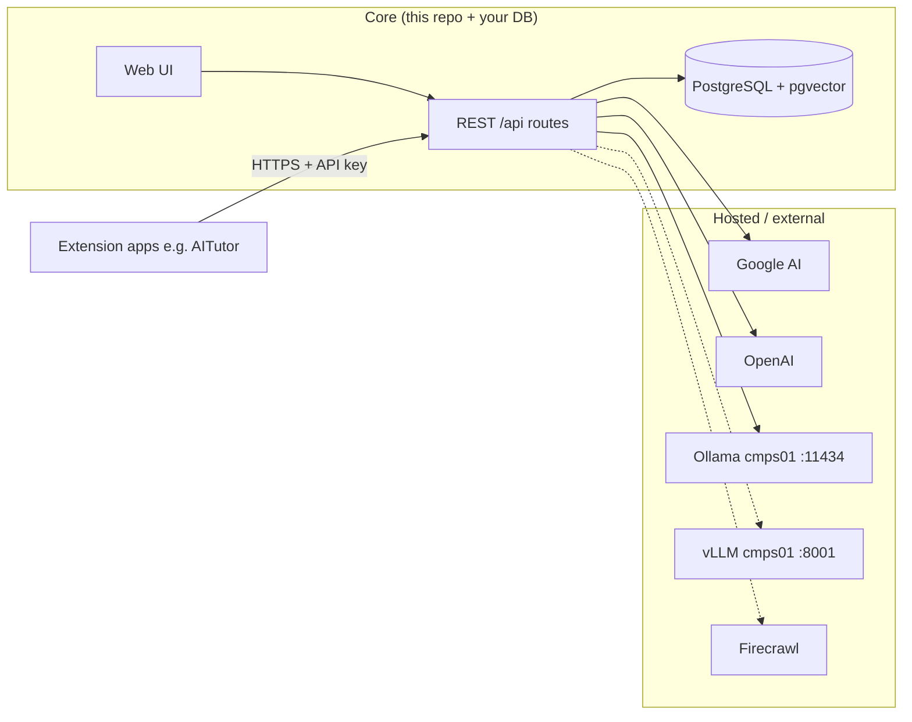
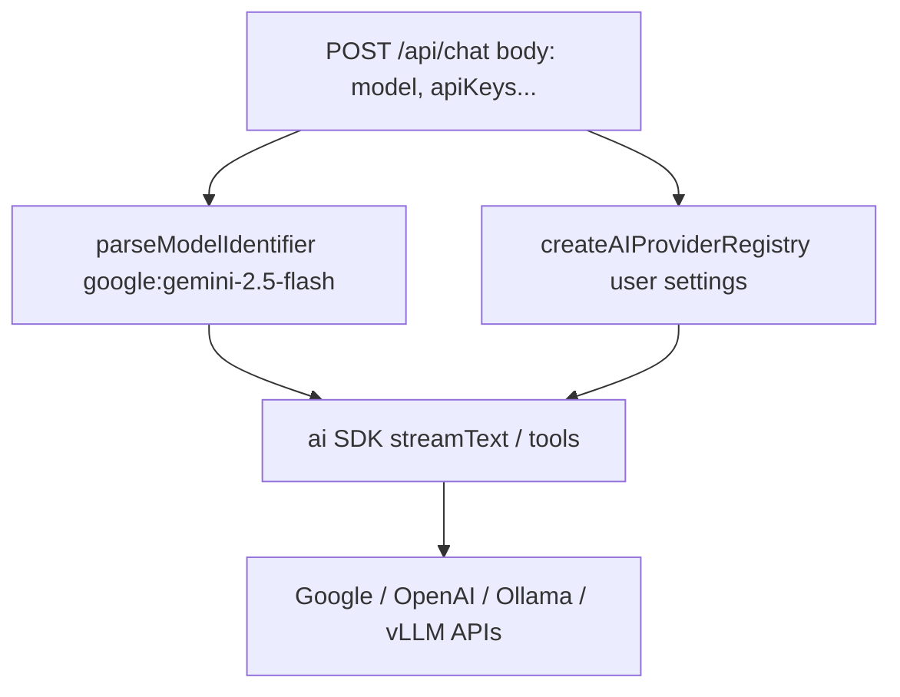
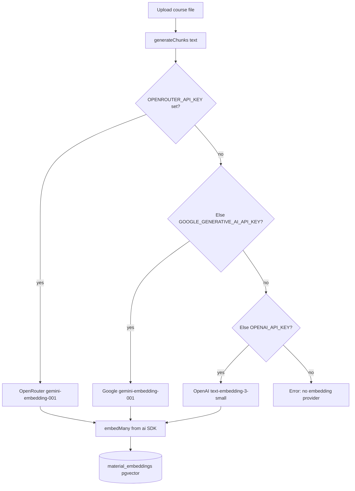
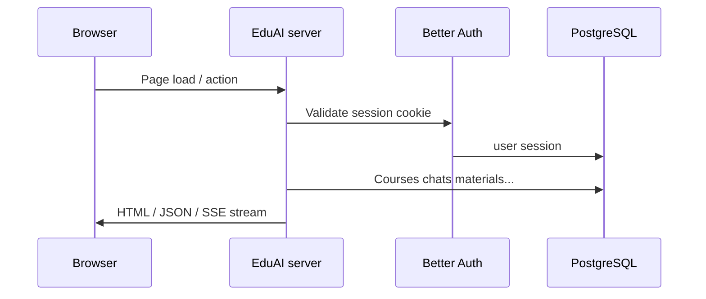
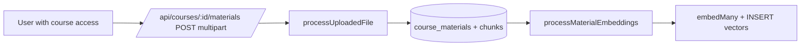
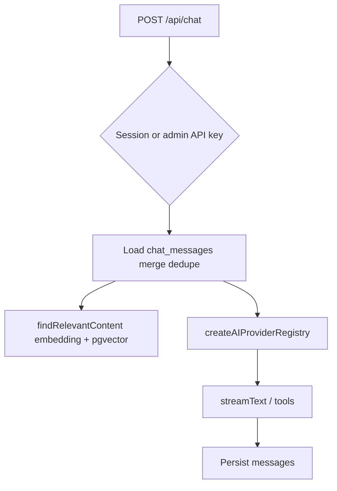
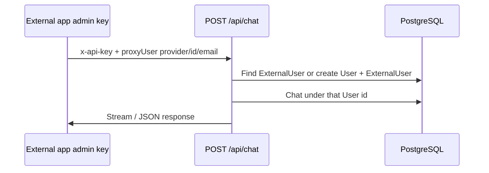
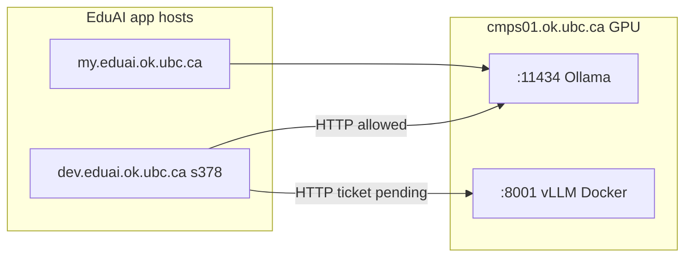

# EduAI — Architecture guide

**Last updated:** 2026-06-02

This document explains **what runs inside this repo (Core)** versus **what lives outside it (hosted services & integrations)**, how **AI providers and keys** work (including `OPENROUTER_API_KEY` / `GOOGLE_GENERATIVE_AI_API_KEY` for embeddings), and how the **codebase fits together**. Use it as the single place to orient yourself; export to PDF when you want a printable copy (see [Saving as PDF](#8-saving-as-pdf)).

---

## Table of Contents

1. [Simple terms: Core vs. hosted](#1-simple-terms-core-vs-hosted)
2. [What is the "Vercel AI SDK" here?](#2-what-is-the-vercel-ai-sdk-here)
3. [Provider config (two different paths)](#3-provider-config-two-different-paths)
4. [Key cheat sheet](#4-key-cheat-sheet)
5. [End-to-end flows (diagrams)](#5-end-to-end-flows-diagrams)
   - [5.3 Chat with course context](#sec-53-chat-with-course-context)
6. [Chat & RAG pipeline (detailed)](#6-chat--rag-pipeline-detailed)
7. [Codebase walkthrough (where to look)](#7-codebase-walkthrough-where-to-look)
8. [Saving as PDF](#8-saving-as-pdf)
9. [One-page mental model](#9-one-page-mental-model)

---

## 1. Simple terms: Core vs. hosted


| Term in this doc             | Meaning                                                                                                                                                                             |
| ---------------------------- | ----------------------------------------------------------------------------------------------------------------------------------------------------------------------------------- |
| **Core (owned)**             | The EduAI application in *this repository*: the web UI, all `/api/`* routes, PostgreSQL data, auth, RAG (chunking + vectors + search), chat persistence. You deploy and operate it. |
| **Hosted / external**        | Services you call over the network but do *not* ship as part of this repo: Google AI, OpenAI, Ollama, vLLM (optional on cmps01), optional Firecrawl, etc. They hold the actual language/embedding models.      |
| **Extensions (integrators)** | Other products (e.g. a campus "tutor" app) that **call EduAI's HTTP API** with an admin API key and optional `proxyUser`. They are clients of Core, not code inside Core.           |





---

## 2. What is the "Vercel AI SDK" here?

In this project you will see npm packages:

- `ai` — the main Vercel AI SDK runtime. It gives unified helpers such as `streamText`, `generateText`, `embed`, and `embedMany` so application code talks to models in a consistent way.
- `@ai-sdk/google`, `@ai-sdk/openai`, `ollama-ai-provider` — **provider adapters** for chat. **vLLM** uses the OpenAI adapter against a local OpenAI-compatible base URL (`/v1/chat/completions`).

Think of it as two layers:

1. **SDK (`ai`)** — "run this model with these messages" or "turn these strings into embedding vectors."
2. **Provider (`@ai-sdk/...`)** — "when the SDK needs Google, call Google's endpoints with this API key."

You do **not** deploy "Vercel" yourself; these are **libraries** published by Vercel that run inside **your Node server**.

---

## 3. Provider config (two different paths)

There are **two separate uses** of AI in this codebase. They use keys differently.

### A) Chat / completion models (`provider:model`)

**Purpose:** Answer the user with streaming or JSON responses, optionally with tools (RAG).

**Where configured:** `app/lib/ai/providers.ts` builds a **provider registry** from **per-request settings** (`apiKeys` in the JSON body for `/api/chat`, or equivalent from the logged-in user's saved settings in the UI). Only providers that are **enabled** and have a **key** (when required) get wired into the registry.




Model IDs look like `google:gemini-2.5-flash` or `ollama:gpt-oss:120b` — provider name, colon, then model id (`parseModelIdentifier` in `providers.ts`).

### B) Embeddings for RAG (course materials)

**Purpose:** Turn each **chunk of course text** into a  **3072-dimensional vector** stored in Postgres (`material_embeddings`), and embed **user queries** at search time for similarity search.

**Where configured:** `app/lib/ai/embedding.ts` — `getEmbeddingModel()`.

- If `OPENROUTER_API_KEY` is set, embeddings use **OpenRouter** with model `google/gemini-embedding-001` (3072-dim, matches pgvector).
- Else if `GOOGLE_GENERATIVE_AI_API_KEY` is set, embeddings use **Google** direct with `gemini-embedding-001`.
- Else if `OPENAI_API_KEY` is set, embeddings use `text-embedding-3-small` (1536-dim; requires migration if used with existing 3072-dim data).
- If none are set, ingestion/search that needs embeddings **throws an error**.

**Important:** Embedding calls **do not** use the `apiKeys` object from the chat request. They **only** read `process.env`. OpenRouter is the recommended dev path when you already use one key for multiple models.

**Team guide (indexing, hosting, failures):** [docs/rag-ai/EMBEDDINGS.md](rag-ai/EMBEDDINGS.md).




---

## 4. Key cheat sheet


| Key / variable                                            | Used for                                                       | Comes from                                                                          |
| --------------------------------------------------------- | -------------------------------------------------------------- | ----------------------------------------------------------------------------------- |
| `OPENROUTER_API_KEY`                                      | **Embeddings** via OpenRouter (preferred when set)             | Server `.env` only (`embedding.ts`)                                                 |
| `GOOGLE_GENERATIVE_AI_API_KEY`                            | **Embeddings** direct Gemini when OpenRouter unset             | Server `.env` only (`embedding.ts`)                                                 |
| `OPENAI_API_KEY`                                          | Embeddings fallback if neither above set                       | Server `.env` only                                                                  |
| `apiKeys.google.apiKey` (and similar) in `/api/chat` body | **Chat** completions for that request                          | Client/request (often admin/API); merged with UI session settings in app code paths |
| `OLLAMA_BASE_URL`                                         | Ollama on **cmps01** for **chat** (`:11434`)                   | Env + optional override in user settings                                            |
| `VLLM_BASE_URL`                                           | vLLM OpenAI-compatible API on **cmps01** (`:8001`, `VLLM_PORT`) | Env + optional override; see [cmps01 inference](#cmps01-gpu-inference-host)          |
| `VLLM_API_KEY`                                            | Placeholder for vLLM (often `vllm-local`)                      | Env                                                                                 |
| `BETTER_AUTH_`*                                           | Sessions and API keys for EduAI accounts                       | Env                                                                                 |
| `FIRECRAWL_API_KEY`                                       | Optional web search tool                                       | Env (see README)                                                                    |


Same Google account key *could* theoretically work for both embeddings and chat if you pass it in both places — but **the code paths are separate**: embeddings **will not** pick up chat body keys.

---

## 5. End-to-end flows (diagrams)

### 5.1 Request lifecycle (browser)




### 5.2 RAG material upload → vectors




Main files: `app/routes/api/courses.materials.$.ts`, `app/lib/ai/file-processing.ts`, `app/lib/ai/embedding.ts`.

<a id="sec-53-chat-with-course-context"></a>

### 5.3 Chat with course context




Main file: `app/routes/api/chat.ts`. For branch-level detail (hybrid vs tools, `modelSupportsTools`, keyword gating).

### 5.4 Extension calling Core (`proxyUser`)




---

## 6. Chat & RAG pipeline

**Full flowchart, code map, and maintenance notes:** [docs/rag-ai/CHAT_RAG_PIPELINE.md](rag-ai/CHAT_RAG_PIPELINE.md)

Related team docs (latency, routing, dev server): [docs/rag-ai/README.md](rag-ai/README.md).

Section [5.3](#sec-53-chat-with-course-context) shows the high-level chat path. **POST /api/chat** actually runs **two different RAG strategies**, chosen from the `AIModel.supportsTools` flag in the database (via `modelSupportsTools` in `providers.ts`):


| Path             | When                                                      | How course context is retrieved                                                                                                                                                                                                                                     |
| ---------------- | --------------------------------------------------------- | ------------------------------------------------------------------------------------------------------------------------------------------------------------------------------------------------------------------------------------------------------------------- |
| **Hybrid RAG**   | `supportsTools === false` (e.g. some local/Ollama models) | If a course is selected **and** the last user message matches keyword heuristics (`course`, `chapter`, `explain`, …), `findRelevantContent` runs **once before** `streamText` and excerpts are injected into the **system** prompt. No tool loop.                 |
| **Tool calling** | `supportsTools === true` (typical cloud models)           | `streamText` registers `getInformation`, `webSearch`, and `fetchPage`. Course RAG runs **only when the model calls `getInformation`**, which executes `findRelevantContent` and returns chunks as **tool output** (up to `maxSteps` internal round-trips per turn). |


Retrieval itself is always the same function: **`findRelevantContent`** in `embedding.ts` (server env embeddings + pgvector over `material_embeddings`). That is independent of which chat provider the user picked in the UI.

### cmps01 GPU inference host

Local **chat** models run on **[cmps01.ok.ubc.ca](http://cmps01.ok.ubc.ca)** (shared UBC GPU server). EduAI app servers call cmps01 over **HTTP** — they do not run inference inside the Node process.

| Service | Port (host) | Provider id in EduAI | Role |
| ------- | ----------- | -------------------- | ---- |
| **Ollama** | **11434** | `ollama` | Default local path; GGUF models; hybrid + tool paths per `supportsTools` |
| **vLLM** (optional) | **8001** (`VLLM_PORT`) | `vllm` | OpenAI-compatible serving (`@ai-sdk/openai` → `/v1`); HF weights in Docker; multi-user / bench spike ([#394](https://github.com/EduAI-Lab/EduAI/issues/394)) |

**Embeddings for RAG** are still **cloud** (OpenRouter / Google / OpenAI env keys) — not served from cmps01 today. See [EMBEDDINGS.md](rag-ai/EMBEDDINGS.md).



**Network (dev → cmps01):**

- **HTTP :11434** (Ollama) — allowed today from s378; laptops cannot reach cmps01 directly (use dev server or SSH tunnel from laptop to cmps01).
- **HTTP :8001** (vLLM) — requires **network firewall** + **host firewall** on cmps01 (IT ticket). Precedent: same pattern as 11434.
- **SSH :22** (s378 → cmps01) — **not** available (connection timed out in testing). Do **not** rely on SSH port-forward from dev to cmps01; use direct HTTP once 8001 is open.

**Setup / ops:** [rag-ai/latency/eduai-summer-2026/VLLM_CMPS01_SETUP.md](rag-ai/latency/eduai-summer-2026/VLLM_CMPS01_SETUP.md) · [DEPLOYMENT.md](DEPLOYMENT.md) · [HOW_TO_USE_DEV_SERVER.md](rag-ai/HOW_TO_USE_DEV_SERVER.md)

**Code:** `app/lib/ai/providers.ts` (`ollama`, `vllm`); enable vLLM in Settings → API keys on dev.

---

## 7. Codebase walkthrough (where to look)

High-level layout:

```
app/
  routes.ts              → URL → route module map (single source of truth for paths)
  routes/                → Pages + api handlers (*.tsx / *.ts)
  components/            → UI (dashboard, chat, admin tables, …)
  lib/
    auth/                → Better Auth server + guards (e.g. enforceAdminIfApiKey)
    ai/
      providers.ts       → Registry + PROVIDER_CONFIGS + model id parsing
      embedding.ts       → Chunks, embed/embedMany, pgvector search (env keys only)
      file-processing.ts → Extract text from PDFs/docs
    prisma.server.ts     → DB client
    courses/             → Course API helpers + Zod schemas
docs/
  ARCHITECTURE.md        → This file
  rag-ai/
    CHAT_RAG_PIPELINE.md → POST /api/chat + hybrid vs tool RAG (detailed)
    EMBEDDINGS.md        → Vectors in Postgres vs cloud embed API, keys, debugging
    README.md            → Index of RAG, latency, and routing team docs
  ...                    → Other documents
```

### Routes worth memorizing

Defined in `app/routes.ts`:


| Pattern                                                    | Role                  |
| ---------------------------------------------------------- | --------------------- |
| `/api/auth/*`                                              | Better Auth           |
| `/api/chat`                                                | Main chat + RAG tools |
| `/api/chats/:chatId`                                       | Chat metadata         |
| `/api/courses`, `/api/courses/:id`, topics, materials      | Courses & RAG upload  |
| `/api/ai-providers/*`, `/api/ai-models/*`                  | Catalog admin         |
| `/api/users/*`                                             | Admin users           |
| `/dashboard`, `/chat`, `/courses`, `/settings`, `/admin/*` | UI                    |


### Database (unified schema)

Single Postgres database; Prisma models include users/sessions, courses, materials/chunks/embeddings, chats/messages, AI catalog, API keys, `ExternalUser` for proxy delegation.

---

## 8. Saving as PDF

This file is Markdown so it stays diff-friendly in git. To get a **PDF**:

1. **VS Code / Cursor:** Install a "Markdown PDF" style extension and export `docs/ARCHITECTURE.md`, **or**
2. Open the preview / GitHub-rendered view and use **Print → Save as PDF**, **or**
3. **Pandoc** (if installed):
  `pandoc docs/ARCHITECTURE.md -o EduAI-architecture.pdf`

Mermaid diagrams render in GitHub and many Markdown previews; some PDF tools need a Mermaid-capable renderer — if diagrams are missing in PDF, use a browser print from a viewer that supports Mermaid (e.g. GitHub page).

---

## 9. One-page mental model

**Core** is one app + one DB. **Hosted APIs** supply brains (chat + embeddings). **Embeddings for RAG** always use **server env** (`OPENROUTER_API_KEY` or `GOOGLE_GENERATIVE_AI_API_KEY` preferred). **Chat** uses the **AI SDK + provider registry** with keys from **request/UI settings** (cloud + `ollama:` / `vllm:` on cmps01). **Extensions** call your APIs; they are not inside this repo. **cmps01** serves local chat over HTTP (**11434** Ollama, **8001** vLLM when deployed).