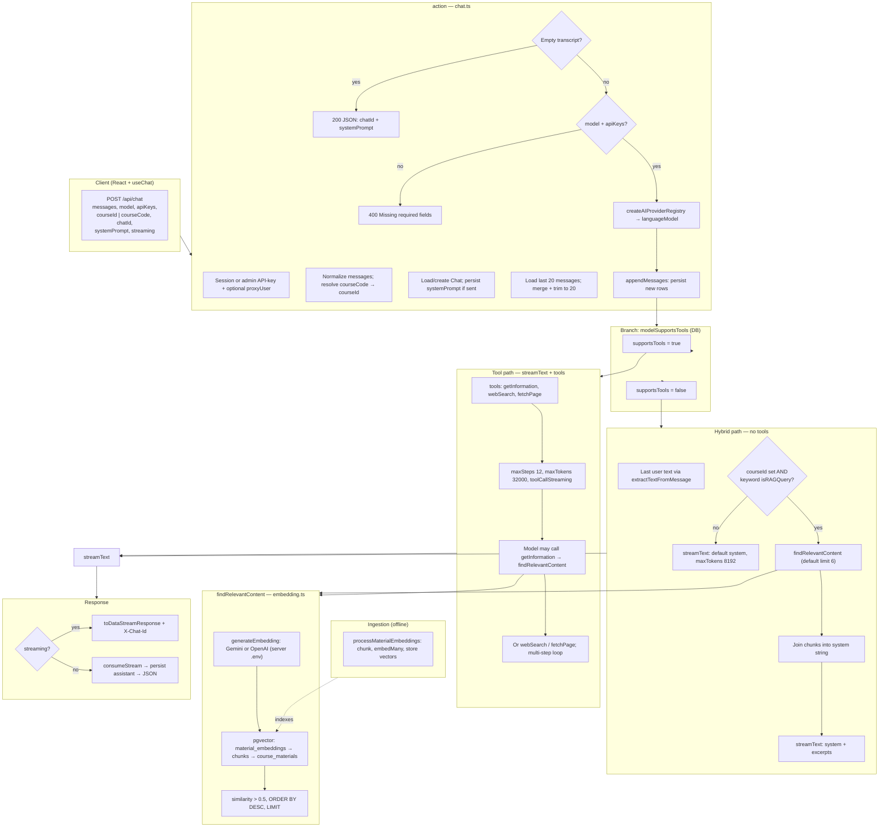

# Chat API and RAG pipeline

**See also:** [EduAI architecture guide](../ARCHITECTURE.md) (Core vs hosted, embedding keys, high-level flows).

**Maintenance:** Living reference — update this doc when you change chat routing, hybrid RAG, or embedding/retrieval behavior (not a one-off PR note).

This document describes how a user prompt flows through **`POST /api/chat`** ([`apps/core/app/routes/api/chat.ts`](../../apps/core/app/routes/api/chat.ts)) and how retrieval-augmented generation (RAG) is triggered relative to **`findRelevantContent`** ([`apps/core/app/lib/ai/embedding.ts`](../../apps/core/app/lib/ai/embedding.ts)).

## Diagram

## Notes

- **Hybrid RAG** runs **`findRelevantContent` once** before `streamText` when a **course** is selected and the last user message matches **keyword heuristics** (`course`, `material`, `chapter`, `explain`, `what is`, etc.). Hits are joined into the **`system`** string (no separate `buildCappedRagContextText` on this branch — default retrieval limit is **6** chunks).
- **Tool RAG** runs **`findRelevantContent`** only when the model invokes **`getInformation`**. If no course is selected, the tool returns `{ error: "No course selected for RAG search" }` (tools stay registered).
- **Embeddings for retrieval** use **`GOOGLE_GENERATIVE_AI_API_KEY`** or **`OPENAI_API_KEY`** on the **server**, independent of which chat provider (e.g. Ollama) the user selected in the UI.
- **Ingestion** (`processMaterialEmbeddings`) fills the tables the vector query reads; it is not executed on each chat request.

> **Other branches:** `feat/local-models-and-ai-enhancement` adds env-capped hybrid context (`buildCappedRagContextText`), lower `maxSteps`, and structured tool error envelopes. This diagram reflects **`main` / current workspace** unless noted.

## Code references

| Area | Path |
| ---- | ---- |
| Route handler | [`apps/core/app/routes/api/chat.ts`](../../apps/core/app/routes/api/chat.ts) |
| Vector search + embed API | [`apps/core/app/lib/ai/embedding.ts`](../../apps/core/app/lib/ai/embedding.ts) |
| Web tools | [`apps/core/app/lib/ai/tools/`](../../apps/core/app/lib/ai/tools/) |
| Provider registry | [`apps/core/app/lib/ai/providers.ts`](../../apps/core/app/lib/ai/providers.ts) |

---

## 1. Entry: `POST /api/chat`

The React chat client calls `POST /api/chat` with a JSON body that typically includes:

| Field | Role |
| ----- | ---- |
| `messages` | Turn array (user/assistant), AI SDK–ish shape with `id` and `role` |
| `model` | Registry id, e.g. `google:gemini-2.5-flash`, `ollama:deepseek-r1:8b` |
| `apiKeys` | Per-provider flags/keys from browser (`UserProviderSettings`) |
| `courseId` or `courseCode` | Optional; enables course-scoped RAG |
| `streaming` | Default `true` |
| `chatId` | Optional; ties to persisted `Chat` |
| `systemPrompt` | Optional override / persistence |

The handler is the `action` in [`chat.ts`](../../apps/core/app/routes/api/chat.ts) (React Router resource route).

## 2. Before any LLM call

1. **Session** — `auth.api.getSession`, or admin API-key path with optional `proxyUser` remapping.
2. **Parse body** — `normalizeMessage` ensures `id` and `role`; stamps `id` if missing.
3. **Course** — `courseCode` → `Course` row by code; `effectiveCourseId = resolved id || courseId`.
4. **Chat** — load by `chatId` + user, or create/update for `systemPrompt`.
5. **History** — last `MAX_CONTEXT_MESSAGES` (**20**) from `ChatMessage`, merged with incoming, tail-trimmed to 20.
6. **Early exits** — empty merged transcript → JSON with `chatId` only; missing `model` / `apiKeys` → 400.
7. **Registry** — `createAIProviderRegistry(apiKeys)` → `registry.languageModel(model)`.
8. **Persist** — `appendMessages(normalizedIncomingMessages)` writes new rows before streaming.

## 3. Two RAG behaviors (split on `supportsTools`)

RAG is **not** one pipeline. It branches on `modelSupportsTools(model)` (from the `AIModel` row in the DB).

### A. Tool-calling path (`supportsTools === true`)

- `streamText` with **`getInformation`**, **`webSearch`**, **`fetchPage`**
- **`maxSteps: 12`**, **`maxTokens: 32000`**, `toolCallStreaming` mirrors client `streaming`
- Course RAG runs **only if the model calls `getInformation`**, which executes `findRelevantContent(question, effectiveCourseId)` (default limit **6**)
- Retrieved chunks are **tool output**, not pre-injected into `system`
- System prompt instructs: course questions → `getInformation` first; external/recent → `webSearch` then `fetchPage`

### B. Hybrid path (`supportsTools === false`)

- No tool loop
- **`extractTextFromMessage`** on the last user turn
- **`isRAGQuery`** = `effectiveCourseId` set **and** message contains any keyword: `course`, `material`, `document`, `chapter`, `lecture`, `assignment`, `explain`, `what is`, `summarize`, `summary`, `content`, `about`
- If true → **`findRelevantContent`** once, then chunks formatted into **`system`** (title + content blocks joined with `---`)
- If false or no course → shorter default system only (**`maxTokens: 8192`**)

**Summary:** tool path = RAG on demand inside multi-step `streamText`; hybrid path = RAG once up front into `system` when keywords + course match.

## 4. `findRelevantContent` (shared)

Defined in [`embedding.ts`](../../apps/core/app/lib/ai/embedding.ts):

1. **`generateEmbedding(userQuery)`** — `embed()` via Gemini `gemini-embedding-001` (if `GOOGLE_GENERATIVE_AI_API_KEY`) or OpenAI `text-embedding-3-small` (if `OPENAI_API_KEY`). Server env only.
2. **Pgvector SQL** — `material_embeddings` → `material_chunks` → `course_materials`, filtered by `courseId`, similarity `1 - (embedding <=> query)`, threshold **> 0.5**, `ORDER BY similarity DESC`, `LIMIT` (default **6**).
3. **Returns** `{ content, similarity, materialTitle }[]`.

**Ingestion (offline):** `processMaterialEmbeddings` → `generateChunks` → `embedMany` → `MaterialChunk` + `material_embeddings` rows.

## 5. LLM execution and response

- **`streamText(streamConfig)`** — provider from registry (OpenAI, Google, Ollama, etc.)
- **Streaming:** `toDataStreamResponse` with `X-Chat-Id` when known
- **Non-streaming:** `consumeStream`, read text/usage, `appendMessages` for assistant, JSON body

## 6. Practical implications

| Situation | Behavior |
| --------- | -------- |
| No course selected | Hybrid `isRAGQuery` is false; `getInformation` returns an error object if the model still calls it |
| Hybrid retrieval | **Keyword-gated**, not embedding-based intent detection |
| Latency on RAG turns | One embedding API call + one DB query before first token (hybrid), or inside a tool step (tool path) |
| Credentials | Retrieval embeddings use server Google/OpenAI keys; chat model may be Ollama-only — two paths |
| Auto routing | Not on this branch; client sends `model` as-is. See [`TEAM_ROUTING_LAYER_PLAN.md`](./TEAM_ROUTING_LAYER_PLAN.md) for planned `resolveRoutedModel` |
