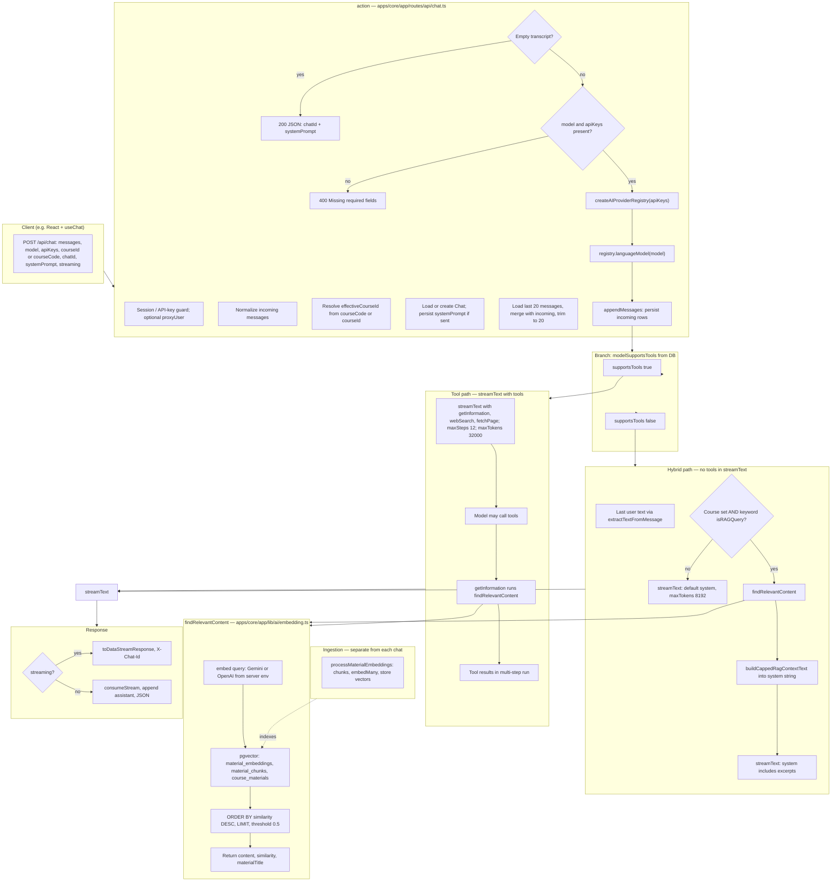

# Chat API and RAG pipeline

**Maintenance:** Living reference — update this doc when you change chat routing, hybrid RAG caps, or embedding/retrieval behavior (not a one-off PR note).

This document describes how a user prompt flows through **`POST /api/chat`** (`apps/core/app/routes/api/chat.ts`) and how retrieval-augmented generation (RAG) is triggered relative to **`findRelevantContent`** (`apps/core/app/lib/ai/embedding.ts`).

## Diagram

## Notes

- **Hybrid RAG** runs **`findRelevantContent` once** before `streamText` when a **course** is selected and the last user message matches **keyword heuristics** (`course`, `material`, `explain`, `what is`, etc.). Retrieved text is injected into the **`system`** string (with chunk and character caps on branches that include that logic).
- **Tool RAG** runs **`findRelevantContent`** only when the model invokes **`getInformation`**; results are returned as **tool output**, not preloaded into `system`.
- **Embeddings for retrieval** use **`GOOGLE_GENERATIVE_AI_API_KEY`** or **`OPENAI_API_KEY`** on the **server**, independent of which chat provider (e.g. Ollama) the user selected.
- **Ingestion** (`processMaterialEmbeddings`) fills the tables the vector query reads; it is not executed on each chat request.

## Code references

- Route handler: `apps/core/app/routes/api/chat.ts`
- Vector search and embed API: `apps/core/app/lib/ai/embedding.ts`
- Provider registry: `apps/core/app/lib/ai/providers.ts`

1. Entry: POST /api/chat
The React chat client calls POST /api/chat with a JSON body that typically includes:

messages — array of turns (user/assistant), with ids and content in AI-SDK-ish shape
model — registry id, e.g. ollama:deepseek-r1:8b
apiKeys — per-provider flags/keys from the browser (UserProviderSettings)
courseId or courseCode — optional; drives whether course-scoped RAG can run
streaming — default true
chatId — optional; ties to persisted Chat
systemPrompt — optional override / persistence
The handler is the action in apps/core/app/routes/api/chat.ts (React Router resource route).

2. Before any LLM call: auth, identity, chat, history
Session — auth.api.getSession (or admin API-key path + optional proxyUser remapping to another User).
Parse body — rawMessages normalized with normalizeMessage (ensures id, role; stamps id if missing).
Course — courseCode → Course row by code; effectiveCourseId = resolved id or explicit courseId.
Chat — load by chatId + user, or create/update for systemPrompt.
History — last MAX_CONTEXT_MESSAGES (20) rows from ChatMessage, revived to generic message objects, merged with the new client messages, then tail-trimmed to 20 again.
Early exits — empty merged transcript returns JSON with chatId only; missing model / apiKeys → 400.
Registry — createAIProviderRegistry(apiKeys) builds an AI SDK registry (OpenAI / Google / Ollama depending on enabled settings and keys).
registry.languageModel(model) — resolves the string id to a LanguageModelV1.
Persist incoming user (and any client-sent) messages — appendMessages(normalizedIncomingMessages) writes new rows to chat_messages before streaming so the server is source of truth for history.
Relevant control flow:

chat.ts
Lines 297-534
export async function action({ request }: ActionFunctionArgs) {
  // ... session, body, normalize, course, chat, merge messages ...
  const registry = createAIProviderRegistry(apiKeys as any);
  const aiModel = registry.languageModel(model);
  await appendMessages(normalizedIncomingMessages);
  // ... tools definition, supportsTools branch ...
3. Two different “RAG” behaviors (important)
RAG is not one pipeline; it splits on modelSupportsTools(model) (loaded from your DB for that AIModel).

A. Tool-calling path (supportsTools === true)
streamText is called with tools: getInformation, webSearch, fetchPage, plus maxSteps: 12, maxTokens: 32000, toolCallStreaming mirroring the client.
Course RAG happens only if the model chooses the getInformation tool. That tool’s execute calls findRelevantContent(question, effectiveCourseId, HYBRID_RAG_MAX_CHUNKS) and returns { relevantContent, count } to the model as tool output.
The system prompt is the long “you have tools…” instruction block; retrieved chunks are not pre-injected into system here—they arrive as tool result messages in the multi-step conversation the SDK manages.

chat.ts
Lines 536-707
    const tools = {
      getInformation: tool({
        // ...
        execute: async ({ question }) => {
          // ...
            const relevantContent = await findRelevantContent(
              question,
              effectiveCourseId,
              HYBRID_RAG_MAX_CHUNKS,
            );
B. Hybrid path (supportsTools === false)
There is no tool loop for retrieval. Instead:

Take the last user message text via extractTextFromMessage.
isRAGQuery — boolean AND of: effectiveCourseId is set and the lowercased user text contains any of a fixed list of substrings ("course", "material", "explain", "what is", …). This is a cheap keyword gate, not an embedding classifier.
If true, findRelevantContent(userQuestion, effectiveCourseId!, HYBRID_RAG_MAX_CHUNKS) runs once before streamText.
Hits are turned into a single string with buildCappedRagContextText (chunk cap + total char cap), then concatenated into systemWithRAG — i.e. retrieval-augmented generation by stuffing excerpts into the system string, while messages stay the normal chat array.
If the gate is false or there is no course id, you get the shorter default system prompt only (no retrieval).

chat.ts
Lines 578-641
    if (!supportsTools) {
      const isRAGQuery =
        Boolean(effectiveCourseId) &&
        ( messageContentLower.includes("course") || /* ... */ );
      if (isRAGQuery) {
        const relevantContent = await findRelevantContent(
          userQuestion || messageContentLower,
          effectiveCourseId!,
          HYBRID_RAG_MAX_CHUNKS,
        );
        const contextText =
          relevantContent.length > 0
            ? buildCappedRagContextText(
                relevantContent,
                HYBRID_RAG_MAX_CHUNKS,
                HYBRID_RAG_MAX_CONTEXT_CHARS,
              )
            : "";
        // systemWithRAG = baseSystemPrompt + contextText ...
        streamConfig = { model: aiModel, messages: trimmedMessages, /* ... */, system: systemWithRAG };
So: tool path = RAG on demand inside streamText steps; hybrid path = RAG once up front into system if keywords + course match.

4. What findRelevantContent does (shared core)
Defined in apps/core/app/lib/ai/embedding.ts:

generateEmbedding(userQuery) — one call to the Vercel AI SDK embed() using either Gemini gemini-embedding-001 (if GOOGLE_GENERATIVE_AI_API_KEY) or OpenAI text-embedding-3-small (if OPENAI_API_KEY). Server env, not the user’s chat API keys.
Pgvector query — raw SQL over material_embeddings joined to material_chunks and course_materials, filtered to courseId, similarity 1 - (embedding <=> query::vector), threshold > 0.5, ORDER BY similarity DESC, LIMIT (your hybrid/tool paths pass the capped chunk count).
Returns { content, similarity, materialTitle }[] per row.

embedding.ts
Lines 109-140
export async function findRelevantContent(
  userQuery: string,
  courseId: string,
  limit: number = 6,
  similarityThreshold: number = 0.5
): Promise<Array<{ content: string; similarity: number; materialTitle: string }>> {
  const queryEmbedding = await generateEmbedding(userQuery);
  const results = await prisma.$queryRaw<Array<{
    content: string;
    similarity: number;
    material_title: string;
  }>>`
    SELECT
      mc.content,
      1 - (me.embedding <=> ${queryEmbedding}::vector) AS similarity,
      cm.title as material_title
    FROM material_embeddings me
    JOIN material_chunks mc ON me."chunkId" = mc.id
    JOIN course_materials cm ON mc."materialId" = cm.id
    WHERE cm."courseId" = ${courseId}
      AND 1 - (me.embedding <=> ${queryEmbedding}::vector) > ${similarityThreshold}
    ORDER BY similarity DESC
    LIMIT ${Number(limit)}
  `;
Indexing side (ingestion, not on each chat): processMaterialEmbeddings splits material text with generateChunks, embedMany, then inserts MaterialChunk + material_embeddings rows. That is how chunks get into the table the query above reads.

5. LLM execution and response
streamText(streamConfig) (AI SDK) talks to the resolved provider (Ollama HTTP via ollama-ai-provider, etc.).
If streaming: result.toDataStreamResponse — chunked SSE-style stream to the client, headers include X-Chat-Id when known.
If not streaming: consumeStream, then read text / usage / finishReason / response, appendMessages for assistant output, JSON body returned.

chat.ts
Lines 715-726

    const result = await streamText(streamConfig as Parameters<typeof streamText>[0]);
    if (streaming) {
      const headers: Record<string, string> = {
        "Content-Encoding": "none",
        "Transfer-Encoding": "chunked",
        Connection: "keep-alive",
      };
      if (chat?.id) {
        headers["X-Chat-Id"] = chat.id;
      }
      return result.toDataStreamResponse({ headers });

7. Practical implications (technical)
No course id → hybrid isRAGQuery is false (first operand false); getInformation still errors if called without a course.
Hybrid RAG is not “always retrieve”; it is keyword-triggered.
Latency on RAG turns includes one embedding API round-trip + one DB vector query before the first Ollama token (hybrid), or the same inside a tool step (tool path).
Embeddings for retrieval use server Google/OpenAI keys; chat may still be Ollama-only in the registry—two different credential paths.
If you later merge the Auto-routing branch, the picture gains a resolveRoutedModel step before registry resolution; on this branch, model is exactly what the client sent.