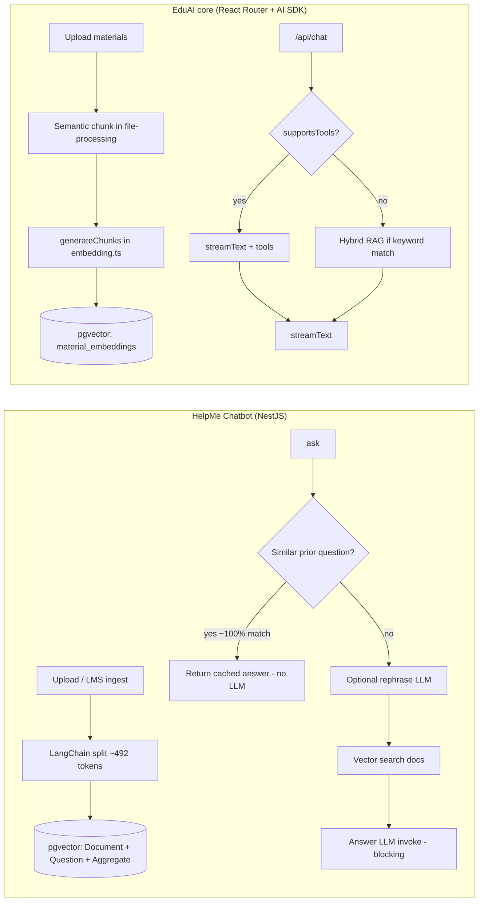

# Gap analysis: HelpMe Chatbot vs EduAI core RAG

**Date:** 2026-05-17  
**Author:** Technical Advisor (URA)  
**Scope:** `URA/other projects/chatbot` vs `EduAICoreLearning/apps/core`  
**Status:** Team decision pending — borrow patterns, not full replacement

**Related:** [GitHub #195](https://github.com/EduAI-Lab/EduAI/issues/195) (tool-calling on small local models), [#196](https://github.com/EduAI-Lab/EduAI/issues/196) (chat latency)

---

## Brief summary — ideas to borrow from HelpMe Chatbot

- **Prior-question cache** — Embed past Q&A pairs; on near-duplicate queries (~99.9% similarity), return the stored answer and skip the main LLM call (biggest latency/cost win in busy courses).
- **Query rephrasing before retrieval** — Use a small/fast model to turn follow-ups into standalone questions so vector search matches better (measure added latency before shipping).
- **Consistent ingest chunking** — Use one splitter end-to-end (HelpMe: LangChain ~492-token chunks with overlap); fix EduAI’s mismatch where `file-processing.ts` semantic chunks are re-split by `generateChunks()` in `embedding.ts`.
- **Local embedding option** — Support Ollama/local embed models for ingest and query (aligns with UBC GPU stack and URA energy work); keep cloud embeddings as fallback.
- **Per-course retrieval tuning** — Expose `topK` and similarity thresholds per course (HelpMe course settings), not only global defaults.
- **Batch embedding writes** — Batch DB inserts on ingest (HelpMe saves 500 rows at a time); replace EduAI’s per-chunk sequential INSERT loop.
- **Course-config caching** — Cache resolved course RAG settings in memory (HelpMe: 60 min) to avoid repeated DB reads on hot paths.

**Do not borrow wholesale:** NestJS microservice split, HelpMe token DB, non-streaming `invoke()`-only UX, or a full schema migration — port patterns into EduAI’s existing `chat.ts` / `embedding.ts` stack instead.

---

## Executive summary

| Claim | Assessment |
|--------|------------|
| “HelpMe RAG is better” | **Partially true** for repeat Q&A and ingest quality; **not proven** for first-time educational queries or multi-tool chat |
| “Replace EduAI RAG with HelpMe” | **High cost, low payoff** unless you need HelpMe LMS integration as-is |
| “Borrow patterns” | **Recommended** |
| “Local models feel slow on our web app” | **Mostly unrelated to RAG choice** — model size (31B), chat orchestration, tool bugs (#195), cloud embedding on query path (#196) |

**Correction vs older docs:** HelpMe stores vectors in **PostgreSQL + pgvector** via LangChain `TypeORMVectorStore`, not OpenSearch. OpenSearch appears only as a TypeScript `Metadata` type import.

---

## Architecture at a glance

---

## Stage-by-stage comparison

### 1. Ingest

| | **HelpMe** | **EduAI** |
|--|------------|-----------|
| **Entry** | `document.service.ts` → `upload.service.ts` | `courses.materials.$.ts` → `processUploadedFile()` |
| **Formats** | PDF, DOCX, PPTX, TXT, MD, CSV; optional multimodal PDF/PPTX | PDF, DOCX, PPTX, TXT, MD |
| **Dedup** | Per-course document aggregates | SHA256 checksum per course |
| **LMS** | Canvas/LMS paths, aggregates, clone course | Standalone course materials |

HelpMe wins on **LMS-native ingest**. EduAI wins on **checksum dedup** and monorepo auth.

---

### 2. Chunking

| | **HelpMe** | **EduAI** |
|--|------------|-----------|
| **Strategy** | `RecursiveCharacterTextSplitter` / `MarkdownTextSplitter`, ~492 chars, overlap 20 | **Mismatch:** semantic chunking (~1500) in `file-processing.ts`, then `generateChunks()` (~800) in `embedding.ts` |
| **Metadata** | Page numbers, courseId, doc name | Material title via join; header context may be lost at embed time |

**Gap:** EduAI upload path is smarter than the embed path actually uses.

---

### 3. Embedding

| | **HelpMe** | **EduAI** |
|--|------------|-----------|
| **Models** | Local Ollama (`mxbai-embed-large`, `nomic-embed-text`) or OpenAI small | Cloud default: `gemini-embedding-001` or `text-embedding-3-small` |
| **Dimensions** | 768–1536 | 3072 (`vector(3072)`) |
| **Batching** | `embedDocuments` + 500-row DB batches | `embedMany` then sequential per-chunk INSERT |

**Gap:** HelpMe aligns with local stack; EduAI query-time RAG hits cloud embed API unless extended.

---

### 4. Retrieval

| | **HelpMe** | **EduAI** |
|--|------------|-----------|
| **Stores** | Document, Question, DocumentAggregate, CourseSettings | `material_chunks` + `material_embeddings` |
| **Query flow** | Rephrase → Question store → if sim > 0.999 return cache → else Document search | Tool `getInformation` or keyword-gated hybrid `findRelevantContent` |
| **Follow-ups** | Standalone-question generator | Chat history only; no dedicated rephrase |
| **Thresholds** | Per-course `topK`, similarity thresholds | Global default similarity 0.5, limit 6 (hybrid up to 8) |

**HelpMe standout:** prior-question cache (`chatbot.service.ts`).  
**EduAI standout:** tool RAG + `webSearch` / `fetchPage`.

---

### 5. Caching

| Layer | **HelpMe** | **EduAI** |
|-------|------------|-----------|
| Course config | 60 min in-memory cache | DB per request |
| Q&A answers | Question vector store (persistent) | None |
| Query embeddings | Local or cloud per config | Cloud on every `findRelevantContent` |
| HTTP warmup | None explicit for Ollama | `warmup.server.ts` — cloud embedding only |

---

### 6. Generation / chat

| | **HelpMe** | **EduAI** |
|--|------------|-----------|
| **API** | `llm.invoke()` — blocking, no stream | `streamText()` |
| **Calls per turn** | Often 2 (rephrase + answer) | 1+ with tools (`maxSteps` ≤ 3) |
| **Extras** | TFIDF “I don’t know” guard | Hybrid keyword gate; rich system prompts |

---

## Is “HelpMe is better” verified?

| Dimension | Winner | Notes |
|-----------|--------|-------|
| Repeat / FAQ questions | HelpMe | Question store + cache shortcut |
| First-time conceptual Q&A | Unclear | Needs benchmark |
| Ingest chunk quality | HelpMe (today) | EduAI semantic upload undermined at embed |
| Platform / extensions / routing | EduAI | Monorepo, Prisma, sustainability router |
| Local / energy measurement | HelpMe patterns | Local embed; EduAI RAG query is cloud-heavy |
| Interactive UX | EduAI | Streaming, tools (when working) |

**Conclusion:** HelpMe is stronger as a **course FAQ accelerator**; not clearly better for EduAI’s multi-tool, extension-integrated chat without a large port.

---

## Migration cost (full replace)

| Area | Effort | Notes |
|------|--------|-------|
| Vector DB | Low–medium | Both pgvector; re-embed; dimension mismatch |
| OpenSearch | N/A | Not used for vectors in HelpMe |
| Runtime | High | NestJS service vs monorepo |
| HelpMe coupling | High | Tokens, HelpMe DB, course settings |
| Chat features | High | Rebuild stream, tools, extensions |
| URA routing | High | Telemetry in EduAI `chat.ts` |

**Estimate:** full replacement = many weeks; selective patterns = days to ~1 week.

---

## Recommendation

**Primary: borrow patterns — do not replace.**

| Pattern | EduAI target | Priority |
|---------|--------------|----------|
| Prior-question cache | New table or extension of schema; check before `streamText` | P1 |
| Query rephrase | Small model when history + course RAG | P2 |
| Consistent chunking | `processMaterialEmbeddings` uses semantic chunks directly | P1 |
| Local embeddings | Ollama path in `embedding.ts` | P1 (URA) |
| Batch ingest writes | `createMany` / transaction | P2 |

**Defer full replacement** unless product mandate is “EduAI = HelpMe chat UI.”

---

## Local model slowness (#195, #196)

| Symptom | Likely cause | RAG-related? |
|---------|--------------|--------------|
| 48 s TTFB on Gemma3:31b | Model load + prompt + serial RAG/cloud embed | Partly |
| ~2 min “Content Download” | Slow 31B token generation | No |
| Empty fast reply on Llama 3.2 | Tool-calling bug (#195) | No |
| “what is gradient descent?” no RAG | Hybrid keyword gate | EduAI-specific |

**Fast wins:** fix #195 denylist; default 8B models (#196); parallel RAG setup; warm Ollama; fix chunking pipeline.

---

## Suggested evaluation

1. Fixed set of 20–30 course prompts (factual, RAG-heavy, follow-up, web-needed).  
2. Same materials in both systems.  
3. Metrics: recall@k, quality rubric, p50/p95 TTFB, tokens, energy.  
4. Run DeepSeek-R1:8B and Gemma3:31b separately.

---

## Key file references

**HelpMe:** `src/chatbot/chatbot.service.ts`, `src/utilities/vector-store.service.ts`, `src/document/document.service.ts`, `docs/NEWDEVS_STARTHERE.md`

**EduAI:** `apps/core/app/lib/ai/embedding.ts`, `file-processing.ts`, `routes/api/chat.ts`, `warmup.server.ts`, `providers.ts`
