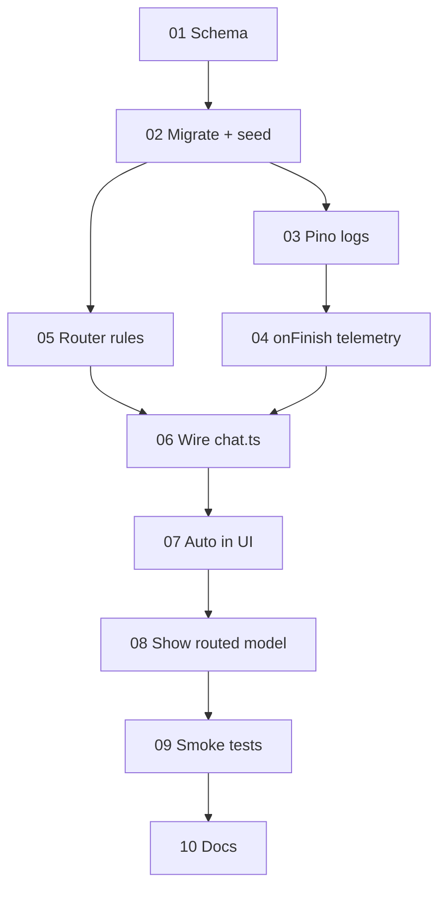

# EduAI routing — Phase 0 & Phase 1 (team implementation guide)

**Audience:** Developers implementing routing on EduAI core  
**Parent tracking issue:** [#197 — Phase 0 routing MVP](https://github.com/EduAI-Lab/EduAICore/issues/197)  
**Sub-issues:** [#182](https://github.com/EduAI-Lab/EduAICore/issues/182)–[#189](https://github.com/EduAI-Lab/EduAICore/issues/189), [#191](https://github.com/EduAI-Lab/EduAICore/issues/191)–[#192](https://github.com/EduAI-Lab/EduAICore/issues/192)   
**Big picture:** `[TEAM_ROUTING_LAYER_PLAN.md](./TEAM_ROUTING_LAYER_PLAN.md)` · **Phase overview:** `[TEAM_ROUTING_PHASES_SUMMARY.md](./TEAM_ROUTING_PHASES_SUMMARY.md)`  
**Technical spec (field-level detail):** `[IMPLEMENTATION_PLAN_MVP.md](./IMPLEMENTATION_PLAN_MVP.md)`  
**Target branch:** `feat/routing-mvp`  
**Rough effort:** ~~17 hours engineering (~~2 focused days), or ~1.5 weeks part-time across the team

---

## Context — what we are shipping in this slice

This guide covers **Phase 0** (telemetry foundation) and **Phase 1** (rule-based **Auto** routing). Together they are the first demo the team can show and the first dataset we can learn from.

**After this slice, EduAI will:**

- Default to **Auto** in the model picker.  
- Route each prompt to a tiered model using **simple rules** (no ML yet).  
- Show which model actually answered.  
- Log **every chat turn** to `AIInteraction` with tokens, duration, routing metadata, and **estimated** energy/carbon.

**We are not shipping yet in this slice:**

- In-chat thumbs up/down or feedback API  
- Real GPU energy measurement (Phase 2 — needs deployment decision Q1)  
- Embedding kNN or trained classifier (Phase 2+)  
- Cascade / “try small then escalate” (Phase 4)  
- Admin analytics dashboard (optional debug route only)

**Decisions already made for the team** (implement as specified; ask in standup if something conflicts):

| Topic                | Decision                                                         |
| -------------------- | ---------------------------------------------------------------- |
| Tier pool            | 5 models across tiers 1–3 (see seed table in Step 2)             |
| Auto default         | On for everyone day one; kill-switch `ROUTER_AUTO_DEFAULT=false` |
| Carbon/energy in MVP | `ESTIMATED_FROM_TOKENS` only — label clearly in DB               |

---

## Context — implementation order

Work is split into **10 steps**. Later steps depend on earlier ones.

---

## Step 01 — Prisma schema

**GitHub:** [#182](https://github.com/EduAI-Lab/EduAICore/issues/182) · **Size:** S (~2h) · **Week 3**

### Context

Nothing else can persist routing or sustainability data until the database schema supports it. All new columns must be **nullable** so the migration is safe on existing databases.

### Task

Extend `prisma/schema.prisma`:

- Add routing/timing/energy fields on `AIInteraction` (`routedByAuto`, `routerVersion`, `routerFeatures`, `routerChosenTier`, `durationMs`, token fields, `energyJoules`, `carbonGramsCO2`, `energySource`, etc.).  
- Add enum `EnergyMeasurementSource` (`RAPL_CPU`, `NVML_GPU`, `OLLAMA_METRICS`, `ESTIMATED_FROM_TOKENS`, `ESTIMATED_FROM_DURATION`).  
- Add on `AIModel`: `tier`, `estEnergyJoulesPerToken`, `averageCarbonGramsPerToken`.

### Done when

- `npm run typecheck` passes  
- Schema reviewed: nullable additions only

---

## Step 02 — Migration and seed

**GitHub:** [#183](https://github.com/EduAI-Lab/EduAICore/issues/183) · **Size:** S (~1h) · **Week 3** · **Blocked by:** #182

### Context

The router and telemetry need **tier numbers** and **per-token constants** in the database. Seeds are a map — new models can be added later; `tier = null` means “manual only, excluded from Auto.”

### Task

1. Run migration: `routing_telemetry_mvp`.
2. Extend `prisma/seed.ts` with `tierAssignments` for:

| Tier | Provider | Model            |
| ---- | -------- | ---------------- |
| 1    | ollama   | deepseek-r1:8b   |
| 2    | ollama   | gemma4:31b       |
| 2    | google   | gemini-2.5-flash |
| 2    | glm      | glm-4.7-flash    |
| 3    | ollama   | gpt-oss:120b     |

1. Export a named constant for local grid intensity (e.g. BC Hydro ~80 g CO₂/kWh) for local Ollama models.
2. Add brief code comments on carbon nuance (local Tier 3 vs cloud Tier 2).

### Done when

- Migration applies on dev DB  
- All five models seeded; team can query tiers in Prisma Studio

---

## Step 03 — Structured logging

**GitHub:** [#184](https://github.com/EduAI-Lab/EduAICore/issues/184) · **Size:** S (~1h) · **Week 3**

### Context

Before adding `onFinish` and router logs, replace ad-hoc `console.log` in the chat path so production debugging is usable.

### Task

- Install `pino` / `pino-pretty`.  
- Add `app/lib/logger.ts`.  
- Replace console calls in `app/routes/api/chat.ts` with structured logs (`chatId`, `userId`, `courseId`).  
- **No behavior change** to responses.

### Done when

- Logs are JSON-friendly in dev  
- Chat still works as before

---

## Step 04 — Telemetry on every chat turn

**GitHub:** [#185](https://github.com/EduAI-Lab/EduAICore/issues/185) · **Size:** M (~4h) · **Week 3** · **Blocked by:** #183, #184

### Context

This is the most delicate backend step. Every assistant turn must produce exactly one `AIInteraction` row with timing, tokens, and estimated energy/carbon — **without slowing down or breaking the stream**.

### Task

In `app/routes/api/chat.ts` at the `streamText` call site:

1. Record `requestStartMs` before streaming.
2. In `onFinish`: compute `durationMs`, read usage tokens, load `AIModel` for constants, set `energySource = ESTIMATED_FROM_TOKENS`, write `AIInteraction` (include routing fields when Auto was used).
3. Fire-and-forget: `.catch()` log errors; never await in the hot path.
4. Duplicate logic for the **non-streaming** branch after `consumeStream()`.
5. If stream aborts and `onFinish` never runs, consider a degraded row with `finishReason = ERROR` (see risk note in MVP spec).

### Done when

- Streaming and non-streaming paths both write rows  
- Null energy only when model has no constants  
- Manual test: one chat → one new row

---

## Step 05 — Rule-based router

**GitHub:** [#186](https://github.com/EduAI-Lab/EduAICore/issues/186) · **Size:** S (~3h) · **Week 3** · **Blocked by:** #183

### Context

**Auto** needs a deterministic, reviewable policy before we invest in ML. Rules use prompt shape, tool/image needs, and RAG metadata.

### Task

Create `app/lib/ai/routing/`:

| File        | Responsibility                                                                               |
| ----------- | -------------------------------------------------------------------------------------------- |
| `router.ts` | `resolveRoutedModel(prompt, context)` → `{ modelId, tier, features }`                        |
| `tiers.ts`  | Load tiered models from DB; `pickTier(n)` with tie-break on lowest `estEnergyJoulesPerToken` |
| `rules.ts`  | Pure functions for rule order below                                                          |

**Rule order:**

1. Images → cheapest tier ≥ 2 with `supportsImages`
2. Tools required → cheapest tier ≥ 2 with `supportsTools`
3. Short factual prompt → Tier 1
4. RAG: top similarity > 0.80 and ≤ 2 chunks → Tier 1
5. RAG: ≥ 4 chunks → Tier 2 (lowest carbon)
6. Default → Tier 2 (lowest carbon)

Persist `features` JSON for later training.

### Done when

- Unit tests cover each rule branch  
- Returns valid `provider:modelId` strings the registry accepts

---

## Step 06 — Wire router into chat API

**GitHub:** [#187](https://github.com/EduAI-Lab/EduAICore/issues/187) · **Size:** S (~1h) · **Week 3** · **Blocked by:** #185, #186

### Context

The router must run **after** we know the prompt and RAG context, but **before** `createAIProviderRegistry` / `languageModel`.

### Task

In `chat.ts`:

- If `model === "auto"` (or undefined per product rules), call `resolveRoutedModel`.  
- Set `resolvedModelId`, `wasAuto`, `routerContext` for telemetry.  
- Pass `resolvedModelId` to the registry.  
- If user picked a specific model, skip router (`routedByAuto = false`).

### Done when

- Auto requests hit Ollama/cloud per rules  
- Manual selection unchanged

---

## Step 07 — Auto in the model dropdown

**GitHub:** [#188](https://github.com/EduAI-Lab/EduAICore/issues/188) · **Size:** S (~1.5h) · **Week 4** · **Blocked by:** #187

### Context

Students should get sustainable routing **by default**, with an env flag to disable Auto default if production misbehaves.

### Task

In `app/routes/chat.tsx` loader:

- Prepend `{ id: "auto", name: "Auto", description: "…", … }` to `chatModels`.  
- Default `selectedModel` to `"auto"`.  
- Respect `ROUTER_AUTO_DEFAULT=false` to restore previous default.

### Done when

- Fresh page load shows Auto selected  
- Kill-switch verified locally

---

## Step 08 — Show which model answered

**GitHub:** [#189](https://github.com/EduAI-Lab/EduAICore/issues/189) · **Size:** S (~2h) · **Week 4** · **Blocked by:** #188

### Context

Transparency builds trust. Users should see when Auto routed them to a specific model.

### Task

- Set response header `X-Routed-Model` (always; harmless for manual picks).  
- Non-stream body: include `routedModel` (and optional short `routerDecision` when Auto).  
- UI: muted “answered by …” under assistant bubbles (use header or body from `useChat`).

### Done when

- Auto and manual flows both display correctly  
- Label matches DB `modelUsed` on telemetry row

---

## Step 09 — Smoke test checklist

**GitHub:** [#191](https://github.com/EduAI-Lab/EduAICore/issues/191) · **Size:** S (~2h) · **Week 4** · **Blocked by:** #189

### Context

The team needs a shared definition of “Phase 0/1 done” before merge.

### Task

Run manual tests (check off in PR or #191):

- Auto default on fresh load  
- `ROUTER_AUTO_DEFAULT=false` reverts default  
- Short factual prompt → Tier 1 (e.g. deepseek)  
- Image prompt → tier-2 image model  
- Tool-style prompt → tier-2 tools model  
- Long RAG → tier-2 local preferred  
- Manual model → `routedByAuto = false`  
- Every turn → one `AIInteraction` with duration, tokens, energy, carbon  
- `npm run typecheck` clean

### Done when

- Checklist posted on #197 or PR  
- Parent #197 can move to Done

---

## Step 10 — Developer documentation

**GitHub:** [#192](https://github.com/EduAI-Lab/EduAICore/issues/192) · **Size:** S (~1h) · **Week 4** · **Blocked by:** #191

### Context

The next developer should not reverse-engineer env vars from PR diffs.

### Task

- Update `.env.example` with `ROUTER_AUTO_DEFAULT`, `ROUTER_VERSION`.  
- Add README section **AI Routing Layer** linking to `TEAM_ROUTING_LAYER_PLAN.md` (or repo copy of plans).

### Done when

- New clone can enable/disable Auto from env docs alone

---

## Context — success metrics (for PM / research)

After ~1 week of real Auto traffic, we expect to sanity-check:

| Metric             | Target (MVP)                                                        |
| ------------------ | ------------------------------------------------------------------- |
| Telemetry coverage | 100% of turns have non-null `durationMs`, tokens, energy fields     |
| Routing mix        | Roughly ≥20% Tier 1, ≥40% Tier 2, ≤40% Tier 3 (tune if skewed)      |
| Estimated savings  | >15% carbon vs always-Tier-3 *estimate* (not hardware-measured yet) |

---

## Context — risks (please read)

| Risk                        | Mitigation                                                                 |
| --------------------------- | -------------------------------------------------------------------------- |
| `onFinish` skipped on error | Degraded row in `finally` if needed                                        |
| Bad routing → complaints    | Manual override; env kill-switch; tune rules from telemetry + offline eval |
| Wrong carbon constants      | `energySource` = estimated; revisit after measurement                      |

---

## Context — rollback

Each step is revertible via git. Emergency: set `ROUTER_AUTO_DEFAULT=false` — users keep manual model selection without redeploying router code.

---

## Task — how to pick up work

1. Open [#197](https://github.com/EduAI-Lab/EduAICore/issues/197) and claim an unassigned sub-issue.
2. Branch from `feat/routing-mvp` (or default team branch if renamed).
3. Follow **Context → Task → Done when** in the issue body (matches this doc).
4. PR links the issue; close sub-issue when merged.
5. Close #197 when all open sub-issues are done and smoke tests pass.

**Questions?** Routing algorithm details → technical lead. Scheduling/priorities → project board. Infrastructure (Ollama host, CTL) → infra track ([#194](https://github.com/EduAI-Lab/EduAICore/issues/194)).

---

*Last updated: 2026-05-18* 