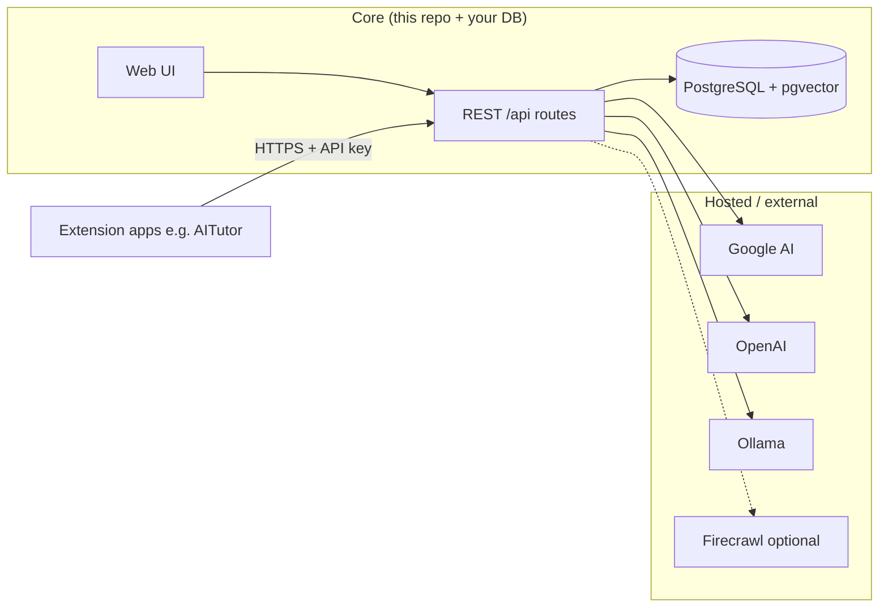
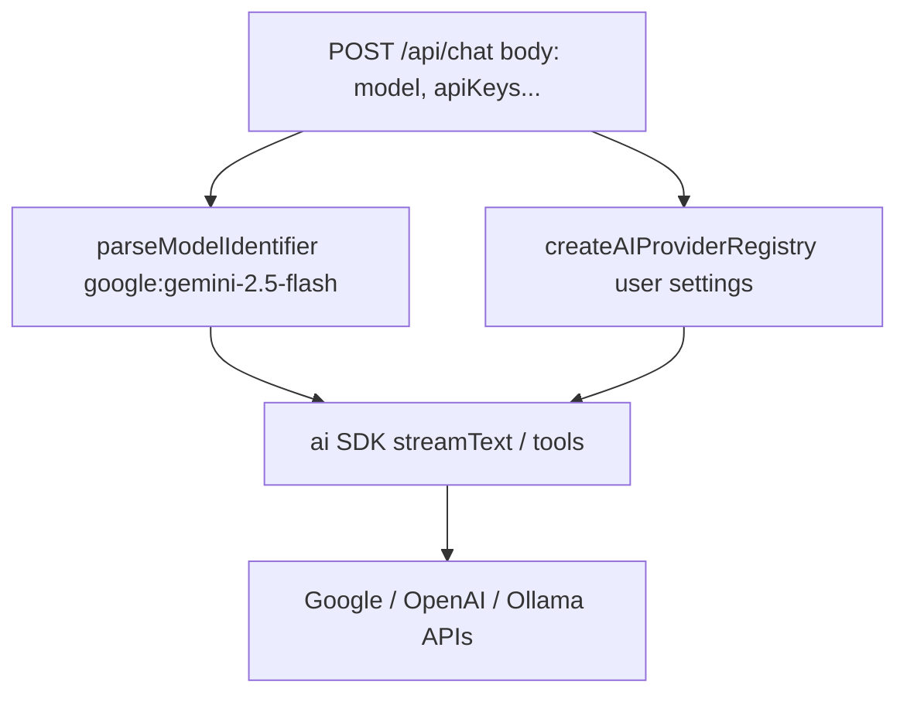
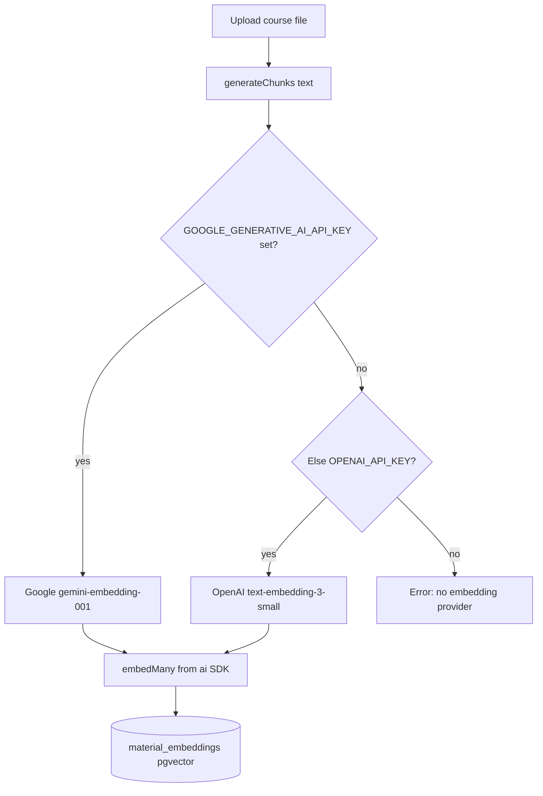
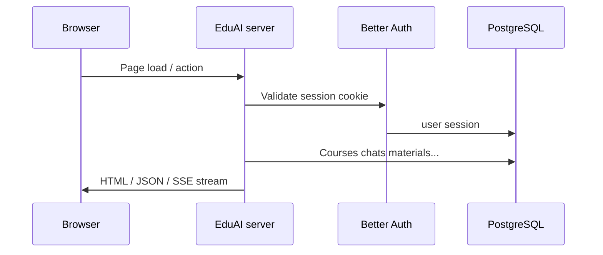
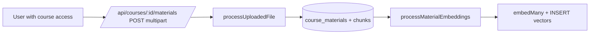
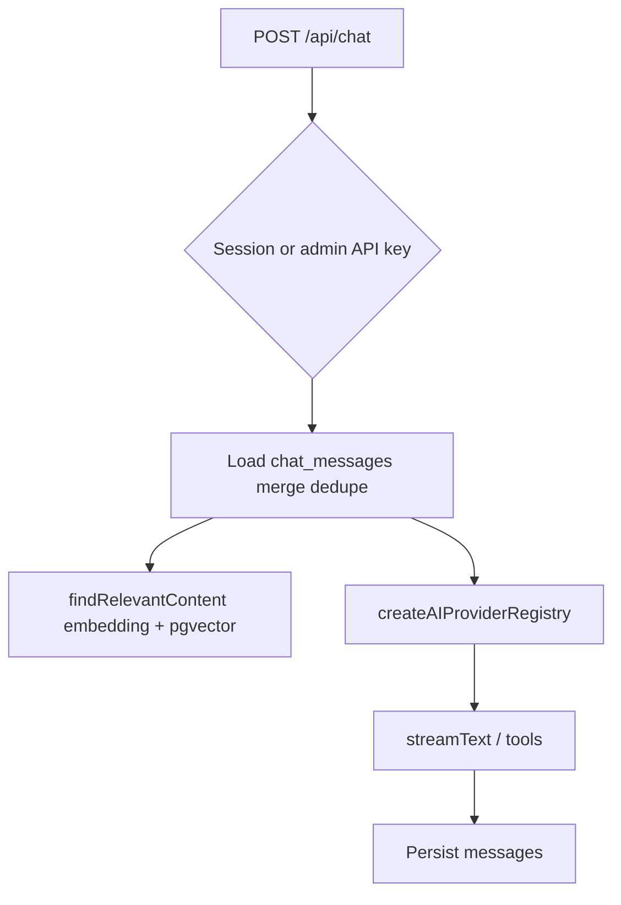
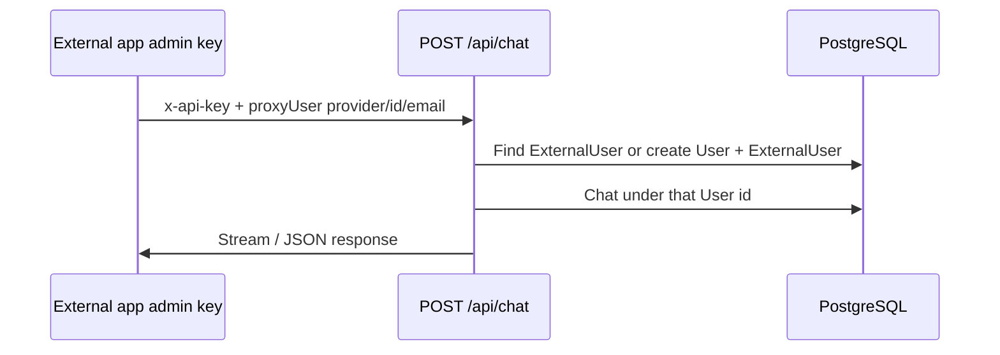

# EduAI — Architecture guide

This document explains **what runs inside this repo (Core)** versus **what lives outside it (hosted services & integrations)**, how **AI providers and keys** work (including `**GOOGLE_GENERATIVE_AI_API_KEY` for embeddings**), and how the **codebase fits together**. Use it as the single place to orient yourself; export to PDF when you want a printable copy (see [Saving as PDF](#saving-as-pdf)).

---

## 1. Simple terms: Core vs. hosted


| Term in this doc             |  Meaning                                                                                                                                                                             |
| ---------------------------- | ----------------------------------------------------------------------------------------------------------------------------------------------------------------------------------- |
| **Core (owned)**             | The EduAI application in *this repository*: the web UI, all `/api/`* routes, PostgreSQL data, auth, RAG (chunking + vectors + search), chat persistence. You deploy and operate it. |
| **Hosted / external**        | Services you call over the network but do *not* ship as part of this repo: Google AI, OpenAI, Ollama, optional Firecrawl, etc. They hold the actual language/embedding models.      |
| **Extensions (integrators)** | Other products (e.g. a campus “tutor” app) that **call EduAI’s HTTP API** with an admin API key and optional `proxyUser`. They are clients of Core, not code inside Core.           |





---

## 2. What is the “Vercel AI SDK” here?

In this project you will see npm packages:

- `**ai**` — the main Vercel AI SDK runtime. It gives unified helpers such as `**streamText**`, `**generateText**`, `**embed**`, and `**embedMany**` so application code talks to models in a consistent way.
- `**@ai-sdk/google**`, `**@ai-sdk/openai**`, `**ollama-ai-provider**` — **provider adapters**. Each one knows how to format requests/responses for that vendor’s HTTP API.

Think of it as two layers:

1. **SDK (`ai`)** — “run this model with these messages” or “turn these strings into embedding vectors.”
2. **Provider (`@ai-sdk/...`)** — “when the SDK needs Google, call Google’s endpoints with this API key.”

You do **not** deploy “Vercel” yourself; these are **libraries** published by Vercel that run inside **your Node server**.

---

## 3. Provider config (two different paths)

There are **two separate uses** of AI in this codebase. They use keys differently.

### A) Chat / completion models (`provider:model`)

**Purpose:** Answer the user with streaming or JSON responses, optionally with tools (RAG).

**Where configured:** `app/lib/ai/providers.ts` builds a **provider registry** from **per-request settings** (`apiKeys` in the JSON body for `/api/chat`, or equivalent from the logged-in user’s saved settings in the UI). Only providers that are **enabled** and have a **key** (when required) get wired into the registry.




Model IDs look like `**google:gemini-2.5-flash**` or `**ollama:gpt-oss:120b**` — provider name, colon, then model id (`parseModelIdentifier` in `providers.ts`).

### B) Embeddings for RAG (course materials)

**Purpose:** Turn each **chunk of course text** into a  **3072-dimensional vector** stored in Postgres (`material_embeddings`), and embed **user queries** at search time for similarity search.

**Where configured:** `app/lib/ai/embedding.ts` — `**getEmbeddingModel()`**.

- If `**GOOGLE_GENERATIVE_AI_API_KEY**` is set in the **server environment**, embeddings use **Google** with model `**gemini-embedding-001`**.
- Else if `**OPENAI_API_KEY**` is set, embeddings use `**text-embedding-3-small**`.
- If neither is set, ingestion/search that needs embeddings **throws an error**.

**Important:** Embedding calls **do not** use the `apiKeys` object from the chat request. They **only** read `**process.env`**. So `.env.example` labels Google as “For Embeddings” because **that env var is what backs RAG vector generation** when Google is chosen.




---

## 4. Key cheat sheet


| Key / variable                                                    | Used for                                                       | Comes from                                                                          |
| ----------------------------------------------------------------- | -------------------------------------------------------------- | ----------------------------------------------------------------------------------- |
| `**GOOGLE_GENERATIVE_AI_API_KEY**`                                | **Embeddings** (RAG ingest + query vectors) when set on server | Server `.env` only (`embedding.ts`)                                                 |
| `**OPENAI_API_KEY`**                                              | Embeddings fallback if Google env not set                      | Server `.env` only                                                                  |
| `**apiKeys.google.apiKey**` (and similar) in `**/api/chat**` body | **Chat** completions for that request                          | Client/request (often admin/API); merged with UI session settings in app code paths |
| `**OLLAMA_BASE_URL`**                                             | Local Ollama base URL for **chat** registry                    | Env + optional override in user settings                                            |
| `**BETTER_AUTH_*`**                                               | Sessions and API keys for EduAI accounts                       | Env                                                                                 |
| `**FIRECRAWL_API_KEY**`                                           | Optional web search tool                                       | Env (see README)                                                                    |


Same Google account key *could* theoretically work for both embeddings and chat if you pass it in both places — but **the code paths are separate**: embeddings **will not** pick up chat body keys.

---

## 5. End-to-end flows (diagrams)

### 5.1 Request lifecycle (browser)




### 5.2 RAG material upload → vectors




Main files: `app/routes/api/courses.materials.$.ts`, `app/lib/ai/file-processing.ts`, `app/lib/ai/embedding.ts`.

### 5.3 Chat with course context




Main file: `app/routes/api/chat.ts`.

### 5.4 Extension calling Core (`proxyUser`)




Docs also in `docs/chat-history.md`.

---

## 6. Codebase walkthrough (where to look)

High-level layout:

```
app/
  routes.ts              → URL → route module map (single source of truth for paths)
  routes/                → Pages + api handlers (*.tsx / *.ts)
  components/            → UI (dashboard, chat, admin tables, …)
  lib/
    auth/                → Better Auth server + guards (e.g. enforceAdminIfApiKey)
    ai/
      providers.ts       → Registry + PROVIDER_CONFIGS + model id parsing
      embedding.ts       → Chunks, embed/embedMany, pgvector search (env keys only)
      file-processing.ts → Extract text from PDFs/docs
    prisma.server.ts     → DB client
    courses/             → Course API helpers + Zod schemas
prisma/
  schema.prisma          → Unified DB schema
  migrations/            → SQL history
  seed.ts                → Default AIProvider / AIModel rows
docs/
  architecture.md        → This file
  chat-history.md        → Chat persistence + proxy users
```

### Routes worth memorizing

Defined in `app/routes.ts`:


| Pattern                                                    | Role                  |
| ---------------------------------------------------------- | --------------------- |
| `/api/auth/*`                                              | Better Auth           |
| `/api/chat`                                                | Main chat + RAG tools |
| `/api/chats/:chatId`                                       | Chat metadata         |
| `/api/courses`, `/api/courses/:id`, topics, materials      | Courses & RAG upload  |
| `/api/ai-providers/*`, `/api/ai-models/*`                  | Catalog admin         |
| `/api/users/*`                                             | Admin users           |
| `/dashboard`, `/chat`, `/courses`, `/settings`, `/admin/*` | UI                    |


### Database (unified schema)

Single Postgres database; Prisma models include users/sessions, courses, materials/chunks/embeddings, chats/messages, AI catalog, API keys, `ExternalUser` for proxy delegation. See `prisma/schema.prisma`.

---

## 7. Saving as PDF

This file is Markdown so it stays diff-friendly in git. To get a **PDF**:

1. **VS Code / Cursor:** Install a “Markdown PDF” style extension and export `docs/architecture.md`, **or**
2. Open the preview / GitHub-rendered view and use **Print → Save as PDF**, **or**
3. **Pandoc** (if installed):
  `pandoc docs/architecture.md -o EduAI-architecture.pdf`

Mermaid diagrams render in GitHub and many Markdown previews; some PDF tools need a Mermaid-capable renderer — if diagrams are missing in PDF, use a browser print from a viewer that supports Mermaid (e.g. GitHub page).

---

## 8. One-page mental model

**Core** is one app + one DB. **Hosted APIs** supply brains (chat + embeddings). **Embeddings for RAG** always use **server env** (`GOOGLE_GENERATIVE_AI_API_KEY` preferred). **Chat** uses the **AI SDK + provider registry** with keys from **request/UI settings**. **Extensions** call your APIs; they are not inside this repo.