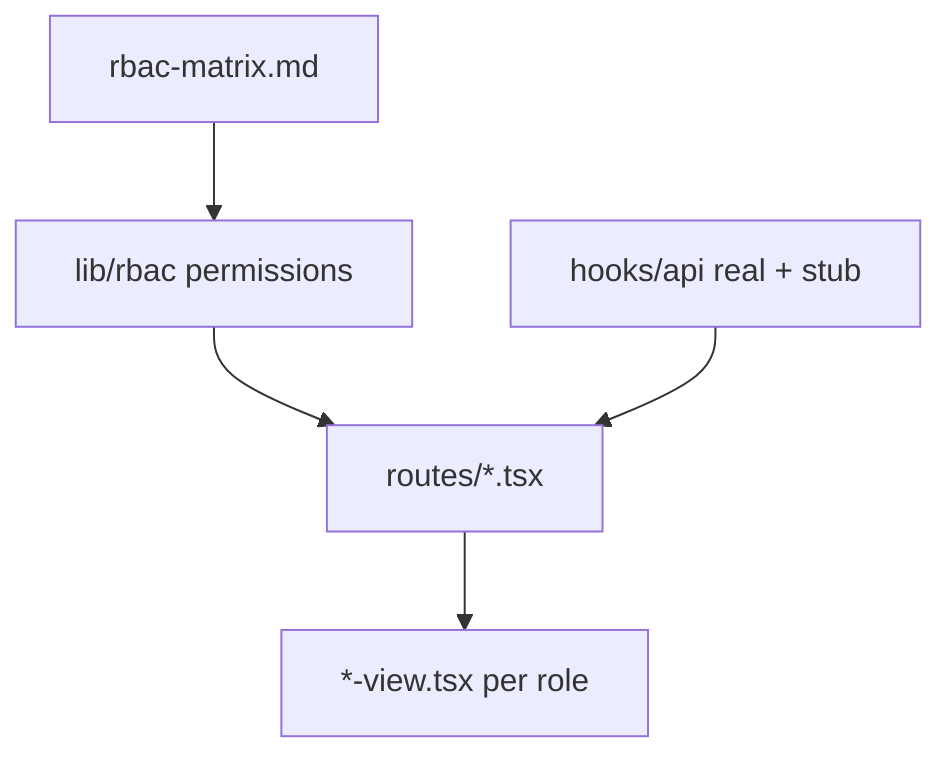

# Issue #386 — Task 3: RBAC UI Implementation (EduAI Only)

**Issue:** [S: Week 5 — RBAC matrix EduAI + demo + frontend tests #386](https://github.com/EduAI-Lab/EduAI/issues/386)  
**Branch:** `feat/rbac-ui`  
**Repo docs:** [`docs/implementations/RBAC_UI_IMPLEMENTATION_PLAN.md`](implementations/RBAC_UI_IMPLEMENTATION_PLAN.md) · [`apps/core/docs/RBAC_UI_TWO_PERSON_ASSIGNMENT.md`](../apps/core/docs/RBAC_UI_TWO_PERSON_ASSIGNMENT.md)  
**Spec:** [`docs/implementations/rbac-matrix.md`](implementations/rbac-matrix.md) §4–13 only  
**App:** [`apps/core`](../apps/core)

---

## What “wireframes” means in #386 (verified)

GitHub issue wording says *“implement the wireframes”* — in this project that means **real frontend code**, not design artifacts.

| Means (in scope) | Does **not** mean |
|------------------|-------------------|
| Ship **working pages** in `apps/core` (React Router routes, components, hooks) | Figma / FigJam / PNG mockups only |
| Role-gated **UI** users can click through in `npm run dev` | Static HTML prototypes with no app integration |
| **Vitest + RTL** tests for role-gated rendering | Storybook-only demos with no routes |
| Extend existing screens (`courses`, `chat`, `admin`, sidebar) | New design system from scratch |

**Deliverable:** merged TypeScript/TSX in the repo that behaves per [`rbac-matrix.md`](implementations/rbac-matrix.md) §4–13. Demo is a walkthrough of the **running app**, not a slide deck of layouts.

There are **no separate wireframe files** in the repo — layout intent comes from the matrix + current `apps/core` routes. Person A/B **code** the per-role views described in the assignment doc.

---

## What Task 3 asks for (your three bullets)

| # | Requirement | How we deliver |
|---|-------------|----------------|
| 1 | **Build UI component/page per role** | One route per feature; **separate view components** per persona (admin, unit-admin, instructor, ta, student) |
| 2 | **Correct permissions and layout for that role** | `lib/rbac` drives visibility; layouts differ (tabs, CTAs, empty states) — not one screen with hidden buttons only |
| 3 | **API hooks stubbed, ready for backend** | `app/hooks/api/*` + fixtures + wiring doc; routes call hooks, views get props |

**Also from #386 scope (same sprint):**

- Frontend tests: **role-gated rendering** + **primary flows**
- Demo round → capture feedback (comments / follow-up issues) — Task 4 in plan

**Acceptance criteria mapping:**

| Criterion | Done when |
|-----------|-----------|
| Screens render correctly per role (matrix) | 5 seed users; manual + RTL tests pass |
| Demo feedback captured | `week5-rbac-demo.md` + GitHub comments |
| Frontend tests pass | `cd apps/core && npm run test` green |

---

## Prerequisite (do not skip)

**`feat/rbac` today = legacy schema** (`PROFESSOR`, `professorId`). Matrix assumes **`origin/feature/rbac`** schema.

```bash
git fetch origin && git merge origin/feature/rbac
cd apps/core && npx prisma migrate dev && npm run typecheck
```

Then add `app/lib/rbac/` before any view work.

---

## Architecture



- **Views:** props only — no `fetch`, no `user.role ===` checks  
- **Routes:** loader (session) + pick view + call hooks  
- **Hooks:** call **real** `/api/*` where routes exist today; **stub** only missing endpoints (see audit below). UI still gates via `lib/rbac` because API RBAC ≠ matrix yet.

---

## Phase 0 — Matrix in code (1–2 days)

[`apps/core/app/lib/rbac/`](../apps/core/app/lib/rbac/)

- `resolveCourseAccess` — §3  
- `canX()` — every operation in §4–13  
- `getNavForUser` — sidebar items per role  
- `permissions.test.ts` — table-driven from matrix  

**Personas (5 layouts):**

| Persona | Platform role | Course role |
|---------|---------------|-------------|
| Admin | `ADMIN` | — |
| Unit admin | `UNIT_ADMIN` | acts as instructor in unit (§3) |
| Instructor | `INSTRUCTOR` | `EnrollmentRole.INSTRUCTOR` |
| TA | usually `STUDENT` | `EnrollmentRole.TA` |
| Student | `STUDENT` | `EnrollmentRole.STUDENT` |

---

## Phase 1 — API hooks (hybrid: real + stub) (~1 day)

**Codebase audit (`feat/rbac` / `development`):** Most Core REST routes **already exist**. Phase 1 should **centralize** fetches into hooks and **call real endpoints** where present. Stub/fixture only for **missing** APIs. Backend issues (#298–#305) are mainly **RBAC fixes**, not greenfield routes.

### Endpoint audit (apps/core today)

| Hook | Exists today? | Route / method | Gap vs matrix |
|------|---------------|----------------|---------------|
| `useCourses` | **Yes** | `GET/POST /api/courses`, `PATCH /api/courses/:id` | GET public; POST ADMIN-only; PATCH uses `professorId` — needs #298 RBAC |
| `useCourseDetail` | **Partial** | No `GET /api/courses/:id` — detail uses **route loader + Prisma** | Hook can wrap loader data or add GET later |
| `useCourseMaterials` | **Yes** | `GET/POST /api/courses/:courseId/materials` | No **DELETE** (#300); students can POST (wrong) |
| `useCourseTopics` | **Yes** | `GET/POST/DELETE .../topics` | No **PATCH**; create/delete ADMIN-only (#299) |
| `useCourseEnrollments` | **No** | No enrollment API in Core | **Stub until #305** |
| `useUsers` | **Yes** | `GET/POST/PATCH/DELETE /api/users` | Works; no `authorizedUnits` until schema #297 |
| `useAiProviders` / `useAiModels` | **Yes** | `/api/ai-providers`, `/api/ai-models`, `GET /api/ollama-models` | Already used by `admin.ai-models.tsx` |
| `useBugReports` / `useSubmitBugReport` | **No in Core** | Bug reports live in **AI Tutor / QM** extensions only | **Stub until #304** Core API + UI |
| `useChatSessions` | **Partial** | `POST /api/chat`, `GET /api/chats/:chatId` | No **DELETE** chat (#302); no course-scoped list |

Registered in [`app/routes.ts`](../apps/core/app/routes.ts). Routes already call these APIs inline (`courses.tsx`, `admin.users.tsx`, `chat.tsx`, `courses.$courseId.tsx`) — Phase 1 **moves** that logic into hooks.

### Hook strategy

```ts
// hooks/api/config.ts
export const STUB_ONLY = {
  enrollments: true,
  bugReports: true,
  deleteMaterial: true,
  deleteChat: true,
  editTopic: true, // no PATCH route
} as const
```

- **Wire now:** `useCourses`, `useCourseMaterials`, `useCourseTopics`, `useUsers`, `useAiProviders`, `useAiModels`, `useChat` (POST + GET history)  
- **Stub now:** `useCourseEnrollments`, `useBugReports`, `useSubmitBugReport`, delete-material, delete-chat, topic PATCH  
- **`STUB_API` global flag:** optional for offline Storybook/tests only — not default for dev  

[`apps/core/docs/api-hook-wiring.md`](../apps/core/docs/api-hook-wiring.md) — per hook: **live endpoint** vs **stub** vs **#issue** for RBAC hardening  

---

## Phase 2 — Pages + per-role views (Task 3 core, 2–3 days)

### Deliverable table

| Page / route | View components (per role) | Permission highlights |
|--------------|---------------------------|------------------------|
| **Shell** `app-sidebar`, `nav-user` | Nav derived from `getNavForUser` | UNIT_ADMIN: no User/AI/Bug admin links |
| `/dashboard` | `dashboard-*-view` (5) | Role welcome + allowed actions list |
| `/courses` | `courses-list-admin-view`, `…-unit-admin-view`, `…-instructor-view`, `…-ta-view`, `…-student-view` | Create: ADMIN + UNIT_ADMIN only; student: published only |
| `/courses/:id` | `course-detail-manager-view`, `course-detail-ta-view`, `course-detail-student-view` | Manager tabs vs learner; enrollments hidden for student; instructor mgmt: admin/unit only |
| `/chat` | `chat-global-view`, `chat-course-scoped-view` | ADMIN/UNIT: global; others: enrolled courses via stub |
| `/settings` | `settings-view` (shared) | Own API keys — all roles §12 |
| `/admin/users` | `users-admin-view` | ADMIN only §4 |
| `/admin/ai-models` | `ai-models-admin-view` | ADMIN only §13 |
| `/admin/bug-reports` | `bug-reports-admin-view` | ADMIN triage §11 |
| **Shared** | `bug-report-submit-dialog` | Submit: all roles §11 |

**File layout:**

```
apps/core/app/components/
  courses/     courses-list-*-view.tsx, course-detail-*-view.tsx
  chat/        chat-global-view.tsx, chat-course-scoped-view.tsx
  admin/       users-admin-view.tsx, bug-reports-admin-view.tsx, ...
  dashboard/   dashboard-*-view.tsx
  shared/      bug-report-submit-dialog.tsx
```

**Layout rules (not just hide buttons):**

- **Student** course detail: 2–3 tabs, no action bar, read-only copy  
- **TA**: upload zone + no topic edit forms  
- **UNIT_ADMIN** courses list: department filter chips on `authorizedUnits`  
- **INSTRUCTOR**: no “Create course” hero/CTA  
- **ADMIN**: full admin nav + all course actions  

---

## Phase 3 — Frontend tests (1 day) — #386 acceptance

**Role-gated rendering** (RTL, no network):

| Test file | Asserts |
|-----------|---------|
| `permissions.test.ts` | `canX()` vs matrix rows |
| `AppSidebar.test.tsx` | 5 roles → correct links present/absent |
| `CoursesListUnitAdminView.test.tsx` | Create visible |
| `CoursesListInstructorView.test.tsx` | Create absent |
| `CoursesListStudentView.test.tsx` | Unpublished course card absent |
| `CourseDetailStudentView.test.tsx` | No Enrollments tab, no upload |
| `CourseDetailTaView.test.tsx` | Upload yes, topic edit no |
| `BugReportsAdminView.test.tsx` | ADMIN only props |

**Primary flows** (stub callbacks):

- Unit admin: open create course dialog → stub `createCourse` called  
- Instructor: open edit on owned course → stub `updateCourse`  
- Student: navigate course detail → materials list read-only  
- All roles: bug submit dialog opens and calls stub `submitBugReport`  

Run: `cd apps/core && npm run test && npm run typecheck`

---

## Phase 4 — Demo feedback (parallel end of sprint)

- Walk 5 seed users through checklist in [`apps/core/docs/week5-rbac-demo.md`](../apps/core/docs/week5-rbac-demo.md)  
- Post summary on **#386**; open follow-up issues for Week 6 (wire real APIs, backend RBAC)  
- Note UI-vs-API gaps using matrix **§20**  

---

## Definition of done (Task 3 + #386)

- [ ] Per-role **view components** exist for every row in deliverable table  
- [ ] Layout and actions match [`rbac-matrix.md`](implementations/rbac-matrix.md) §4–13  
- [ ] All data/mutations go through **hooks** (real APIs where they exist; stubs documented for gaps)  
- [ ] Role-gated + primary-flow **tests pass**  
- [ ] Demo feedback recorded on #386  

**Explicitly out of Task 3:** API enforcement (#298–#305), AI Tutor/QM (§14–18), E2E Playwright.

---

## Suggested order (single developer)

1. Merge schema → `lib/rbac` + tests  
2. Stub hooks + fixtures  
3. Sidebar + dashboard (proves 5 nav shapes)  
4. Courses list + detail (largest surface)  
5. Chat, settings, admin, bug dialog  
6. Tests + demo doc  

**Two-person split:** [`apps/core/docs/RBAC_UI_TWO_PERSON_ASSIGNMENT.md`](../apps/core/docs/RBAC_UI_TWO_PERSON_ASSIGNMENT.md) — **lead** owns Phase 0 setup + `feat/rbac-ui` handoff; A/B start after checklist.

---

## Branch note

| Item | Status |
|------|--------|
| `feat/rbac` | Working branch for #386 |
| `origin/feature/rbac` | Merge for schema/types |
| `development` | Merge target when PR ready |
