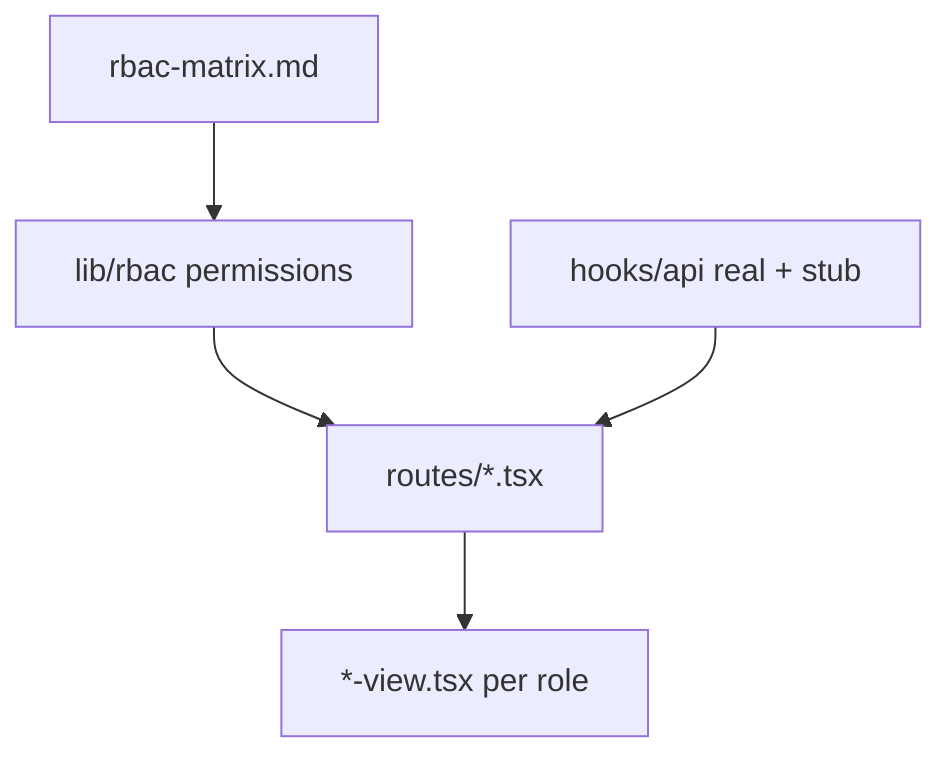

# Issue #386 — Task 3: RBAC UI Implementation (EduAI Only)

**Related docs**

- Permissions spec: [rbac-matrix.md](./rbac-matrix.md) §4–13
- Two-person split: [RBAC_UI_TWO_PERSON_ASSIGNMENT.md](../../apps/core/docs/RBAC_UI_TWO_PERSON_ASSIGNMENT.md)

**Issue:** S: Week 5 — RBAC matrix EduAI + demo + frontend tests (#386)  
**Branch:** `feat/rbac-ui`  
**App:** `apps/core`

---

## What “wireframes” means in #386 (verified)

GitHub issue wording says *“implement the wireframes”* — in this project that means **real frontend code**, not design artifacts.

| Means (in scope) | Does **not** mean |
|------------------|-------------------|
| Ship **working pages** in `apps/core` (React Router routes, components, hooks) | Figma / FigJam / PNG mockups only |
| Role-gated **UI** users can click through in `npm run dev` | Static HTML prototypes with no app integration |
| **Vitest + RTL** tests for role-gated rendering | Storybook-only demos with no routes |
| Extend existing screens (`courses`, `chat`, `admin`, sidebar) | New design system from scratch |

**Deliverable:** merged TypeScript/TSX in the repo that behaves per [rbac-matrix.md](./rbac-matrix.md) §4–13. Demo is a walkthrough of the **running app**, not a slide deck of layouts.

There are **no separate wireframe files** in the repo — layout intent comes from the matrix + current `apps/core` routes. Person A/B **code** the per-role views described in the assignment doc.

---

## What Task 3 asks for

| # | Requirement | How we deliver |
|---|-------------|----------------|
| 1 | **Build UI component/page per role** | One route per feature; **separate view components** per persona (admin, unit-admin, instructor, ta, student) |
| 2 | **Correct permissions and layout for that role** | `lib/rbac` drives visibility; layouts differ (tabs, CTAs, empty states) — not one screen with hidden buttons only |
| 3 | **API hooks ready for backend** | `app/hooks/api/*`; real APIs where they exist; stub gaps; routes call hooks, views get props |

**Also from #386 scope:**

- Frontend tests: **role-gated rendering** + **primary flows**
- Demo round → capture feedback (comments / follow-up issues)

**Acceptance criteria**

| Criterion | Done when |
|-----------|-----------|
| Screens render correctly per role (matrix) | 5 seed users; manual + RTL tests pass |
| Demo feedback captured | `week5-rbac-demo.md` + GitHub comments |
| Frontend tests pass | `cd apps/core && npm run test` green |

---

## Prerequisite (do not skip)

**`feat/rbac` today = legacy schema** (`PROFESSOR`, `professorId`). Matrix assumes **`origin/feature/rbac`** schema.

```bash
git fetch origin && git merge origin/feature/rbac
cd apps/core && npx prisma migrate dev && npm run typecheck
```

Then add `app/lib/rbac/` before any view work. Lead checklist: [RBAC_UI_TWO_PERSON_ASSIGNMENT.md](../../apps/core/docs/RBAC_UI_TWO_PERSON_ASSIGNMENT.md).

---

## Architecture



- **Views:** props only — no `fetch`, no `user.role ===` checks
- **Routes:** loader (session) + pick view + call hooks
- **Hooks:** call **real** `/api/*` where routes exist today; **stub** only missing endpoints (see audit below). UI still gates via `lib/rbac` because API RBAC ≠ matrix yet.

---

## Phase 0 — Matrix in code (1–2 days)

`apps/core/app/lib/rbac/`

- `resolveCourseAccess` — §3
- `canX()` — every operation in §4–13
- `getNavForUser` — sidebar items per role
- `permissions.test.ts` — table-driven from matrix

**Personas (5 layouts):**

| Persona | Platform role | Course role |
|---------|---------------|-------------|
| Admin | `ADMIN` | — |
| Unit admin | `UNIT_ADMIN` | acts as instructor in unit (§3) |
| Instructor | `INSTRUCTOR` | `EnrollmentRole.INSTRUCTOR` |
| TA | usually `STUDENT` | `EnrollmentRole.TA` |
| Student | `STUDENT` | `EnrollmentRole.STUDENT` |

---

## Phase 1 — API hooks (hybrid: real + stub) (~1 day)

**Codebase audit:** Most Core REST routes **already exist**. Centralize fetches into hooks; call real endpoints where present. Stub only **missing** APIs. Backend issues (#298–#305) are mainly **RBAC fixes**, not greenfield routes.

### Endpoint audit (apps/core today)

| Hook | Exists today? | Route / method | Gap vs matrix |
|------|---------------|----------------|---------------|
| `useCourses` | **Yes** | `GET/POST /api/courses`, `PATCH /api/courses/:id` | GET public; POST ADMIN-only; PATCH uses `professorId` — needs #298 RBAC |
| `useCourseDetail` | **Partial** | No `GET /api/courses/:id` — detail uses **route loader + Prisma** | Hook can wrap loader data or add GET later |
| `useCourseMaterials` | **Yes** | `GET/POST /api/courses/:courseId/materials` | No **DELETE** (#300); students can POST (wrong) |
| `useCourseTopics` | **Yes** | `GET/POST/DELETE .../topics` | No **PATCH**; create/delete ADMIN-only (#299) |
| `useCourseEnrollments` | **No** | No enrollment API in Core | **Stub until #305** |
| `useUsers` | **Yes** | `GET/POST/PATCH/DELETE /api/users` | Works; no `authorizedUnits` until schema #297 |
| `useAiProviders` / `useAiModels` | **Yes** | `/api/ai-providers`, `/api/ai-models`, `GET /api/ollama-models` | Already used by `admin.ai-models.tsx` |
| `useBugReports` / `useSubmitBugReport` | **No in Core** | Bug reports in extensions only | **Stub until #304** Core API + UI |
| `useChatSessions` | **Partial** | `POST /api/chat`, `GET /api/chats/:chatId` | No **DELETE** chat (#302); no course-scoped list |

Phase 1 **moves** inline `fetch` from routes into hooks.

### Hook strategy

```ts
export const STUB_ONLY = {
  enrollments: true,
  bugReports: true,
  deleteMaterial: true,
  deleteChat: true,
  editTopic: true,
} as const
```

- **Wire now:** `useCourses`, `useCourseMaterials`, `useCourseTopics`, `useUsers`, `useAiProviders`, `useAiModels`, `useChat`
- **Stub now:** `useCourseEnrollments`, `useBugReports`, `useSubmitBugReport`, delete-material, delete-chat, topic PATCH
- Document in `apps/core/docs/api-hook-wiring.md`

---

## Phase 2 — Pages + per-role views (2–3 days)

| Page / route | View components (per role) | Permission highlights |
|--------------|---------------------------|------------------------|
| **Shell** | Nav from `getNavForUser` | UNIT_ADMIN: no User/AI/Bug admin |
| `/dashboard` | `dashboard-*-view` (5) | Role welcome |
| `/courses` | 5 list views | Create: ADMIN + UNIT_ADMIN only |
| `/courses/:id` | manager / ta / student detail | Enrollments hidden for student |
| `/chat` | global vs course-scoped | |
| `/settings` | shared | Own API keys §12 |
| `/admin/users`, `/admin/ai-models`, `/admin/bug-reports` | admin views | ADMIN only |
| **Shared** | `bug-report-submit-dialog` | All roles submit §11 |

**Layout rules:** distinct layouts per role where required (not only hidden buttons). See assignment doc for A/B ownership.

---

## Phase 3 — Frontend tests (1 day)

`permissions.test.ts`, sidebar/course/admin view tests, primary flows. Run: `cd apps/core && npm run test && npm run typecheck`.

---

## Phase 4 — Demo feedback

Walk 5 seed users; post on #386; note gaps from matrix §20 in `apps/core/docs/week5-rbac-demo.md`.

---

## Definition of done

- [ ] Per-role view components for deliverable table
- [ ] Layout/actions match rbac-matrix §4–13
- [ ] Hooks: live where APIs exist; stubs documented
- [ ] Tests pass
- [ ] Demo feedback on #386

**Out of scope:** API enforcement (#298–#305), AI Tutor/QM (§14–18), E2E Playwright.

---

## Branch note

| Item | Use |
|------|-----|
| `feat/rbac-ui` | Team branch (lead creates) |
| `origin/feature/rbac` | Schema merge |
| `development` | Merge target when PR ready |
