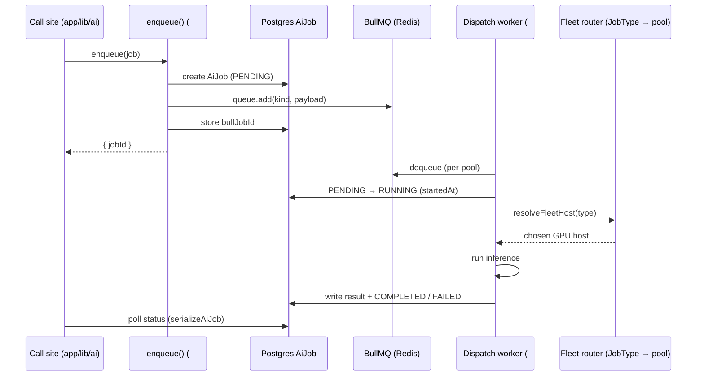

# Async AI-Job Queue — Contract

**Date:** July 2026
**Status:** Design — frozen for handoff (v1)
**Covers:** EduAICore #912 (design). Unblocks the dequeue/dispatch worker (Deployment epic #168) and the producer track (#914 enqueue, #915 backpressure, #916 tests, #917 ETA).

> **This doc is the frozen contract** between the two sides — the producer/enqueue side (`enqueue()`, the `AiJob` model, status read model) and the dequeue/dispatch side (routing into the GPU fleet, epic #168). It fixes the job schema and the queue interface. Neither side may change a field or a status transition without updating this doc.

---

## Table of Contents

1. [Overview + data flow](#1-overview--data-flow)
2. [`JobType` — reused from the fleet](#2-jobtype--reused-from-the-fleet)
3. [Job payload schema](#3-job-payload-schema)
4. [BullMQ topology](#4-bullmq-topology)
5. [`AiJob` Prisma model](#5-aijob-prisma-model)
6. [Enqueue contract — producer (#914)](#6-enqueue-contract--producer-914)
7. [Dequeue / dispatch contract — worker (#168)](#7-dequeue--dispatch-contract--worker-168)
8. [Status / ETA read model (#917)](#8-status--eta-read-model-917)
9. [Environment](#9-environment)
10. [Non-goals & open seams](#10-non-goals--open-seams)

---

## 1. Overview + data flow

GPU throughput is finite — each fleet pool serves a fixed number of concurrent requests (say ~20).
When demand exceeds that, work must **wait somewhere** instead of `POST /api/chat` (or a producer)
blocking on a saturated server. The queue is that buffer: it absorbs the overflow, drains as the
pool frees slots, and lets clients poll for position/result. It is the durable seam between
EduAI's producers and the GPU fleet.

**Both `JobType`s are queued.** `interactive` (chat, tutor) and `background` (Question Maker) both
pass through the queue — the difference is *priority*, not *whether* they queue. Interactive work
drains first; background yields. Streaming chat still streams over `POST /api/chat`, but the
send now flows through the queue so a full pool parks the request instead of erroring. The queue
boundary is the **fleet pool** (throughput budget), and **priority** orders jobs contending for
that budget — see [§4](#4-bullmq-topology).

Two systems of record:
- **Redis / BullMQ** — the transport. Holds the live work queue and BullMQ's own job state.
- **Postgres `AiJob` row** — the **source of truth** for status, position, and result. Survives a
  Redis flush; drives the client-facing status/ETA endpoints (#917). Mirrors the existing
  `CourseReEmbedJob` pattern (`apps/core/app/lib/ai/re-embed-job.server.ts`).



RAG prefetch and model-id resolution stay on the app server, exactly as in the live chat path —
only inference is sent to the picked GPU host (see fleet doc, *Request path*).

---

## 2. `JobType` — reused from the fleet

`JobType` is **not** a new enum. It is the *same* type the fleet router already consumes to pick
a server pool, defined in `apps/core/app/lib/ai/routing/fleet/types.ts` and documented as the
authority in [`docs/rag-ai/routing/eduai-summer-2026/MULTI_SERVER_ROUTING_PLAN.md`](../rag-ai/routing/eduai-summer-2026/MULTI_SERVER_ROUTING_PLAN.md)
(§ *Job types — how we pick a server pool*).

```typescript
type JobType = "interactive" | "background";
```

`JobType` describes **how long the user can wait**, not which app sent the request. It maps to both
a **fleet pool** (which servers) and a **queue priority** (who drains first):

| `JobType` | Meaning | Fleet pool | Priority |
|-----------|---------|------------|----------|
| `interactive` | user waiting on screen (chat, tutor) | chat pool — `VLLM_FLEET_CHAT_URLS` | high |
| `background`  | minutes OK (Question Maker generation) | heavy pool — `VLLM_FLEET_HEAVY_URL` (falls back to chat pool if unset) | low |

**`JobType` is the only classification the queue stores.** It is resolved at the call site from the
fleet's `WorkloadFeature` (the extension's `routingContext.feature`, mapped via `featureToJobType()`
in `fleet/types.ts`). `WorkloadFeature` is a **fleet-routing input**, not a queue concept — the queue
persists the *resolved* `type`, never the feature. Where the job *came from* is tracked separately
by the free-form `source` string on `AiJob` (§3/§5) — a new extension adds a `source` value, it does
**not** touch any enum in this contract.

**v1 reality — the pools overlap.** cmps03 (the heavy pool) is *planned, not yet running* (fleet
doc, § *Current fleet*), so `VLLM_FLEET_HEAVY_URL` is unset and **`background` resolves to the chat
pool too**. In v1 both types contend for the *same* servers — which is exactly why interactive must
outrank background in the queue, and why the queue is keyed by the **resolved pool**, not the
nominal `JobType` (see [§4](#4-bullmq-topology)). When cmps03 lands, `background` re-resolves to the
heavy pool and the contention disappears — no schema change. The epic #168 overload path
(admission queue → Bedrock overflow) bolts onto the same priority mechanism later — see
[§10](#10-non-goals--open-seams).

**The contract references the fleet doc; it never redefines `JobType`.** If the fleet changes it,
this doc follows — a single source prevents drift.

---

## 3. Job payload schema

Zod is the source of truth (matches the convention in `apps/core/app/lib/ai/schemas.ts`); the TS
type is derived with `z.infer`. `input` is a **discriminated union on `kind`** so each work-kind
carries exactly its own fields.

```typescript
import { z } from "zod";

// Concrete async work kinds. Seeded with the only v1 producer; extend as producers land.
export const JobKindSchema = z.enum(["question-generation"]);

// Reused from the fleet — see §2. Not redefined here at runtime; import from fleet/types.
const JobTypeSchema = z.enum(["interactive", "background"]);

// Kind-specific inputs (discriminated on `kind`).
const QuestionGenerationInputSchema = z.object({
  kind: z.literal("question-generation"),
  courseId: z.string().min(1),
  prompt: z.string().min(1),
  count: z.number().int().min(1).max(100),
  // …QM-specific fields; extend as needed (#914).
});

export const JobInputSchema = z.discriminatedUnion("kind", [
  QuestionGenerationInputSchema,
  // future kinds add their schema here
]);

export const JobPayloadSchema = z.object({
  kind: JobKindSchema,                       // concrete work kind; also the BullMQ job name
  type: JobTypeSchema,                        // fleet pool selector + priority (§2)
  source: z.string().min(1),                  // origin app ("core", "ai-tutor", "question-maker") — telemetry only, free-form
  userId: z.string().min(1),                  // owner; RBAC + result routing
  courseId: z.string().min(1).optional(),     // course scope where applicable
  input: JobInputSchema,                      // kind-specific payload
  requestedModel: z.string().optional(),      // explicit model id; else Auto routing decides
  idempotencyKey: z.string().optional(),      // dedupe retried enqueues
});

export type JobPayload = z.infer<typeof JobPayloadSchema>;
```

**Rules the producer enforces:**
- `type` is resolved at the call site from the fleet's `WorkloadFeature` via `featureToJobType()`
  (`fleet/types.ts`) — the queue receives the resolved `type`, never the feature. See [§2](#2-jobtype--reused-from-the-fleet).
- `source` is a **free-form** origin tag (telemetry / debugging only). It is never used for routing
  or priority, so a new extension just picks a new string — no enum edit anywhere in this contract.
- **Priority is derived from `type`, not carried as a field** — `interactive → high`, `background →
  low`. Keeping `JobType` the single source avoids a priority that can drift out of sync with the
  pool selector. The enqueue maps it to BullMQ's `priority` option (§6).
- `input.kind` MUST equal the top-level `kind` (enforced by validation).
- Payload is JSON-serializable — it round-trips through Redis and the `AiJob.result` column.
- `idempotencyKey`, when present, is passed to BullMQ as the job id so a re-enqueue is a no-op.

---

## 4. BullMQ topology

**One queue per fleet pool** — the queue boundary is the *throughput budget*, and priority orders
jobs contending for it:

| Queue name       | Holds                                              | Worker concurrency |
|------------------|----------------------------------------------------|--------------------|
| `ai-jobs:chat`   | interactive (high prio) **+** background when the heavy pool is unset (low prio) | sized to chat pool (cmps01 + cmps02) |
| `ai-jobs:heavy`  | background (low prio), once cmps03 / `VLLM_FLEET_HEAVY_URL` is configured | sized to heavy pool (cmps03) |

- **Queue = resolved pool, not nominal `JobType`.** The producer resolves
  `feature → JobType → pool` (reusing the fleet's `resolveFleetHost()` pool logic) and enqueues to
  *that* pool's queue. v1 (heavy pool unset): interactive **and** background both land on
  `ai-jobs:chat`; background carries low priority so interactive always drains first. When cmps03
  lands, background re-resolves to `ai-jobs:heavy` and stops contending — no schema or contract
  change.
- **Priority** is BullMQ's per-job `priority` (lower number = drained first): `interactive` jobs
  enqueue at high priority, `background` at low. Priority only *matters* while a single pool serves
  both classes (the v1 fallback); once pools are physically separate it is a no-op.
- **BullMQ job `name` = `kind`** (e.g. `"question-generation"`), so the worker can branch on work
  kind and metrics group by kind.

**Why per-pool + priority, not either extreme:**
- *Not one global priority queue.* One queue = one worker set = one concurrency budget. But the
  pools are distinct GPU fleets with independent throughput; a single queue can't point subsets of
  jobs at different pools without in-worker filtering — the exact coupling epic #168 forbids
  (*"background jobs must not block interactive traffic"*). Priority is the wrong axis for
  *cross-pool* separation.
- *Not two queues keyed by nominal `JobType`.* That mis-models the v1 fallback: with the heavy pool
  unset, background runs on the chat pool, so a separate `background` queue would need its own
  worker *also* pointed at the chat pool → two workers racing on one pool, and BullMQ priority
  cannot order across independent queues. Interactive latency would not be protected.
- Keying the queue on the **resolved pool** and using **priority within a shared pool** gives
  independent per-pool concurrency/rate-limits *and* correct interactive-first ordering in every
  fleet state.

Both queues share the single hot-reload-safe ioredis connection exported from
`apps/core/app/lib/queue/connection.server.ts` (`maxRetriesPerRequest: null`, required by BullMQ).

---

## 5. `AiJob` Prisma model

Source of truth for status/position/result. Mirrors `CourseReEmbedJob` (same `PENDING`/`RUNNING`
lifecycle, same snapshot-serializer convention). Lands as a migration in **#914** — this section
is the spec.

```prisma
enum AiJobType {
  interactive
  background
}

enum AiJobStatus {
  PENDING     // enqueued, not yet picked up
  RUNNING     // worker dequeued and is executing
  COMPLETED   // finished, result written
  FAILED      // terminal failure after retries exhausted
  CANCELLED   // cancelled by user/system before completion
}

model AiJob {
  id            String       @id @default(cuid())
  kind          String                       // JobKind (§3); string for forward-compat
  type          AiJobType
  source        String                       // origin app — telemetry, free-form (§3)
  status        AiJobStatus  @default(PENDING)
  payload       Json                         // validated JobPayload
  result        Json?                         // worker-written result (see §7)
  errorMessage  String?
  userId        String
  courseId      String?
  queueName     String?                       // pool queue the job was pushed onto (§4)
  bullJobId     String?                       // link back to the BullMQ job — unique per queue only
  attempts      Int          @default(0)
  startedAt     DateTime?
  completedAt   DateTime?
  createdAt     DateTime     @default(now())
  updatedAt     DateTime     @updatedAt

  @@unique([queueName, bullJobId])
  @@index([userId, status])
  @@index([status, type])
  @@map("ai_jobs")
}
```

**No `queuePosition` column.** Position is not a stored fact — a snapshot taken at enqueue is stale
the instant a job ahead drains. It is **computed live at read time** (count of `PENDING` jobs ahead
in the same queue) and returned only by `serializeAiJob()`; nothing persists it. See [§8](#8-status--eta-read-model-917).

**`bullJobId` is unique per queue, not globally.** BullMQ's auto-generated ids are per-queue
counters, so `ai-jobs:chat` and `ai-jobs:heavy` both issue `"1"`. The row therefore stores the
`queueName` it was pushed onto and the uniqueness is the pair `(queueName, bullJobId)`. Every
lookup by BullMQ id — producer dedupe (§6) and worker transition (§7) — MUST key on the pair.

A `serializeAiJob()` helper returns the client-facing shape with ISO timestamps, exactly like
`serializeReEmbedJob` in `re-embed-job.server.ts` — see [§8](#8-status--eta-read-model-917).

---

## 6. Enqueue contract — producer (#914)

Single entry point used by `app/lib/ai/` call sites:

```typescript
async function enqueue(job: JobPayload): Promise<{ jobId: string }>;
```

Steps (all-or-nothing on the DB row):
1. **Validate** `job` with `JobPayloadSchema`; reject on failure (throws / 400 at the route).
2. **Resolve the target queue** from the fleet pool for `job.type` (`ai-jobs:heavy` when the heavy
   pool is configured for a `background` job, else `ai-jobs:chat`) and the **priority** from
   `job.type` (`interactive → high`, `background → low`).
3. **Create** the `AiJob` row as `PENDING` (`payload = job`, `queueName` = the queue resolved in
   step 2). Position is not stored (§5).
4. **Add** to that queue with priority:
   `queue.add(job.kind, job, { jobId: job.idempotencyKey, priority })`.
5. **Persist** the returned BullMQ id into `AiJob.bullJobId` — unique against `queueName`, never
   on its own (§5).
6. **Return** `{ jobId: aiJob.id }` — the durable handle only. Queue position / ETA are **not**
   returned here; the client reads them from the status endpoint (§8), which is the single source
   of position (computed live per poll). `enqueue` accepts work; it does not report on the queue.

Failure between steps 3 and 4 (Redis down) leaves a `PENDING` row with no `bullJobId` — a reaper
(#915) marks such rows `FAILED`. Backpressure / queue-full rejection is specified in **#915**;
this contract only guarantees the signature and the row lifecycle above.

`jobId` returned to callers is the **`AiJob.id`** (stable, DB-backed), never the raw BullMQ id.

---

## 7. Dequeue / dispatch contract — worker (#168)

The worker consumes each pool queue and is the **only** writer of terminal state. It MUST:

1. **Consume** from each pool queue (`ai-jobs:chat`, `ai-jobs:heavy`) with a BullMQ `Worker` bound
   to the shared ioredis connection, one worker per pool sized to that pool's capacity. BullMQ
   drains higher-priority jobs first, so interactive work is served ahead of background whenever a
   queue holds both.
2. **Transition** the `AiJob` (looked up by `(queueName, bullJobId)` — the id alone is ambiguous
   across pools, §5) `PENDING → RUNNING`, set `startedAt`,
   increment `attempts`.
3. **Route:** map `job.type → fleet pool` via `resolveFleetHost()` (fleet layer). Resolve the
   model id (`requestedModel` or Auto) *before* the fleet pick, exactly as the live chat path
   does.
4. **Run** inference against the chosen host.
5. **Write terminal state** to the `AiJob` row:
   - success → `status = COMPLETED`, `result = <result JSON>`, `completedAt = now`.
   - failure → BullMQ retries per `attempts` policy; once exhausted → `status = FAILED`,
     `errorMessage` set, `completedAt = now`.
6. **Honor cancellation:** if the row is `CANCELLED` before the worker starts (or a cancel flag is
   observed), skip execution and do not overwrite terminal state.

### Status transitions (only legal moves)

| From      | To                    | Trigger |
|-----------|-----------------------|---------|
| `PENDING`   | `RUNNING`             | worker picks up |
| `PENDING`   | `CANCELLED`           | user/system cancels before pickup |
| `RUNNING`   | `COMPLETED`           | inference succeeds |
| `RUNNING`   | `FAILED`              | retries exhausted |
| `RUNNING`   | `PENDING`             | transient retry (BullMQ re-queue) |

`COMPLETED` / `FAILED` / `CANCELLED` are terminal.

### Result JSON shape (written to `AiJob.result`)

```jsonc
{
  "kind": "question-generation",   // echoes the job kind
  "model": "vllm:qwen3.5-27b", // host/model actually used
  "output": { /* kind-specific; QM: generated questions */ },
  "usage": { "inputTokens": 0, "outputTokens": 0 }, // optional telemetry
  "fleetHost": "http://cmps03…:8001"  // which GPU host served it (debug)
}
```

The `output` sub-shape is owned by each `kind` and versioned with the kind, not this contract.

---

## 8. Status / ETA read model (#917)

This read model is the **single source of queue position and ETA** — `enqueue` returns neither
(§6). Position is computed live on every poll, so it decreases as the worker drains the pool and is
never stale. Producers and clients read status via a `serializeAiJob()` snapshot (ISO timestamps),
matching `serializeReEmbedJob`:

```typescript
{
  id, kind, type, source, status,
  queuePosition,          // computed at read: PENDING jobs ahead in the same queue (not a column)
  result,                 // null until COMPLETED
  errorMessage,           // null unless FAILED
  attempts,
  startedAt, completedAt, createdAt, updatedAt  // ISO strings | null
}
```

**ETA (#917)** is derived, not stored: `eta ≈ queuePosition × rollingMeanJobDuration(type)`, where
the rolling mean comes from recent `completedAt − startedAt` per pool. Position is recomputed from
the queue at read time so it decreases as the worker drains the pool. This is a later issue; the
contract only guarantees the `queuePosition` field and the timestamps ETA is computed from.

---

## 9. Environment

- **`REDIS_URL`** — already consumed by `app/lib/queue/connection.server.ts`
  (default `redis://localhost:63790`, the `eduai-redis` service in root `docker-compose.dev.yml`).
- No new env var is introduced by this contract. If #914/#915 add one (e.g. a queue-size cap),
  document it in `docs/ENVIRONMENT.md` and the relevant `.env.example` at that time.

---

## 10. Non-goals & open seams

- **Bedrock overflow** (epic #168 overload path) — out of scope for v1. When even the high-priority
  interactive backlog on a pool exceeds a threshold, #168 spills overflow to Bedrock. It bolts onto
  the same priority mechanism (act on the interactive backlog depth already visible in the queue) —
  no schema change. v1 buffers and prioritizes; it does not spill.
- **Producer implementation** (#914), **backpressure / queue-full** (#915), **enqueue tests +
  worker integration-verify** (#916), **ETA exposure** (#917) — separate issues; this ships the
  contract only.
- **Embeddings / RAG index** stay on Ollena/CPU per the fleet doc — *not* fleet-routed and *not*
  in this queue.
