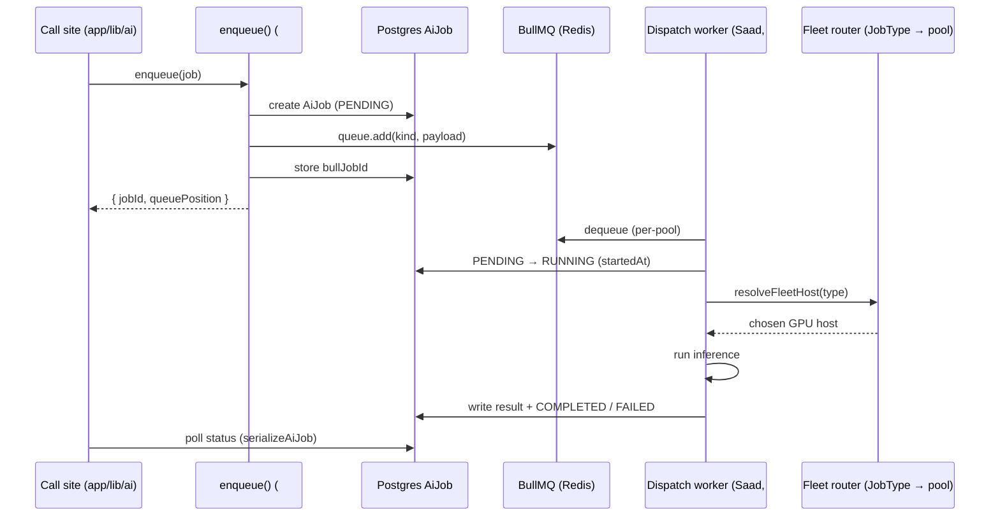

# Async AI-Job Queue — Contract

**Date:** July 2026
**Status:** Design — frozen for handoff (v1)
**Covers:** EduAICore #912 (design). Unblocks Saad's dequeue/dispatch worker (Deployment epic #168) and the producer track (#914 enqueue, #915 backpressure, #916 tests, #917 ETA).

> **Ownership split (epic #63).** **Abdullah** owns the queue + producer/enqueue side (`enqueue()`, the `AiJob` model, status read model). **Saad** (epic #168) owns dequeue + routing/dispatch into the GPU fleet. This doc is the **shared, frozen contract** between the two — the job schema and the queue interface. Neither side may change a field or a status transition without updating this doc.

---

## Table of Contents

1. [Overview + data flow](#1-overview--data-flow)
2. [`JobType` — reused from the fleet](#2-jobtype--reused-from-the-fleet)
3. [Job payload schema](#3-job-payload-schema)
4. [BullMQ topology](#4-bullmq-topology)
5. [`AiJob` Prisma model](#5-aijob-prisma-model)
6. [Enqueue contract — producer (Abdullah, #914)](#6-enqueue-contract--producer-abdullah-914)
7. [Dequeue / dispatch contract — worker (Saad, #168)](#7-dequeue--dispatch-contract--worker-saad-168)
8. [Status / ETA read model (#917)](#8-status--eta-read-model-917)
9. [Environment](#9-environment)
10. [Non-goals & open seams](#10-non-goals--open-seams)

---

## 1. Overview + data flow

The queue lets AI work that a user does not need to *watch stream* (Question Maker generation
today) be accepted quickly, run off the request path, and be polled for a result. Interactive
chat is **not** queued — it streams live over `POST /api/chat`. The queue is the durable seam
between EduAI's producers and the GPU fleet Saad routes into.

Two systems of record:
- **Redis / BullMQ** — the transport. Holds the live work queue and BullMQ's own job state.
- **Postgres `AiJob` row** — the **source of truth** for status, position, and result. Survives a
  Redis flush; drives the client-facing status/ETA endpoints (#917). Mirrors the existing
  `CourseReEmbedJob` pattern (`apps/core/app/lib/ai/re-embed-job.server.ts`).



RAG prefetch and model-id resolution stay on the app server, exactly as in the live chat path —
only inference is sent to the picked GPU host (see fleet doc, *Request path*).

---

## 2. `JobType` — reused from the fleet

`JobType` is **not** a new enum. It is the *same* type the fleet router already consumes to pick
a server pool, defined in `apps/core/app/lib/ai/routing/fleet/types.ts` and documented as the
authority in [`docs/rag-ai/routing/eduai-summer-2026/MULTI_SERVER_ROUTING_PLAN.md`](../rag-ai/routing/eduai-summer-2026/MULTI_SERVER_ROUTING_PLAN.md)
(§ *Job types — how we pick a server pool*).

```typescript
type JobType = "interactive" | "background";
type WorkloadFeature = "chat" | "tutor" | "question-maker";
```

`JobType` describes **how long the user can wait**, not which app sent the request. It is derived
from the extension's `routingContext.feature`:

| `routingContext.feature` | → `JobType` | Server pool |
|--------------------------|-------------|-------------|
| `chat` (default)         | `interactive` | `VLLM_FLEET_CHAT_URLS` |
| `tutor`                  | `interactive` | `VLLM_FLEET_CHAT_URLS` |
| `question-maker`         | `background`  | `VLLM_FLEET_HEAVY_URL` (falls back to chat pool) |

**v1 reality:** everything that actually gets *queued* is `background` (Question Maker). The
`interactive` value exists in the contract because the type is shared with the fleet and because
the epic #168 overload path ("interactive admission queue → Bedrock overflow") will queue
`interactive` work later. v1 producers enqueue `background` only — see [§10](#10-non-goals--open-seams).

**The contract references the fleet doc; it never redefines these types.** If the fleet changes
`JobType`/`WorkloadFeature`, this doc follows — a single source prevents drift.

---

## 3. Job payload schema

Zod is the source of truth (matches the convention in `apps/core/app/lib/ai/schemas.ts`); the TS
type is derived with `z.infer`. `input` is a **discriminated union on `kind`** so each work-kind
carries exactly its own fields.

```typescript
import { z } from "zod";

// Concrete async work kinds. Seeded with the only v1 producer; extend as producers land.
export const JobKindSchema = z.enum(["question-generation"]);

// Reused from the fleet — see §2. Not redefined here at runtime; import from fleet/types.
const JobTypeSchema = z.enum(["interactive", "background"]);
const WorkloadFeatureSchema = z.enum(["chat", "tutor", "question-maker"]);

// Kind-specific inputs (discriminated on `kind`).
const QuestionGenerationInputSchema = z.object({
  kind: z.literal("question-generation"),
  courseId: z.string().min(1),
  prompt: z.string().min(1),
  count: z.number().int().min(1).max(100),
  // …QM-specific fields; owned by the QM producer (#914), extend as needed.
});

export const JobInputSchema = z.discriminatedUnion("kind", [
  QuestionGenerationInputSchema,
  // future kinds add their schema here
]);

export const JobPayloadSchema = z.object({
  kind: JobKindSchema,                       // concrete work kind; also the BullMQ job name
  type: JobTypeSchema,                        // fleet pool selector (§2)
  feature: WorkloadFeatureSchema,             // telemetry / debugging origin tag
  userId: z.string().min(1),                  // owner; RBAC + result routing
  courseId: z.string().min(1).optional(),     // course scope where applicable
  input: JobInputSchema,                      // kind-specific payload
  requestedModel: z.string().optional(),      // explicit model id; else Auto routing decides
  idempotencyKey: z.string().optional(),      // dedupe retried enqueues
});

export type JobPayload = z.infer<typeof JobPayloadSchema>;
```

**Rules the producer enforces:**
- `type` MUST be consistent with `feature` per the [§2](#2-jobtype--reused-from-the-fleet) mapping.
  Reuse the fleet's `featureToJobType()` helper (`fleet/types.ts`) rather than hand-mapping.
- `input.kind` MUST equal the top-level `kind` (enforced by validation).
- Payload is JSON-serializable — it round-trips through Redis and the `AiJob.result` column.
- `idempotencyKey`, when present, is passed to BullMQ as the job id so a re-enqueue is a no-op.

---

## 4. BullMQ topology

**One queue per fleet pool**, keyed by `JobType`:

| Queue name          | Holds            | Worker concurrency owner |
|---------------------|------------------|--------------------------|
| `ai-jobs:background`  | `background` jobs  | Saad — sized to cmps03 / heavy pool |
| `ai-jobs:interactive` | `interactive` jobs (empty in v1) | Saad — reserved for the #168 admission queue |

- **BullMQ job `name` = `kind`** (e.g. `"question-generation"`), so the worker can branch on work
  kind and metrics group by kind.
- Producers select the queue from `job.type`; v1 only ever writes to `ai-jobs:background`.

**Why per-pool, not a single queue with `JobType` as the job name:** epic #168's hard requirement
is *"background jobs must not block interactive traffic."* Separate queues let Saad set
concurrency, rate limits, and priority **independently per pool** and point each queue's worker at
its own GPU pool. A single shared queue would couple the two and force in-worker filtering to
protect interactive latency. Per-pool is the cheaper, clearer contract.

Both queues share the single hot-reload-safe ioredis connection exported from
`apps/core/app/lib/queue/connection.server.ts` (`maxRetriesPerRequest: null`, required by BullMQ).

---

## 5. `AiJob` Prisma model

Source of truth for status/position/result. Mirrors `CourseReEmbedJob` (same `PENDING`/`RUNNING`
lifecycle, same snapshot-serializer convention). Lands as a migration in **#914** — this section
is the spec.

```prisma
enum AiJobType {
  interactive
  background
}

enum AiJobStatus {
  PENDING     // enqueued, not yet picked up
  RUNNING     // worker dequeued and is executing
  COMPLETED   // finished, result written
  FAILED      // terminal failure after retries exhausted
  CANCELLED   // cancelled by user/system before completion
}

model AiJob {
  id            String       @id @default(cuid())
  kind          String                       // JobKind (§3); string for forward-compat
  type          AiJobType
  feature       String                       // WorkloadFeature — telemetry
  status        AiJobStatus  @default(PENDING)
  queuePosition Int?                          // snapshot at enqueue; refined by #917
  payload       Json                         // validated JobPayload
  result        Json?                         // worker-written result (see §7)
  errorMessage  String?
  userId        String
  courseId      String?
  bullJobId     String?      @unique          // link back to the BullMQ job
  attempts      Int          @default(0)
  startedAt     DateTime?
  completedAt   DateTime?
  createdAt     DateTime     @default(now())
  updatedAt     DateTime     @updatedAt

  @@index([userId, status])
  @@index([status, type])
  @@map("ai_jobs")
}
```

A `serializeAiJob()` helper returns the client-facing shape with ISO timestamps, exactly like
`serializeReEmbedJob` in `re-embed-job.server.ts` — see [§8](#8-status--eta-read-model-917).

---

## 6. Enqueue contract — producer (Abdullah, #914)

Single entry point used by `app/lib/ai/` call sites:

```typescript
async function enqueue(job: JobPayload): Promise<{ jobId: string; queuePosition: number }>;
```

Steps (all-or-nothing on the DB row):
1. **Validate** `job` with `JobPayloadSchema`; reject on failure (throws / 400 at the route).
2. **Create** the `AiJob` row as `PENDING` (`payload = job`, `queuePosition` = current waiting
   count of the target queue).
3. **Add** to the pool queue: `queue.add(job.kind, job, { jobId: job.idempotencyKey })`.
4. **Persist** the returned BullMQ id into `AiJob.bullJobId`.
5. **Return** `{ jobId: aiJob.id, queuePosition }`.

Failure between steps 2 and 3 (Redis down) leaves a `PENDING` row with no `bullJobId` — a reaper
(#915) marks such rows `FAILED`. Backpressure / queue-full rejection is specified in **#915**;
this contract only guarantees the signature and the row lifecycle above.

`jobId` returned to callers is the **`AiJob.id`** (stable, DB-backed), never the raw BullMQ id.

---

## 7. Dequeue / dispatch contract — worker (Saad, #168)

The worker consumes each pool queue and is the **only** writer of terminal state. It MUST:

1. **Consume** from `ai-jobs:<type>` with a BullMQ `Worker` bound to the shared ioredis
   connection.
2. **Transition** the `AiJob` (looked up by `bullJobId`) `PENDING → RUNNING`, set `startedAt`,
   increment `attempts`.
3. **Route:** map `job.type → fleet pool` via `resolveFleetHost()` (fleet layer). Resolve the
   model id (`requestedModel` or Auto) *before* the fleet pick, exactly as the live chat path
   does.
4. **Run** inference against the chosen host.
5. **Write terminal state** to the `AiJob` row:
   - success → `status = COMPLETED`, `result = <result JSON>`, `completedAt = now`.
   - failure → BullMQ retries per `attempts` policy; once exhausted → `status = FAILED`,
     `errorMessage` set, `completedAt = now`.
6. **Honor cancellation:** if the row is `CANCELLED` before the worker starts (or a cancel flag is
   observed), skip execution and do not overwrite terminal state.

### Status transitions (only legal moves)

| From      | To                    | Trigger |
|-----------|-----------------------|---------|
| `PENDING`   | `RUNNING`             | worker picks up |
| `PENDING`   | `CANCELLED`           | user/system cancels before pickup |
| `RUNNING`   | `COMPLETED`           | inference succeeds |
| `RUNNING`   | `FAILED`              | retries exhausted |
| `RUNNING`   | `PENDING`             | transient retry (BullMQ re-queue) |

`COMPLETED` / `FAILED` / `CANCELLED` are terminal.

### Result JSON shape (written to `AiJob.result`)

```jsonc
{
  "kind": "question-generation",   // echoes the job kind
  "model": "vllm:qwen2.5-32b-instruct", // host/model actually used
  "output": { /* kind-specific; QM: generated questions */ },
  "usage": { "inputTokens": 0, "outputTokens": 0 }, // optional telemetry
  "fleetHost": "http://cmps03…:8001"  // which GPU host served it (debug)
}
```

The `output` sub-shape is owned by each `kind` and versioned with the kind, not this contract.

---

## 8. Status / ETA read model (#917)

Producers and clients read status via a `serializeAiJob()` snapshot (ISO timestamps), matching
`serializeReEmbedJob`:

```typescript
{
  id, kind, type, feature, status,
  queuePosition,          // live position among PENDING jobs in the same pool
  result,                 // null until COMPLETED
  errorMessage,           // null unless FAILED
  attempts,
  startedAt, completedAt, createdAt, updatedAt  // ISO strings | null
}
```

**ETA (#917)** is derived, not stored: `eta ≈ queuePosition × rollingMeanJobDuration(type)`, where
the rolling mean comes from recent `completedAt − startedAt` per pool. Position is recomputed from
the queue at read time so it decreases as the worker drains the pool. This is a later issue; the
contract only guarantees the `queuePosition` field and the timestamps ETA is computed from.

---

## 9. Environment

- **`REDIS_URL`** — already consumed by `app/lib/queue/connection.server.ts`
  (default `redis://localhost:63790`, the `eduai-redis` service in root `docker-compose.dev.yml`).
- No new env var is introduced by this contract. If #914/#915 add one (e.g. a queue-size cap),
  document it in `docs/ENVIRONMENT.md` and the relevant `.env.example` at that time.

---

## 10. Non-goals & open seams

- **Interactive admission queue + Bedrock overflow** (epic #168 overload path) — out of scope for
  v1. The contract reserves the `ai-jobs:interactive` queue and the `interactive` `JobType` value
  so this bolts on without a schema change.
- **Producer implementation** (#914), **backpressure / queue-full** (#915), **enqueue tests +
  worker integration-verify** (#916), **ETA exposure** (#917) — separate issues; this ships the
  contract only.
- **Embeddings / RAG index** stay on Ollena/CPU per the fleet doc — *not* fleet-routed and *not*
  in this queue.
