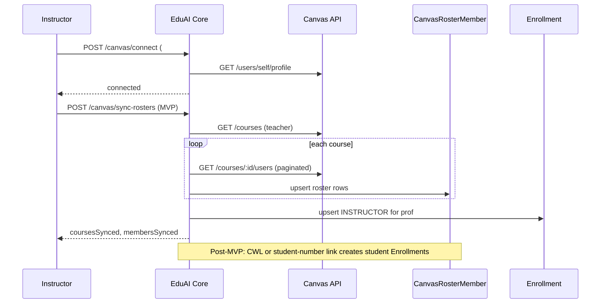

# Canvas Roster Sync — Detailed Design (Draft)


|                     |                                                                                        |
| ------------------- | -------------------------------------------------------------------------------------- |
| **Status**          | **Draft — for team review**                                                            |
| **Date**            | June 2026                                                                              |
| **Audience**        | Engineering, product                                                                   |
| **Epic**            | EduAICore #59 (platform centralization)                                                |
| **Depends on**      | Core Canvas connect API (#381), settings UI (#472)                                     |
| **Constraint**      | **CWL not available yet** — do not rely on `User.email` for enrollment matching in MVP |
| **MVP deliverable** | Instructor **Sync enrollments** button → courses + roster staging in Core              |


**Related docs:**


| Document                                                          | Role                                        |
| ----------------------------------------------------------------- | ------------------------------------------- |
| [Canvas integration strategy](./lti-canvas-integration-report.md) | Product direction (CWL-first, LTI deferred) |
| [Canvas LTI vs API research](./canvas-lti-vs-api-key-research.md) | Endpoint reference, local API test results  |
| [Canvas API integration guide](./canvas-api-integration-guide.md) | Token setup, connect API                    |


---

## 1. Purpose

This document specifies **how Core syncs Canvas courses and rosters** when an instructor clicks **Sync enrollments**, and how student `Enrollment` rows will be linked **later** (after CWL or an explicit student-number flow).

It answers:

1. What happens when an instructor clicks **Sync enrollments** (**MVP**).
2. What data we store in staging before a student has an EduAI account (**MVP**).
3. How students eventually get `Enrollment` rows (**post-MVP** until CWL or approved linker ships).
4. What we deliberately **do not** do (ghost users, synchronous bulk profile fetch, unverified email matching).

This is a **design draft** for teammate feedback. Implementation issue numbers (e.g. #398) may be assigned after review.

---

## 2. Executive summary

### 2.1 Two halves (full product — not all in MVP)


| Half            | Source                              | Question it answers            | MVP?              |
| --------------- | ----------------------------------- | ------------------------------ | ----------------- |
| **Roster sync** | Canvas REST (instructor token)      | Who should be in which course? | **Yes**           |
| **Login link**  | CWL (future) or verified student id | Who is this person on EduAI?   | **No** (deferred) |


For **MVP**, sync completes the first half only: Core has courses + staged roster. Student `Enrollment` linking ships when identity is trustworthy (CWL) or via an explicit MVP linker (student number — see §2.4).

### 2.2 Performance principle

Sync must stay **fast** for large classes (e.g. 3 courses × 200 students):

- **~7–15 Canvas API calls** for that size (paginated roster lists).
- **No per-student `/profile` calls on the sync hot path.**
- Optional email enrichment runs **async** or **at login**, only for rows missing email.
- Optional email enrichment runs **async**, only for rows missing email — **not required for MVP**.

### 2.3 Identity matching — full product (after CWL)

When CWL is live, matching priority becomes:

1. **Email** — CWL-verified `User.email` ↔ staged roster email.
2. **SIS ID from IdP** — CWL student number ↔ Canvas `sis_user_id`.
3. **Manual fallback** — user enters student number ↔ `sis_user_id`.

### 2.4 MVP scope (no CWL)

**Ship now:**


| Item                        | Details                                                                     |
| --------------------------- | --------------------------------------------------------------------------- |
| **Sync enrollments button** | `POST /api/canvas/sync-rosters` + UI on Canvas settings (#472)              |
| **Course upsert**           | Canvas teacher courses → Core `Course` (`externalId`, `externalSource`)     |
| **Roster staging**          | `CanvasRosterMember` rows per student/TA (see §4.2)                         |
| **Instructor enrollment**   | Syncing professor gets `Enrollment` role `INSTRUCTOR` on each synced course |
| **Re-sync**                 | Deactivate staging rows dropped from Canvas roster                          |
| **Sync status in UI**       | Counts, `lastSyncedAt`, error messages                                      |


**Do not ship in MVP:**


| Item                                        | Why                                                                                             |
| ------------------------------------------- | ----------------------------------------------------------------------------------------------- |
| `**User.email` ↔ roster email matching**    | No CWL — `User.email` is not institutionally verified; anyone could register a matching address |
| **Automatic student `Enrollment` on login** | Depends on trustworthy identity (CWL) or explicit student-number flow                           |
| **Login hook `resolveCanvasEnrollments`**   | Deferred to post-MVP (§6)                                                                       |
| **Async bulk `/profile` enrichment**        | Optional; staging works with `canvasUserId` + `sis_user_id` without email                       |


**MVP outcome for instructors:** After sync, Core has the right **courses** and a **roster snapshot** professors (and admin tools) can trust. Extensions can read staged data or wait for linker.

**MVP outcome for students:** They do **not** auto-gain enrollments until a follow-up issue ships (CWL linker and/or student-number link UI). That is intentional without verified identity.

**Email on staging:** Still **store** roster `email` when Canvas returns it (for future CWL matching). Do **not** use it to create student `Enrollment` in MVP.

**Student number (future linker):** When we add student linking without CWL, match entered student number ↔ staging `sisUserId` (see §6.3). Not part of sync-button MVP unless team explicitly adds it in the same sprint.

---

## 3. Product flows

### 3.1 Instructor — Sync enrollments (**MVP**)

```text
1. Sign in to EduAI (existing auth — email/password for dev/pilot users)
2. Settings → Canvas → Connect (canvasUrl + personal access token)   [#381]
3. Click "Sync enrollments"
4. Core pulls teacher courses + rosters from Canvas (~seconds)
5. UI shows: courses synced, roster member count, lastSyncedAt
6. Instructor has INSTRUCTOR Enrollment on each synced course
```

### 3.2 Student / TA enrollment link (**post-MVP**)

Not in sync-button MVP. Planned after CWL or explicit linker:

```text
1. Professor has already synced (roster staged in Core)
2. Student/TA signs in (CWL — preferred — or student-number link flow)
3. Backend matches identity → creates/updates Enrollment rows
4. Student sees courses on dashboard / in extensions
```

### 3.3 Re-sync

Instructor clicks **Sync** again (manual; no cron in v1):

- New roster members added to staging.
- Removed members marked inactive in staging (and linked enrollments deactivated).
- Existing EduAI users re-linked if new email/sis data appears.

---

## 4. Data model

### 4.1 Existing tables (no change to shape)


| Model               | Role in sync                                              |
| ------------------- | --------------------------------------------------------- |
| `CanvasIntegration` | Encrypted token + `canvasUrl` per instructor (#381)       |
| `Course`            | `externalId` + `externalSource: "canvas"`, `lastSyncedAt` |
| `Enrollment`        | Live link `userId` ↔ `courseId`; created at link time     |
| `User`              | Created at login only — **not** bulk-created at sync      |


### 4.2 New table (proposed): `CanvasRosterMember`

Staging between Canvas sync and EduAI login. Holds **expected** course membership from Canvas.

```prisma
// PROPOSED — not in schema yet; names/fields open for review

model CanvasRosterMember {
  id             String         @id @default(cuid())
  courseId       String         // Core Course.id
  canvasUserId   String         // Canvas user id (stringified)
  sisUserId      String?        // Canvas sis_user_id (often student number at UBC)
  email          String?        // normalized lowercase; nullable if Canvas omits
  displayName    String?
  role           EnrollmentRole // STUDENT | TA (INSTRUCTOR synced via separate path)
  syncedByUserId String         // instructor User.id who ran sync
  isActive       Boolean        @default(true)
  lastSeenAt     DateTime       // updated each sync when row still on roster
  createdAt      DateTime       @default(now())
  updatedAt      DateTime       @updatedAt

  course         Course         @relation(fields: [courseId], references: [id], onDelete: Cascade)
  syncedBy       User           @relation(fields: [syncedByUserId], references: [id])

  @@unique([courseId, canvasUserId, role])
  @@index([email])
  @@index([sisUserId])
  @@index([canvasUserId])
  @@map("canvas_roster_members")
}
```

**Design notes:**

- One row per `(course, canvas user, role)`.
- `email` stored normalized: `trim().toLowerCase()`.
- `sisUserId` compared as normalized string (exact rules TBD after UBC pilot).
- `isActive: false` when user drops off roster; row retained for audit.

### 4.3 Course upsert mapping (Canvas → Core)


| Core field       | Canvas source           | Notes                                         |
| ---------------- | ----------------------- | --------------------------------------------- |
| `externalId`     | course `id`             | String                                        |
| `externalSource` | `"canvas"`              | Fixed                                         |
| `name`           | `name`                  |                                               |
| `code`           | `course_code`           | Fallback: parse from `name`                   |
| `section`        | TBD                     | Parse from `sis_course_id` or default `"001"` |
| `term` / `year`  | TBD                     | Parse from `sis_course_id` or enrollment term |
| `startDate`      | `start_at` or sync date | Required by schema                            |
| `endDate`        | `end_at`                | Optional                                      |
| `lastSyncedAt`   | `now()`                 |                                               |


**Open:** UBC `sis_course_id` format — see §10.

### 4.4 Enrollment creation (link time)


| Core field       | Source                                                |
| ---------------- | ----------------------------------------------------- |
| `courseId`       | from matched `CanvasRosterMember`                     |
| `userId`         | logged-in `User.id`                                   |
| `role`           | from staging row                                      |
| `externalSource` | `"canvas"`                                            |
| `externalId`     | Canvas enrollment id if captured; else `canvasUserId` |
| `isActive`       | mirrors staging + roster state                        |


---

## 5. Sync algorithm (instructor-triggered)

**Trigger:** `POST /api/canvas/sync-rosters`  
**Auth:** Session; caller must be `INSTRUCTOR` or `ADMIN` with `CanvasIntegration`  
**Target duration:** ~5–15 seconds for 600 roster rows across 3 courses (network dependent)

### Step 1 — Load credentials

```text
integration = getCanvasIntegrationWithDecryptedKey(session.userId)
if !integration → 400 "Connect Canvas first"
canvasUrl, apiKey = integration
```

### Step 2 — List instructor Canvas courses

```http
GET {canvasUrl}/api/v1/courses
  ?enrollment_type=teacher
  &enrollment_role=TeacherEnrollment
  &per_page=100
```

- Follow Canvas pagination (`Link` header or `page` query).
- Skip concluded courses if desired (filter `workflow_state` — **open question**).

### Step 3 — Upsert Core `Course` per Canvas course

For each Canvas course:

```text
course = upsert Course where externalSource="canvas" AND externalId=canvasCourse.id
map fields (§4.3)
course.lastSyncedAt = now()
```

**Shared course rule (proposed):** If another instructor already synced the same Canvas course id, reuse the same Core `Course` row (unique on `externalSource` + `externalId`). Both instructors get `Enrollment` role `INSTRUCTOR`.

### Step 4 — Ensure instructor enrollment

```text
upsert Enrollment(userId=syncingInstructor, courseId, role=INSTRUCTOR, isActive=true)
```

### Step 5 — Fetch roster per course (fast path)

**Students:**

```http
GET {canvasUrl}/api/v1/courses/{canvasCourseId}/users
  ?enrollment_type[]=student
  &include[]=email
  &per_page=100
```

**TAs (if in scope for v1):**

```http
GET ...?enrollment_type[]=ta&include[]=email&per_page=100
```

Paginate until empty page.

For each user row:

```text
staging = upsert CanvasRosterMember(
  courseId       = coreCourse.id,
  canvasUserId   = row.id,
  sisUserId      = row.sis_user_id ?? null,
  email          = normalize(row.email) ?? null,   // do NOT call /profile here
  displayName    = row.name,
  role           = STUDENT | TA,
  syncedByUserId = session.userId,
  isActive       = true,
  lastSeenAt     = now(),
)
```

### Step 6 — Deactivate dropped members

```text
for each course synced in this run:
  update CanvasRosterMember
    set isActive = false
    where courseId = course.id
      and lastSeenAt < syncRunStartedAt
```

For rows already linked to a `User`:

```text
update Enrollment set isActive = false
  where userId linked via prior match
    and courseId = course.id
    and no active staging row for that canvasUserId
```

### Step 7 — Instructor enrollment only (**MVP**)

```text
upsert Enrollment(
  userId = syncingInstructor,
  courseId = each synced course,
  role = INSTRUCTOR,
  isActive = true,
)
```

**Not in MVP:** eager link of students by `User.email` or `sisUserId` (§6.4). Staging rows are written; student `Enrollment` waits for post-MVP linker.

~~Step 7 (removed from MVP): Eager link for existing EduAI users by email.~~

### Step 8 — Response

```json
{
  "coursesSynced": 3,
  "membersSynced": 587,
  "lastSyncedAt": "2026-06-04T12:00:00.000Z"
}
```

(`membersLinked` omitted in MVP — no automatic student linking.)

### Step 9 — Optional async enrichment (**post-MVP**)

If staging rows exist with `email IS NULL`:

- Queue background job with bounded concurrency (e.g. 10–15 parallel).
- For each: `GET /users/{canvasUserId}/profile` → store `primary_email`.
- Retry on HTTP 429 with backoff.
- Update `CanvasRosterMember.email` for future CWL matching.

Defer until CWL linker is planned. Not required for sync-button MVP.

---

## 6. Login-time enrollment linking (**post-MVP — requires CWL or student-number flow**)

> **Not in sync-button MVP.** Core auth today has no CWL; `User.email` is not safe for automatic roster matching. Implement this section in a follow-up issue after CWL lands (or alongside an explicit student-number link UI).

**Trigger (future):** Internal hook after successful CWL login, or after successful manual link.

Function (proposed name): `resolveCanvasEnrollments(user: User)`

### 6.1 Email match (**requires CWL**)

Only when `User.email` comes from CWL (institutionally verified):

```text
rows = CanvasRosterMember where isActive=true
       and email = normalize(user.email)

for each row:
  upsert Enrollment(user, row.courseId, row.role)
```

**Do not use** self-registered or unverified `User.email` for this match.

### 6.2 SIS ID match (CWL attribute)

```text
sisFromIdP = user.studentNumberFromCwl  // attribute name TBD
if sisFromIdP:
  rows = staging where isActive and sisUserId matches normalize(sisFromIdP)
  upsert Enrollments
```

### 6.3 Manual link (interim without CWL)

If CWL is delayed, a separate small feature can ship:

```text
POST /api/canvas/link-roster
  body: { studentNumber: "12345678" }

normalize(input) === staging.sisUserId
→ upsert Enrollment(s)
```

Copy: “Enter your UBC student number to link Canvas enrollments.” Rate-limit and audit.

### 6.4 Eager link on sync (optional, post-CWL)

After staging upsert, for users with **CWL-verified email** or known `sisUserId` on `User`:

```text
user = find User by verified email OR sis field
if user:
  upsert Enrollment(user, course, role from staging)
```

### 6.5 Optional Canvas account search

Deferred; validate with instructor PAT on `canvas.ubc.ca` before use.

### Match priority summary (full product)


| Priority | Match                                 | Requires    | MVP?             |
| -------- | ------------------------------------- | ----------- | ---------------- |
| 1        | CWL email ↔ staging email             | CWL         | No               |
| 2        | CWL student number ↔ `sis_user_id`    | CWL         | No               |
| 3        | Manual student number ↔ `sis_user_id` | Link UI     | Optional interim |
| 4        | Account search by email               | API + token | No               |


---

## 7. Canvas API reference (sync)

Base: `{canvasUrl}/api/v1`  
Auth: `Authorization: Bearer {decryptedToken}`


| Step                                | Method | Path                                                                 |
| ----------------------------------- | ------ | -------------------------------------------------------------------- |
| Verify connect (existing)           | GET    | `/users/self/profile`                                                |
| Teacher courses                     | GET    | `/courses?enrollment_type=teacher&enrollment_role=TeacherEnrollment` |
| Students in course                  | GET    | `/courses/:id/users?enrollment_type[]=student&include[]=email`       |
| TAs in course                       | GET    | `/courses/:id/users?enrollment_type[]=ta&include[]=email`            |
| Profile fallback (async/login only) | GET    | `/users/:canvasUserId/profile`                                       |
| Account search (login fallback)     | GET    | `/accounts/self/users?search_term=...`                               |


**Avoid:**

- `GET /courses/:id/students` (deprecated)
- `include[]=primary_email` on course users (invalid)
- Synchronous `/profile` for every roster row during sync

**Pagination:** Use `per_page=100`; follow `Link: ... rel="next"` until exhausted.

**Rate limits:** Canvas may return 429. Sync should use retry with backoff; async enrichment must cap concurrency.

---

## 8. API surface (Core)

### 8.1 Implemented (#381)


| Method | Path                      | Purpose            |
| ------ | ------------------------- | ------------------ |
| GET    | `/api/canvas/integration` | Connection status  |
| POST   | `/api/canvas/connect`     | Save URL + token   |
| DELETE | `/api/canvas/disconnect`  | Remove integration |


### 8.2 MVP (sync enrollments)


| Method | Path                       | Purpose                                       |
| ------ | -------------------------- | --------------------------------------------- |
| POST   | `/api/canvas/sync-rosters` | Run §5 sync algorithm                         |
| GET    | `/api/canvas/integration`  | Extend with `lastSyncedAt`, counts (optional) |


UI (#472): **Sync enrollments** button + status on Canvas settings tab.

### 8.3 Post-MVP


| Method | Path                      | Purpose                                     |
| ------ | ------------------------- | ------------------------------------------- |
| POST   | `/api/canvas/link-roster` | Manual `sis_user_id` link (§6.3)            |
| GET    | `/api/canvas/sync-status` | Optional if not merged into GET integration |


### 8.4 Internal (post-MVP)


| Function                         | Purpose                            |
| -------------------------------- | ---------------------------------- |
| `resolveCanvasEnrollments(user)` | Post-CWL login hook (§6)           |
| `enrichRosterEmails(job)`        | Async profile fallback (§5 Step 9) |


---

## 9. UBC pilot checklist (required before launch)

Run on **one real course** on `canvas.ubc.ca` with an instructor PAT. **Redact PII** in notes; do not commit real emails to git.


| #   | Check                                                                           | Record           |
| --- | ------------------------------------------------------------------------------- | ---------------- |
| 1   | Roster `include[]=email` — what % of students have `email` on the list row?     |                  |
| 2   | Is `sis_user_id` populated? Does it match the student number students know?     |                  |
| 3   | For one student without list email: does `/profile` return `primary_email`?     |                  |
| 4   | Does CWL email equal Canvas `primary_email` / roster email?                     | (when CWL ships) |
| 5   | Does `GET /accounts/self/users?search_term={email}` work with instructor token? |                  |
| 6   | LT Hub: personal tokens allowed for roster sync? PIA for storing roster data?   |                  |


Results should drive post-MVP linker design (async profile, manual student number, CWL attributes).

---

## 10. Open questions for team review

Please comment on these in PR/issue review. **MVP-focused items first.**


| #      | Question                                                             | Proposal                                                      | Alternatives                                     |
| ------ | -------------------------------------------------------------------- | ------------------------------------------------------------- | ------------------------------------------------ |
| **M1** | **MVP = sync button only?**                                          | Yes — no student auto-enroll until CWL or link UI             | Include student-number link in same MVP          |
| **M2** | **Button label**                                                     | "Sync enrollments"                                            | "Sync courses", "Sync rosters"                   |
| **M3** | **Expose staging to UI?**                                            | Instructor sees member count only                             | Admin roster table view                          |
| 1      | **Shared Core course** when two instructors sync same Canvas course? | One `Course` per `externalId`; both get INSTRUCTOR enrollment | Duplicate courses per instructor                 |
| 2      | **TAs in MVP sync?**                                                 | Yes — extra roster API call per course                        | Students only in MVP                             |
| 3      | **Course metadata parsing**                                          | Minimal MVP: name + code from Canvas; default section/term    | Full `sis_course_id` parser for UBC              |
| 4      | **Concluded courses**                                                | Skip `workflow_state=completed` unless instructor opts in     | Sync all teacher enrollments                     |
| 5      | **Interim without CWL**                                              | Separate issue: student-number link UI                        | Wait for CWL only                                |
| 6      | **Staging table name**                                               | `CanvasRosterMember`                                          | `PendingEnrollment`, `CanvasRosterStaging`, etc. |
| 7      | **Who can sync**                                                     | Only user with own `CanvasIntegration`                        | Admin sync on behalf of instructor               |
| 8      | **QM token sharing**                                                 | Core token only for MVP                                       | Migrate QM to read Core integration              |
| 9      | `**externalId` on Enrollment**                                       | Canvas enrollment id if available from API                    | Use `canvasUserId` only                          |


---

## 11. Edge cases


| Scenario                            | Behavior                                                                            |
| ----------------------------------- | ----------------------------------------------------------------------------------- |
| Student not on EduAI yet            | Staging row only; no `User`, no `Enrollment` (**MVP**)                              |
| Student logs in before prof syncs   | No enrollments until sync (**MVP**)                                                 |
| Student logs in after sync (no CWL) | No auto-enroll in MVP; needs link UI or CWL (**by design**)                         |
| Email changes in Canvas             | Re-sync updates staging; CWL linker re-links later                                  |
| Duplicate email on two Canvas users | Log warning; use `sis_user_id` when linker ships                                    |
| `sis_user_id` null on roster        | Store row anyway; linker may use email after CWL                                    |
| TA is also a student in same course | Two staging rows (different roles) or Canvas single role — **confirm API behavior** |
| Instructor disconnects Canvas       | Staging rows remain; stop new syncs; do not delete courses                          |
| Test mode integration (#381)        | Sync returns mock data or skips Canvas calls — mirror connect test mode             |


---

## 12. Security and privacy

- Roster data (email, student number, names) is **personal information** under FIPPA.
- Expect PIA or amendment before production roster storage (see [strategy report §7](./lti-canvas-integration-report.md)).
- Store minimum fields needed for matching.
- Never return decrypted Canvas token to client.
- Manual student-number link should rate-limit and audit (prevent enumeration).
- Normalize and compare `sis_user_id` as string; do not expose whether a given student number exists in a course without auth.

---

## 13. Implementation phases (suggested)


| Phase  | Scope                     | Deliverable                                                     | MVP?    |
| ------ | ------------------------- | --------------------------------------------------------------- | ------- |
| **P1** | Schema + sync API         | `CanvasRosterMember`, `POST sync-rosters`, Canvas client, tests | **Yes** |
| **P2** | Sync UI                   | Sync enrollments button + status (#472)                         | **Yes** |
| **P3** | CWL + login linker        | `resolveCanvasEnrollments`, email/sis match (§6)                | No      |
| **P4** | Interim linker (optional) | Student-number link API/UI if CWL delayed                       | No      |
| **P5** | Pilot + polish            | UBC checklist §9, async email if needed, CHANGELOG              | No      |


**MVP = P1 + P2.** Instructor can connect Canvas and sync enrollments; roster lives in Core staging.

---

## 14. Out of scope (MVP)

- CWL integration and automatic student enrollment on login
- Matching on unverified `User.email`
- LTI launch / NRPS
- Creating `User` records for every Canvas roster member at sync time
- Automatic scheduled sync (cron) — manual re-sync in MVP
- Quiz export/import (Question Maker — separate)
- Institutional Canvas developer key (until UBC approves)
- File/material sync from Canvas
- `POST /api/canvas/link-roster` (unless explicitly pulled into MVP — see §10 M1)

---

## 15. Diagram




---

## 16. Changelog (this document)


| Version | Date       | Notes                                                                  |
| ------- | ---------- | ---------------------------------------------------------------------- |
| 0.1     | 2026-06-04 | Initial draft for team review                                          |
| 0.2     | 2026-06-04 | MVP scoped to sync enrollments button; no CWL / no User.email matching |


