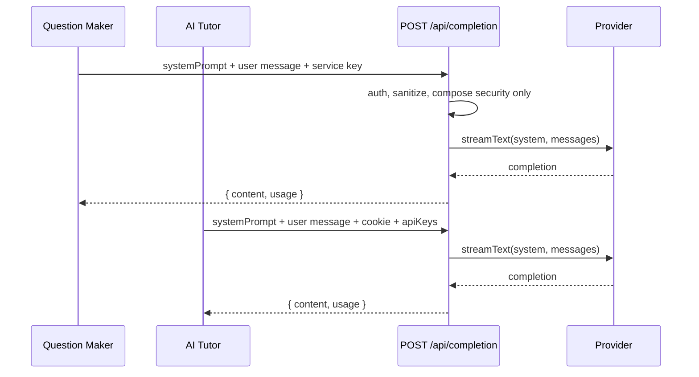

# Lightweight completion endpoint (`POST /api/completion`)

**Issue:** [#858 — AI assist QM / AI tutor](https://github.com/EduAI-Lab/EduAICore/issues/858)  
**Epic:** [#61 — RAG/AI](https://github.com/EduAI-Lab/EduAICore/issues/61)  
**Status:** Implemented on the monorepo `development` branch; hardening continued in #1113.

## Problem

Question Maker (QM) and AI Tutor call **`POST /api/chat`** for AI-assist flows. That route was built for the interactive course chat UI and has accumulated features that are wrong for extension “prompt and return” use cases:

| `/api/chat` feature | Needed for course chat | Needed for QM / AI Tutor assist |
|---------------------|------------------------|----------------------------------|
| Chat persistence (`chatId`, `ChatMessage` rows) | Yes | No |
| History merge / restore | Yes | No — caller sends full turn |
| Default EduAI course system prompt | Yes (when unset) | **No** — caller owns the prompt |
| RAG prefetch + hybrid injection | Yes | **No** |
| Tool calling (course RAG, web search) | Yes | **No** |
| ADHD assist policy prepend | Yes (when enabled) | **No** |
| Intent routing / autorouting | Yes | **No** |
| `filterIncomingClientMessages` (user-only) | Yes (security) | **Breaks QM** — strips `role: "system"` in `messages` |

### Concrete failure modes

1. **QM** sends `{ role: "system", content: "You are a question generator…" }` inside `messages`. Core strips it; the model sees only the user turn plus the default EduAI assistant prompt.
2. **AI Tutor** passes `systemPrompt` in the body (better), but still gets tool instructions, RAG blocks, ADHD overlays, and security composition stacked on top of tutoring prompts.
3. Latency: RAG embedding lookup + tool round-trips on every assist call, even for structured JSON generation.

## Goal

Provide a **stateless, prompt-faithful** completion path for server-to-server and extension callers. Callers supply the full prompt; Core forwards it to the provider with minimal, documented additions.

## Non-goals

- Replacing `/api/chat` for the student course chat UI.
- Streaming for v1 (extensions already use `streaming: false`).
- Chat history, `chatId`, or transcript APIs.
- RAG, web tools, ADHD assist, admin tools, or proxy-user chat scoping (may add `proxyUser` later if needed).

## Proposed endpoint

```
POST /api/completion
```

### Authentication

| Caller | Auth | Notes |
|--------|------|-------|
| QM backend | `Authorization: Bearer <EDUAI_API_KEY>` | Service key; no user session required |
| AI Tutor server | Forwarded session `Cookie` + user `apiKeys` in body | Same as today’s `aiGuidance.callEduAI` |
| Admin / scripts | `x-api-key` + session (existing `enforceAdminIfApiKey`) | Optional |

On branches with `requireServiceKey`, service-key callers skip chat persistence (same as ephemeral `/api/chat` today).

### Request body

```jsonc
{
  // Required
  "model": "google:gemini-2.5-flash",
  "apiKeys": { "google": { "apiKey": "…", "isEnabled": true } },

  // Prompt — at least one required
  "systemPrompt": "You are a question generation assistant…",  // preferred
  "messages": [
    { "id": "uuid", "role": "user", "content": "Generate 3 MCQs about …" }
  ],

  // Optional
  "streaming": false,           // default false for extensions
  "temperature": 0.2,           // default 0.2 (deterministic assist)
  "maxTokens": 8192,            // default 8192; caller may raise for extraction
  "courseCode": "COSC 121"      // logging / metrics only — no RAG
}
```

**System prompt resolution (in order):**

1. `body.systemPrompt` (sanitized, length-capped)
2. First `role: "system"` message in `messages` (extracted to `system`, removed from message list)
3. Reject `400` if neither is present

**Allowed message roles:** `user`, `assistant` (multi-turn assist). `system` in `messages` is extracted once, not passed through as a message.

### Response (non-streaming, default)

Same envelope as `/api/chat` non-streaming for drop-in replacement:

```json
{
  "content": "…",
  "model": "google:gemini-2.5-flash",
  "usage": { "promptTokens": 0, "completionTokens": 0 },
  "finishReason": "stop"
}
```

No `chatId`. No `sources`.

### Rate limiting

`/api/completion` shares Core's Redis-backed sliding-window configuration with
`/api/chat`: `CHAT_RATE_LIMIT` requests per `CHAT_RATE_LIMIT_WINDOW_MS`. A
session or admin API-key request is keyed by its Core user id. A direct service-key
request uses the stable, non-secret `service` bucket. A denial occurs before
provider work and returns:

```http
HTTP/1.1 429 Too Many Requests
Retry-After: 42
Content-Type: application/json

{"error":"RATE_LIMITED","retryAfter":42}
```

Redis is authoritative across Core instances. If Redis is unavailable, Core
switches quickly to a bounded process-local fallback; requests remain protected,
but decisions are not shared between instances until Redis recovers.

### Provider failures

Provider-owned failures use a sanitized stable body; validation errors such as a
missing model or malformed prompt keep their ordinary `{ "error": "..." }` 400
shape.

```json
{
  "error": "Provider is temporarily unavailable",
  "code": "PROVIDER_UNAVAILABLE",
  "retryable": true,
  "provider": "openai"
}
```

Codes are `INVALID_PROVIDER_CONFIG` (400), `PROVIDER_UNAVAILABLE` (503),
`MODEL_UNAVAILABLE` (503), `PROVIDER_REQUEST_FAILED` (502), and
`PROVIDER_TIMEOUT` (502). A positive integer upstream `Retry-After` is forwarded
only when the provider supplied a reliable hint. Core's own application limiter
is the only `RATE_LIMITED` 429 contract; upstream provider throttling is a
retryable provider availability failure.

### What Core still adds

| Layer | Include? | Rationale |
|-------|----------|-----------|
| Immutable security policy (prompt confidentiality) | **Yes** | Same baseline as `/api/chat`; prepended, not appended |
| Provider registry + `apiKeys` validation | **Yes** | Required to call the model |
| `sanitizeSystemPrompt` + max length | **Yes** | Abuse guard |
| Default EduAI course prompt | **No** | Caller owns prompt |
| RAG / tools / ADHD / oversight | **No** | Out of scope |

## Architecture



## File layout (sketch)

```
app/routes/api/completion.ts          # Route handler (thin)
app/lib/ai/completion.server.ts       # Shared: parse body, resolve system, call model
app/tests/unit/completion.route.test.ts
docs/implementations/lightweight-completion-endpoint.md  # this file
```

On `apps/core` layout (main development branch), paths become `apps/core/app/routes/api/completion.ts`, etc.

## Migration plan

### Phase 1 — Core endpoint (this branch)

- [x] Implement `POST /api/completion`
- [x] Unit tests: prompt resolution, security prepend, rejects missing prompt
- [ ] Register in agent-readiness manifest when present on branch

### Phase 2 — Extension cutover

| Extension | File | Change |
|-----------|------|--------|
| QM | `apps/extensions/question-maker/.../eduaiService.js` | `chat()` → `POST /api/completion`; hoist `systemPrompt` |
| AI Tutor | `apps/extensions/ai-tutor/server/src/services/aiGuidance.js` | `getEduAiCompletionUrl()` |

- [x] QM `eduaiService.chat()` cutover
- [x] AI Tutor `aiGuidance.callEduAI()` cutover

### Phase 3 — Hardening

- [ ] Metrics: `completion.request` with `caller` header or `X-EduAI-Caller: question-maker|ai-tutor`
- [x] Redis-backed limits for service-key and session identities (#1113)
- [ ] Document in `docs/chat-history.md` cross-link (“use `/api/completion` for stateless assist”)

## Comparison with `/api/chat`

| | `/api/chat` | `/api/completion` |
|---|-------------|-------------------|
| Persistence | Yes | No |
| `chatId` | Yes | No |
| Default system prompt | Yes | No — required from caller |
| System in `messages` | Stripped | Extracted |
| RAG / tools | Yes | No |
| ADHD assist | Yes | No |
| Streaming | Default `true` | Default `false` |
| Primary consumers | Course chat UI | QM, AI Tutor, future extensions |

## Open questions

1. **Endpoint name** — `/api/completion` vs `/api/llm/complete` vs `/api/assist/complete`? Prefer `/api/completion` (short, distinct from `/api/chat`).
2. **Streaming** — Defer to Phase 3 unless course chat reuse needs it.
3. **Shared lib** — Extract `runCompletion({ system, messages, model, apiKeys })` from route so `/api/chat` could optionally delegate “assist mode” later (not required for #858).

## Test plan

1. QM-style payload: `systemPrompt` + single user message → response JSON matches generation schema.
2. QM legacy payload: system role inside `messages` only → same behavior after extraction.
3. Missing system → `400`.
4. Service key without session → `200`.
5. Session without service key (AI Tutor) → `200`.
6. Confirm no `prisma.chat` / `findRelevantContent` calls (mock/spy in unit test).
