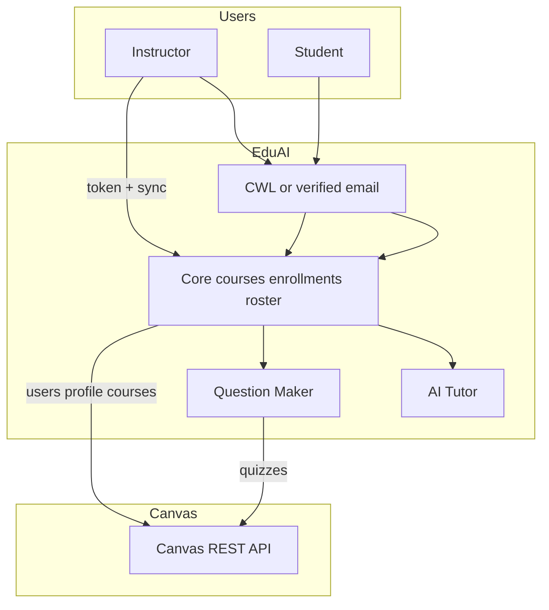
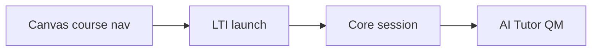

# EduAI Canvas Integration Report

## Strategy, roster sync, CWL, and LTI (deferred)

| | |
|---|---|
| **Report type** | Product and technical strategy |
| **Date** | June 2026 |
| **Status** | Final (v3) |
| **Audience** | Engineering, product, UBC Learning Technology |
| **Related** | EduAICore #60, Epic #59, CWL/SSO, Question Maker Canvas |

| Document | Role |
|----------|------|
| **This report** | What to build, in what order, and why |
| [`canvas-lti-vs-api-key-research.md`](./canvas-lti-vs-api-key-research.md) | API reference, local test results, endpoint details |
| [`lti-schema-changes.md`](./lti-schema-changes.md) | LTI schema and launch design (**deferred**) |
| [`canvas-api-integration-guide.md`](./canvas-api-integration-guide.md) | **#379** — Docker + web setup, token, connect, troubleshoot |
| [`CANVAS_EXPORT.md`](../../apps/extensions/question-maker/docs/features/CANVAS_EXPORT.md) | Question Maker export (existing) |

---

## 1. Purpose

This report records decisions and evidence for Canvas integration at EduAI:

1. **How users enter EduAI** — website + CWL (planned), not Canvas course menu for MVP.
2. **How Canvas is used** — REST API for rosters, quiz export, future file sync.
3. **What LTI is** — and why it is **not** required for the current product direction.
4. **What we validated** — local Canvas LMS API testing (June 2026).
5. **What remains unknown** — field shapes on production `canvas.ubc.ca` (requires a short pilot check).

---

## 2. Executive summary

### 2.1 Three mechanisms (do not conflate)

| Mechanism | Purpose |
|-----------|---------|
| **CWL** | Sign in to **eduai.ubc.ca** with UBC identity. |
| **Canvas REST API** | EduAI **server** reads/writes Canvas (courses, roster, quizzes, files) using an instructor token or institutional developer key. |
| **LTI 1.3** | User opens EduAI **from inside Canvas**; Canvas asserts identity and course context. |

### 2.2 Decision for MVP

| Build now | Defer |
|-----------|--------|
| CWL on Core (or verified email for pilots) | LTI launch (`/lti/login`, `/lti/callback`, …) |
| Canvas roster sync on Core (instructor token) | NRPS, in-Canvas iframe |
| Question Maker quiz export/import (existing REST) | Institutional developer key (until UBC approves) |

**Users access EduAI on our site, not via Canvas navigation.** Canvas supplies **course membership data**; CWL supplies **who is logged in**. Match those two to create `Enrollment` rows.

### 2.3 LTI in one sentence

**LTI is only needed if students and instructors must launch EduAI from a link inside Canvas.** It is not needed to sync rosters or export quizzes if they already use EduAI with CWL.

---

## 3. Product model (Path A — current direction)

```text
Instructor → EduAI (CWL or email) → Connect Canvas URL + API token → Sync rosters
Student    → EduAI (CWL or verified email) → Matched to synced roster → Sees courses
Question Maker → Same or shared Canvas token → Export/import quizzes via REST
```

**Not in MVP:**

```text
Student → Canvas course menu → "EduAI" → auto session   (requires LTI)
```

### 3.1 When to revisit LTI (Path B)

Adopt LTI if UBC/CTL requires EduAI in **course navigation**, or students must not have a separate EduAI account. See [`lti-schema-changes.md`](./lti-schema-changes.md).

---

## 4. Roster sync MVP (recommended)

### 4.1 Instructor flow

1. Instructor saves `canvasUrl` + encrypted API token (pattern from Question Maker `canvas_integrations`).
2. **Sync** action:
   - List teacher courses: `GET /api/v1/courses?enrollment_type=teacher&enrollment_role=TeacherEnrollment`
   - Per course, list students: `GET /api/v1/courses/:id/users?enrollment_type[]=student&include[]=email` (paginate)
   - For each student missing `email` on the roster row, call `GET /api/v1/users/:canvasUserId/profile` and read `primary_email` (fallback `login_id`)
3. Upsert Core `Course` (`externalId`, `externalSource = canvas`) and pending roster records (email, `sis_user_id`, `canvasUserId`).

### 4.2 Student flow

1. Student signs in to EduAI (CWL when available; until then verified email).
2. Backend normalizes email (lowercase, trim) and matches roster rows → creates `Enrollment` for linked courses.
3. Optional fallback: student-entered identifier ↔ `sis_user_id` when email match is impossible.

### 4.3 Why profile fallback is required

Local Canvas testing (June 2026) showed:

- Course roster can return students **without** `email` even when `include[]=email` is set.
- `GET /users/:id/profile` returned `primary_email` for the same users (e.g. `student2@example.com`, `aoludare@student.ubc.ca`).
- `login_id` may be **null** while `primary_email` is set — match on **`primary_email` first**, not `login_id` alone.
- `include[]=primary_email` is **not** valid on the course users endpoint; use `include[]=email` on roster, then profile fallback.

**Do not use** deprecated `GET /courses/:id/students` for new code; use **course users** with `enrollment_type[]=student`.

Details and curl examples: [`canvas-lti-vs-api-key-research.md`](./canvas-lti-vs-api-key-research.md) §6.

### 4.4 Local vs UBC Canvas

Hand-made users on **localhost Canvas** prove the **API pattern**, not UBC field values. Before promising “email-only” enrollment to stakeholders, run the same three calls on **one real UBC course** with an instructor token (redact samples; do not commit real emails).

---

## 5. What exists in the codebase today

| Area | State | Location |
|------|--------|----------|
| QM Canvas connect + export/import | **Implemented** | `question-maker/.../canvasService.js`, `/api/canvas/*` |
| Core roster sync | **Not built** | Use `Enrollment.externalId` / `externalSource` in Prisma |
| CWL | **Planned** | Auth centralization docs |
| LTI | **Designed only** | `lti-schema-changes.md` |

Question Maker calls `{canvasUrl}/api/v1/...` with `Authorization: Bearer {token}`. Roster sync should live on **Core** so AI Tutor and QM share enrollments.

---

## 6. LTI reference (deferred)

| LTI provides | LTI does not provide |
|--------------|----------------------|
| Launch from Canvas with role + course | Quiz export, file sync for RAG |
| NRPS roster (server-to-server) | CWL login on EduAI homepage |
| Grade passback (AGS) | Replacement for instructor API token |

Long-term institutional deployments may use **LTI for launch** and **REST for quizzes/files**. EduAI can ship **REST + CWL first**.

---

## 7. Privacy and compliance

- Storing class rosters (emails, Canvas user ids) is **personal information** under FIPPA — expect **PIA** or an amendment to an existing EduAI PIA, whether or not LTI is used.
- LTI does not remove the need for privacy review; it only changes how identity is asserted.
- Contact **LT Hub**: https://lthub.ubc.ca/support/privacy/

---

## 8. Roadmap

### Phase 1 — MVP

| Priority | Item |
|----------|------|
| P0 | Core Canvas connect + roster sync (§4) |
| P0 | Enrollment match on login email (CWL or verified email) |
| P0 | Keep QM REST export/import |
| P1 | Centralize Canvas credentials on Core (single integration for QM + Core) |
| P1 | Instructor “Sync rosters” + last synced timestamp |
| P1 | UBC validation: one real course, document which fields exist |
| P1 | LT Hub / PIA for roster storage |

### Phase 2 — Scale

| Priority | Item |
|----------|------|
| P2 | CWL on Core as primary login |
| P2 | Institutional scoped developer key (if UBC requires) |
| P2 | Core material sync from Canvas (REST, Epic #59) |

### Phase 3 — Optional LTI

Implement `lti-schema-changes.md` only if Path B (§3.1) is required.

---

## 9. Architecture

### 9.1 MVP (CWL-first)



### 9.2 Future LTI (optional)



---

## 10. Open questions

1. Official pilot model: confirm Path A (EduAI site + CWL, Canvas for data).
2. UBC: personal access tokens vs developer key for roster sync.
3. On `canvas.ubc.ca`, roster `include[]=email` vs profile `primary_email` hit rate.
4. CWL email claim alignment with Canvas `primary_email` (e.g. `@student.ubc.ca`).
5. CTL timeline for requiring LTI in course navigation.

---

## 11. Conclusion

| Integration | MVP role |
|-------------|----------|
| **CWL** | Login to EduAI |
| **Canvas REST** | Roster sync, QM quizzes, future files |
| **LTI** | Optional later — in-Canvas launch only |

Prioritize **roster sync with profile fallback** and **CWL/email matching**. Treat LTI as a separate track when the product requires opening EduAI from inside Canvas.

---

## Document history

| Version | Date | Notes |
|---------|------|-------|
| 1.0 | 2026-05-31 | Initial LTI vs API comparison |
| 2.0 | 2026-05-31 | CWL-first; LTI deferred |
| 3.0 | 2026-06-03 | Roster sync algorithm, local API findings, profile fallback, UBC validation note |
