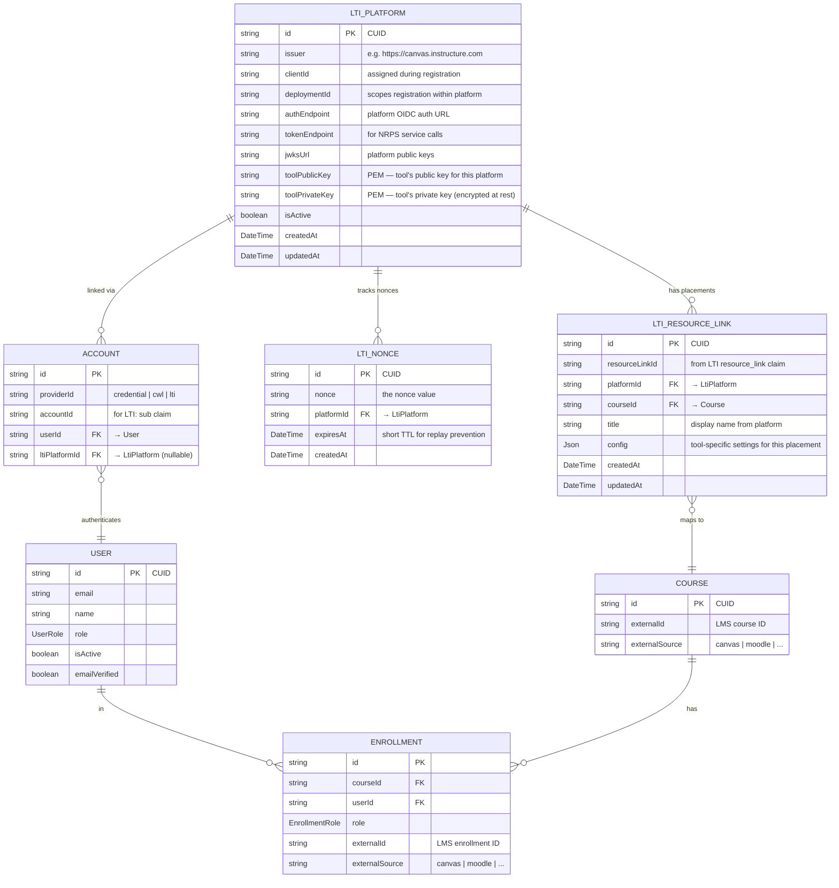

# LTI 1.3 Integration — Schema Design Changes

**Date:** May 2026
**Status:** Proposal — pending review
**Relates to:** Unified Database Schema Design · User Management & Roles (EduAICore #60) · Platform Centralization (EduAICore #58) · ARCHITECTURE.md
**Depends on:** Phase 1 Core schema migrations (must be complete before LTI tables are added)

---

## Table of Contents

0. [ERD — LTI additions](#0-erd--lti-additions)
1. [Context and Motivation](#1-context-and-motivation)
2. [New Tables](#2-new-tables)
3. [Modified Tables](#3-modified-tables)
4. [Unchanged Tables](#4-unchanged-tables)
5. [User Provisioning Flow](#5-user-provisioning-flow)
6. [Interaction with Existing Architecture](#6-interaction-with-existing-architecture)
7. [Impact on Extensions (AI Tutor & Question Maker)](#7-impact-on-extensions-ai-tutor--question-maker)
8. [Impact on User Management & Roles (EduAICore #60)](#8-impact-on-user-management--roles-eduaicore-60)
9. [Implementation Order](#9-implementation-order)

---

## 0. ERD — LTI additions

`||` = exactly one · `o{` = zero or many · `}o--` = zero or one (FK side).

Shows only LTI-related tables and the existing tables they connect to. All other existing tables and relationships are unchanged and omitted for clarity.



---

## 1. Context and Motivation

### What LTI solves for EduAI

The User Management & Roles architecture plan (EduAICore #60) explicitly identifies Canvas integration as the **primary blocker** for role and enrollment work. The plan states:

> *"The current four roles are therefore intentionally left unchanged"* and *"Canvas is our source of truth for course structure and user roles at UBC."*

LTI 1.3 is the standardised protocol for this integration. Rather than building a custom Canvas REST API integration that only works with Canvas, LTI gives EduAI a platform-agnostic launch and roster protocol that works with Canvas, Moodle, Blackboard, D2L, and any other compliant LMS — all through the same code path.

### What LTI replaces or unblocks

| Current state | With LTI |
|---|---|
| Users must create EduAI accounts manually (email/password or CWL) | Users are auto-provisioned on first LTI launch — no separate account creation |
| No reliable source of truth for who is an instructor, TA, or student in a given course | The LTI launch JWT carries role claims directly from the LMS |
| Enrollment management endpoints (Gap G-2 in EduAICore #60) need to be built from scratch | Enrollments are upserted on each launch; full roster available via NRPS |
| No TA assignment endpoints (Gap G-3) | TA role arrives in the launch JWT — the LMS is the source of truth |
| Course creation is ADMIN-only (Gap G-4) | Courses can be auto-created or linked on first instructor launch |
| The Unit Admin concept and its scoping model are blocked pending Canvas integration | Canvas sub-accounts map to units; the LTI `context` claim carries this context |
| Role naming (`PROFESSOR` vs `INSTRUCTOR`) is blocked pending LMS integration (Gap G-8) | LTI uses standardised role URIs — the mapping is defined once in the launch handler |

### What LTI does not replace

LTI handles launch, identity, enrollment, and (optionally) grade passback. It does **not** replace:

- **Course material sync** — LTI has no file transfer protocol. If EduAI needs to pull files from Canvas for RAG ingestion, the Canvas REST API (or a similar per-LMS API) is still needed. The existing `externalId` / `externalSource` columns on `CourseMaterial` support this.
- **The internal AI pipeline** — chunking, embeddings, chat, the Vercel AI SDK provider registry, and all RAG logic are entirely internal to Core and untouched by LTI.
- **Extension architecture** — AI Tutor and Question Maker continue to call Core's HTTP API with `EDUAI_API_KEY`. LTI lives at the boundary between the LMS and Core; extensions are downstream of Core.

---

## 2. New Tables

### `LtiPlatform`

Stores registration details for each LMS platform connected to the tool. One row per unique (issuer, clientId, deploymentId) combination.

```prisma
model LtiPlatform {
  id             String   @id @default(cuid())
  issuer         String   // e.g. "https://canvas.instructure.com"
  clientId       String   // assigned by the platform during tool registration
  deploymentId   String   // scopes a registration within a platform instance
  authEndpoint   String   // platform's OIDC authorization URL (Step 2 redirect target)
  tokenEndpoint  String   // platform's OAuth 2.0 token endpoint (for NRPS service calls)
  jwksUrl        String   // URL to platform's JWKS (public keys for verifying launch JWTs)
  toolPublicKey  String   @db.Text  // PEM-encoded public key for this tool-platform pair
  toolPrivateKey String   @db.Text  // PEM-encoded private key (encrypt at rest via app-layer)
  isActive       Boolean  @default(true)
  createdAt      DateTime @default(now())
  updatedAt      DateTime @updatedAt

  // Relations
  accounts      Account[]
  resourceLinks LtiResourceLink[]
  nonces        LtiNonce[]

  @@unique([issuer, clientId, deploymentId])
  @@map("lti_platforms")
}
```

**Why this table is needed:** LTI 1.3 uses OIDC and asymmetric key signing. During a launch, the tool must know where to redirect the browser (`authEndpoint`), how to verify the signed JWT (`jwksUrl`), and which credentials to use for server-to-server service calls like NRPS roster sync (`clientId`, `tokenEndpoint`, `toolPrivateKey`). None of this information exists anywhere in the current schema.

**Key management:** `toolPublicKey` and `toolPrivateKey` are stored per-platform rather than globally. This allows key rotation per platform without disrupting other integrations, and means a compromised key only affects one LMS connection. The private key must be encrypted at the application layer before storage (e.g., via AES-256 using a key from environment variables — this would be a new env var alongside the existing `BETTER_AUTH_*` secrets). The tool exposes a JWKS endpoint (`GET /lti/jwks`) that dynamically builds the key set from active `LtiPlatform` rows.

**`isActive` flag:** Allows an admin to disable a platform integration without deleting the row. Launch attempts from a disabled platform are rejected at the login initiation step.

---

### `LtiResourceLink`

Maps an LTI `resource_link` claim to an internal course and optional per-placement configuration.

```prisma
model LtiResourceLink {
  id             String      @id @default(cuid())
  resourceLinkId String      // the resource_link.id from the LTI launch JWT
  platformId     String
  courseId        String
  title          String?     // resource_link.title from the launch (display name in the LMS)
  config         Json?       // tool-specific settings for this placement
  createdAt      DateTime    @default(now())
  updatedAt      DateTime    @updatedAt

  // Relations
  platform       LtiPlatform @relation(fields: [platformId], references: [id], onDelete: Cascade)
  course         Course      @relation(fields: [courseId], references: [id], onDelete: Cascade)

  @@unique([resourceLinkId, platformId])
  @@index([courseId])
  @@map("lti_resource_links")
}
```

**Why this table is needed:** A single course in the LMS can contain multiple LTI links — an instructor might place one link for the AI Tutor and another for Question Maker, or two AI Tutor links pointing to different modules. The `resource_link.id` claim in the launch JWT identifies which placement was clicked. Without this table, every launch for the same course would be indistinguishable, and per-placement configuration (e.g., which AI Tutor module to open, which Question Maker assessment to load) would have nowhere to live.

**`config` JSON:** Stores per-placement settings that the instructor selects via the Deep Linking flow. For example, an AI Tutor placement might store `{ "target": "ai-tutor", "moduleId": "clx..." }` to route the launch to a specific module, while a Question Maker placement might store `{ "target": "question-maker", "assessmentId": "clx..." }`. The schema is intentionally loose (JSON) because config shapes differ between tool types and will evolve. The `target` field within the config determines which extension the launch is routed to.

**`onDelete: Cascade` on both FKs:** If a platform registration is deleted, its resource links are meaningless. If a course is deleted (soft-deleted in Core via `deletedAt`), its placements should go with it. Note: since Core uses soft deletes on `Course`, a hard cascade here only fires if a course row is actually removed from the database — which the current schema design says never happens while extension references exist. In practice, soft-deleted courses would leave their resource links intact but launches would fail at the course-matching step (the launch handler filters `WHERE deletedAt IS NULL`).

---

### `LtiNonce`

Tracks nonces to prevent JWT replay attacks during the OIDC launch flow.

```prisma
model LtiNonce {
  id         String      @id @default(cuid())
  nonce      String
  platformId String
  expiresAt  DateTime    // short TTL — typically 5-10 minutes
  createdAt  DateTime    @default(now())

  // Relations
  platform   LtiPlatform @relation(fields: [platformId], references: [id], onDelete: Cascade)

  @@unique([nonce, platformId])
  @@index([expiresAt])
  @@map("lti_nonces")
}
```

**Why this table is needed:** During the OIDC launch (Step 2), the tool generates a `nonce` and sends it to the platform. When the platform returns the signed JWT (Step 3), the tool must verify that the nonce in the JWT matches one it actually issued, and that it hasn't been used before. Without server-side nonce tracking, the launch flow is vulnerable to replay attacks.

**Cleanup:** The `expiresAt` index supports a periodic cleanup job (`DELETE FROM lti_nonces WHERE "expiresAt" < NOW()`) to prevent unbounded table growth. Nonces older than a few minutes are never valid. This cleanup can run on the same cron infrastructure used for the daily cross-DB reconciliation described in the schema design doc (Section 4, "Cross-DB deletion — soft-delete strategy"), though at a higher frequency (hourly or even per-request with a probabilistic trigger).

**Alternative — Redis:** If a cache layer is ever introduced to the architecture (currently Core is PostgreSQL-only per ARCHITECTURE.md), nonces are a natural fit for a TTL-keyed cache rather than a relational table. The Prisma model is provided here because the current stack is PostgreSQL-only and introducing Redis solely for nonces is not justified. If Redis is adopted for other reasons (session caching, rate limiting), nonces should migrate there.

---

## 3. Modified Tables

### `Account` — new nullable `ltiPlatformId` column

The `Account` table (managed by better-auth) currently supports multiple auth providers per user via `(providerId, accountId)`. LTI introduces a new provider where the `accountId` (the `sub` claim) is only unique within the context of a specific platform — `sub = "user_42"` on Canvas and `sub = "user_42"` on Moodle are different people.

**Change:** Add one nullable column and widen the unique constraint.

```prisma
model Account {
  id            String       @id @default(cuid())
  providerId    String       // "credential" | "cwl" | "lti"
  accountId     String       // for LTI: the `sub` claim from the launch JWT
  userId        String
  ltiPlatformId String?      // null for non-LTI accounts; FK → LtiPlatform for LTI accounts

  // Relations
  user          User         @relation(fields: [userId], references: [id], onDelete: Cascade)
  ltiPlatform   LtiPlatform? @relation(fields: [ltiPlatformId], references: [id], onDelete: SetNull)

  // ... all existing fields (createdAt, updatedAt, etc.) unchanged

  @@unique([providerId, accountId, ltiPlatformId])
  @@map("accounts")
}
```

**Why the unique constraint must widen:** The current `@@unique([providerId, accountId])` assumes `accountId` is globally unique within a provider. This holds for `credential` (email addresses) and `cwl` (CWL identifiers), but not for `lti` — two platforms can issue the same `sub` string. Without `ltiPlatformId` in the constraint, the second platform's user would collide with the first's.

**`onDelete: SetNull`:** If an `LtiPlatform` row is deleted, the account doesn't disappear — it just loses its platform link. The user retains their account and can still log in via other providers (credential, CWL). The orphaned LTI account row can be cleaned up by an admin or ignored — it's inert without a platform reference.

**Non-LTI accounts:** For `providerId = "credential"` or `"cwl"`, `ltiPlatformId` is always `null`. PostgreSQL's default null-distinct behaviour in unique indexes means `(providerId, accountId, null)` is treated as unique, so no conflict arises. This is consistent with the existing better-auth behaviour.

**better-auth compatibility:** better-auth manages the `Account` model. Adding a nullable column that better-auth doesn't know about is safe — better-auth will ignore it on reads and writes. The LTI launch handler writes `ltiPlatformId` directly via Prisma, bypassing better-auth's account creation helpers. This is the same pattern used for CWL SAML integration (described in schema design Section 3, "Auth"): better-auth's SSO plugin creates the `Account` row, and application code can extend it with additional columns.

---

### `Course` — no structural change

The existing columns handle LTI context:

| Existing column | LTI source |
|---|---|
| `externalId` | `context.id` from the launch JWT (the platform's course ID) |
| `externalSource` | Derived from the platform type — e.g., `"canvas"` for a Canvas issuer |
| `lastSyncedAt` | Updated on each NRPS roster sync |

No new columns are needed. The `@@index([externalSource, externalId])` already exists for LMS sync lookups.

**`externalSource` value convention:** Use the platform type string (e.g., `"canvas"`, `"moodle"`) rather than a generic `"lti"`. This preserves compatibility with any future Canvas-specific features (like material sync via the Canvas REST API, as noted in the schema design) that key off `externalSource = "canvas"`. The platform type can be derived from the `LtiPlatform.issuer` URL or stored as a metadata field on `LtiPlatform` if needed.

---

### `Enrollment` — no structural change

The existing columns handle LTI enrollment:

| Existing column | LTI source |
|---|---|
| `externalId` | Enrollment ID from NRPS roster response (or synthesised from `sub` + `context.id` on launch) |
| `externalSource` | Same convention as `Course.externalSource` |
| `role` | Mapped from LTI role URI (see table below) |

**LTI role URI → `EnrollmentRole` mapping:**

| LTI Role URI | `EnrollmentRole` |
|---|---|
| `http://purl.imsglobal.org/vocab/lis/v2/membership#Instructor` | `INSTRUCTOR` |
| `http://purl.imsglobal.org/vocab/lis/v2/membership#Learner` | `STUDENT` |
| `http://purl.imsglobal.org/vocab/lis/v2/membership/Instructor#TeachingAssistant` | `TA` |

This mapping directly resolves Gap G-8 from the User Management doc (naming decision for the teaching role). The LTI spec uses `Instructor`, not `Professor` — adopting `INSTRUCTOR` as the `EnrollmentRole` value (which the schema design already does) aligns EduAI with the standard. The system-level `UserRole` enum can remain `INSTRUCTOR` as well, avoiding the `PROFESSOR` vs `INSTRUCTOR` naming debate entirely: the LMS is the source of truth, and the LMS uses `Instructor`.

---

## 4. Unchanged Tables

| Table(s) | Reason |
|---|---|
| `User` | LTI users are provisioned as standard `User` rows with the same CUID PK; no new columns needed |
| `Session` | LTI launches create standard better-auth sessions; the session model is unchanged |
| `ExternalUser` | Used for proxy delegation by extensions via `proxyUser`; LTI identity goes through `Account`, not `ExternalUser` |
| `ApiKey` | Server-to-server auth for extensions; LTI uses its own key infrastructure |
| `CourseTopic`, `Question`, `QuestionSecondaryTopic` | Internal content models; LTI does not interact with them |
| `CourseMaterial`, `MaterialChunk`, `MaterialEmbedding` | Internal RAG pipeline; unaffected by launch protocol |
| `AiProvider`, `AiModel`, `UserProviderSettings` | AI provider configuration; unrelated to LTI |
| `AiInteraction`, `Chat`, `ChatMessage` | Chat and interaction tracking; unrelated to LTI |
| `BugReport` | Internal support workflow; unrelated to LTI |
| All AI Tutor extension tables | LTI integration lives in Core; extensions consume Core APIs as before |
| All Question Maker extension tables | Same as above |

---

## 5. User Provisioning Flow

When an LTI launch JWT arrives, the launch handler (`POST /lti/callback`) executes the following:

**Step 1 — Platform lookup.** Match `(issuer, clientId, deploymentId)` from the JWT claims to an `LtiPlatform` row. If no active platform is found → reject the launch with a 403.

**Step 2 — JWT validation.** Fetch the platform's public keys from `LtiPlatform.jwksUrl`, verify the JWT signature, check the nonce against `LtiNonce`, and validate standard claims (`aud`, `exp`, `iat`). If validation fails → reject with a 401.

**Step 3 — Account lookup.** Query `Account` for `(providerId = 'lti', accountId = JWT.sub, ltiPlatformId = platform.id)`.

**Step 4a — Account exists.** Load the linked `User`. Update name/email from the JWT if the platform is considered authoritative (configurable per platform). Proceed to Step 5.

**Step 4b — Account does not exist (first launch for this user).**

- Check if a `User` with the same email already exists (from a prior credential or CWL login). If so, create a new `Account` row linking the LTI identity to the existing user. This handles the common case where an instructor manually created an EduAI account before the LMS integration was configured.
- If no user with that email exists, create a new `User`:
  - `email` = email claim from JWT
  - `name` = name claim from JWT
  - `emailVerified = true` (the platform already verified it)
  - `role` = mapped from the LTI system role claim (see below)
  - `isActive = true`
- Create the `Account` row with `providerId = 'lti'`, `accountId = JWT.sub`, `ltiPlatformId = platform.id`.

**`UserRole` derivation for new users:** The LTI JWT carries both system-level roles and context-level (course) roles. For the system-level `UserRole` on `User`:

| LTI system role | `UserRole` |
|---|---|
| `http://purl.imsglobal.org/vocab/lis/v2/institution/person#Instructor` | `INSTRUCTOR` |
| `http://purl.imsglobal.org/vocab/lis/v2/institution/person#Staff` | `INSTRUCTOR` |
| `http://purl.imsglobal.org/vocab/lis/v2/institution/person#Student` | `STUDENT` |
| `http://purl.imsglobal.org/vocab/lis/v2/institution/person#Administrator` | `ADMIN` (or `UNIT_ADMIN` — see Section 8) |
| No system role / unknown | `STUDENT` (safe default) |

This is the system-level role on the `User` record. The course-level role (Instructor/TA/Student within a specific course) goes into `Enrollment.role` in Step 5.

**Email conflict handling:** If the LTI JWT provides an email that matches an existing `User` but with a different name, do not overwrite the existing name. The first identity source wins for display name; the user can update it manually.

**Step 5 — Enrollment upsert.** Extract the `context.id` claim (LMS course ID). Look up `Course` by `(externalId = context.id, externalSource)` where `deletedAt IS NULL`.

- **Course exists:** Upsert an `Enrollment` row with the role mapped from the JWT's context role claim. The `@@unique([courseId, userId])` constraint on `Enrollment` means this is an `UPDATE` if the user is already enrolled (consistent with the "Role promotion" note in the schema design).
- **Course does not exist + user is an instructor:** Present a course setup/linking flow (or auto-create the course with `externalId` and `externalSource` populated, depending on configuration).
- **Course does not exist + user is a student:** Return an error — students cannot create courses.

**Step 6 — Session creation.** Create a standard better-auth session for the user. From this point forward, the user's experience is identical to one who logged in via email/password or CWL. The session cookie is set; subsequent page loads go through the existing `validate session cookie → load user → serve page` flow documented in ARCHITECTURE.md Section 5.1.

**Step 7 — Redirect.** Redirect the browser to the tool UI. If an `LtiResourceLink` exists for this `(resourceLinkId, platformId)`, use its `config` to determine the target (e.g., `/chat?courseId=...` for AI Tutor, `/courses/:id/questions` for Question Maker). If no resource link exists (first launch for this placement), create one.

---

## 6. Interaction with Existing Architecture

### Auth layer (better-auth)

LTI does not replace better-auth. It adds a new provider alongside `credential` and `cwl`. The launch handler creates a better-auth session at the end of the OIDC flow, so all downstream auth — session validation, API key guards (`enforceAdminIfApiKey` in `guards.server.ts`), and the `POST /api/sessions/validate` endpoint used by AI Tutor — works unchanged. No changes to `app/lib/auth/` are needed beyond the launch handler itself.

### Extension auth (AI Tutor's `normalizeEduAiRole`)

AI Tutor's `normalizeEduAiRole` in `server/src/auth.js` maps EduAI role claims to AI Tutor roles. Since LTI users receive standard `UserRole` values (`INSTRUCTOR`, `TA`, `STUDENT`), and the session validation endpoint returns the same user object regardless of how the user authenticated, AI Tutor requires **no changes** for LTI support.

### Embedding and RAG pipeline

The RAG pipeline (`embedding.ts`, `file-processing.ts`, pgvector) is entirely internal. LTI launches do not interact with embeddings, chunks, or material processing. Users who arrive via LTI use the chat and RAG features through the same `POST /api/chat` endpoint as all other users. The `GOOGLE_GENERATIVE_AI_API_KEY` and `OPENAI_API_KEY` environment variables (documented in ARCHITECTURE.md Section 4) are unaffected.

### `ExternalUser` and proxy delegation

The `ExternalUser` model exists for extensions that call Core's API via `proxyUser` (ARCHITECTURE.md Section 5.4). This is a server-to-server delegation mechanism — the extension authenticates with `EDUAI_API_KEY` and specifies which user to act on behalf of. LTI operates at a completely different layer (browser-based launches from an LMS), so `ExternalUser` is not involved. The two mechanisms coexist without interaction.

### Canvas REST API integration

The schema design mentions Canvas REST API integration as a separate concern (Epic #59) for material sync. LTI and the Canvas REST API serve different purposes and coexist:

| Concern | Protocol | Schema columns used |
|---|---|---|
| User launch and identity | LTI 1.3 | `Account.ltiPlatformId`, `LtiPlatform.*` |
| Enrollment sync | LTI NRPS | `Enrollment.externalId`, `Enrollment.externalSource` |
| Course material sync | Canvas REST API | `CourseMaterial.externalId`, `CourseMaterial.externalSource` |

The `externalSource` value (`"canvas"`) is shared between both — an LTI-launched course from Canvas and a Canvas REST API material sync both use `externalSource = "canvas"`, which is the correct behaviour since they're referring to the same LMS instance.

### Existing cron reconciliation

The daily cron that reconciles `core_*_id` references in extensions (schema design Section 4, "Cross-DB deletion — soft-delete strategy") is unaffected by LTI. LTI tables live in Core's database and have standard FK cascades — they don't participate in cross-DB reference tracking.

---

## 7. Impact on Extensions (AI Tutor & Question Maker)

LTI integration is **entirely within Core**. Extensions are not directly affected and require no schema or code changes for LTI support. The impact is indirect and positive:

**AI Tutor:** Currently validates sessions via `POST /api/sessions/validate` on Core and checks enrollment via `GET /api/courses/:id/enrollments`. Both endpoints return the same data regardless of whether the user originally authenticated via credential, CWL, or LTI. AI Tutor's `normalizeEduAiRole` maps `INSTRUCTOR` → `instructor`, `TA` → `ta`, `STUDENT` → `student` — these values are the same for LTI-provisioned users.

**Question Maker:** Currently authenticates users via Core CUIDs stored in its local `users` table. When an LTI-provisioned user first interacts with QM, QM creates a local `users` row keyed on the Core CUID (as described in schema design Section 5, "Extension Schema — Question Maker"). The Core CUID is the same regardless of auth provider.

**Resource link routing:** The `LtiResourceLink.config` JSON can include a `target` field (`"ai-tutor"` or `"question-maker"`) that tells Core's launch handler where to redirect the user after session creation. Core redirects to its own UI, which then routes to the appropriate extension context. Extensions do not need to implement LTI endpoints.

---

## 8. Impact on User Management & Roles (EduAICore #60)

The User Management & Roles architecture plan is explicitly on hold pending LMS integration. LTI resolves several of the blockers and open questions identified in that document:

### Gaps resolved

| Gap | Status with LTI |
|---|---|
| G-2: No enrollment management endpoints | **Partially resolved.** Enrollments are upserted on LTI launch. Full roster sync available via NRPS. Manual enroll/unenroll endpoints may still be needed for non-LMS courses. |
| G-3: No TA assignment endpoints | **Resolved.** TA role arrives in the LTI launch JWT from the LMS. No separate assignment endpoint needed for LMS-sourced courses. |
| G-4: Professors cannot create courses | **Resolved for LMS courses.** Courses are auto-created or linked on first instructor launch. Manual course creation (for non-LMS courses) can remain ADMIN/UNIT_ADMIN-only. |
| G-8: Naming not finalized | **Resolved.** LTI uses `Instructor` — adopt `INSTRUCTOR` as the canonical name, which the schema design already does. |

### Unit Admin and Canvas sub-accounts

The User Management doc notes that the Unit Admin concept *"may map to Canvas sub-accounts, which Canvas already models."* In LTI terms, Canvas sub-accounts surface through the `context` claim hierarchy in the launch JWT. A Canvas Account Admin launching from a sub-account context could be mapped to `UNIT_ADMIN` with `authorizedUnits` populated from the sub-account's course code prefix. This mapping is application logic in the launch handler, not a schema change — the `User.authorizedUnits String[]` column and `UNIT_ADMIN` role defined in the schema design are sufficient.

### Role naming decision

The User Management doc identifies three naming decisions that must be made before extensions adopt OAuth role claims. LTI provides the answer for Decision 3 (`PROFESSOR` vs `INSTRUCTOR`): the LTI spec uses `Instructor`, so EduAI should use `INSTRUCTOR`. The schema design already made this choice. Decisions 1 (`ADMIN` vs `SYSTEM_ADMIN`) and 2 (`UNIT_ADMIN` vs `DEPARTMENT_ADMIN`) are not LTI-dependent and remain open.

---

## 9. Implementation Order

These changes are additive and non-breaking. They can be implemented as a new phase after the current Phase 3 (integration testing) described in the schema design, or in parallel with Phase 2 work since LTI tables have no dependencies on extension schema cleanup.

**Prerequisite:** Phase 1 Core schema migrations must be complete — specifically, the `Enrollment` table must exist (replacing `course_enrollments` + `course_tas`), and `Course` must have the `externalId` / `externalSource` / `lastSyncedAt` columns.

---

### Phase L1 — LTI schema migrations

Core-only Prisma migration. No application logic changes yet.

- Create `lti_platforms` table
- Create `lti_resource_links` table
- Create `lti_nonces` table
- Add `ltiPlatformId String?` to `accounts`; add FK to `lti_platforms`; widen unique constraint to `@@unique([providerId, accountId, ltiPlatformId])`
- Add new env var for private key encryption (e.g., `LTI_KEY_ENCRYPTION_SECRET`)

**Test:** `npx prisma migrate dev && npm run typecheck` in `apps/core`. Verify existing auth flows (credential login, CWL login, API key auth) still work — the new nullable column should have no effect on existing `Account` queries.

---

### Phase L2 — LTI launch endpoints

Implement the three core LTI routes. No changes to existing routes.

- `POST /lti/login` — Login initiation: validate `iss` against `LtiPlatform`, generate nonce, store in `LtiNonce`, redirect to platform's `authEndpoint`
- `POST /lti/callback` — Authentication response: validate JWT signature against platform JWKS, check nonce, extract claims, run user provisioning flow (Section 5), create better-auth session, redirect to tool UI
- `GET /lti/jwks` — JWKS endpoint: build JWK set from active `LtiPlatform` rows' `toolPublicKey` values

Register these routes in `app/routes.ts` alongside existing `/api/auth/*` routes.

**Test:** Register the tool with a test LMS (Canvas Free-for-Teacher or a local Moodle instance). Test the full launch flow: LMS click → login initiation → OIDC redirect → JWT validation → user provisioned in DB → session created → redirected to tool UI. Verify the user appears in Core's `users` table, an `Account` row with `providerId = 'lti'` exists, and an `Enrollment` row links them to the correct course.

---

### Phase L3 — NRPS roster sync

Implement server-to-server NRPS calls for bulk enrollment sync.

- Add a service function that calls the platform's NRPS endpoint (authenticated via OAuth 2.0 client credentials using `LtiPlatform.clientId` and `LtiPlatform.toolPrivateKey`)
- Sync the returned roster into `Enrollment` rows, using `externalSource` and `externalId` for dedup
- Update `Course.lastSyncedAt` after each sync
- Wire the sync to a trigger (manual button in admin UI, or on-demand when an instructor views the enrollment list, or on a cron schedule)

**Test:** Trigger a roster sync for a test course. Verify all enrolled users from the LMS appear as `Enrollment` rows in Core with correct roles. Verify that users who were removed from the LMS roster have their `Enrollment.isActive` set to `false`.

---

### Phase L4 — Deep Linking (optional)

Implement Deep Linking so instructors can browse and select EduAI content from within the LMS.

- `GET /lti/deep-link` — presents a content picker UI (select a course, module, assessment, etc.)
- `POST /lti/deep-link/return` — builds and signs the Deep Linking response JWT with the selected content items, redirects back to the platform

This phase creates `LtiResourceLink` rows with populated `config` JSON. Without Deep Linking, resource links are created on first launch with default config.

**Test:** From within a test LMS course, use the "External Tool" content selector. Verify the Deep Linking UI appears, an instructor can select content, and the resulting LMS link launches directly to the selected content.

---

### Phase L5 — Admin UI

Add LTI platform management to the Core admin dashboard.

- CRUD for `LtiPlatform` rows (issuer, client ID, deployment ID, endpoints)
- Key pair generation (generate and store PEM-encoded RSA or EC keys)
- Platform enable/disable toggle (`isActive`)
- View active resource links per platform
- Manual NRPS roster sync trigger per course

This uses the existing admin UI patterns in `app/components/` and is gated behind the `ADMIN` role check in route handlers.
