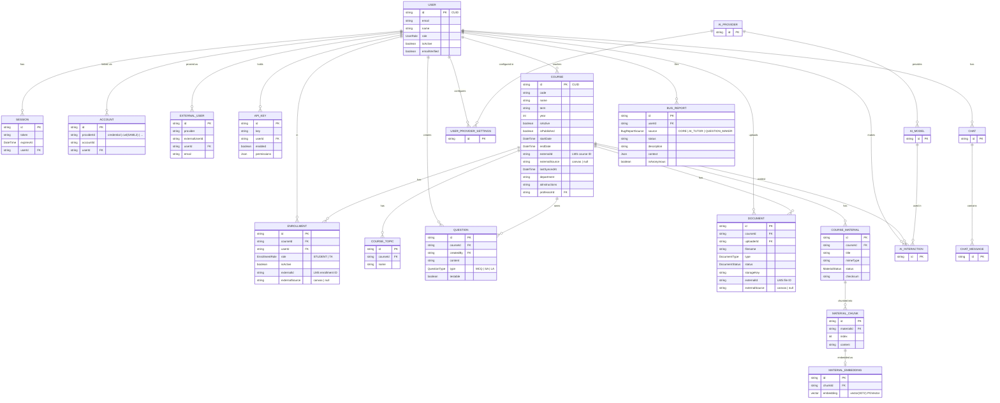

# EduAI Unified Database Schema Design

**Date:** May 2026  
**Status:** Decisions finalized — ready for implementation  
**Covers:** Platform Centralization (EduAICore #58) · User Management & Roles (EduAICore #60)

---

## Table of Contents

0. [ERD — Core target state](#0-erd--core-target-state)
1. [Current State Summary](#1-current-state-summary)
2. [Overlap and Conflict Analysis](#2-overlap-and-conflict-analysis)
3. [Unified Schema — Core (target state)](#3-unified-schema--core-target-state)
4. [Extension Schema — AI Tutor](#4-extension-schema--ai-tutor)
5. [Extension Schema — Question Maker](#5-extension-schema--question-maker)
6. [Migration Strategy](#6-migration-strategy)

---

## 0. ERD — Core target state

`||` = exactly one · `o{` = zero or many · `}o--` = zero or one (FK side).



---

## 1. Current State Summary

Full schemas are in each repo's `prisma/schema.prisma` or Sequelize models. Key facts needed for the analysis below:

| | Core | AI Tutor | Question Maker |
|---|---|---|---|
| ORM | Prisma | Prisma | Sequelize |
| DB | PostgreSQL + PGVector | PostgreSQL | PostgreSQL |
| Auth | better-auth (email/pw + API key) | better-auth + EduAI OIDC | JWT + bcrypt |
| User ID type | CUID string | CUID string | int autoincrement |
| Course table | `courses` | `CourseOffering` | `courses` |
| Topic table | `course_topics` | `Topic` | `topics` |
| LMS link | none | `externalId` + `externalSource` | none |
| Enrollment | `course_enrollments` + `course_tas` (two tables) | `CourseEnrollment` + `CourseInstructor` | via `user_id` on `courses` |

---

## 2. Overlap and Conflict Analysis

### Users — three incompatible implementations

Core and AI Tutor both use better-auth with CUID user IDs and the same four roles (`ADMIN | PROFESSOR | TA | STUDENT`). QM uses integer IDs, no roles, and no SSO. All three converge on Core for identity.

### Courses — two autonomous systems, one with no LMS link

AI Tutor already has `externalId` + `externalSource` on `CourseOffering` to link to Core. QM has no such link. Core has no `isPublished` flag, no start/end dates, and no LMS reference column. The unified design adds all of these to Core's `courses` table.

### Topics — duplicated, unsynchronized

All three repos have a course-scoped topic model with identical semantics (`CourseTopic` / `Topic` / `topics`). Extensions sync their local topic lists from Core via the API.

### Enrollments — split across two tables in Core

Core uses separate `course_enrollments` (students) and `course_tas` (TAs) tables. The target merges these into a single `Enrollment` table with a `role` enum.

### Bug Reports — identical logic duplicated

QM and AI Tutor both maintain a `bug_reports` table with the same fields. **Decision: consolidate into Core.** Extensions POST to Core's bug report API; Core stores a `source` tag identifying which extension submitted it.

### Canvas — two distinct workflows, no conflict

- **QM's Canvas integration**: per-user credentials for exporting questions to Canvas quizzes. QM-specific, stays in QM.
- **Core's planned Canvas integration** (Epic #59): roster and material sync at the course level. Separate concern.

We can think of consolidating these into core once canvas integration gets approved (if it does)

---

## 3. Unified Schema — Core (target state)

### Auth

**Current:** email/password via better-auth.

**When CWL approval arrives:** CWL uses **SAML 2.0** (not OIDC) via UBC's Shibboleth Identity Provider (`authentication.ubc.ca`). UBC's legacy Auth2 system is end-of-life; the supported integration paths for new applications are CAS (legacy) or SAML 2.0/Shibboleth (preferred). better-auth supports SAML 2.0 natively via its SSO plugin as of v1.3 — this is the integration path to use.

When CWL is enabled, a user who already has an email/password account gets a second `Account` row with `providerId='cwl'` on their first CWL login. Both auth methods coexist — no schema migration is needed. `Account` is keyed on `(providerId, accountId)` and already supports multiple providers per user.

Adding CWL is a better-auth SSO plugin config change only (`auth.ts`) — no Prisma migration.

### New enums

```prisma
enum UserRole {
  ADMIN
  PROFESSOR
  TA
  STUDENT
  DEPARTMENT_ADMIN  // [NEW]
}

enum EnrollmentRole { STUDENT  TA }       // [NEW]
enum QuestionType   { MCQ  SA  LA }       // [NEW]
enum BugReportSource {                    // [NEW]
  CORE
  AI_TUTOR
  QUESTION_MAKER
}
```

### `DEPARTMENT_ADMIN` role

A `DEPARTMENT_ADMIN` can create and edit courses scoped to their department (`Course.department` string match). Their privileges are limited to course management within their department. They have no access to system-level features: system prompts, bug report triage, AI model config, or any admin-only API. Only `ADMIN` users have those privileges. `department` is a plain `String?` on `Course` — no separate `Department` model.

### `courses` — new columns

| Column | Type | Notes |
|---|---|---|
| `isPublished` | `Boolean @default(false)` | gates student visibility |
| `startDate` / `endDate` | `DateTime?` | optional; sourced from LMS or set manually |
| `externalId` | `String?` | LMS course ID |
| `externalSource` | `String?` | `"canvas"` or null (null = manually created) |
| `lastSyncedAt` | `DateTime?` | null = manual or never synced |
| `department` | `String?` | used for DEPARTMENT_ADMIN scoping |

Index: `@@index([externalSource, externalId])` for LMS sync lookups.

**Source-of-truth policy:** when `externalSource` is set, the LMS is authoritative for `code`, `name`, `startDate`, `endDate`. Core-owned fields (`aiInstructions`, `isPublished`) are never overwritten by a sync.

### `Enrollment` — replaces `course_enrollments` + `course_tas`

```prisma
model Enrollment {
  id             String         @id @default(cuid())
  courseId       String
  userId         String
  role           EnrollmentRole
  enrolledAt     DateTime       @default(now())
  isActive       Boolean        @default(true)
  externalId     String?        // LMS enrollment ID
  externalSource String?        // "canvas" | null

  @@unique([courseId, userId])
  @@index([userId])
  @@index([externalSource, externalId])
  @@map("enrollments")
}
```

`course_enrollments` and `course_tas` are dropped; `enrollments` replaces both.

### `Question` — new shared question bank

```prisma
model Question {
  id        String       @id @default(cuid())
  courseId  String
  createdBy String
  content   String
  type      QuestionType
  testable  Boolean      @default(false)  // true = visible to AI Tutor

  @@index([courseId, testable])
  @@map("questions")
}
```

QM is the authoring UI; AI Tutor reads via `GET /api/questions?courseId=:id&testable=true`. QM retains all derived data (variants, assessments) keyed by `coreQuestionId`. Neither extension calls the other.

### `Document` — new columns

| Column | Type | Notes |
|---|---|---|
| `externalId` | `String?` | LMS file/page ID |
| `externalSource` | `String?` | `"canvas"` or null |

### `BugReport` — new consolidated table

```prisma
model BugReport {
  id          String          @id @default(cuid())
  source      BugReportSource
  userId      String
  description String          @db.VarChar(2000)
  status      String          @default("unhandled")  // unhandled | in_progress | resolved
  consoleLogs String?
  networkLogs String?
  screenshot  String?
  pageUrl     String?
  userAgent   String?
  isAnonymous Boolean         @default(false)
  context     Json?           // AI Tutor sends {courseOfferingId, moduleId, lessonId, activityId}
  createdAt   DateTime        @default(now())
  updatedAt   DateTime        @updatedAt
  user        User            @relation(fields: [userId], references: [id], onDelete: Cascade)

  @@index([status, createdAt])
  @@index([userId])
  @@index([source])
  @@map("bug_reports")
}
```

Extensions POST to `POST /api/bug-reports` with their `source` value. The `context` JSON absorbs AI Tutor's hierarchical context without Core needing to model that hierarchy. QM bug reports leave `context` null.

### Unchanged

`course_topics`, `course_materials`, `material_chunks`, `material_embeddings`, `ai_providers`, `ai_models`, `user_provider_settings`, `ai_interactions`, `system_config`, `chats`, `chat_messages`.

---

## 4. Extension Schema — AI Tutor

### Dropped

| Table | Reason |
|---|---|
| `User`, `Session`, `Account`, `Verification` | Core owns identity; AI Tutor validates via Core session API |
| `CourseInstructor`, `CourseEnrollment` | Core owns enrollment; route middleware calls `GET /api/courses/:id/enrollments` directly |
| `BugReport` | Replaced by `POST /api/bug-reports` on Core |

All `userId` columns already store CUIDs — no change needed.

### Schema changes

**`Topic` — one new nullable column:**

```prisma
coreTopicId String? @unique  // Core CourseTopic.id; null = not yet synced
```

**`CourseOffering`** — `externalId` + `externalSource` already exist and are set to `externalSource='core'` from the start. No migration needed.

### Co-instructor handling

AI Tutor has `CourseInstructor.role = LEAD | ASSISTANT`; Core's `EnrollmentRole` only has `STUDENT | TA`. Decision: treat all instructors as `PROFESSOR` in Core. `CourseInstructor` is dropped — the LEAD/ASSISTANT distinction is not modelled for the pilot. Revisit post-pilot if co-instructor display matters.

### Unchanged

`Module`, `Lesson`, `Activity`, `ActivitySecondaryTopic`, `Submission`, `ActivityFeedback`, `ActivityStudentMetric`, `ActivityAnalytics`, `AiChatSession`, `AiInteractionTrace`, `PromptTemplate`, `SystemPrompt`, `SuggestedPrompt`.

---

## 5. Extension Schema — Question Maker

QM keeps Sequelize. All tables stay in QM's PostgreSQL database.

### Dropped

| Table | Reason |
|---|---|
| `users` | Replaced by a thin identity table keyed on Core CUID (see below) |
| `bug_reports` | Replaced by `POST /api/bug-reports` on Core |

### `users` table — redesigned, not bridged

Since QM is not in production, the `users` table is redesigned from scratch. The integer autoincrement PK is replaced by a Core CUID string PK. There is no `password_hash` — auth is Core's responsibility entirely.

All QM tables that previously held an integer `user_id` FK now hold a `VARCHAR` Core CUID referencing this table. Affected: `courses`, `canvas_integrations`, `canvas_course_mappings`.

QM creates a local `users` row the first time a Core user is seen (on login). The row exists only for FK integrity within QM — all identity and auth decisions go through Core.

### New reference columns

| Table | New column | Type | Notes |
|---|---|---|---|
| `courses` | `core_course_id` | `VARCHAR unique` | Core Course CUID; null until linked |
| `topics` | `core_topic_id` | `VARCHAR unique` | Core CourseTopic CUID; null until synced |
| `question_metadata` | `core_question_id` | `VARCHAR unique` | Core Question CUID; null until pushed |

### Unchanged

`variants`, `assessments`, `assessment_sections`, `section_variants`, `variant_selection_cursors`, `canvas_integrations`, `canvas_course_mappings`.

---

## 6. Implementation Order

No existing production data. No data migration scripts needed — reference columns (`core_course_id`, `core_topic_id`, etc.) are populated at runtime as courses and topics are created going forward.

### Phase 1 — Core schema

- Add new `courses` columns: `isPublished`, `startDate`, `endDate`, `externalId`, `externalSource`, `lastSyncedAt`, `department`
- Create `enrollments` table (replacing `course_enrollments` and `course_tas`)
- Create `questions` table
- Add `externalId` / `externalSource` to `documents`
- Create `bug_reports` table
- Update `UserRole` enum (add `DEPARTMENT_ADMIN`)

### Phase 2 — Extension schemas

- **AI Tutor:** add `Topic.coreTopicId`; remove `User`, `Session`, `Account`, `Verification`, `CourseInstructor`, `CourseEnrollment`, `BugReport` tables; update route middleware to call Core's enrollment API
- **QM:** redesign `users` table (CUID string PK, no `password_hash`); change `user_id` columns in `courses`, `canvas_integrations`, `canvas_course_mappings` to `VARCHAR`; add `core_course_id`, `core_topic_id`, `core_question_id` reference columns; drop `bug_reports` table

### Phase 3 — Integration testing

Verify end-to-end: Core auth → AI Tutor session validation → QM user provisioning → cross-app question flow (`QM → POST /api/questions → Core → AI Tutor GET`).
