# EduAI Unified Database Schema Design

**Date:** May 2026  
**Status:** Decisions finalized — ready for implementation  
**Covers:** Platform Centralization (EduAICore #58) · User Management & Roles (EduAICore #60)

---

## Table of Contents

0. [ERD — Core target state](#0-erd--core-target-state)
1. [Current State Summary](#1-current-state-summary)
2. [Overlap and Conflict Analysis](#2-overlap-and-conflict-analysis)
3. [Unified Schema — Core (target state)](#3-unified-schema--core-target-state)
4. [Extension Schema — AI Tutor](#4-extension-schema--ai-tutor)
5. [Extension Schema — Question Maker](#5-extension-schema--question-maker)
6. [Migration Strategy](#6-migration-strategy)

---

## 0. ERD — Core target state

`||` = exactly one · `o{` = zero or many · `}o--` = zero or one (FK side).

```mermaid
erDiagram
    USER {
        string id PK "CUID"
        string email
        string name
        UserRole role
        boolean isActive
        boolean emailVerified
    }
    SESSION {
        string id PK
        string token
        DateTime expiresAt
        string userId FK
    }
    ACCOUNT {
        string id PK
        string providerId "credential | cwl(SAML2) | ..."
        string accountId
        string userId FK
    }
    EXTERNAL_USER {
        string id PK
        string provider
        string externalUserId
        string userId FK
        string email
    }
    API_KEY {
        string id PK
        string key
        string userId FK
        boolean enabled
        Json permissions
    }
    COURSE {
        string id PK "CUID"
        string code
        string name
        string section "regex validated"
        string term
        int year
        boolean isActive
        boolean isPublished
        DateTime startDate
        DateTime endDate
        string externalId "LMS course ID"
        string externalSource "canvas | null"
        DateTime lastSyncedAt
        string department
        string aiInstructions
        DateTime deletedAt "null = active"
    }
    ENROLLMENT {
        string id PK
        string courseId FK
        string userId FK
        EnrollmentRole role "STUDENT | TA | INSTRUCTOR"
        boolean isActive
        string externalId "LMS enrollment ID"
        string externalSource "canvas | null"
    }
    COURSE_TOPIC {
        string id PK
        string courseId FK
        string name
        DateTime deletedAt "null = active"
    }
    QUESTION {
        string id PK
        string courseId FK
        string topicId FK
        string createdBy FK
        string content "question text / prompt"
        QuestionType type "MCQ | SA | LA"
        QuestionDifficulty difficulty "EASY | MEDIUM | HARD"
        ReasoningLevel reasoningLevel "FACTUAL | ANALYTICAL | APPLICATION"
        Json choices "MCQ only: [{letter, text}]"
        string answer "answer key; null until set"
        boolean testable
        DateTime deletedAt "null = active"
    }
    QUESTION_SECONDARY_TOPIC {
        string questionId FK
        string topicId FK
    }
    COURSE_MATERIAL {
        string id PK
        string courseId FK
        string title
        string mimeType
        MaterialStatus status
        string checksum
        string externalId "LMS file ID"
        string externalSource "canvas | null"
    }
    MATERIAL_CHUNK {
        string id PK
        string materialId FK
        int index
        string content
    }
    MATERIAL_EMBEDDING {
        string id PK
        string chunkId FK
        vector embedding "vector(3072) PGVector"
    }
    AI_PROVIDER { string id PK }
    AI_MODEL { string id PK }
    USER_PROVIDER_SETTINGS { string id PK }
    AI_INTERACTION { string id PK }
    CHAT { string id PK }
    CHAT_MESSAGE { string id PK }
    BUG_REPORT {
        string id PK
        string userId FK
        BugReportSource source "CORE | AI_TUTOR | QUESTION_MAKER"
        BugReportStatus status "UNHANDLED | IN_PROGRESS | RESOLVED"
        boolean isAnonymous
        string description
        Json context
    }

    USER ||--o{ SESSION : "has"
    USER ||--o{ ACCOUNT : "linked via"
    USER ||--o{ EXTERNAL_USER : "proxied as"
    USER ||--o{ API_KEY : "holds"
    USER ||--o{ USER_PROVIDER_SETTINGS : "configures"
    USER ||--o{ ENROLLMENT : "in"
    USER ||--o{ QUESTION : "creates"
    USER ||--o{ AI_INTERACTION : "makes"
    USER ||--o{ CHAT : "has"
    USER ||--o{ BUG_REPORT : "files"

    COURSE ||--o{ ENROLLMENT : "has"
    COURSE ||--o{ COURSE_TOPIC : "has"
    COURSE ||--o{ QUESTION : "owns"
    COURSE ||--o{ COURSE_MATERIAL : "has"
    COURSE ||--o{ AI_INTERACTION : "context"

    COURSE_TOPIC ||--o{ QUESTION : "categorises"
    QUESTION ||--o{ QUESTION_SECONDARY_TOPIC : "tagged with"
    COURSE_TOPIC ||--o{ QUESTION_SECONDARY_TOPIC : "secondary for"

    COURSE_MATERIAL ||--o{ MATERIAL_CHUNK : "chunked into"
    MATERIAL_CHUNK ||--o| MATERIAL_EMBEDDING : "embedded as"

    AI_PROVIDER ||--o{ AI_MODEL : "provides"
    AI_PROVIDER ||--o{ USER_PROVIDER_SETTINGS : "configured in"
    AI_MODEL ||--o{ AI_INTERACTION : "used in"

    CHAT ||--o{ CHAT_MESSAGE : "contains"
```



---

## 1. Current State Summary

Full schemas are in each repo's `prisma/schema.prisma` or Sequelize models. Key facts needed for the analysis below:

| | Core | AI Tutor | Question Maker |
|---|---|---|---|
| ORM | Prisma | Prisma | Sequelize |
| DB | PostgreSQL + PGVector | PostgreSQL | PostgreSQL |
| Auth | better-auth (email/pw + API key) | better-auth + EduAI OIDC | JWT + bcrypt |
| User ID type | CUID string | CUID string | int autoincrement |
| Course table | `courses` | `CourseOffering` | `courses` |
| Topic table | `course_topics` | `Topic` | `topics` |
| LMS link | none | `externalId` + `externalSource` | none |
| Enrollment | `course_enrollments` + `course_tas` (two tables) | `CourseEnrollment` + `CourseInstructor` | via `user_id` on `courses` |

---

## 2. Overlap and Conflict Analysis

### Users — three incompatible implementations

Core and AI Tutor both use better-auth with CUID user IDs and the same four roles (`ADMIN | INSTRUCTOR | TA | STUDENT`). QM uses integer IDs, no roles, and no SSO. All three converge on Core for identity.

### Courses — two autonomous systems, one with no LMS link

AI Tutor already has `externalId` + `externalSource` on `CourseOffering` to link to Core. QM has no such link. Core has no `isPublished` flag, no start/end dates, and no LMS reference column. The unified design adds all of these to Core's `courses` table.

### Topics — duplicated, unsynchronized

All three repos have a course-scoped topic model with identical semantics (`CourseTopic` / `Topic` / `topics`). Extensions sync their local topic lists from Core via the API.

### Enrollments — split across two tables in Core

Core uses separate `course_enrollments` (students) and `course_tas` (TAs) tables. The target merges these into a single `Enrollment` table with a `role` enum.

### Bug Reports — identical logic duplicated

QM and AI Tutor both maintain a `bug_reports` table with the same fields. **Decision: consolidate into Core.** Extensions POST to Core's bug report API; Core stores a `source` tag identifying which extension submitted it.

### Canvas — two distinct workflows, no conflict

- **QM's Canvas integration**: per-user credentials for exporting questions to Canvas quizzes. QM-specific, stays in QM.
- **Core's planned Canvas integration** (Epic #59): roster and material sync at the course level. Separate concern.

We can think of consolidating these into core once canvas integration gets approved (if it does)

### `Document` — dead schema, superseded by `CourseMaterial`

Core's `Document` model (`storageKey`, `originalName`, `tags`, `description`, `uploaderId`) was added speculatively and is never written to — no route or service in the current codebase calls `prisma.document`. All active file handling runs through `CourseMaterial`, which carries the full RAG pipeline (text extraction, chunking, PGVector embeddings, checksum dedup). **Decision: drop `Document` entirely.** The LMS file sync columns (`externalId`, `externalSource`) originally planned for `Document` are added to `CourseMaterial` instead, so Canvas-synced files enter the same processing pipeline as manually uploaded ones.

---

## 3. Unified Schema — Core (target state)

### Auth

**Current:** email/password via better-auth.

**When CWL approval arrives:** CWL uses **SAML 2.0** (not OIDC) via UBC's Shibboleth Identity Provider (`authentication.ubc.ca`). UBC's legacy Auth2 system is end-of-life; the supported integration paths for new applications are CAS (legacy) or SAML 2.0/Shibboleth (preferred). better-auth supports SAML 2.0 natively via its SSO plugin as of v1.3 — this is the integration path to use.

When CWL is enabled, a user who already has an email/password account gets a second `Account` row with `providerId='cwl'` on their first CWL login. Both auth methods coexist — no schema migration is needed. `Account` is keyed on `(providerId, accountId)` and already supports multiple providers per user.

Adding CWL is a better-auth SSO plugin config change only (`auth.ts`) — no Prisma migration.

### New enums

```prisma
enum UserRole {
  ADMIN
  INSTRUCTOR
  TA
  STUDENT
  UNIT_ADMIN  // [NEW]
}

enum EnrollmentRole { STUDENT  TA  INSTRUCTOR }       // [NEW]
enum QuestionType   { MCQ  SA  LA }       // [NEW]

enum QuestionDifficulty {                 // [NEW]
  EASY
  MEDIUM
  HARD
}

enum ReasoningLevel {                     // [NEW]
  FACTUAL
  ANALYTICAL
  APPLICATION
}

enum BugReportSource {                    // [NEW]
  CORE
  AI_TUTOR
  QUESTION_MAKER
}

enum BugReportStatus {                    // [NEW]
  UNHANDLED
  IN_PROGRESS
  RESOLVED
}
```

### `UNIT_ADMIN` role

A `UNIT_ADMIN` can create and edit courses in any subject they are authorized for. Their privileges are limited to course management within those subjects. They have no access to system-level features: system prompts, bug report triage, AI model config, or any admin-only API. Only `ADMIN` users have those privileges.

**Scoping mechanism:** A new `authorizedUnits String[]` column is added to the `User` model. It is set by an `ADMIN` when the `UNIT_ADMIN` account is created or promoted, and may be updated at any time to expand or restrict scope. For all other roles (`INSTRUCTOR`, `TA`, `STUDENT`) this field is an empty array and is never checked. No separate model is needed — authorization middleware checks `user.authorizedUnits.includes(course.department)`.

`authorizedUnits` is stored on `User` (not a separate table) because the scope is per-admin and not shared between admins. This means auth middleware can evaluate the check from `req.user.authorizedUnits` with no additional join.

Valid subject values are defined by a Zod enum (`UnitSchema`) in a shared constants file (`apps/core/app/lib/units.ts`). This is an application-layer enum — not a Postgres enum — so adding or renaming a subject requires only a code change and a data migration, with no DB schema migration.

Authorization rules for `UNIT_ADMIN`:
- May create or edit a course only if `course.department` is in `user.authorizedUnits`
- May not set `course.department` to a value outside `user.authorizedUnits`
- May not act on courses whose `course.department` is not in their array, even if that field is null
- Must specify an instructor (`userId` of a user with role `INSTRUCTOR`) at course creation time; that user is enrolled with `EnrollmentRole.INSTRUCTOR`. The `UNIT_ADMIN` is never auto-enrolled into the course they create.

**Known limitation:** if a subject code is renamed (e.g. `"COSC"` → `"CS"`), all `User.authorizedUnits` arrays and all `Course.department` values containing the old code must be updated in a data migration. Because values are controlled by `UnitSchema` (no free-form user entry), renames are infrequent and the affected rows are easily identified with an array-contains query.

### `courses` — new columns

| Column | Type | Notes |
|---|---|---|
| `section` | `String` | identifies the section within a course offering (e.g. `"001"`, `"L2A"`); regex-validated on write |
| `isPublished` | `Boolean @default(false)` | gates student visibility |
| `startDate` | `DateTime` | required; sourced from LMS or set manually at creation time |
| `endDate` | `DateTime?` | optional; sourced from LMS or set manually |
| `externalId` | `String?` | LMS course ID |
| `externalSource` | `String?` | `"canvas"` or null (null = manually created) |
| `lastSyncedAt` | `DateTime?` | null = manual or never synced |
| `department` | `String?` | used for UNIT_ADMIN scoping |
| `deletedAt` | `DateTime?` | null = active; soft-delete for cross-DB integrity (see [Cross-DB deletion](#cross-db-deletion--soft-delete-strategy)) |

Index: `@@index([externalSource, externalId])` for LMS sync lookups.

**Multi-section uniqueness:** the existing `@@unique([code])` constraint on `courses` is relaxed to `@@unique([code, startDate, section])`. This allows the same course code (e.g. `"CPSC 110"`) to have multiple sections starting on the same date, and to recur across terms, without conflict.

**`section` validation:** route handlers must validate `section` against a regex on write (e.g. `^[A-Z0-9]{1,10}$` — exact pattern TBD). The `@@unique([code, startDate, section])` constraint is case-sensitive; enforcing an uppercase convention at the validation layer prevents duplicate sections from appearing under different casings.

**Instructors via enrollment:** there is no `instructorId` FK on `Course`. Instructors are modelled entirely through `Enrollment` with `role = INSTRUCTOR`, allowing multiple instructors per course. At creation time at least one `INSTRUCTOR` enrollment must exist — either the creating user enrolls themselves, or a `UNIT_ADMIN` specifies an instructor to enroll on their behalf.

**Source-of-truth policy:** when `externalSource` is set, the LMS is authoritative for `code`, `name`, `startDate`, `endDate`. Core-owned fields (`aiInstructions`, `isPublished`) are never overwritten by a sync.

### `Enrollment` — replaces `course_enrollments` + `course_tas`

```prisma
model Enrollment {
  id             String         @id @default(cuid())
  courseId       String
  userId         String
  role           EnrollmentRole
  enrolledAt     DateTime       @default(now())
  updatedAt      DateTime       @updatedAt
  isActive       Boolean        @default(true)
  externalId     String?        // LMS enrollment ID
  externalSource String?        // "canvas" | null
  course         Course         @relation(fields: [courseId], references: [id], onDelete: Cascade)
  user           User           @relation(fields: [userId], references: [id], onDelete: Cascade)

  @@unique([courseId, userId])
  @@index([userId])
  @@index([externalSource, externalId])
  @@map("enrollments")
}
```

`course_enrollments` and `course_tas` are dropped; `enrollments` replaces both. The `@@unique([courseId, userId])` constraint means a user holds exactly one role per course — a TA cannot simultaneously be enrolled as a student in the same course.

**Role promotion:** because of the unique constraint, promoting a student to TA is an `UPDATE` (`role = TA`), not an `INSERT`. Route handlers must use `upsert` or an explicit `UPDATE WHERE (courseId, userId)` — attempting an `INSERT` will conflict and 409.

### `Question` — new shared question bank

Core stores the canonical question record. QM is the authoring UI — each QM `Variant` that has been approved (non-draft) is pushed to Core as its own `Question` row; `Variant.core_question_id` stores the returned CUID. `Question_Metadata` is a QM-internal authoring container that Core never sees. AI Tutor reads questions directly from Core.

```prisma
model Question {
  id             String             @id @default(cuid())
  courseId       String
  topicId        String             // CourseTopic.id — required; every question belongs to a topic
  createdBy      String
  content        String             // question text / prompt
  type           QuestionType
  difficulty     QuestionDifficulty @default(MEDIUM)
  reasoningLevel ReasoningLevel     @default(FACTUAL)
  choices        Json?              // [{letter: "A", text: "..."}] for MCQ; null for SA/LA
  answer         String?            // answer key; null until set by instructor
  testable       Boolean            @default(false)  // true = visible to AI Tutor
  deletedAt      DateTime?          // null = active; soft-delete for cross-DB integrity
  createdAt      DateTime           @default(now())
  updatedAt      DateTime           @updatedAt
  course         Course             @relation(fields: [courseId], references: [id], onDelete: Cascade)
  topic          CourseTopic        @relation(fields: [topicId], references: [id])
  creator        User               @relation(fields: [createdBy], references: [id])

  @@index([courseId, topicId, testable])
  @@index([createdBy])
  @@map("questions")
}

model QuestionSecondaryTopic {
  questionId String
  topicId    String
  question   Question    @relation(fields: [questionId], references: [id], onDelete: Cascade)
  topic      CourseTopic @relation(fields: [topicId], references: [id])

  @@id([questionId, topicId])
  @@index([topicId])
  @@map("question_secondary_topics")
}
```

`topicId` on `Question` remains the single canonical (primary) topic. Secondary topics are additional categorisations stored as rows in `question_secondary_topics`. A write-time validation must reject a secondary topic ID equal to the primary `topicId`.

**Why not a `String[]` array column like QM's `secondary_topics_id`?** QM uses Sequelize on PostgreSQL and stores the array in a plain `VARCHAR[]` column — there is no FK enforcement, so a deleted or soft-deleted `CourseTopic` can silently remain in the array. Core uses Prisma, which has no native array-of-FK support: Prisma does not let you declare a `String[]` field as a foreign key or attach an `onDelete` behaviour to it. A plain `String[]` would therefore bypass the soft-delete integrity story entirely — `GET /api/questions` filters `WHERE deletedAt IS NULL` on topics, but stale IDs in a raw array would never be caught. The join table gives each reference a proper `onDelete: Cascade` (question deleted → its secondary-topic rows go with it) and makes it straightforward to query "all questions that touch topic X" with a standard join rather than an array-contains scan.

AI Tutor's **server** reads via `GET /api/questions?courseId=:id&topicId=:topicId&testable=true` and receives the full question record including `choices` and `answer`; this is a server-to-server call authenticated with `EDUAI_API_KEY` — students never call this endpoint directly. Neither extension calls the other. When a course is deleted, all its questions cascade-delete.

**`testable` provenance:** the flag is set by the instructor from within QM. Only non-draft variants are eligible — when an instructor approves a QM Variant (`isDraft = false`) they may also toggle `testable` on the corresponding Core Question via `PATCH /api/questions/:id`. Core never auto-sets `testable`; it is always an explicit instructor decision.

### `Document` — dropped

`Document` is dead schema — no route or service in Core calls `prisma.document`. All file handling runs through `CourseMaterial`. `Document` is removed from the Prisma schema entirely.

### `CourseMaterial` — new columns and constraint changes

The LMS sync columns originally planned for `Document` are added to `CourseMaterial` instead, so Canvas-synced files enter the same RAG pipeline as manually uploaded ones:

| Column | Type | Notes |
|---|---|---|
| `externalId` | `String?` | LMS file/page ID |
| `externalSource` | `String?` | `"canvas"` or null |

**`checksum` uniqueness relaxed:** the original `checksum @unique` global constraint is replaced with `@@unique([courseId, checksum])`. This allows the same file (same checksum) to be uploaded to multiple courses — a common case for shared reference documents — while still deduplicating within a single course.

**New index:** `@@index([externalSource, externalId])` added to match the lookup pattern already present on `courses` and `enrollments`, for efficient LMS sync queries.

### `BugReport` — new consolidated table

```prisma
model BugReport {
  id          String          @id @default(cuid())
  source      BugReportSource
  userId      String?
  isAnonymous Boolean         @default(false)  // when true, admin UI masks name/email in the reporter column
  description String          @db.VarChar(2000)
  status      BugReportStatus @default(UNHANDLED)
  consoleLogs String?
  networkLogs String?
  screenshot  String?
  pageUrl     String?
  userAgent   String?
  context     Json?           // AI Tutor sends {courseOfferingId, moduleId, lessonId, activityId}
  createdAt   DateTime        @default(now())
  updatedAt   DateTime        @updatedAt
  user        User?           @relation(fields: [userId], references: [id], onDelete: SetNull)

  @@index([status, createdAt])
  @@index([userId])
  @@index([source])
  @@map("bug_reports")
}
```

Extensions POST to `POST /api/bug-reports` with their `source` value. The `context` JSON absorbs AI Tutor's hierarchical context without Core needing to model that hierarchy. QM bug reports leave `context` null.

`userId` is nullable with `onDelete: SetNull`. Bug reports are audit data — deleting a user account nulls the `userId` reference rather than cascading the deletion. This preserves the report for admin triage while removing the personal identity link. The `isAnonymous` flag controls display in the admin UI; `userId` being null after account deletion has the same effect permanently.

### Cross-DB deletion — soft-delete strategy

Extensions hold `core_*_id` references as nullable columns pointing into Core's database. No DB-level FK can enforce integrity across service boundaries, so Core uses soft deletes on the three entity types that extensions reference:

**Affected models:** `Course`, `CourseTopic`, `Question` — each gains a `deletedAt DateTime?` column (`null` = active). Core never hard-deletes these rows while references may exist in extensions. A delete action sets `deletedAt = now()`. All extension-facing API endpoints (`GET /api/courses`, `GET /api/questions`, `GET /api/courses/:id/topics`) filter `WHERE deletedAt IS NULL` automatically.

**Extension-side handling — two trigger points only, never on every read:**

- **Cron reconciliation (daily):** each extension runs a background job that iterates its local `core_*_id` references and calls Core. Any reference that returns a 404 gets its local `core_*_id` nullified (soft-deleted records are already filtered from all extension-facing endpoints, so they surface as 404s). Normal reads are entirely local — no Core HTTP call on the request path.
- **On write:** when an extension attempts to POST/PATCH a Core entity and receives a 404, it nullifies its local reference and surfaces an error to the user.

Extensions tolerate a stale-reference window of at most one cron cycle (one day). This is acceptable — deletions are infrequent instructor actions, not high-frequency events.

### Intra-Core tables with courseId — soft-delete filtering

Two Core-internal tables reference `courses` without an `onDelete` clause and are not in the affected-models list. Each requires explicit handling:

**`ai_interactions`** has `courseId String?` → `courses` with no `onDelete`. Because interaction records are an audit trail, they are **retained** after a course is soft-deleted — not cascaded. However, any route that surfaces interaction history (e.g. usage dashboards, per-course analytics) must join `courses` and add `WHERE courses.deletedAt IS NULL` explicitly. The record is preserved; it simply stops appearing in course-scoped views. No `deletedAt` column is added to `ai_interactions`.

**`Question.topicId` and `QuestionSecondaryTopic.topicId`** both reference `course_topics`, which gains `deletedAt`. Because a question must always have a primary topic and the topic row is never hard-deleted, the topic FK remains valid at the DB level even after a soft-delete. Route behaviour:

- `GET /api/questions` returns questions regardless of whether their `topicId` points to a soft-deleted topic. The topic join is a read-through — the topic name and ID are still returned to the caller even if `topic.deletedAt` is set, so existing questions remain fully usable.
- `POST /api/questions` and `PATCH /api/questions/:id` must reject a `topicId` or secondary topic ID whose `deletedAt` is not null (422 — topic is deleted).
- Topic soft-deletion is **not blocked** by existing question references. The topic disappears from the topic list (`GET /api/courses/:id/topics` filters `WHERE deletedAt IS NULL`) but questions that already reference it continue to work.

### AI Tutor — course reconciliation column

AI Tutor links to Core courses via `CourseOffering.externalId` + `externalSource = 'core'`, not via a `core_course_id` column. The cron reconciliation strategy described above (iterating `core_*_id` columns) does not directly apply. To align with the same pattern, **`CourseOffering` gains one new nullable column:**

```prisma
coreOfferingId String? @unique  // Core Course.id; null = not yet linked or link lost
```

This column is set alongside `externalId` when a Core course is imported. The daily cron iterates rows where `coreOfferingId IS NOT NULL`, calls `GET /api/courses/:coreOfferingId`, and nullifies `coreOfferingId` on 404. `externalId` and `externalSource` are left intact (they may still be useful for re-linking). `CourseOffering` itself is never deleted by the cron — the local offering and all its content (modules, lessons, activities) remain.

### AI Tutor — Topic post-nullification behaviour

When the cron nullifies `Topic.coreTopicId`, **the local AI Tutor topic record is not deleted**. Every `Activity` with `mainTopicId` pointing to that topic continues to work exactly as before — the topic just loses its Core link. The topic will no longer appear in topic-sync operations until an instructor manually re-links it. No cascade to activities or submissions is triggered.

### Unchanged

`course_topics` (gains `deletedAt` only), `material_chunks`, `material_embeddings`, `ai_providers`, `ai_models`, `user_provider_settings`, `system_config`, `chats`, `chat_messages`.

---

## 4. Extension Schema — AI Tutor

### Dropped

| Table | Reason |
|---|---|
| `User`, `Session`, `Account`, `Verification` | Core owns identity; AI Tutor validates via Core session API |
| `CourseInstructor`, `CourseEnrollment` | Core owns enrollment; route middleware calls `GET /api/courses/:id/enrollments` directly. `enrollmentSync.js` is deleted — enrollment data is never written by extensions |
| `BugReport` | Replaced by `POST /api/bug-reports` on Core |

All `userId` columns already store CUIDs — no change needed.

**`Role` enum — removed.** The Prisma schema previously defined a local `Role` enum (`STUDENT | INSTRUCTOR | TA | ADMIN`). With the `User`, `Session`, `Account`, and `Verification` tables dropped, no model in the schema uses this enum. Role strings flow from Core's session response as plain values; the local Prisma enum was decorative and has been deleted.

### Schema changes

**`Topic` — PK type change + one new nullable column:**

Since AI Tutor is greenfield, `Topic.id` is changed from `Int @id @default(autoincrement())` to `String @id @default(cuid())`. This brings topic IDs onto the same CUID type used everywhere else and avoids integer-to-string translation at the API boundary.

Cascading ID type changes within AI Tutor:
- `Activity.mainTopicId` → `String`
- `ActivitySecondaryTopic.topicId` → `String`

One new nullable column is also added:

```prisma
coreTopicId String? @unique  // Core CourseTopic.id; null = not yet synced
```

`coreTopicId` links the AI Tutor topic to Core's `CourseTopic` across the database boundary. The AI Tutor topic retains its own CUID; `coreTopicId` is a separate reference to the corresponding Core record.

**`CourseOffering`** — `externalId` + `externalSource` already exist and are set to `externalSource='core'` from the start. One new nullable column is added for soft-delete reconciliation (see [Cross-DB deletion](#cross-db-deletion--soft-delete-strategy)):

```prisma
coreOfferingId String? @unique  // Core Course.id; null = not yet linked or link lost
```

### Instructor handling

Instructors are modelled via `EnrollmentRole.INSTRUCTOR` — multiple instructors per course are supported. `CourseInstructor` is dropped; the enrollment table covers this entirely.

### Unchanged

`Module`, `Lesson`, `Activity`, `ActivitySecondaryTopic`, `Submission`, `ActivityFeedback`, `ActivityStudentMetric`, `ActivityAnalytics`, `AiChatSession`, `AiInteractionTrace`, `PromptTemplate`, `SystemPrompt`, `SuggestedPrompt`.

---

## 5. Extension Schema — Question Maker

QM keeps Sequelize. All tables stay in QM's PostgreSQL database.

### Dropped

| Table | Reason |
|---|---|
| `users` | Replaced by a thin identity table keyed on Core CUID (see below) |
| `bug_reports` | Replaced by `POST /api/bug-reports` on Core |

### `users` table — redesigned, not bridged

Since QM is not in production, the `users` table is redesigned from scratch. The integer autoincrement PK is replaced by a Core CUID string PK. There is no `password_hash` — auth is Core's responsibility entirely.

All QM tables that previously held an integer `user_id` FK now hold a `VARCHAR` Core CUID referencing this table. Affected: `courses`, `canvas_integrations`, `canvas_course_mappings`.

QM creates a local `users` row the first time a Core user is seen (on login). The row exists only for FK integrity within QM — all identity and auth decisions go through Core.

### `topics` table — PK redesigned to CUID string

Since QM is greenfield, `topics.id` is changed from `INTEGER autoincrement` to `VARCHAR` CUID, generated via `@paralleldrive/cuid2` (the same library Prisma uses internally for `@default(cuid())`). This aligns topic IDs with the CUID format used across Core and AI Tutor, eliminating integer-to-string translation at the API boundary.

A `@@unique([course_id, name])` uniqueness constraint is added, matching the `@@unique([courseId, name])` constraint on Core's `CourseTopic` and AI Tutor's `Topic`. This prevents duplicate topic names within a course and ensures the pre-push sync check (`GET /api/courses/:id/topics` by name) is unambiguous.

Cascading type changes within QM:
- `question_metadata.primary_topic_id` → `VARCHAR` (local QM CUID)
- `variants.secondary_topics_id` → `VARCHAR[]` (array of local QM topic CUIDs, was `INTEGER[]`)

### New reference columns

| Table | New column | Type | Notes |
|---|---|---|---|
| `courses` | `core_course_id` | `VARCHAR unique` | Core Course CUID; null until linked |
| `topics` | `core_topic_id` | `VARCHAR unique` | Core CourseTopic CUID; null until synced |
| `variants` | `core_question_id` | `VARCHAR unique` | Core Question CUID; null until variant is approved and pushed |

**`secondary_topics_id` stores local QM topic CUIDs, not Core IDs.** This is consistent with how `primary_topic_id` works — both reference `topics.id` within QM's own database. When pushing a variant to Core, the server translates each local topic ID in `secondary_topics_id` to its corresponding `core_topic_id` (the same lookup performed for the primary topic), then submits those Core CUIDs as `QuestionSecondaryTopic` rows on the Core side. Each element in the array becomes one row; the push fails with a 422 if any translated Core ID matches the variant's primary Core topic ID.

**`difficulty` and `reasoningLevel` enum values use uppercase** (`EASY`, `MEDIUM`, `HARD`, `FACTUAL`, `ANALYTICAL`, `APPLICATION`) to match Core's `QuestionDifficulty` and `ReasoningLevel` Prisma enums exactly. Values are passed to Core's `POST /api/questions` without any transformation.

`core_question_id` lives on `variants`, not on `question_metadata`. Each approved (non-draft) QM Variant is pushed to Core as its own `Question` row; multiple variants from the same `question_metadata` shell each get an independent Core Question entry. `question_metadata` is a QM-internal authoring container — Core never sees it.

### Unchanged

`question_metadata`, `assessments`, `assessment_sections`, `section_variants`, `variant_selection_cursors`, `canvas_integrations`, `canvas_course_mappings`.

---

## 6. Implementation Order

No existing production data. No data migration scripts needed — reference columns (`core_course_id`, `core_topic_id`, etc.) are populated at runtime as courses and topics are created going forward.

**Key constraint:** extension tables must not be dropped until the Core replacement APIs are live and verified. Dropping AI Tutor's auth tables before Core's session endpoint exists leaves AI Tutor with no working auth path. Each phase below is independently runnable — no phase creates a broken intermediate state.

---

### Phase 1 — Core schema migrations

Core continues to run standalone throughout this phase. Extensions are untouched.

- Add `authorizedUnits String[]` to `User` model (UNIT_ADMIN scoping); default `[]`
- Add new `courses` columns: `section`, `isPublished`, `startDate` (required), `endDate`, `externalId`, `externalSource`, `lastSyncedAt`, `department`, `deletedAt`
- Relax `@@unique([code])` on `courses` to `@@unique([code, startDate, section])`
- Create `enrollments` table (replacing `course_enrollments` and `course_tas`); update all Core route handlers that currently reference `CourseEnrollment` / `CourseTA`
- Create `questions` table (with `topicId`, `choices`, `answer`, `difficulty`, `reasoningLevel`, `deletedAt`)
- Create `question_secondary_topics` join table (`@@id([questionId, topicId])`)
- Add `externalId` / `externalSource` to `course_materials`; change `checksum @unique` to `@@unique([courseId, checksum])`; add `@@index([externalSource, externalId])`; drop the unused `documents` table
- Create `bug_reports` table (with `isAnonymous`, `userId String?`, `onDelete: SetNull`)
- Add `deletedAt DateTime?` to `course_topics`
- Update `UserRole` enum (add `UNIT_ADMIN`)
- Add `QuestionDifficulty`, `ReasoningLevel`, `BugReportStatus` enums
- Audit all route handlers that query `ai_interactions` with a `courseId` filter and add an explicit `WHERE courses.deletedAt IS NULL` join (records are retained; course-scoped views must filter)
- Audit `POST /api/questions` and `PATCH /api/questions/:id` handlers to reject a `topicId` or secondary topic ID whose `deletedAt IS NOT NULL` (422 — topic is deleted)

**Test:** `npm run db:migrate && npm run typecheck` in `apps/core`. Manually exercise course creation, enrollment, document upload, and chat. Seed the new tables.

---

### Phase 1.5 — Core cross-app API surface

Still Core-only work, but this phase must complete before any extension tables are dropped. These endpoints are the replacement for the functionality extensions currently handle locally.

- `POST /api/sessions/validate` — accepts a session token, returns the authenticated user; used by AI Tutor middleware in place of its local better-auth session lookup
- `GET /api/courses/:id/enrollments` — returns enrolled users and their roles; used by AI Tutor route middleware
- `POST /api/bug-reports` — accepts `{ source, description, consoleLogs, networkLogs, screenshot, pageUrl, userAgent, context }`; used by both extensions
- `POST /api/questions` — QM pushes a canonical question record (body includes `secondaryTopicIds: string[]`); returns the Core CUID; server writes `question_secondary_topics` rows transactionally
- `GET /api/questions?courseId=:id&topicId=:topicId&testable=true` — AI Tutor reads testable questions for a course, optionally filtered by topic
- `GET /api/courses/:id/topics` — extensions pull the topic list for a course
- `POST /api/courses/:id/topics` — QM pushes a new topic into Core; returns the Core CUID stored in `core_topic_id`

**Test:** hit each endpoint directly (curl / REST client) with valid Core session tokens before proceeding.

---

### Phase 2a — Wire extensions to Core APIs (old tables kept)

Extensions call the new Core endpoints but retain their existing local tables. This is a dual-read period — no data is lost and rollback is trivial.

- **AI Tutor:** update session middleware to call `POST /api/sessions/validate` on Core instead of querying its local `Session` table; update enrollment checks to call `GET /api/courses/:id/enrollments`; wire bug report submission to `POST /api/bug-reports` on Core
- **QM:** wire bug report submission to `POST /api/bug-reports` on Core; wire question push to `POST /api/questions` on Core (populating `core_question_id`)

**Test:** run Core + AI Tutor + QM simultaneously in dev. Step through the full auth flow (login → Core session → AI Tutor middleware). Submit a bug report from each extension and confirm it appears in Core's `bug_reports` table.

---

### Phase 2b — Extension schema cleanup (drop replaced tables)

Only run after Phase 2a is verified. Each drop is a one-way migration.

- **AI Tutor:**
  - Change `Topic.id` to `String @id @default(cuid())`; update `Activity.mainTopicId` and `ActivitySecondaryTopic.topicId` to `String`; add `Topic.coreTopicId String? @unique`
  - Add `CourseOffering.coreOfferingId String? @unique`; populate it alongside `externalId` when linking to Core
  - Drop `User`, `Session`, `Account`, `Verification` tables
  - Drop `CourseInstructor`, `CourseEnrollment` tables; delete `enrollmentSync.js` (enrollment is Core-owned — extensions read, never write)
  - Drop `BugReport` table
  - Remove local `Role` Prisma enum (no model references it after User table is dropped; roles flow from Core session response)
- **QM:**
  - Redesign `users` table (CUID string PK, no `password_hash`)
  - Change `topics.id` to `VARCHAR` CUID via `@paralleldrive/cuid2`; add `@@unique([course_id, name])`; update `question_metadata.primary_topic_id` and `variants.secondary_topics_id` to `VARCHAR` / `VARCHAR[]` (both store local QM CUIDs, translated to Core IDs at push time)
  - Change `variants.difficulty` to `ENUM('EASY','MEDIUM','HARD')` and `variants.reasoning_level` to `ENUM('FACTUAL','ANALYTICAL','APPLICATION')` — uppercase to match Core's enum values exactly
  - Change `user_id` columns in `courses`, `canvas_integrations`, `canvas_course_mappings` to `VARCHAR`
  - Add `core_course_id` to `courses`, `core_topic_id` to `topics`, `core_question_id` to `variants` (not `question_metadata`)
  - Add `@paralleldrive/cuid2` to QM backend dependencies and run `npm install`
  - Drop `bug_reports` table

**Test:** `npm run typecheck` in both extensions. Run each app's full test suite (`npm run test:integration` in AI Tutor server; `npm test` in QM backend).

---

### Phase 3 — Integration testing

With all tables dropped and APIs wired, verify end-to-end across all three apps:

- Core auth → AI Tutor session validation → AI Tutor course load (enrollment from Core)
- QM question push (`POST /api/questions`) → Core stores record → AI Tutor `GET /api/questions` returns it
- Bug report submission from AI Tutor and QM → appears in Core with correct `source` tag
- Topic sync: Core `CourseTopic` created → extension pulls via `GET /api/courses/:id/topics` → `coreTopicId` / `core_topic_id` populated
- Course deletion cascade: delete a course in Core → enrollments, questions, and course materials cascade-delete; QM rows with `core_course_id` and AI Tutor rows with `coreOfferingId` are nullified on the next cron reconciliation (or immediately on any failed write attempt); `ai_interactions` for that course are retained but filtered from course-scoped views
- Topic soft-delete: soft-delete a `CourseTopic` in Core → `GET /api/courses/:id/topics` stops returning it; existing questions that reference it remain fully readable; AI Tutor's `Topic.coreTopicId` is nullified by the daily cron, local topic and its activities are unaffected; new question writes with that `topicId` are rejected with 422
