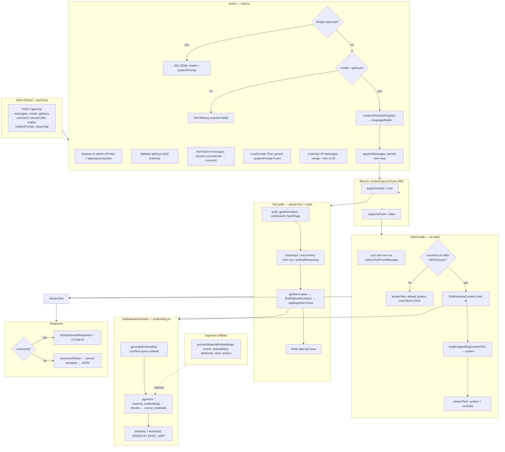

# Chat API and RAG pipeline

**See also:** [EduAI architecture guide](../ARCHITECTURE.md) (Core vs hosted, embedding keys, high-level flows), [Embeddings in EduAI](./EMBEDDINGS.md) (indexing, pgvector, API keys, hosting).

**Maintenance:** Living reference — update this doc when you change chat routing, hybrid RAG caps, or embedding/retrieval behavior (not a one-off PR note).

This document describes how a user prompt flows through **`POST /api/chat`** ([`apps/core/app/routes/api/chat.ts`](../../apps/core/app/routes/api/chat.ts)) and how retrieval-augmented generation (RAG) is triggered relative to **`findRelevantContent`** ([`apps/core/app/lib/ai/embedding.ts`](../../apps/core/app/lib/ai/embedding.ts)). RAG context caps live in [`chat-rag.ts`](../../apps/core/app/lib/chat-rag.ts).

## Diagram

## Notes

- **Hybrid RAG** runs **`findRelevantContent` once** before `streamText` when a **course** is selected and **`isRAGQuery`** is true (keyword heuristics, or always-on when `CHAT_HYBRID_RAG_ALWAYS_WITH_COURSE=1`). Hits are formatted with **`buildCappedRagContextText`** (chunk cap **4**, total char cap **14_000**) and injected into **`system`**.
- **Tool RAG** runs **`findRelevantContent`** only when the model invokes **`getInformation`**. Results pass through **`capRagHitsForTool`** (same chunk cap **4**, **6000** chars per chunk) before returning as tool output.
- **Query embeddings** use an in-memory cache (`QUERY_EMBED_CACHE_TTL_MS`, `QUERY_EMBED_CACHE_MAX`). **Server** `OPENROUTER_API_KEY`, `GOOGLE_GENERATIVE_AI_API_KEY`, or `OPENAI_API_KEY` (first match wins) — independent of the user's chat provider (e.g. Ollama).
- **Similarity threshold** defaults from **`RAG_SIMILARITY_THRESHOLD`** (default **0.5**) when the caller omits `similarityThreshold`.
- **Ingestion** (`processMaterialEmbeddings`) fills the vector tables; it does not run on each chat request.

## Code references

| Area | Path |
| ---- | ---- |
| Route handler | [`apps/core/app/routes/api/chat.ts`](../../apps/core/app/routes/api/chat.ts) |
| RAG caps + formatters | [`apps/core/app/lib/chat-rag.ts`](../../apps/core/app/lib/chat-rag.ts) |
| Vector search + embed API | [`apps/core/app/lib/ai/embedding.ts`](../../apps/core/app/lib/ai/embedding.ts) |
| API key body schema | [`apps/core/app/lib/chat-api-keys.schema.ts`](../../apps/core/app/lib/chat-api-keys.schema.ts) |
| Chat debug logging | [`apps/core/app/lib/chat-api-log.ts`](../../apps/core/app/lib/chat-api-log.ts) |
| Web tools | [`apps/core/app/lib/ai/tools/`](../../apps/core/app/lib/ai/tools/) |
| Provider registry | [`apps/core/app/lib/ai/providers.ts`](../../apps/core/app/lib/ai/providers.ts) |

---

## 1. Entry: `POST /api/chat`

The React chat client calls `POST /api/chat` with a JSON body that typically includes:

| Field | Role |
| ----- | ---- |
| `messages` | Turn array (user/assistant), AI SDK–ish shape with `id` and `role` |
| `model` | Registry id, e.g. `google:gemini-2.5-flash`, `ollama:deepseek-r1:8b` |
| `apiKeys` | Per-provider flags/keys from browser; validated with `clientApiKeysBodySchema` → `toUserProviderSettings` |
| `courseId` or `courseCode` | Optional; enables course-scoped RAG |
| `streaming` | Default `true` |
| `chatId` | Optional; ties to persisted `Chat` (server-generated CUID) |
| `systemPrompt` | Optional override / persistence (`null` clears stored prompt) |
| `proxyUser` | Admin API-key only; remaps acting user via `ExternalUser` mapping |

The handler is the `action` in [`chat.ts`](../../apps/core/app/routes/api/chat.ts) (React Router resource route).

## 2. Before any LLM call

1. **Session** — `auth.api.getSession`, or admin `x-api-key` path with optional `proxyUser` remapping.
2. **Parse body** — `normalizeMessage` ensures `id` and `role`; stamps UUID if missing.
3. **Course** — `courseCode` → `Course` row by code; `effectiveCourseId = resolved id || courseId`.
4. **Chat** — load by `chatId` + user (410 if deleted); create/update for `systemPrompt`.
5. **History** — last **`MAX_CONTEXT_MESSAGES` (20)** from `ChatMessage`, merged with incoming (dedupe by `id`), tail-trimmed to 20.
6. **Early exits** — empty merged transcript → JSON with `chatId` only; missing `model` / invalid `apiKeys` → 400.
7. **Registry** — `createAIProviderRegistry(validatedApiKeys)` → `registry.languageModel(model)`.
8. **Persist** — `appendMessages(normalizedIncomingMessages)` writes new rows before streaming (`skipDuplicates` on `messageId`).

Debug hooks (`chatApiDebug`) log history merge counts and pre-stream prompt size hints (`systemChars`, `messageCount`, `messageTextChars`) without dumping full RAG text.

## 3. Two RAG behaviors (split on `supportsTools`)

RAG is **not** one pipeline. It branches on `modelSupportsTools(model)` (from the `AIModel` row in the DB).

### A. Tool-calling path (`supportsTools === true`)

- `streamText` with **`getInformation`**, **`webSearch`**, **`fetchPage`**
- **`maxSteps`**: `CHAT_TOOL_MAX_STEPS` (default **12**, capped at 32)
- **`maxTokens`**: `CHAT_TOOL_MAX_OUTPUT_TOKENS` (default **32000**, capped at 128_000)
- `toolCallStreaming` mirrors client `streaming`
- Course RAG runs **only if the model calls `getInformation`**, which executes `findRelevantContent(question, effectiveCourseId, HYBRID_RAG_MAX_CHUNKS)` then **`capRagHitsForTool`**
- Retrieved chunks are **tool output**, not pre-injected into `system`
- System prompt instructs: course questions → `getInformation` first; external/recent → `webSearch` then `fetchPage`

### B. Hybrid path (`supportsTools === false`)

- No tool loop
- **`extractTextFromMessage`** on the last user turn (string, parts array, or `{ text }` object)
- **`isRAGQuery`** = `effectiveCourseId` set **and** (
  `CHAT_HYBRID_RAG_ALWAYS_WITH_COURSE=1` **or** message contains any keyword:
  `course`, `material`, `document`, `chapter`, `lecture`, `assignment`, `explain`, `what is`, `summarize`, `summary`, `content`, `about`
  )
- If true → **`findRelevantContent`** once → **`buildCappedRagContextText`** → appended to **`system`**
- If false or no course → default system only (**`maxTokens: 8192`**)
- On retrieval error, falls back to default system (no excerpts)

**Summary:** tool path = RAG on demand inside multi-step `streamText`; hybrid path = RAG once up front into `system` when course + gate match.

### RAG caps (constants in `chat-rag.ts`)

| Constant | Value | Used for |
| -------- | ----- | -------- |
| `HYBRID_RAG_MAX_CHUNKS` | 4 | pgvector `LIMIT` (hybrid + tool) |
| `HYBRID_RAG_MAX_CONTEXT_CHARS` | 14_000 | Hybrid `system` excerpt budget |
| `TOOL_RAG_MAX_CHARS_PER_CHUNK` | 6000 | Per-chunk truncation in tool results |
| `HYBRID_RAG_MIN_TRUNCATE_CHARS` | 120 | Minimum room before truncating last hybrid excerpt |

`buildCappedRagContextText` preserves retrieval order, adds `**Source**: {materialTitle}` headers, joins with `---`, and truncates the last chunk with `…` when over budget.

## 4. `findRelevantContent` (shared)

Defined in [`embedding.ts`](../../apps/core/app/lib/ai/embedding.ts):

1. **`generateEmbedding(userQuery)`** — `embed()` via OpenRouter `google/gemini-embedding-001` (if `OPENROUTER_API_KEY`), else direct Gemini `gemini-embedding-001`, else OpenAI `text-embedding-3-small`. Normalized query text is cached in-memory (`QUERY_EMBED_CACHE_TTL_MS` default 90s, `QUERY_EMBED_CACHE_MAX` default 300 entries).
2. **Pgvector SQL** — `material_embeddings` → `material_chunks` → `course_materials`, filtered by `courseId`, similarity `1 - (embedding <=> query)`, threshold from **`RAG_SIMILARITY_THRESHOLD`** when `similarityThreshold` is omitted (default **0.5**), `ORDER BY similarity DESC`, `LIMIT` from caller.
3. **Returns** `{ content, similarity, materialTitle }[]`.

Signature: `findRelevantContent(userQuery, courseId, limit = 6, similarityThreshold?: number)` — omitting `similarityThreshold` reads **`RAG_SIMILARITY_THRESHOLD`** from the environment.

**Ingestion (offline):** `processMaterialEmbeddings` → `generateChunks` (800 chars, 80 overlap) → `generateEmbeddings` via batched `embedMany` (`EMBED_MANY_BATCH_SIZE` default 64) → `MaterialChunk` + `material_embeddings` in one transaction.

## 5. LLM execution and response

- **`streamText(streamConfig)`** — provider from registry (OpenAI, Google, Ollama, vLLM, etc.). Local models on **cmps01**: `ollama:…` (:11434), `vllm:…` (:8001, OpenAI-compatible — see [VLLM_CMPS01_SETUP.md](latency/eduai-summer-2026/VLLM_CMPS01_SETUP.md))
- **Streaming:** `toDataStreamResponse` with `X-Chat-Id` when known
- **Non-streaming:** `consumeStream`, read text/usage/finishReason, `appendMessages` for assistant (from `response.messages` or fallback text), JSON body

Resolved system prompt order: request `systemPrompt` → stored `chat.systemPrompt` → route default (tool or hybrid template with optional `courseCode` line).

## 6. Environment variables

| Variable | Default | Effect |
| -------- | ------- | ------ |
| `CHAT_HYBRID_RAG_ALWAYS_WITH_COURSE` | off | `1` = hybrid RAG on every message when a course is selected (skip keyword gate) |
| `CHAT_TOOL_MAX_STEPS` | 12 | Tool-path `maxSteps` (1–32) |
| `CHAT_TOOL_MAX_OUTPUT_TOKENS` | 32000 | Tool-path `maxTokens` (1024–128000) |
| `RAG_SIMILARITY_THRESHOLD` | 0.5 | Minimum cosine similarity for retrieval hits when caller omits threshold |
| `QUERY_EMBED_CACHE_TTL_MS` | 90000 | Query embedding cache TTL |
| `QUERY_EMBED_CACHE_MAX` | 300 | Max cached query embeddings |
| `EMBED_MANY_BATCH_SIZE` | 64 | Ingestion batch size for `embedMany` |
| `OPENROUTER_API_KEY` / `GOOGLE_GENERATIVE_AI_API_KEY` / `OPENAI_API_KEY` | — | Embedding provider (OpenRouter → Google → OpenAI) |

## 7. Practical implications

| Situation | Behavior |
| --------- | -------- |
| No course selected | Hybrid `isRAGQuery` is false; `getInformation` returns `{ error: "No course selected for RAG search" }` if called |
| Hybrid retrieval | Keyword-gated unless `CHAT_HYBRID_RAG_ALWAYS_WITH_COURSE=1` — not embedding-based intent detection |
| Latency on RAG turns | Cached embed (hit) or one embed API call + one DB query before first token (hybrid), or inside a tool step (tool path) |
| Credentials | Retrieval embeddings use server Google/OpenAI keys; chat model may be Ollama-only — two credential paths |
| Auto routing | Not on this branch; client sends `model` as-is. See [`TEAM_ROUTING_LAYER_PLAN.md`](./routing/eduai-summer-2026/TEAM_ROUTING_LAYER_PLAN.md) for planned routing work |
