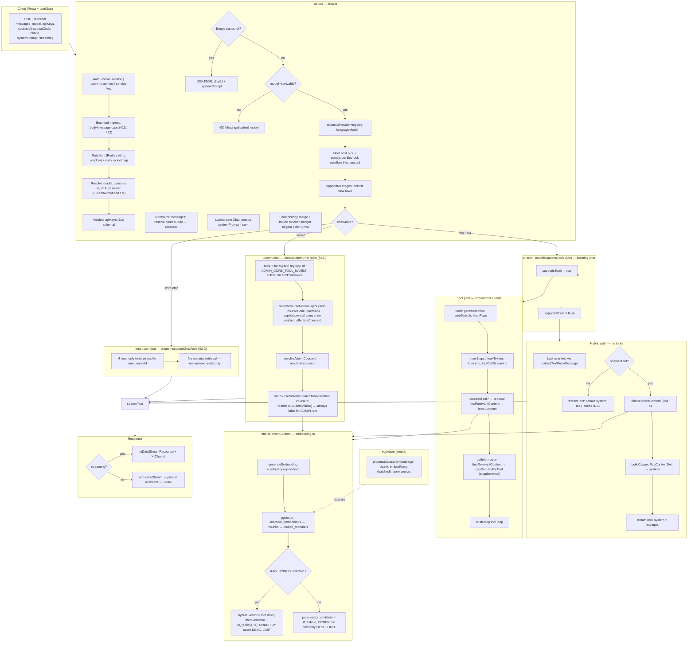

# Chat API and RAG pipeline

**See also:** [EduAI architecture guide](../ARCHITECTURE.md) (Core vs hosted, embedding keys, high-level flows), [Embeddings in EduAI](./EMBEDDINGS.md) (indexing, pgvector, API keys, hosting).

**Maintenance:** Living reference — update this doc when you change chat routing, hybrid RAG caps, or embedding/retrieval behavior (not a one-off PR note).

This document describes how a user prompt flows through **`POST /api/chat`** ([`apps/core/app/routes/api/chat.ts`](../../apps/core/app/routes/api/chat.ts)) and how retrieval-augmented generation (RAG) is triggered relative to **`findRelevantContent`** ([`apps/core/app/lib/ai/embedding.ts`](../../apps/core/app/lib/ai/embedding.ts)). RAG context caps live in [`chat-rag.ts`](../../apps/core/app/lib/chat-rag.ts).

**Last verified against the code:** 2026-08-31.

Three chat modes hit the same route: **learning chat** (`chatMode: "learning"`, sections 1–7 below), **instructor chat** (`chatMode: "instructor"`, §3.D), and **admin chat** (`chatMode: "admin"`, §3.C). `parseChatMode` (`lib/agent-tools/chat-mode.ts`) treats anything that is not the literal string `"admin"` or `"instructor"` as learning, so neither elevated mode is reachable by accident. Learning and admin chat share the retrieval body but resolve "which course" differently; instructor chat does no material retrieval at all.

## Diagram

## Notes

- **Hybrid RAG** prefetches **`findRelevantContent`** on every course-scoped turn. Excerpts inject when **`shouldInjectCourseRag`** passes (`needsCourseRag`, similarity thresholds, or `CHAT_HYBRID_RAG_ALWAYS_WITH_COURSE=1`), formatted with **`buildCappedRagContextText`** and **`buildRagSystemBlock`** (chunk cap **4**, char cap **14_000**).
- **Tool RAG (preload)** shares the same prefetch + inject gate. When injection passes, excerpts use **`buildRagSystemBlock({ toolPath: true })`**. **`getInformation`** remains a supplemental fallback (`capRagHitsForTool`, **6000** chars per chunk).
- **Query embeddings** use an in-memory cache (`QUERY_EMBED_CACHE_TTL_MS`, `QUERY_EMBED_CACHE_MAX`). **Server** `OPENROUTER_API_KEY`, `GOOGLE_GENERATIVE_AI_API_KEY`, or `OPENAI_API_KEY` (first match wins) — independent of the user's chat provider (e.g. Ollama).
- **Similarity threshold** applies to both retrieval paths: chunks must clear the vector cosine floor before ranking. Defaults from **`RAG_SIMILARITY_THRESHOLD`** (default **0.5**) when the caller omits `similarityThreshold`; per-course `ragSimilarityThreshold` overrides when set.
- **Ingestion** (`processMaterialEmbeddings`) fills the vector tables; it does not run on each chat request.
- **Admin chat's `searchCourseMaterials`** (#1658, §3.C) reuses `findRelevantContent` + `capRagHitsForTool` via the shared **`runCourseMaterialSearchTool`** helper (`chat-rag.ts`) — same retrieval body as learning chat's `getInformation`, but course resolution and visibility differ; see §3.C.

## Code references

| Area | Path |
| ---- | ---- |
| Route handler | [`apps/core/app/routes/api/chat.ts`](../../apps/core/app/routes/api/chat.ts) |
| RAG caps + formatters | [`apps/core/app/lib/chat-rag.ts`](../../apps/core/app/lib/chat-rag.ts) |
| RAG inject gate | [`apps/core/app/lib/ai/course-rag-policy.ts`](../../apps/core/app/lib/ai/course-rag-policy.ts) |
| Chat intent | [`apps/core/app/lib/ai/chat-intent.ts`](../../apps/core/app/lib/ai/chat-intent.ts) |
| Vector search + embed API | [`apps/core/app/lib/ai/embedding.ts`](../../apps/core/app/lib/ai/embedding.ts) |
| API key body schema | [`apps/core/app/lib/chat-api-keys.schema.ts`](../../apps/core/app/lib/chat-api-keys.schema.ts) |
| Chat debug logging | [`apps/core/app/lib/chat-api-log.ts`](../../apps/core/app/lib/chat-api-log.ts) |
| Web tools | [`apps/core/app/lib/ai/tools/`](../../apps/core/app/lib/ai/tools/) |
| Provider registry | [`apps/core/app/lib/ai/providers.ts`](../../apps/core/app/lib/ai/providers.ts) |
| Bounded ingress | [`apps/core/app/lib/chat-input.server.ts`](../../apps/core/app/lib/chat-input.server.ts) |
| Auto router | [`apps/core/app/lib/ai/routing/router.ts`](../../apps/core/app/lib/ai/routing/router.ts) |
| Fleet + admission | [`apps/core/app/lib/ai/routing/fleet/`](../../apps/core/app/lib/ai/routing/fleet/), [`admission.server.ts`](../../apps/core/app/lib/ai/admission.server.ts) |
| Bedrock overflow | [`apps/core/app/lib/ai/routing/bedrock/`](../../apps/core/app/lib/ai/routing/bedrock/) |
| Course-scope guardrail | [`apps/core/app/lib/ai/course-scope-guardrail.ts`](../../apps/core/app/lib/ai/course-scope-guardrail.ts) |
| ADHD Assist | [`apps/core/app/lib/ai/adhd-assist.ts`](../../apps/core/app/lib/ai/adhd-assist.ts) + `adhd-*.ts` siblings |
| Chat modes + system prompts | [`apps/core/app/lib/agent-tools/chat-mode.ts`](../../apps/core/app/lib/agent-tools/chat-mode.ts) |
| Admin chat tools (`searchCourseMaterials`, §3.C) | [`apps/core/app/lib/agent-tools/create-admin-chat-tools.ts`](../../apps/core/app/lib/agent-tools/create-admin-chat-tools.ts) |
| Instructor chat tools (§3.D) | [`apps/core/app/lib/agent-tools/create-instructor-chat-tools.ts`](../../apps/core/app/lib/agent-tools/create-instructor-chat-tools.ts) |
| Admin course resolution | [`apps/core/app/lib/agent-tools/admin-context.server.ts`](../../apps/core/app/lib/agent-tools/admin-context.server.ts) |
| Admin context-budget helpers | [`apps/core/app/lib/ai/providers.server.ts`](../../apps/core/app/lib/ai/providers.server.ts) |

---

## 1. Entry: `POST /api/chat`

The React chat client calls `POST /api/chat` with a JSON body that typically includes:

| Field | Role |
| ----- | ---- |
| `messages` | Turn array (user/assistant), AI SDK–ish shape with `id` and `role` |
| `model` | Registry id, e.g. `google:gemini-2.5-flash`, `ollama:deepseek-r1:8b` |
| `apiKeys` | Per-provider flags/keys from browser; validated with `clientApiKeysBodySchema` → `toUserProviderSettings` |
| `courseId` or `courseCode` | Optional; enables course-scoped RAG |
| `streaming` | Default `true` |
| `chatId` | Optional; ties to persisted `Chat` (server-generated CUID) |
| `systemPrompt` | Optional override / persistence (`null` clears stored prompt) |
| `chatMode` | `"learning"` (default) \| `"instructor"` \| `"admin"`; anything else parses to `learning` |
| `adhdAssist` | Optional; turns on Assistive Mode composition + oversight for this turn |
| `forceHybridRag` | Optional; forces the hybrid (non-tool) RAG path |
| `regenerateOnly` | Optional; re-runs the last turn under a different Assist policy. Always non-streaming, never persists, requires an owned `chatId` |
| `routingContext` | Optional `{ jobType, workload }` hints for fleet/pool selection |
| `proxyUser` | Admin-API-key callers only; delegates the turn to another user |

The handler is the `action` in [`chat.ts`](../../apps/core/app/routes/api/chat.ts) (React Router resource route).

## 2. Before any LLM call

1. **Auth** — three accepted callers, checked in this order:
   - `enforceAdminIfApiKey(request)` — an `x-api-key` header is honoured **only** for an active `ADMIN`; anything else is `401`/`403`. This is the path that also unlocks `proxyUser` delegation.
   - a normal Better Auth cookie session (`getRequestSession`);
   - failing both, `requireServiceKey(request)` — a valid `Authorization: Bearer <EDUAI_API_KEY>` is admitted as a synthetic `ADMIN`-shaped service principal (`id: "service"`) for extension calls.
2. **Bounded ingress** — `resolveChatInputLimits()` + `readBoundedChatJson()` + `validateChatBody()` (`lib/chat-input.server.ts`) enforce `CHAT_MAX_BODY_BYTES` (2 MiB), `CHAT_MAX_MESSAGES` (100), `CHAT_MAX_MESSAGE_CHARS` (32 768) and `CHAT_MAX_TOTAL_MESSAGE_CHARS` (131 072) — `413`/`422` **before** anything is persisted or a provider is admitted.
3. **Model resolution** — a `bedrock:*` model from a client is rejected (`400 BEDROCK_NOT_SELECTABLE`); the legacy `auto-hybrid` mode is rejected; `auto` / `auto-llm` are checked against the admin-managed `routing-model-settings` before the router runs. Omitting `model` falls back to whichever Auto mode is enabled, or `400` if none is.
4. **Rate limits & quotas** — a Redis sliding window shared with `/api/completion` (`CHAT_RATE_LIMIT` / `CHAT_RATE_LIMIT_WINDOW_MS`), keyed per user for session/API-key callers and to one shared bucket for direct service-key callers; plus the admin-configurable per-role daily local-model cap (`lib/chat-daily-limits.server.ts`).
5. **Parse body** — `normalizeMessage` ensures `id` and `role`; stamps UUID if missing. `filterIncomingClientMessages` / `sanitizeSystemPrompt` (`lib/ai/prompt-safety.ts`) strip client-supplied content that must not enter the system prompt.
6. **Course** — `courseCode` → `Course` row by code (`courseCodeLookupCandidates` / `pickCourseIdByCandidatePriority`); `effectiveCourseId = resolved id || courseId`. Access is resolved with `resolveCourseAccessWithCourse`, and `restrictToStudentVisible` is set once from `access.level === "student"`.
7. **Chat** — load by `chatId` + user (410 if deleted); create/update for `systemPrompt`. The stored `Chat.chatbotType` must match the requested `chatMode`.
8. **History** — loaded from `ChatMessage` and merged with the incoming turns (dedupe by `id`), then bounded by `prepareBoundedSessionContext` (`lib/chat-rag.ts`): a tail window capped by `CHAT_MAX_CONTEXT_MESSAGES` (**100**, clamped 4–200) and, once the assembled input reaches `CHAT_CONTEXT_FILL_RATIO` (**0.90**, per-model override `AIModel.contextFillRatio`) of the model's context window, older turns are replaced by a synthetic **session digest** (`CHAT_DIGEST_MAX_SOURCE_MESSAGES`, `CHAT_SESSION_RECENT_MESSAGES`, `CHAT_SESSION_DIGEST_MAX_CHARS`). `CHAT_SESSION_MAX_CHARS` is the fallback budget when the context window is unknown.
9. **Early exits** — empty merged transcript → JSON with `chatId` only; unresolvable model / invalid `apiKeys` → 400.
10. **Registry** — `createAIProviderRegistry(validatedApiKeys)` → `registry.languageModel(model)`, after `mergeLocalInferenceFromEnv` folds deployment-managed `ollama`/`vllm` settings in.
11. **Fleet + admission** — `resolveFleetHost` picks a healthy GPU host, `acquireAiAdmission` applies the process-local FIFO gate (`AI_MAX_INFLIGHT`, `AI_ADMISSION_WAIT_MS`), and `tryActivateBedrockOverflow` is the last resort when local capacity is exhausted.
12. **Persist** — `appendMessages(normalizedIncomingMessages)` writes new rows before streaming (`skipDuplicates` on `messageId`).

Debug hooks (`chatApiDebug` / `chatApiTrace` / `chatApiReject`, `lib/chat-api-log.ts`) log history merge counts and pre-stream prompt size hints (`systemChars`, `messageCount`, `messageTextChars`) without dumping full RAG text.

**Course-scope guardrail.** On a course-scoped *learning* turn, `lib/ai/course-scope-guardrail.ts` adds an always-on system-prompt policy (Layer A). A stricter second-pass classifier (Layer B) runs only when `COURSE_SCOPE_GUARDRAIL_ENABLED` **and** the course's own `courseScopeGuardrailEnabled` column are both on; it fails open on timeout (`COURSE_SCOPE_CLASSIFIER_TIMEOUT_MS`, default 2 s) and is skipped for admin preview and service-key/extension calls.

**ADHD Assist.** When Assistive Mode is on, `lib/ai/adhd-assist.ts` composes a structured-output schema and may pin the model (`ADHD_ASSIST_AUTO_MODEL`); `adhd-oversight.ts` optionally runs a second-pass structural audit (`ADHD_ASSIST_OVERSIGHT`, on by default) and records compliance metrics as `AssistiveEvent` rows.

## 3. Two RAG behaviors (split on `supportsTools`)

RAG is **not** one pipeline. It branches on `getChatModelCapabilities(model).supportsTools` (from the `AIModel` row in the DB).

### A. Tool-calling path (`supportsTools === true`)

- `streamText` with **`getInformation`**, **`webSearch`**, **`fetchPage`**
- **`maxSteps`**: `CHAT_TOOL_MAX_STEPS` (default **12**, capped at 32)
- **`maxTokens`**: `resolveToolMaxOutputTokens(AIModel.maxTokens)` — env cap from `CHAT_TOOL_MAX_OUTPUT_TOKENS` (default **8192**, max 128_000), further clamped to the model's DB `maxTokens` when set (vLLM models seeded at **8192**)
- `toolCallStreaming` mirrors client `streaming`
- When `effectiveCourseId` is set, **`findRelevantContent`** runs **before** `streamText` (prefetch). Excerpts are injected only when **`shouldInjectCourseRag`** is true: `needsCourseRag(message)`, strong/moderate similarity, or `CHAT_HYBRID_RAG_ALWAYS_WITH_COURSE=1`.
- **`getInformation`** remains registered as a supplemental tool — the model may call it if preloaded excerpts are insufficient. Its results pass through **`capRagHitsForTool`** (chunk cap **4**, **6000** chars per chunk).
- System prompt instructs: use preloaded excerpts first; call `getInformation` only if they are insufficient; external/recent info → `webSearch` then `fetchPage`.

### B. Hybrid path (`supportsTools === false`)

- No tool loop
- **`extractTextFromMessage`** on the last user turn (string, parts array, or `{ text }` object)
- **`isRAGQuery`** / inject gate = prefetch when course selected; inject when `needsCourseRag(message)` **or** top-1 similarity ≥ moderate threshold **or** `CHAT_HYBRID_RAG_ALWAYS_WITH_COURSE=1` (#484 smart gate)
- If inject passes → **`findRelevantContent`** once → **`buildCappedRagContextText`** → **`buildRagSystemBlock`** → appended to **`system`**
- If no course → default system only (**`maxTokens: 8192`**)
- On retrieval error, falls back to default system (no excerpts)

**Summary:** both paths prefetch on course-scoped chat; excerpts inject when the smart gate passes. `getInformation` is supplemental on the tool path only.

### C. Admin chat path (`chatMode: "admin"`) — `searchCourseMaterials`

Admin chat (`/admin/chat`, ADMIN session only, [`create-admin-chat-tools.ts`](../../apps/core/app/lib/agent-tools/create-admin-chat-tools.ts)) never enters the tool-vs-hybrid split above — `routes/api/chat.ts` branches on `chatMode` before that split (see the `chatMode?` node in the diagram) and always uses tool-calling. Its RAG tool differs from learning chat's `getInformation` in three ways:

1. **Explicit course, not ambient context.** Learning chat resolves RAG against `effectiveCourseId` from the session/UI course selector — there's always exactly one course in scope. Admin chat is platform-wide with no UI course filter, so `searchCourseMaterials` takes `courseId` or `courseCode` as tool call parameters; the model must name a course. Resolution goes through **`resolveAdminCourseId`** — the same helper every other course-scoped admin tool uses (`listCourseEnrollments`, `listCourseTopics`, …) — which also accepts a `fallbackCourseId` (the UI's `effectiveCourseId`, when the admin has one selected) before erroring if no course can be resolved.
2. **Shared retrieval body, separate gating.** Once a `courseId` is resolved, both `getInformation` and `searchCourseMaterials` call the same **`runCourseMaterialSearchTool(question, courseId, restrictToStudentVisible)`** in `chat-rag.ts` — `findRelevantContent` (chunk cap `HYBRID_RAG_MAX_CHUNKS`) capped for a tool result via `capRagHitsForTool`, fails closed with a typed `{ error }` (never throws) on retrieval failure. Only "which course, and is one even selected" is duplicated per caller (#1658 review) — the retrieval/error-handling body is not.
3. **Visibility is a pass-through, not a role check.** `restrictToStudentVisible` (excludes hidden/scheduled materials, #839) comes from `ChatToolContext.restrictToStudentVisible`, set once in `routes/api/chat.ts` as `courseAccess?.level === "student"`. ADMIN-role callers never resolve to a `"student"` access level, so `searchCourseMaterials` always passes `restrictToStudentVisible: false` — admins can search a course's full material set, including anything hidden from students.

**Tool budget:** the full admin registry (63 tools) does not fit the seeded 16k-context admin model's token budget (`estimateToolDefinitionTokens`, `providers.server.ts`); `routes/api/chat.ts` calls `pickCoreAdminChatTools` to send only the 18 `ADMIN_CORE_TOOL_NAMES` (which includes `searchCourseMaterials`) on ≤32k-context models, the full registry otherwise. See `docs/AGENT_READINESS.md` and `chat-admin-registry-budget.test.ts`.

### D. Instructor chat path (`chatMode: "instructor"`) — no material retrieval

The course-scoped assistant at `/instructor/chat` (#1659) also always uses tool calling and never enters the tool-vs-hybrid split. `routes/api/chat.ts` requires a course **and** `access.level === "instructor"` **and** `course.isPublished` before entering this mode; `createInstructorChatTools` is then built against that one `courseId`.

Its four tools (`getCourse`, `listCourseEnrollments`, `listCourseTopics`, `getCourseTopic`) are hard-pinned to `ctx.effectiveCourseId` and take no `courseId` argument, so the model cannot ask about another course. **`searchCourseMaterials` / `getInformation` are deliberately absent** — instructor mode is read-only course ops (roster, topics, metadata), not tutoring or material search. `isPrivilegedChatMode()` groups it with admin mode for the shared non-RBAC turn logic (tool setup, budget caps, skipping the student course-scope classifier, web tools, and ADHD oversight); the `COURSE_REQUIRED` gate is the one place the two modes deliberately diverge, since instructor mode always needs a course and admin mode never does.

### RAG caps (constants in `chat-rag.ts`)

| Constant | Value | Used for |
| -------- | ----- | -------- |
| `HYBRID_RAG_MAX_CHUNKS` | 4 | pgvector `LIMIT` (hybrid + tool) |
| `HYBRID_RAG_MAX_CONTEXT_CHARS` | 14_000 | Hybrid `system` excerpt budget |
| `TOOL_RAG_MAX_CHARS_PER_CHUNK` | 6000 | Per-chunk truncation in tool results |
| `HYBRID_RAG_MIN_TRUNCATE_CHARS` | 120 | Minimum room before truncating last hybrid excerpt |

`buildCappedRagContextText` preserves retrieval order, adds `**Source**: {materialTitle}` headers, joins with `---`, and truncates the last chunk with `…` when over budget.

## 4. `findRelevantContent` (shared)

Defined in [`embedding.ts`](../../apps/core/app/lib/ai/embedding.ts):

1. **`generateEmbedding(userQuery)`** — `embed()` against the **effective per-course embedding settings** (`resolveEffectiveEmbeddingSettings`, `embedding-config.ts`): `Course.embeddingProvider` / `Course.embeddingModel` when set, else `EMBEDDING_PROVIDER` / the matching env model.
   - **local** → the OpenAI-compatible vLLM embedding endpoint when `VLLM_EMBEDDING_BASE_URL` is set, else Ollama `mxbai-embed-large`. A failure **throws**; it does not fall back to cloud, because index and query must share a model space.
   - **cloud** at `EMBEDDING_DIMENSION=1024` → OpenRouter `openai/text-embedding-3-small` @ 1024 dims → OpenAI direct (`dimensions: 1024`) → OpenRouter's default model.
   - **cloud** at the legacy `EMBEDDING_DIMENSION=3072` → OpenRouter → Google `gemini-embedding-001` → OpenAI.

   Each attempt has a deadline (`EMBEDDING_REQUEST_TIMEOUT_MS`, default 30 000 ms, range 100–120 000) and is retried at most twice on transient errors. Normalized query text is cached in-memory (`QUERY_EMBED_CACHE_TTL_MS` default 90s, `QUERY_EMBED_CACHE_MAX` default 300 entries).
2. **Retrieval SQL** — branches on **`RAG_HYBRID_BM25`**:
   - **Hybrid path** (`RAG_HYBRID_BM25=1`, recommended): unions lexical candidates selected by the GIN-backed `content_tsv @@ query` predicate with semantic candidates above the vector cosine floor (`1 − (embedding <=> query) > threshold`), then ranks the union by `(1 − (embedding <=> query)) × α + ts_rank(content_tsv, query) × (1−α)`, where α = **`RAG_HYBRID_BM25_ALPHA`** (default **0.7**). `ORDER BY score DESC`, `LIMIT`. Exact labels can enter through full-text search while semantically relevant chunks remain eligible even when they do not contain the query terms.
   - **Pure-vector path** (default when flag is off): `1 - (embedding <=> query)`, filtered by threshold from **`RAG_SIMILARITY_THRESHOLD`** (default **0.5**), `ORDER BY similarity DESC`.
3. **Returns** `{ content, similarity, materialTitle }[]` — same shape for both paths; `similarity` holds the combined score in hybrid mode.

Signature: `findRelevantContent(userQuery, courseId, limit = 6, similarityThreshold?, restrictToStudentVisible = false, requestOptions?)`.

- **Per-course overrides win.** `getCourseRagSettings(courseId)` supplies `ragTopK` and `ragSimilarityThreshold`; only when those are null does the call fall back to the `limit` argument and then to **`RAG_SIMILARITY_THRESHOLD`** (default 0.5). Both hybrid and pure-vector paths apply the effective threshold as a vector cosine pre-filter; hybrid then ranks survivors by combined score.
- **Student visibility (#839, #777).** When `restrictToStudentVisible` is true — set once in `chat.ts` from `access.level === "student"` — two extra SQL clauses are injected into both retrieval paths: `visibleToStudents = true AND (availableAt IS NULL OR availableAt <= NOW())`, plus a Canvas publish gate excluding materials with `unpublishedAt` set or an entry in `canvas_material_exclusions`. Staff callers get the empty filter, so a material an instructor can read directly is never invisible to that instructor in RAG.
- **ANN tuning (#940).** The retrieval query runs inside an explicit `$transaction` so a single `SELECT set_config(...)` can apply `ivfflat.probes` (**`RAG_IVFFLAT_PROBES`**, default 10, clamped 1–100) on the same pooled connection. On pgvector ≥ 0.8.0 it additionally sets `ivfflat.iterative_scan = relaxed_order` and `ivfflat.max_probes = 32768` so a course filter cannot starve a small course's nearest chunks out of the candidate set. The version check is cached per process; older extensions reject those GUCs, so they are skipped. Evidence: [`IVFFLAT_EXPLAIN_EVIDENCE.md`](./IVFFLAT_EXPLAIN_EVIDENCE.md).

**Ingestion (offline):** `processMaterialEmbeddings` → `resolveMaterialChunks` (semantic chunks from upload when `SEMANTIC_CHUNK_SEPARATOR` is present, else `generateChunks` at 800 chars / 80 overlap) → `generateEmbeddings` via batched `embedMany` (`EMBED_MANY_BATCH_SIZE` default 64) → batch `MaterialChunk` insert + `material_embeddings` in one transaction. Re-upload materials to pick up improved chunk boundaries for files indexed before this fix.

## 5. LLM execution and response

- **`streamText(streamConfig)`** — provider from registry (OpenAI, Google, Ollama, vLLM, etc.). Local models on **cmps01**: `ollama:…` (:11434), `vllm:…` (:8001, OpenAI-compatible — see [VLLM.md](VLLM.md))
- **Streaming:** `toDataStreamResponse` with `X-Chat-Id` when known
- **Non-streaming:** `consumeStream`, read text/usage/finishReason, `appendMessages` for assistant (from `response.messages` or fallback text), JSON body
- **Provider failures:** before streaming starts (and on non-streaming requests), Core returns the same sanitized `error`/`code`/`retryable`/`provider` JSON contract as `/api/completion`. After a 200 stream has begun, HTTP status and headers are immutable, so the same JSON object is serialized as the AI SDK stream-error message instead. Client aborts remain 499 and are never classified as provider failures.

Resolved system prompt order: request `systemPrompt` → stored `chat.systemPrompt` → route default (tool or hybrid template with optional `courseCode` line).

## 6. Environment variables

| Variable | Default | Effect |
| -------- | ------- | ------ |
| `CHAT_TOOL_MAX_STEPS` | 12 | Tool-path `maxSteps` (1–32) |
| `CHAT_TOOL_MAX_OUTPUT_TOKENS` | 8192 | Tool-path env cap for `maxTokens` (1024–128000); clamped to `AIModel.maxTokens` when set |
| `RAG_HYBRID_BM25` | off | `1` = enable hybrid BM25+vector retrieval in `findRelevantContent` (recommended; improves label and vague queries) |
| `RAG_HYBRID_BM25_ALPHA` | 0.7 | Vector weight in hybrid score (0–1 exclusive); BM25 weight = 1−α. Ignored when hybrid is off. |
| `RAG_SIMILARITY_THRESHOLD` | 0.5 | Minimum vector cosine similarity for retrieval hits — pre-filter on both pure-vector and hybrid BM25 paths |
| `CHAT_RAG_INJECT_STRONG_SIM` | 0.8 (or `ROUTING_RAG_STRONG_SIM`) | Inject when top-1 similarity clears bar even if intent skips |
| `CHAT_RAG_INJECT_MODERATE_SIM` | 0.55 (or `ROUTING_RAG_TIER1_SIM`) | Inject when at least one chunk clears moderate bar |
| `CHAT_HYBRID_RAG_ALWAYS_WITH_COURSE` | off | `1` = inject on every course-scoped message (testing / legacy always-on) |
| `QUERY_EMBED_CACHE_TTL_MS` | 90000 | Query embedding cache TTL |
| `QUERY_EMBED_CACHE_MAX` | 300 | Max cached query embeddings |
| `EMBED_MANY_BATCH_SIZE` | 64 | Ingestion batch size for cloud `embedMany` (capped at the provider's 100) |
| `OLLAMA_EMBED_MANY_BATCH_SIZE` | 8 | Initial local batch size; auto-splits on an Ollama `400` |
| `RAG_IVFFLAT_PROBES` | 10 | `ivfflat.probes` per retrieval query (1–100) |
| `EMBEDDING_PROVIDER` / `EMBEDDING_DIMENSION` | `cloud` / 1024 | Embedding path and expected vector length (per-course override on `Course`) |
| `EMBEDDING_REQUEST_TIMEOUT_MS` | 30000 | Per-attempt embedding deadline (100–120000) |
| `VLLM_EMBEDDING_BASE_URL` / `VLLM_EMBEDDING_MODEL` | — | OpenAI-compatible local embedding endpoint, preferred over Ollama when set |
| `OPENROUTER_API_KEY` / `OPENAI_API_KEY` / `GOOGLE_GENERATIVE_AI_API_KEY` | — | Cloud embedding providers (Google only on the legacy 3072 path) |
| `CHAT_MAX_CONTEXT_MESSAGES` | 100 | Tail window loaded from `ChatMessage` (4–200) |
| `CHAT_CONTEXT_FILL_RATIO` | 0.90 | Fraction of the model context window that triggers digesting older turns |
| `CHAT_SESSION_MAX_CHARS` / `CHAT_SESSION_RECENT_MESSAGES` / `CHAT_SESSION_DIGEST_MAX_CHARS` | 28000 / 6 / 14000 | Session-digest budget when the context window is unknown |
| `CHAT_MAX_BODY_BYTES` / `CHAT_MAX_MESSAGES` / `CHAT_MAX_MESSAGE_CHARS` / `CHAT_MAX_TOTAL_MESSAGE_CHARS` | 2 MiB / 100 / 32768 / 131072 | Bounded ingress (413 / 422) |
| `CHAT_RATE_LIMIT` / `CHAT_RATE_LIMIT_WINDOW_MS` | 100 / 60000 | Redis sliding window shared with `/api/completion` |
| `CHAT_LONG_OUTPUT_MAX_TOKENS` / `CHAT_LONG_OUTPUT_ADHD_MAX_TOKENS` | 1200 / 600 | Caps applied only to detected long-output requests; never raise a model cap |
| `ROUTER_MODE` | `rules` | Global default Auto mode (`rules` \| `knn` \| `hybrid` \| `llm`) |
| `COURSE_SCOPE_GUARDRAIL_ENABLED` | off | Server kill switch for the Layer B course-scope classifier (ANDed with the course's own flag) |
| `ADHD_ASSIST_OVERSIGHT` | on | Set `false`/`0`/`off` to disable the Assist second-pass structural audit |
| `AI_MAX_INFLIGHT` / `AI_ADMISSION_WAIT_MS` | 8 / 15000 | Process-local FIFO admission gate for local-GPU inference |

## 7. Practical implications

| Situation | Behavior |
| --------- | -------- |
| No course selected | Hybrid `isRAGQuery` is false; `getInformation` returns `{ error: "No course selected for RAG search" }` if called |
| Hybrid retrieval (inject) | Smart inject gate (`needsCourseRag` + similarity thresholds); prefetch always when course selected. Override: `CHAT_HYBRID_RAG_ALWAYS_WITH_COURSE=1` |
| BM25 hybrid retrieval | `RAG_HYBRID_BM25=1` combines GIN-backed lexical candidates (`content_tsv @@ query`) with independent vector-threshold candidates, then reranks their union; `content_tsv` is a generated (`GENERATED ALWAYS ... STORED`) `tsvector` column, so content is not tokenized per query. Recommended for production. |
| Latency on RAG turns | Cached embed (hit) or one embed API call + one DB query before first token (hybrid), or inside a tool step (tool path) |
| Credentials | Retrieval embeddings use server-configured (local or cloud) providers; the chat model may be vLLM/Ollama-only — two independent credential paths |
| Auto routing | **Shipped.** `model: "auto"` runs the rule/kNN/hybrid stack and `model: "auto-llm"` the LLM classifier (`lib/ai/routing/router.ts`), both gated by admin-managed `routing-model-settings`. `ROUTER_MODE` sets the global default. Background: [`TEAM_ROUTING_LAYER_PLAN.md`](./routing/eduai-summer-2026/TEAM_ROUTING_LAYER_PLAN.md) |
| Instructor chat | Course-scoped roster/topic reads only — no `getInformation` / `searchCourseMaterials`, so no retrieval happens on this path (§3.D) |
| Stream cancellation | `POST /api/chat/cancel` aborts a registered in-flight stream (`lib/ai/active-chat-cancellations.server.ts`); a client abort is reported as `499` and is never classified as a provider failure |
