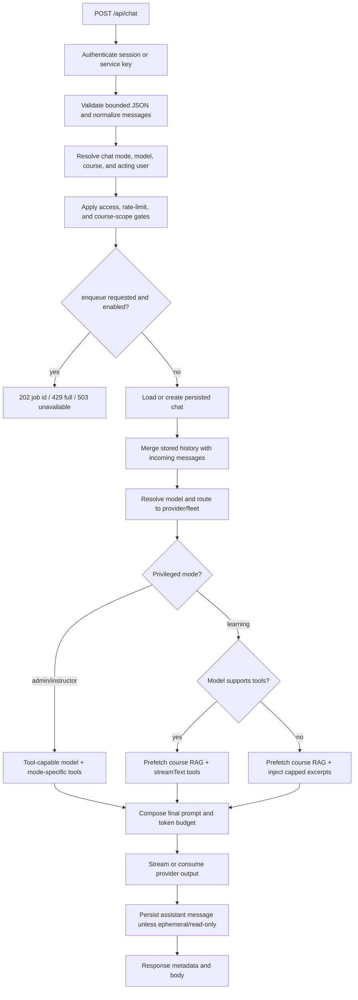

# Chat and RAG pipeline

This is the current contract for `POST /api/chat`. The implementation authority
is [`apps/core/app/routes/api/chat.ts`](../../apps/core/app/routes/api/chat.ts);
shared retrieval and formatting live in
[`chat-rag.ts`](../../apps/core/app/lib/chat-rag.ts) and
[`embedding.ts`](../../apps/core/app/lib/ai/embedding.ts).

## Request lifecycle

The route performs authorization before provider work. Retrieval, provider
errors, and queue errors are surfaced as explicit responses; an infrastructure
failure must not be presented as an empty course corpus.

## Chat modes and access

`chatMode` is parsed as one of the route's three modes: `learning` (the default),
`instructor`, or `admin`.

| Mode | Course requirement | Access and behavior |
| --- | --- | --- |
| `learning` | Required for browser sessions; service-key integrations may omit it | Students need active enrollment in a published course. Student RAG is visibility-filtered. |
| `instructor` | Always required | Caller must have an active instructor enrollment in the published course. Requires a tool-capable model. |
| `admin` | Optional | Requires an active platform admin. It can search an explicitly selected course and may use platform-wide admin tools. Requires a tool-capable model. |

A persisted chat is owned by the acting user and pinned to its course. A later
request that names a different course receives `409 COURSE_MISMATCH`; omitting a
course on a follow-up inherits the chat's stored course. Missing or inaccessible
courses are rejected before generation.

`proxyUser` is accepted only for an admin API-key session. The resolved proxy
identity becomes the acting user for ownership, rate limits, and authorization.
Service-key calls are ephemeral: they can use the route but do not create or
append persisted chat/message history.

## Model selection

The route accepts a concrete registry model id such as
`vllm:qwen2.5-7b-instruct` or a supported Auto mode. Auto modes are gated by
Admin → AI Models and are documented in [`MODEL_ROUTING.md`](./MODEL_ROUTING.md).
If no model is supplied and no enabled Auto mode can be selected, the route
returns `400` rather than silently choosing a provider.

The `AIModel.supportsTools` capability controls the learning-chat strategy. It
does not override the privileged-mode requirement: admin and instructor chat
reject a non-tool-capable model.

## Learning RAG paths

### Tool-capable model

The route uses `streamText` with the learning tools `getInformation`, `webSearch`,
and `fetchPage`.

- Course retrieval is prefetched before generation whenever a course is in
  scope. This keeps retrieval latency off the first model tool decision.
- `shouldInjectCourseRag` injects the top results when the intent heuristic asks
  for course material, or when similarity clears the strong/moderate thresholds.
- Injected excerpts are capped at 4 chunks and 14,000 characters.
- `getInformation` remains available as a supplemental search when the preload
  is insufficient. Tool results are capped per chunk by
  `CHAT_TOOL_RAG_MAX_CHARS_PER_CHUNK` (default 6,000; bounded 500–50,000).
- External or recent facts use the web tools rather than being attributed to
  course material.

### Model without tools (hybrid path)

The route has no tool loop. It still prefetches course RAG, then injects capped
excerpts into the system prompt when the course-intent heuristic, similarity
thresholds, or `CHAT_HYBRID_RAG_ALWAYS_WITH_COURSE=1` says to do so. The same
4-chunk and 14,000-character limits apply.

When retrieval ran for a course question but returns no usable excerpts, the
prompt tells the model to say that the uploaded materials do not support an
answer. It must not fill the gap with unsupported general knowledge.

### Retrieval body shared by both paths

`findRelevantContent` embeds the query using server-side embedding settings,
searches `material_embeddings` joined to chunks/materials, applies the course
threshold and top-k, and returns source titles with similarity. Optional hybrid
BM25 ranking and student visibility filters are documented in
[`EMBEDDINGS.md`](./EMBEDDINGS.md).

Student retrieval excludes deleted, unpublished, Canvas-excluded, hidden, and
not-yet-available materials. Staff retrieval passes the student filter off.
Retrieved text is wrapped as untrusted reference content so instructions inside
course files are not treated as system instructions.

## Admin and instructor tools

Privileged modes use the mode-specific tool registry. Admin chat's full registry
is large, so models with context windows up to 32k use the reduced core admin
tool set. Models with windows up to 16k also receive tighter output and tool-step
limits. Instructor mode has its smaller course-assistant registry.

Admin `searchCourseMaterials` resolves the course explicitly per tool call and
uses the shared `runCourseMaterialSearchTool` retrieval body. It is not allowed
to inherit a student's ambient course visibility filter.

## History and context budgeting

The route loads a bounded history window and merges it with incoming messages by
message id. The count window is a safety ceiling, not the actual model budget:

| Setting | Default | Bounds / purpose |
| --- | ---: | --- |
| `CHAT_MAX_CONTEXT_MESSAGES` | 100 | 4–200 messages loaded and tail-trimmed |
| `CHAT_DIGEST_MAX_SOURCE_MESSAGES` | 600 | 200–2,000 older messages available for digesting |
| `CHAT_CONTEXT_FILL_RATIO` | 0.90 | 0.5–0.98; per-model `AIModel.contextFillRatio` may override |
| `CHAT_SESSION_MAX_CHARS` | 28,000 | Fallback only when model context is unknown |
| `CHAT_SESSION_RECENT_MESSAGES` | 6 | 2–50 recent messages kept verbatim during digesting |
| `CHAT_SESSION_DIGEST_MAX_CHARS` | 14,000 | 500–50,000 synthetic digest cap |

After the final security prompt and tool schemas are known, the route estimates
the actual model input, reserves space for tool steps where needed, and caps the
completion to fit the model context window. Privileged prompts that cannot fit
are rejected instead of being sent to the provider. Tool and assistant payloads
are bounded before later model steps.

## Persistence, streaming, and special paths

- Browser turns persist new client messages before generation and persist the
  assistant response after successful consumption. Duplicate message ids are
  ignored.
- `streaming` defaults to `true`. Responses include `X-Chat-Id` when a persisted
  chat is involved.
- `regenerateOnly=true` requires an existing chat id, forces non-streaming, and
  is a read-only preview. It never persists messages or usage telemetry.
- `enqueue=true` is honored only when the guarded queue feature is enabled. A
  successful enqueue returns `202` with `jobId`, `queuePosition`, and
  `queueDepth`; a full queue returns `429` with `Retry-After`.
- Browser course image messages are rejected by the course-chat path. Admin and
  service-key integrations retain their multimodal routing where supported.
- Browser learning chat may run the optional course-scope classifier only when
  both the server flag and course setting are enabled. It does not run for
  admin, instructor, or service-key paths.

## Response metadata

The route reports selected runtime facts without exposing provider secrets. Useful
headers include:

| Header | Meaning |
| --- | --- |
| `X-Chat-Id` | Persisted chat id, when applicable |
| `X-Routed-Model` | Concrete model used after Auto resolution |
| `X-Routing-Tier` / `X-Router-Version` | Auto routing metadata |
| `X-Fleet-Server` | vLLM fleet host that served the request |
| `X-Web-Tools-Enabled` | Effective web-tool policy |
| `X-Admission-Wait-Ms` | Time spent waiting for local AI admission |
| `X-RAG-Latency-Ms` | Retrieval duration when RAG ran |

Non-streaming JSON can include `content`, `model`, `usage`, `finishReason`,
`sources`, `reasoning`, `responseId`, course/chat ids, RAG similarity/chunk
counts, token estimates, and RAG latency. Streaming uses the AI SDK data stream
response and the response headers above.

## Failure and cancellation behavior

Provider failures are mapped through the centralized sanitized error boundary;
client aborts use status `499`. Retrieval failures are logged and returned as a
service error rather than silently producing an ungrounded answer. Local AI
admission has a bounded wait (`AI_ADMISSION_WAIT_MS`) and can attempt configured
Bedrock overflow after local capacity is exhausted. Request-specific
`X-EduAI-Request-Id` cancellation aborts the matching active provider stream and
releases its admission slot.

## Code map

| Concern | File |
| --- | --- |
| Route and response contract | [`apps/core/app/routes/api/chat.ts`](../../apps/core/app/routes/api/chat.ts) |
| RAG formatting and context limits | [`apps/core/app/lib/chat-rag.ts`](../../apps/core/app/lib/chat-rag.ts) |
| Prefetch/injection policy | [`apps/core/app/lib/ai/course-rag-policy.ts`](../../apps/core/app/lib/ai/course-rag-policy.ts) |
| Intent heuristics | [`apps/core/app/lib/ai/chat-intent.ts`](../../apps/core/app/lib/ai/chat-intent.ts) |
| Learning/admin/instructor tools | [`apps/core/app/lib/ai/tools/`](../../apps/core/app/lib/ai/tools/) and [`apps/core/app/lib/agent-tools/`](../../apps/core/app/lib/agent-tools/) |
| Provider registry and context metadata | [`apps/core/app/lib/ai/providers.ts`](../../apps/core/app/lib/ai/providers.ts) and [`apps/core/app/lib/ai/providers.server.ts`](../../apps/core/app/lib/ai/providers.server.ts) |
| Chat tests | [`apps/core/app/tests/`](../../apps/core/app/tests/) |
