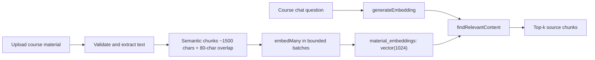

# Embeddings and vector retrieval

This document describes the current embedding and retrieval contract in
[`apps/core/app/lib/ai/embedding.ts`](../../apps/core/app/lib/ai/embedding.ts).
The server uses the same effective embedding configuration for material
ingestion and query-time retrieval. Chat-request provider keys are unrelated:
embeddings read server environment variables and optional course settings only.

## Data flow



The upload path preserves Markdown structure, equations, and tables where the
extractor can identify them. It records `CourseMaterial`, `MaterialChunk`, and
`MaterialEmbedding` rows. Re-indexing replaces a material's vectors only after
the new embeddings have succeeded.

## Current schema and settings

`material_embeddings.embedding` is currently `vector(1024)`, with one embedding
per `MaterialChunk`. The Prisma schema intentionally represents the vector as an
unsupported database type, so the raw SQL in `embedding.ts` is part of the
contract. `material_chunks.content_tsv` supports the optional lexical side of
hybrid retrieval.

The effective settings are resolved in this order:

1. A course's non-null `embeddingProvider` / `embeddingModel` override.
2. `EMBEDDING_PROVIDER` and the corresponding environment model.
3. Provider-specific defaults.

Changing provider, model, or dimension makes existing vectors stale. Do not point
a 1024-dimensional database at a 3072-dimensional provider. The legacy 3072 path
exists only when `EMBEDDING_DIMENSION=3072` is deliberately configured; it is not
the current default and should not be introduced into a shared 1024 database.

## Provider resolution

### Local mode

Set `EMBEDDING_PROVIDER=local` (the alias `ollama` is accepted). The local model
defaults to `mxbai-embed-large`.

- If `VLLM_EMBEDDING_BASE_URL` is set, Core uses its OpenAI-compatible `/v1`
  embedding endpoint and `VLLM_EMBEDDING_MODEL` or the course model override.
  URL allowlisting and CMPS01 internal authentication are applied.
- Otherwise Core uses native Ollama through `OLLAMA_BASE_URL` and
  `OLLAMA_EMBEDDING_MODEL`.
- Local batches start at `OLLAMA_EMBED_MANY_BATCH_SIZE` (default 8, bounded
  1–32) and can split after an Ollama 400/context-size response.
- A local provider failure is terminal. It does not silently fall back to cloud,
  because mixing providers during one indexing run would make failures and
  corpus consistency difficult to reason about.

### Cloud mode

Cloud mode is the default when the provider is absent or set to `cloud`.

For the current 1024-dimensional path:

1. OpenRouter is used when it has a compatible `openai/*` model configured.
2. Direct OpenAI is used when `OPENAI_API_KEY` is available.
3. If OpenRouter is available but the configured model is not a direct OpenAI
   model id, Core uses the default `openai/text-embedding-3-small` through
   OpenRouter.

For the legacy 3072-dimensional path, resolution is OpenRouter, direct Google
Gemini, then direct OpenAI. That path must be paired with a matching database
column and is not a fallback for the 1024 path.

Cloud batches use `EMBED_MANY_BATCH_SIZE` (default 64, bounded to the provider
limit of 100). `EMBEDDING_REQUEST_TIMEOUT_MS` defaults to 30 seconds and is
bounded to 100–120,000 ms. Transient 429/503/timeout failures are retried with
jitter, up to three attempts, then fail the operation.

## Environment variables

Use [`apps/core/.env.example`](../../apps/core/.env.example) as the complete
environment reference. The RAG-relevant variables are:

| Variable | Current role |
| --- | --- |
| `EMBEDDING_PROVIDER` | `local`/`ollama` or `cloud`; defaults to cloud |
| `EMBEDDING_DIMENSION` | Expected vector size; current schema is 1024 |
| `VLLM_EMBEDDING_BASE_URL` | Optional OpenAI-compatible local embedding endpoint |
| `VLLM_EMBEDDING_MODEL` | Model served by that endpoint |
| `VLLM_API_KEY` / `CMPS01_INTERNAL_KEY` | Endpoint authentication; never commit values |
| `OLLAMA_BASE_URL` / `OLLAMA_EMBEDDING_MODEL` | Native local embedding path |
| `OPENROUTER_API_KEY` / `OPENROUTER_EMBEDDING_MODEL` | Cloud OpenRouter path |
| `OPENAI_API_KEY` | Direct OpenAI cloud path |
| `GOOGLE_GENERATIVE_AI_API_KEY` | Legacy 3072 Gemini path |
| `EMBEDDING_REQUEST_TIMEOUT_MS` | Provider-call deadline |
| `EMBED_MANY_BATCH_SIZE` | Cloud batch size |
| `OLLAMA_EMBED_MANY_BATCH_SIZE` | Local batch size |
| `MATERIAL_EMBEDDING_INSERT_BATCH_SIZE` | Max rows per vector insert, default 500 |
| `REINDEX_CONCURRENCY` | Concurrent materials during course re-embed, default 4, max 16 |
| `RAG_IVFFLAT_PROBES` | Initial ANN lists scanned, default 10, bounded 1–100 |
| `RAG_HYBRID_BM25` / `RAG_HYBRID_BM25_ALPHA` | Optional lexical reranking and vector weight |

Do not print API keys while debugging. Provider logs should identify the chosen
provider/model without exposing credentials.

## Query retrieval

`findRelevantContent(query, courseId, limit, similarityThreshold,
restrictToStudentVisible)` performs:

1. Load course-level RAG top-k and threshold overrides when present.
2. Embed the query and verify its dimension.
3. Run cosine-distance search against `material_embeddings`, joined to chunks
   and course materials.
4. Apply the similarity floor and return source title, content, and score.

The global threshold defaults to `RAG_SIMILARITY_THRESHOLD` or `0.5`. A course's
`ragTopK` and `ragSimilarityThreshold` override caller/global defaults.

When `restrictToStudentVisible` is true, retrieval additionally requires the
material to be visible, available now, published, and not excluded by Canvas.
Deleted materials are excluded for every caller. Staff paths pass the student
filter off.

### Pure vector and hybrid search

Pure vector search ranks by cosine similarity. When `RAG_HYBRID_BM25=1`, Core
builds a wider vector candidate pool, adds lexical candidates from the stored
`content_tsv`, and ranks the union using:

```text
score = cosine_similarity * RAG_HYBRID_BM25_ALPHA
      + ts_rank * (1 - RAG_HYBRID_BM25_ALPHA)
```

The alpha default is `0.7`, so vector similarity remains the dominant signal.

The IVFFlat index uses `vector_cosine_ops`. `RAG_IVFFLAT_PROBES` is applied with
`SET LOCAL` inside the same transaction as the search. On pgvector >= 0.8,
iterative relaxed scanning and a bounded `ivfflat.max_probes` help filtered
course searches find enough candidates. Older pgvector versions skip those
optional settings rather than taking retrieval down.

Query embeddings are cached in process memory. The cache key includes course,
provider, model, and normalized query; the default TTL is 90 seconds and the
default maximum is 300 entries. The cache is an optimization, not a consistency
boundary.

## Re-embedding and lease safety

From `apps/core`, the supported operator entry point is:

```bash
npm run re-embed:course -- --list
npm run re-embed:course -- <course-id-or-exact-course-code>
```

The course re-embed job uses bounded concurrency. For each material it checks an
optional `{ jobId, leaseOwner }` fence before work and before replacing vectors;
the transaction also verifies the job is still running and the lease has not
expired. This prevents an expired worker from overwriting a newer re-embed run.
Provider/model snapshots and progress are stored with the job. A failed material
does not partially replace its existing vectors.

Do not use a dimension-changing re-embed as an ad hoc fix. A dimension change
requires a coordinated database migration, matching environment, full corpus
re-embedding, and retrieval verification in a controlled environment.

## Ingestion limits and fixtures

The upload processor accepts TXT, Markdown, PDF, DOCX, and PPTX. It validates the
declared type and file signature, limits normal uploads to 50 MiB, protects ZIP
containers with entry/size/total limits, and rejects extracted text over 20
million characters. Semantic chunks target 1,500 characters with 80-character
overlap; equations are kept intact where possible.

The committed ingestion fixtures are under [`fixtures/`](./fixtures/). The
repeatable script and its current known limitation are documented in
[`TESTING.md`](./TESTING.md).

## Code map

| Concern | File |
| --- | --- |
| Provider resolution, embedding, retrieval, re-embedding | [`apps/core/app/lib/ai/embedding.ts`](../../apps/core/app/lib/ai/embedding.ts) |
| Provider/model setting resolution | [`apps/core/app/lib/ai/embedding-config.ts`](../../apps/core/app/lib/ai/embedding-config.ts) |
| Extraction, sanitization, chunking, upload limits | [`apps/core/app/lib/ai/file-processing.ts`](../../apps/core/app/lib/ai/file-processing.ts) |
| Vector schema | [`apps/core/prisma/schema.prisma`](../../apps/core/prisma/schema.prisma) |
| Vector/index migrations | [`apps/core/prisma/migrations/`](../../apps/core/prisma/migrations/) |
| Embedding smoke test | [`apps/core/scripts/test-embedding.ts`](../../apps/core/scripts/test-embedding.ts) |
| Course re-embed command | [`apps/core/scripts/re-embed-course.ts`](../../apps/core/scripts/re-embed-course.ts) |
