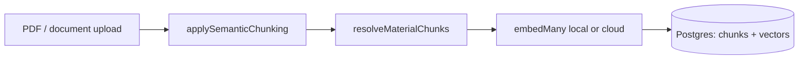
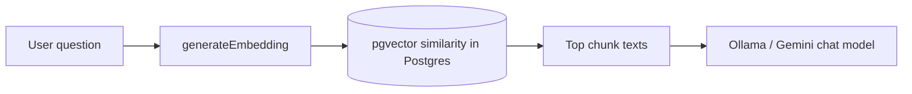

# Embeddings in EduAI

**Maintenance:** Living reference — update when `embedding.ts`, material upload, pgvector schema, or embedding env vars change.

**See also:** [Local embeddings](./LOCAL-EMBEDDINGS.md) (dimension + model decision), [Chat & RAG pipeline](./CHAT_RAG_PIPELINE.md), [Architecture guide](../ARCHITECTURE.md), [Dev server runbook](./HOW_TO_USE_DEV_SERVER.md).

This document explains **how embeddings work in our system**: what is stored where, which API keys matter, and how that differs from the keys students enter for chat models (Ollama, Gemini, etc.).

---

## The short version

EduAI RAG uses **two separate pieces**:

| Piece | What it is | Where it lives |
| ----- | ---------- | -------------- |
| **Vector library** | Chunk text + numeric vectors per course material | **Our PostgreSQL** (`material_chunks`, `material_embeddings`, pgvector) |
| **Embedding API** | Converts text → vector (list of numbers) | **Ollama (local)** or **OpenRouter / OpenAI cloud** (`apps/core/.env`) |

There is no department-wide “embeddings API” that hosts our vectors. The API key (when using cloud) pays for **conversion** only; **we** store the results in Postgres.

```text
Upload PDF  →  chunk  →  embed API (local or cloud)  →  Postgres
Student asks  →  embed (question)  →  pgvector search  →  chunk text  →  chat LLM
```

The chat model only sees **retrieved text**, not the vector database.

---

## What are embeddings?

When a professor uploads a syllabus or lecture PDF, EduAI does not feed the entire file into the chat model on every question. That would be slow, expensive, and often over the model’s context limit. Instead, we **prepare** the material ahead of time and, at question time, pull back only the **few paragraphs that are most relevant** to what the student asked. Embeddings are the mechanism that makes that “find the right paragraph” step possible.

### Turning text into numbers that capture meaning

An **embedding** is what you get when a specialized **embedding model** reads a piece of text and outputs a long list of numbers — for example, **1024** numbers in our default local setup (`mxbai-embed-large`). You can think of that list as a coordinate in a very high-dimensional space. The important property is not the numbers themselves but what they encode: **text with similar meaning ends up with similar coordinates**.

So two sentences that both discuss “office hours on Tuesdays” will produce vectors that are **close** to each other, even if they use different words. A sentence about “matrix multiplication” will be **far** from office-hour text. The model has learned this from large-scale training; we do not hand-write the rules.

EduAI never shows these numbers to students. We use them only inside the server to **rank** which stored chunks best match a question. The chat model (Ollama, Gemini, etc.) still receives normal **English text** — the actual chunk content pulled from the database.

### How that differs from keyword search

Keyword search (e.g. searching for the word “syllabus”) only finds documents that contain that exact word. A student might ask *“When is the midterm?”* without using the word “exam.” Embedding search compares **meaning**: if a chunk talks about the midterm schedule, it can still rank highly even when the question and the chunk share few words. That is why RAG in EduAI is built on vectors rather than a simple full-text search over PDFs.

### Chunks: we embed paragraphs, not whole PDFs

Course materials are usually long. Embedding the entire syllabus as one vector would blur many topics into a single point and make retrieval vague. So we **split** extracted text into **chunks**. On the upload path, `applySemanticChunking()` in `file-processing.ts` produces header-aware segments (~1500 chars) with **~80 character overlap** between consecutive chunks (via `applyChunkOverlap()`), joined with a delimiter; `processMaterialEmbeddings()` splits on that delimiter instead of re-chunking. For PDF/DOCX/PPTX plain text, the standard chunking path also splits at heuristic section boundaries (Chapter/Section/Part, numbered headings, slide markers, all-caps titles) before paragraph and sentence splits. Content that did not pass through upload (or has no delimiter) still uses overlapping sentence-based chunks (~800 chars, ~80 overlap) via `generateChunks()`. Each chunk gets its own vector. At question time we retrieve the **top few chunks** (capped in chat code), not the whole course library.

### Dimensionality (1024, 768, 3072, etc.)

**Dimensionality** is how long the number list is (e.g. 1024 floats). Higher does not automatically mean better search quality; what matters is a **good embedding model** and the **same model** for indexing and queries. After [LOCAL-EMBEDDINGS](./LOCAL-EMBEDDINGS.md), our schema is `vector(1024)` with default local model **`mxbai-embed-large`**. Switching model, provider, or dimension requires **re-embedding** — see [How to change vector dimensionality](#how-to-change-vector-dimensionality).

For the full upload → chat pipeline, see [Two lifecycles](#two-lifecycles-write-index-and-read-rag) below.

---

## Two lifecycles: write (index) and read (RAG)

### 1. Indexing — when materials are uploaded

**Trigger:** [`courses.materials.$.ts`](../../apps/core/app/routes/api/courses.materials.$.ts) calls `processMaterialEmbeddings(materialId, content)` after text is extracted.

**Steps:**

1. `processUploadedFile()` → `applySemanticChunking()` → `applyChunkOverlap()` (~80 chars) → content joined with `SEMANTIC_CHUNK_SEPARATOR`.
2. `resolveMaterialChunks(content)` in `processMaterialEmbeddings()` — splits on the separator when present, else `generateChunks()` with provider-aware chunk sizes (smaller for local Ollama).
3. `generateEmbeddings(chunks)` — `embedMany` via Ollama or cloud ([provider order](#provider-selection)).
4. Batch-insert `material_chunks` via `createManyAndReturn`, then insert `material_embeddings` (vector via raw SQL) in one transaction.
5. Material status → `READY` or `FAILED`.



**Important:** Indexing needs a working **server** embed provider at upload time. Vectors **remain in the DB** if the key is removed later, but **new** uploads and **chat retrieval** fail until a provider is configured again.

### 2. Retrieval — when chat needs course context

**Trigger:** `findRelevantContent` from [`embedding.ts`](../../apps/core/app/lib/ai/embedding.ts), called from [`chat.ts`](../../apps/core/app/routes/api/chat.ts):

| Chat path | When `findRelevantContent` runs |
| --------- | -------------------------------- |
| **Hybrid RAG** | `supportsTools: false`, course selected, keyword heuristics match — **once before** `streamText` |
| **Tool RAG** | `supportsTools: true` — only if the model calls `getInformation` |

**Steps:**

1. `generateEmbedding(userQuery)` — one embed API call for the question.
2. pgvector similarity over that course’s chunks (default threshold **0.5**), top **N** by score.
3. Chunk **text** goes to the chat model (system prompt or tool result).



---

## Credentials and environment variables

Single reference for keys and `.env` entries (avoids duplicating the same three variables in two tables).

| Name | Location | Role | Powers RAG embeddings? |
| ---- | -------- | ---- | ---------------------- |
| `EMBEDDING_PROVIDER` | `apps/core/.env` | `local` / `ollama` → Ollama; `cloud` or unset → cloud chain | **Yes** — selects path |
| `EMBEDDING_DIMENSION` | `apps/core/.env` | Expected vector length (default **1024**); must match pgvector column | **Yes** — validation |
| `OLLAMA_BASE_URL` | `apps/core/.env` | Ollama host (same as chat; cmps01 on dev server) | **Yes** (local path) |
| `OLLAMA_EMBEDDING_MODEL` | `apps/core/.env` | Local embed model (default **`mxbai-embed-large`**) | **Yes** (local path) |
| `OPENROUTER_API_KEY` | `apps/core/.env` | Cloud embed via OpenRouter (`openai/text-embedding-3-small` @ 1024 dims) | **Yes** (cloud / fallback) |
| `OPENROUTER_EMBEDDING_MODEL` | `apps/core/.env` | Override OpenRouter model id | Optional |
| `OPENROUTER_HTTP_REFERER` | `apps/core/.env` | OpenRouter ranking header; defaults to `BETTER_AUTH_URL` | Optional |
| `OPENROUTER_APP_TITLE` | `apps/core/.env` | OpenRouter `X-Title` header (default `EduAI`) | Optional |
| `OPENAI_API_KEY` | `apps/core/.env` | Direct OpenAI embed (`text-embedding-3-small`, `dimensions: 1024`) | **Yes** (cloud fallback) |
| `GOOGLE_GENERATIVE_AI_API_KEY` | `apps/core/.env` | Legacy 3072-dim Gemini path only when `EMBEDDING_DIMENSION=3072` | **Yes** (legacy) |
| `DATABASE_URL` | `apps/core/.env` | Postgres connection; vectors live here | **No** — not an embed API |
| User **chat** `apiKeys` in request body | Client / chat UI | Ollama, Gemini, etc. for **conversation** | **No** |

Template: [`apps/core/.env.example`](../../apps/core/.env.example).

### Example blocks

**Dev server (cmps01):**

```env
EMBEDDING_PROVIDER=local
EMBEDDING_DIMENSION=1024
OLLAMA_BASE_URL="http://localhost:11434/"
OLLAMA_EMBEDDING_MODEL=mxbai-embed-large
```

Pull the model once: `ollama pull mxbai-embed-large`

**Laptop without Ollama (cloud fallback):**

```env
EMBEDDING_PROVIDER=cloud
EMBEDDING_DIMENSION=1024
OPENROUTER_API_KEY=sk-or-...
# or OPENAI_API_KEY=sk-...
```

### Common misconception

> “We need the department’s embedding API key to access our vector database.”

**Correction:** The database is **ours** (`eduai-db` in local Docker; dev/prod per `DATABASE_URL`). Any valid **server** embed provider can **generate** vectors for dev, as long as indexing and search use the **same model family and dimension**. The key does not “unlock” stored vectors — Postgres does.

### Provider selection

`getCloudEmbeddingModel()` / `getLocalEmbeddingModel()` resolution in [`embedding.ts`](../../apps/core/app/lib/ai/embedding.ts) (logged as `[embedding]`):

**When `EMBEDDING_PROVIDER=local` or `ollama`:**

1. Ollama (`OLLAMA_BASE_URL` + `OLLAMA_EMBEDDING_MODEL`)
2. On failure → cloud chain (1024-dim models)

**When `EMBEDDING_PROVIDER=cloud` or unset:**

1. `OPENROUTER_API_KEY` → OpenRouter `openai/text-embedding-3-small` (1024 dims when `EMBEDDING_DIMENSION=1024`)
2. Else `OPENAI_API_KEY` → OpenAI `text-embedding-3-small` with `dimensions: 1024`
3. Legacy `EMBEDDING_DIMENSION=3072` path: OpenRouter Gemini → Google → OpenAI
4. Else → throws *No embedding provider configured*

**Do not mix providers or dimensions** on existing data without re-indexing.

**Smoke test:** from `apps/core`, run `npm run test:embedding` (loads `.env`, prints active provider and vector length).

### How to change vector dimensionality

Indexing, query embeds, and Postgres must all use the **same dimension**. Three places must agree:

| Layer | What to set |
| ----- | ----------- |
| **Postgres** | `material_embeddings.embedding` column — `vector(N)` |
| **`apps/core/.env`** | `EMBEDDING_DIMENSION=N` and matching `EMBEDDING_PROVIDER` / model vars |
| **Embedding API** | Model output length must equal `N` |

If any layer disagrees, you get errors like `expected 3072 dimensions, not 1024` during upload or re-embed.

**When you need this:** switching git branches on the shared dev server, changing embedding provider, or applying a Prisma migration that alters the pgvector column. Existing vectors are **incompatible** across dimensions — changing `N` clears old embeddings and requires **re-embed** per course. Course materials keep `rawText`.

**Coordinate on the shared dev host** (`dev.eduai.ok.ubc.ca`) before altering dimensions; everyone shares one `eduai-db` container.

#### Common configurations

| Target dimension | Typical provider | `.env` highlights |
| ---------------- | ---------------- | ----------------- |
| **1024** | Local Ollama | `EMBEDDING_PROVIDER=local`, `EMBEDDING_DIMENSION=1024`, `OLLAMA_EMBEDDING_MODEL=mxbai-embed-large` |
| **1024** | Cloud | `EMBEDDING_PROVIDER=cloud`, `EMBEDDING_DIMENSION=1024`, `OPENROUTER_API_KEY` or `OPENAI_API_KEY` |
| **3072** | Cloud (legacy Gemini) | `EMBEDDING_PROVIDER=cloud`, `EMBEDDING_DIMENSION=3072`, `OPENROUTER_API_KEY` or `GOOGLE_GENERATIVE_AI_API_KEY` |

Check the branch you checked out (e.g. `schema.prisma` → `vector(N)`) to know which row applies.

#### Procedure (dev server or local Docker DB)

From repo root on the server (path may be `/srv/www/dev.eduai.ok.ubc.ca/EduAICore` or a nested clone — use whichever contains `apps/core`):

1. **Checkout the branch** you want to test and install deps:
   ```bash
   cd /srv/www/dev.eduai.ok.ubc.ca/EduAICore
   git fetch origin && git checkout <branch> && git pull
   npm install
   cd apps/core && npx prisma generate && npx prisma migrate deploy
   ```

2. **Set `apps/core/.env`** to match the target dimension (see table above).

3. **Verify the pgvector column** — `atttypmod` must equal your target `N`:
   ```bash
   docker exec -it eduai-db psql -U postgres -d eduai -c \
     "SELECT atttypmod FROM pg_attribute WHERE attrelid = 'material_embeddings'::regclass AND attname = 'embedding';"
   ```

4. **If the column is wrong** — `prisma migrate deploy` may report “up to date” while the column was never altered. Fix manually (run SQL via `docker exec`, not as bare shell commands):
   ```bash
   docker exec -it eduai-db psql -U postgres -d eduai -c \
     "DELETE FROM material_embeddings; ALTER TABLE material_embeddings ALTER COLUMN embedding TYPE vector(<N>);"
   ```
   Replace `<N>` with `1024` or `3072`. This deletes existing vectors; `rawText` on materials is unchanged.

5. **Smoke test and re-embed** affected courses:
   ```bash
   cd apps/core
   npm run test:embedding
   npm run re-embed:course -- --list
   npm run re-embed:course -- <courseId-or-code>
   ```

6. **Restart the dev server** (tmux) so `.env` changes load.

#### Switching back

Before checking out another branch (e.g. returning the shared server to `development` for others), **repeat the procedure for that branch’s target dimension** — alter the column, update `.env`, re-embed, restart. There is no automatic down-migration for pgvector dimension in Prisma.

#### Copy into PR test plan (dev server)

```markdown
## How to change vector dimensionality (dev server)

Shared DB: coordinate in team chat. Requires SSH to `dev.eduai.ok.ubc.ca`, UBC VPN, `eduai-db` running.

1. Checkout branch → `npm install` → `cd apps/core && npx prisma generate && npx prisma migrate deploy`
2. Set `apps/core/.env` so `EMBEDDING_DIMENSION` and provider match this branch (see docs/rag-ai/EMBEDDINGS.md)
3. Verify column: `docker exec -it eduai-db psql -U postgres -d eduai -c "SELECT atttypmod FROM pg_attribute WHERE attrelid = 'material_embeddings'::regclass AND attname = 'embedding';"`
4. If wrong, manual fix: `DELETE FROM material_embeddings; ALTER TABLE material_embeddings ALTER COLUMN embedding TYPE vector(<N>);` via `docker exec`
5. `npm run test:embedding` → `npm run re-embed:course -- <courseId>` for each course under test
6. Restart tmux dev server

Before leaving the branch: repeat for the next branch’s dimension so the shared server stays consistent for others.
```

Full detail: [How to change vector dimensionality](#how-to-change-vector-dimensionality) (this section).

### Re-embed after dimension change

After changing dimension (see [How to change vector dimensionality](#how-to-change-vector-dimensionality)), re-index each course that had materials:

```bash
cd apps/core
npm run re-embed:course -- --list          # show id + code for every course
npm run re-embed:course -- "COSC 111"      # by course code
npm run re-embed:course -- <courseId>       # by internal id (cuid)
```

This clears chunks/embeddings per material, re-runs `processMaterialEmbeddings`, and sets material status to `READY` or `FAILED`.

---

## Hosting and scale

| Component | Where | Notes |
| --------- | ----- | ----- |
| **Vectors + chunk text** | Campus / project Postgres (pgvector) | See `docker-compose.dev.yml` → `eduai-db`; [DEPLOYMENT.md](../DEPLOYMENT.md) for dev/prod |
| **Embedding computation** | **Ollama on cmps01** (local) or **cloud** (laptop fallback) | Chunk text sent to provider at index + per RAG query |
| **Chat LLM** | `cmps01` Ollama (`:11434`) and/or vLLM (`:8001`, optional) and/or cloud chat APIs | Separate from embeddings; usually dominates latency. See [ARCHITECTURE.md](../ARCHITECTURE.md#cmps01-gpu-inference-host). |

**Classroom scale:** Indexing bursts at upload week (`embedMany`); during term one embed per RAG turn plus a cheap DB search; vectors written once per chunk.

---

## Database layout (RAG storage)

```text
course_materials          ← file metadata, courseId, status (PROCESSING → READY / FAILED)
    └── material_chunks   ← plain text per segment
            └── material_embeddings  ← vector(1024) per chunk
```

pgvector enabled via migration (`CREATE EXTENSION IF NOT EXISTS vector`). Prisma uses raw SQL for vector insert/search. Schema: [`schema.prisma`](../../apps/core/prisma/schema.prisma) — `MaterialChunk`, `MaterialEmbedding`.

### ANN index (#940)

`material_embeddings.embedding` has an `ivfflat` index (`vector_cosine_ops`) added by migration `20260804000000_material_embeddings_ivfflat_index`, so both retrieval paths in `findRelevantContent()` (pure vector and hybrid BM25) hit the index instead of an exact full-scan over every chunk.

| Knob | Where | Default | Notes |
| ---- | ----- | ------- | ----- |
| `lists` | Index DDL (migration, build-time only) | `100` | ivfflat's own heuristic is `rows / 1000` for tables up to ~1M rows, but the real chunk count varies per deployment and grows over time, so a dynamic value would go stale. 100 is a static default sized for tens of thousands to a few hundred thousand chunks; `REINDEX` with a new `lists` once real production counts are known. |
| `ivfflat.probes` | Runtime GUC, `RAG_IVFFLAT_PROBES` env var | `10` | How many of the `lists` clusters a query scans — higher = better recall/closer to exact search, at the cost of scanning more rows. Set per-query via `SET LOCAL` inside a `prisma.$transaction` in `findRelevantContent()` (see `resolveIvfflatProbes()` in `embedding.ts`), since it's a session-scoped setting and Prisma pools connections — a bare `$executeRaw` `SET` before a separate `$queryRaw` is not guaranteed to land on the same connection. Clamped to `[1, 100]`. |

**Why `ivfflat` and not `hnsw`:** the issue allows either. `hnsw` generally gives better recall/latency without a `lists` tuned to row count, but requires pgvector ≥ 0.5.0 and the repo's Postgres image (`pgvector/pgvector:pg16` in the `docker-compose.*.yml` files) doesn't pin an extension version in its tag. `ivfflat` has been available since pgvector 0.1.0, so it's the safe default until HNSW availability is confirmed on every environment this migration runs against (shared dev host, CI, prod).

**Why plain `CREATE INDEX` and not `CONCURRENTLY`:** no other migration in this repo uses `CONCURRENTLY`, and Prisma's `migrate deploy` runs each migration file inside a transaction, which `CONCURRENTLY` cannot run inside. On a large production table a plain `CREATE INDEX` briefly locks out writes; re-run as `CONCURRENTLY` out-of-band once `material_embeddings` is large enough for that lock window to matter.

**Verifying the index is used:** `EXPLAIN ANALYZE` the query in `findRelevantContent()` (substitute a real `courseId` and a `vector` literal) and confirm the plan shows `Index Scan using material_embeddings_embedding_ivfflat_idx` rather than `Seq Scan on material_embeddings`.

---

## Failure modes and debugging

| Symptom | Likely cause |
| ------- | ------------ |
| `No embedding provider configured` | Missing local Ollama or cloud keys in `apps/core/.env` |
| `Embedding dimension mismatch` | Column, `EMBEDDING_DIMENSION`, and model output disagree — see [How to change vector dimensionality](#how-to-change-vector-dimensionality) |
| Generic “check the university website” answers (Ollama + course) | Hybrid RAG failed embed step; fallback prompt without excerpts |
| `getInformation` → `Failed to search course materials` | Same missing/unhealthy embed provider on tool path |
| RAG runs, empty results | No indexed materials (run re-embed), similarity below 0.5, or wrong course |
| Material stuck `FAILED` | Error in `processMaterialEmbeddings` (check upload logs / `[embedding]`) |
| Local embed slow first call | Model cold-start — optional warmup (#372) |

**Verify indexing:** Upload test PDF → material `READY` → rows in `material_chunks` / `material_embeddings`.

**Verify retrieval:** Course-related question with course selected; check `[embedding]` logs before `streamText`.

---

## Code map

| Function | File | Role |
| -------- | ---- | ---- |
| `generateChunks` | `embedding.ts` | Sentence-based fallback splitter |
| `resolveMaterialChunks` | `embedding.ts` | Upload semantic chunks or fallback |
| `joinSemanticChunks` / `applyChunkOverlap` / `SEMANTIC_CHUNK_SEPARATOR` | `file-processing.ts` | Serialize semantic chunks on upload with overlap |
| `generateEmbeddings` / `generateEmbedding` | `embedding.ts` | Local or cloud embed API |
| `processMaterialEmbeddings` | `embedding.ts` | Index one material |
| `reEmbedCourseMaterials` | `embedding.ts` | Re-index all materials in a course |
| `resolveIvfflatProbes` | `embedding.ts` | Reads/clamps `RAG_IVFFLAT_PROBES` for the ANN index probes GUC (#940) |
| `findRelevantContent` | `embedding.ts` | Similarity search |
| `re-embed-course.ts` | `scripts/` | CLI wrapper for course re-embed |
| Upload handler | `courses.materials.$.ts` | Triggers indexing |
| Hybrid / tool RAG | `chat.ts` | Calls `findRelevantContent` |

---

## Related reading

- [LOCAL-EMBEDDINGS.md](./LOCAL-EMBEDDINGS.md) — dimension + model decision
- [CHAT_RAG_PIPELINE.md](./CHAT_RAG_PIPELINE.md) — `/api/chat`, hybrid vs tools
- [HOW_TO_USE_DEV_SERVER.md](./HOW_TO_USE_DEV_SERVER.md) — shared dev host, `.env`
- [DEPLOYMENT.md](../DEPLOYMENT.md) — topology, Ollama on cmps01
- [EDUAI_HELPME_ANALYSIS.md](./eduai-summer-2026/EDUAI_HELPME_ANALYSIS.md) — HelpMe local embed patterns
