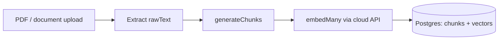
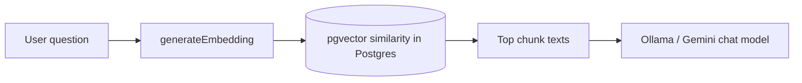

# Embeddings in EduAI

**Maintenance:** Living reference — update when `embedding.ts`, material upload, pgvector schema, or embedding env vars change.

**See also:** [Chat & RAG pipeline](./CHAT_RAG_PIPELINE.md) (when retrieval runs during `/api/chat`), [Architecture guide](../ARCHITECTURE.md) (high-level platform map), [Dev server runbook](./HOW_TO_USE_DEV_SERVER.md).

This document explains **how embeddings work in our system**: what is stored where, which API keys matter, and how that differs from the keys students enter for chat models (Ollama, Gemini, etc.).

---

## The short version

EduAI RAG uses **two separate pieces**:

| Piece | What it is | Where it lives |
| ----- | ---------- | -------------- |
| **Vector library** | Chunk text + numeric vectors per course material | **Our PostgreSQL** (`material_chunks`, `material_embeddings`, pgvector) |
| **Embedding API** | Converts text → vector (list of numbers) | **OpenRouter, Google, or OpenAI cloud** (`apps/core/.env`) — not a database login |

There is no department-wide “embeddings API” that hosts our vectors. The API key pays for **conversion** only; **we** store the results in Postgres.

```text
Upload PDF  →  chunk  →  cloud embed API  →  Postgres
Student asks  →  cloud embed (question)  →  pgvector search  →  chunk text  →  chat LLM
```

The chat model only sees **retrieved text**, not the vector database.

---

## What are embeddings?

When a professor uploads a syllabus or lecture PDF, EduAI does not feed the entire file into the chat model on every question. That would be slow, expensive, and often over the model’s context limit. Instead, we **prepare** the material ahead of time and, at question time, pull back only the **few paragraphs that are most relevant** to what the student asked. Embeddings are the mechanism that makes that “find the right paragraph” step possible.

### Turning text into numbers that capture meaning

An **embedding** is what you get when a specialized **embedding model** reads a piece of text and outputs a long list of numbers — for example, **3072** numbers in our default Gemini setup. You can think of that list as a coordinate in a very high-dimensional space. The important property is not the numbers themselves but what they encode: **text with similar meaning ends up with similar coordinates**.

So two sentences that both discuss “office hours on Tuesdays” will produce vectors that are **close** to each other, even if they use different words. A sentence about “matrix multiplication” will be **far** from office-hour text. The model has learned this from large-scale training; we do not hand-write the rules.

EduAI never shows these numbers to students. We use them only inside the server to **rank** which stored chunks best match a question. The chat model (Ollama, Gemini, etc.) still receives normal **English text** — the actual chunk content pulled from the database.

### How that differs from keyword search

Keyword search (e.g. searching for the word “syllabus”) only finds documents that contain that exact word. A student might ask *“When is the midterm?”* without using the word “exam.” Embedding search compares **meaning**: if a chunk talks about the midterm schedule, it can still rank highly even when the question and the chunk share few words. That is why RAG in EduAI is built on vectors rather than a simple full-text search over PDFs.

### Chunks: we embed paragraphs, not whole PDFs

Course materials are usually long. Embedding the entire syllabus as one vector would blur many topics into a single point and make retrieval vague. So we **split** extracted text into **chunks** — overlapping segments of roughly **800 characters** with about **80 characters** of overlap between neighbors (`generateChunks()`). Each chunk gets its own vector. At question time we retrieve the **top few chunks** (capped in chat code), not the whole course library.

### Dimensionality (3072, 768, etc.)

**Dimensionality** is how long the number list is (e.g. 3072 floats). Higher does not automatically mean better search quality; what matters is a **good embedding model** and the **same model** for indexing and queries. Our schema is `vector(3072)` for the Gemini path. Switching model or provider requires **re-embedding** all materials — see [Provider selection](#provider-selection-current-code).

For the full upload → chat pipeline, see [Two lifecycles](#two-lifecycles-write-index-and-read-rag) below.

---

## Two lifecycles: write (index) and read (RAG)

### 1. Indexing — when materials are uploaded

**Trigger:** [`courses.materials.$.ts`](../../apps/core/app/routes/api/courses.materials.$.ts) calls `processMaterialEmbeddings(materialId, content)` after text is extracted.

**Steps:**

1. `generateChunks(content)` — sentence-based chunks with overlap.
2. `generateEmbeddings(chunks)` — `embedMany` via Google or OpenAI ([provider order](#provider-selection-current-code)).
3. Insert `material_chunks` (text) + `material_embeddings` (vector via raw SQL).
4. Material status → `READY` or `FAILED`.



**Important:** Indexing needs a **server** embedding key at upload time. Vectors **remain in the DB** if the key is removed later, but **new** uploads and **chat retrieval** fail until a key is set again.

### 2. Retrieval — when chat needs course context

**Trigger:** `findRelevantContent` from [`embedding.ts`](../../apps/core/app/lib/ai/embedding.ts), called from [`chat.ts`](../../apps/core/app/routes/api/chat.ts):

| Chat path | When `findRelevantContent` runs |
| --------- | -------------------------------- |
| **Hybrid RAG** | `supportsTools: false`, course selected, keyword heuristics match — **once before** `streamText` |
| **Tool RAG** | `supportsTools: true` — only if the model calls `getInformation` |

**Steps:**

1. `generateEmbedding(userQuery)` — one cloud API call for the question.
2. pgvector similarity over that course’s chunks (default threshold **0.5**), top **N** by score.
3. Chunk **text** goes to the chat model (system prompt or tool result).



---

## Credentials and environment variables

Single reference for keys and `.env` entries (avoids duplicating the same three variables in two tables).

| Name | Location | Role | Powers RAG embeddings? |
| ---- | -------- | ---- | ---------------------- |
| `OPENROUTER_API_KEY` | `apps/core/.env` | Preferred embed provider (Gemini `gemini-embedding-001` via OpenRouter) | **Yes** (first match) |
| `GOOGLE_GENERATIVE_AI_API_KEY` | `apps/core/.env` | Direct Gemini embed (`gemini-embedding-001`) | **Yes** (if OpenRouter unset) |
| `OPENAI_API_KEY` | `apps/core/.env` | Fallback embed (`text-embedding-3-small`, 1536-dim) | **Yes** (if neither above set) |
| `OPENROUTER_EMBEDDING_MODEL` | `apps/core/.env` | Override OpenRouter model id (default `google/gemini-embedding-001`) | Optional |
| `OPENROUTER_HTTP_REFERER` | `apps/core/.env` | OpenRouter ranking header; defaults to `BETTER_AUTH_URL` | Optional |
| `OPENROUTER_APP_TITLE` | `apps/core/.env` | OpenRouter `X-Title` header (default `EduAI`) | Optional |
| `DATABASE_URL` | `apps/core/.env` | Postgres connection; vectors live here | **No** — not an embed API; app DB access |
| User **chat** `apiKeys` in request body | Client / chat UI | Ollama, Gemini, etc. for **conversation** | **No** |
| Admin `x-api-key` / Better Auth API keys | Settings / API auth | Sister apps, admin | **No** |

Template: [`apps/core/.env.example`](../../apps/core/.env.example).

### Common misconception

> “We need the department’s embedding API key to access our vector database.”

**Correction:** The database is **ours** (`eduai-db` in local Docker; dev/prod per `DATABASE_URL`). Any valid **server** OpenRouter, Google, or OpenAI key can **generate** vectors for dev, as long as indexing and search use the **same model family**. The key does not “unlock” stored vectors — Postgres does.

### Provider selection (current code)

`getEmbeddingModel()` in [`embedding.ts`](../../apps/core/app/lib/ai/embedding.ts):

1. `OPENROUTER_API_KEY` set → **OpenRouter** `google/gemini-embedding-001` (or `OPENROUTER_EMBEDDING_MODEL`)
2. Else `GOOGLE_GENERATIVE_AI_API_KEY` set → **Gemini** `gemini-embedding-001` (direct)
3. Else `OPENAI_API_KEY` set → **OpenAI** `text-embedding-3-small`
4. Else → throws *No embedding provider configured*

**Recommended for devs:** use **OpenRouter** when you already have one key for chat and embeddings — same 3072-dim Gemini model as direct Google, without a separate Google AI project key.

**Do not mix providers** on existing data without re-indexing. OpenAI fallback uses **1536** dims; Gemini/OpenRouter path uses **3072** — schema is `vector(3072)` today.

**Smoke test:** from `apps/core`, run `npm run test:embedding` (loads `.env`, prints active provider and vector length).

---

## Hosting and scale

| Component | Where | Notes |
| --------- | ----- | ----- |
| **Vectors + chunk text** | Campus / project Postgres (pgvector) | See `docker-compose.dev.yml` → `eduai-db`; [DEPLOYMENT.md](../DEPLOYMENT.md) for dev/prod |
| **Embedding computation** | **Cloud** (current code) | Chunk text sent to provider at index + per RAG query |
| **Chat LLM** | `cmps01` Ollama (`:11434`) and/or vLLM (`:8001`, optional) and/or cloud chat APIs | Separate from embeddings; usually dominates latency. See [ARCHITECTURE.md](../ARCHITECTURE.md#cmps01-gpu-inference-host). |

**Future:** Local embedding model on `cmps01` (new code path + GPU capacity). **Today:** embeddings are cloud; vectors are on-prem.

**Classroom scale:** Indexing bursts at upload week (`embedMany`); during term one embed per RAG turn plus a cheap DB search; vectors written once per chunk.

---

## Database layout (RAG storage)

```text
course_materials          ← file metadata, courseId, status (PROCESSING → READY / FAILED)
    └── material_chunks   ← plain text per segment
            └── material_embeddings  ← vector(3072) per chunk
```

pgvector enabled via migration (`CREATE EXTENSION IF NOT EXISTS vector`). Prisma uses raw SQL for vector insert/search. Schema: [`schema.prisma`](../../apps/core/prisma/schema.prisma) — `MaterialChunk`, `MaterialEmbedding`.

---

## Failure modes and debugging

| Symptom | Likely cause |
| ------- | ------------ |
| `No embedding provider configured` | Missing all embed keys (`OPENROUTER_API_KEY`, `GOOGLE_GENERATIVE_AI_API_KEY`, `OPENAI_API_KEY`) in `apps/core/.env` |
| Generic “check the university website” answers (Ollama + course) | Hybrid RAG failed embed step; fallback prompt without excerpts |
| `getInformation` → `Failed to search course materials` | Same missing embed key on tool path |
| RAG runs, empty results | No indexed materials, similarity below 0.5, or wrong course |
| Material stuck `FAILED` | Error in `processMaterialEmbeddings` (check upload logs) |

**Verify indexing:** Upload test PDF → material `READY` → rows in `material_chunks` / `material_embeddings`.

**Verify retrieval:** Course-related question with course selected; no embed errors in logs before `streamText`.

---

## Code map

| Function | File | Role |
| -------- | ---- | ---- |
| `generateChunks` | `embedding.ts` | Split material text |
| `generateEmbeddings` / `generateEmbedding` | `embedding.ts` | Cloud embed API |
| `processMaterialEmbeddings` | `embedding.ts` | Index one material |
| `findRelevantContent` | `embedding.ts` | Similarity search |
| `getEmbeddingModel` | `embedding.ts` | OpenRouter vs Gemini vs OpenAI |
| Upload handler | `courses.materials.$.ts` | Triggers indexing |
| Hybrid / tool RAG | `chat.ts` | Calls `findRelevantContent` |

---

## Related reading

- [CHAT_RAG_PIPELINE.md](./CHAT_RAG_PIPELINE.md) — `/api/chat`, hybrid vs tools
- [HOW_TO_USE_DEV_SERVER.md](./HOW_TO_USE_DEV_SERVER.md) — shared dev host, `.env`
- [DEPLOYMENT.md](../DEPLOYMENT.md) — topology, Ollama on cmps01
- [EDUAI_HELPME_ANALYSIS.md](./eduai-summer-2026/EDUAI_HELPME_ANALYSIS.md) — local embed ideas (future)
