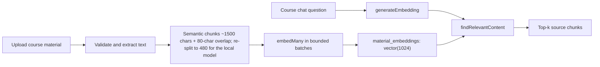

# Embeddings and vector retrieval

This document describes the current embedding and retrieval contract in
[`apps/core/app/lib/ai/embedding.ts`](../../apps/core/app/lib/ai/embedding.ts).
The server uses the same effective embedding configuration for material
ingestion and query-time retrieval. Chat-request provider keys are unrelated:
embeddings read server environment variables and optional course settings only.

## Data flow


```mermaid
flowchart LR
  U[Upload course material] --> X[Validate and extract text]
  X --> C[Semantic chunks ~1500 chars + 80-char overlap; re-split to 480 for the local model]
  C --> E[embedMany in bounded batches]
  E --> V["material_embeddings: vector(1024)"]
  Q[Course chat question] --> QE[generateEmbedding]
  QE --> S[findRelevantContent]
  V --> S
  S --> R[Top-k source chunks]
```

The upload path preserves Markdown structure, equations, and tables where the
extractor can identify them. It records `CourseMaterial`, `MaterialChunk`, and
`MaterialEmbedding` rows. Re-indexing replaces a material's vectors only after
the new embeddings have succeeded.

## Material lifecycle: storage, failure, retry, delete and re-upload

Source: `uploadMaterial`, `reclaimProvisionalRow` and `reprocessMaterial` in
[`routes/api/courses.materials.$.ts`](../../apps/core/app/routes/api/courses.materials.$.ts),
and `runMaterialExtraction`, `claimRestoreTarget` and `failMaterial` in
[`lib/materials/extraction-job.server.ts`](../../apps/core/app/lib/materials/extraction-job.server.ts).

### What is stored where

| Data | Table / column | Kept until |
| --- | --- | --- |
| Material row: title, type, size, status, failure code, uploader, `deletedAt` | `course_materials` | Hard-deleted by `purge-deleted-materials` 90 days after a soft delete |
| Raw uploaded bytes | `material_upload_blobs` | The material reaches READY, FAILED, or becomes a duplicate receipt. **The original file is not kept.** |
| Extracted text | `course_materials.rawText` | With the row; survives an embedding failure |
| Chunks and vectors | `material_chunks`, `material_embeddings` | With the row; replaced (never appended) on every re-embed |

`checksum` is first `pending:<sha256 of the file bytes>`, then becomes the hash
of the **extracted text** once extraction finalizes the row. `(courseId,
checksum)` is unique, and soft-deleted rows count, so duplicates are detected on
text content, not on file name or bytes.

### Upload

1. One write creates the row (`PROCESSING`, `pending:` checksum) and the bytes,
   and the request answers `202`. The rest runs in the background under a
   15-minute lease that a running job renews; the sweeper (every ≤5 minutes)
   resumes any row whose lease expired, from the stored bytes.
2. Extract the text, then look for another row in the course with the same text
   checksum (deleted rows included). See *Re-upload* below when one exists.
3. Otherwise finalize: real title, text checksum, `rawText`.
4. Chunk and embed with `replace: true`, mark `READY`, discard the bytes, start
   topic analysis.

### Embedding fails after the text was saved

The row becomes `FAILED` with `MATERIAL_EMBED_FAILED` (or
`MATERIAL_EMBED_RATE_LIMITED` / `MATERIAL_EMBED_PROVIDER_UNAVAILABLE` for a
transient provider error). `rawText` stays; the bytes are discarded; the error
goes to Admin → Logs with `details.materialId`. Chunks and vectors are written
in one transaction only after every embedding succeeds, so a failed first
attempt leaves none and the file is absent from chat until it recovers.
Retrieval filters on `"deletedAt" IS NULL`, not on status: a material that was
READY and then fails a re-embed keeps serving its previous vectors.

### Try again

`POST …/materials/<id>/reprocess` re-runs **only the embedding**, from the
stored `rawText`; nothing is re-read from a file. Allowed when the row is
`FAILED`, not deleted, not a duplicate receipt and has text, for instructors and
above or a TA retrying their own upload. The row is claimed with one conditional
update, so a double click starts one run. A row that failed at extraction has
no text and no bytes, so it is not offered a retry: the file must be uploaded
again.

### Delete

A delete is soft: it stamps `deletedAt` / `deletedBy` and audits
`MATERIAL_DELETED`. Text, chunks and vectors remain until the purge job, but
every retrieval query filters `"deletedAt" IS NULL`, so chat stops using the
material immediately.

### Re-upload of the same content

A new upload of content whose text checksum matches an existing row does not
add a second material:

| Existing row | Result |
| --- | --- |
| Deleted (any status), or not deleted and `FAILED` | **Restore**: the existing row is un-deleted (a deleted row also takes the new uploader), its `rawText` is set from the **new upload's** extracted text — identical by definition of the match — and it is re-embedded. |
| `READY`, not deleted | Nothing added; the upload reports "already on the course". |
| Being restored by another upload | The new upload waits for the next sweep and then reports the settled outcome. |

The new upload's own row becomes a **receipt**: `FAILED` with `duplicateOfId`
pointing at the existing row and `duplicateResolution` `RESTORED` or
`EXISTING`. A receipt for a failed restore also carries the same failure code.
The client reports the outcome and then soft-deletes the receipt, which is why
the table shows soft-deleted `pending:` rows after re-uploads.

Re-uploading the exact same **bytes** while an earlier upload of them is still
stranded or failed reclaims that row instead (`reclaimProvisionalRow`); while it
is still processing, the upload answers `409`.

### Behaviour that is intended but can surprise

- Duplicates match on extracted text, so a renamed copy of a file is the same
  material and a restore keeps the original title.
- A restore that fails leaves the previously deleted material **visible** as
  FAILED, so the failure is not hidden (#1791).
- Receipt cleanup is done by the browser. If the tab closes before the upload
  settles, the receipt stays in the list as "already on the course" until
  someone removes it.
- Try again, delete-and-re-upload and re-uploading all embed the same text, so a
  failure caused by the text itself fails the same way each time (#1931).

## Current schema and settings

`material_embeddings.embedding` is currently `vector(1024)`, with one embedding
per `MaterialChunk`. The Prisma schema intentionally represents the vector as an
unsupported database type, so the raw SQL in `embedding.ts` is part of the
contract. `material_chunks.content_tsv` supports the optional lexical side of
hybrid retrieval.

The effective settings are resolved in this order:

1. A course's non-null `embeddingProvider` / `embeddingModel` override.
2. `EMBEDDING_PROVIDER` and the corresponding environment model.
3. Provider-specific defaults.

Changing provider, model, or dimension makes existing vectors stale. Do not point
a 1024-dimensional database at a 3072-dimensional provider. The legacy 3072 path
exists only when `EMBEDDING_DIMENSION=3072` is deliberately configured; it is not
the current default and should not be introduced into a shared 1024 database.

## Provider resolution

### Local mode

Set `EMBEDDING_PROVIDER=local` (the alias `ollama` is accepted). The local model
defaults to `mxbai-embed-large`.

- If `VLLM_EMBEDDING_BASE_URL` is set, Core uses its OpenAI-compatible `/v1`
  embedding endpoint and `VLLM_EMBEDDING_MODEL` or the course model override.
  URL allowlisting and CMPS01 internal authentication are applied.
- Otherwise Core uses native Ollama through `OLLAMA_BASE_URL` and
  `OLLAMA_EMBEDDING_MODEL`.
- Local batches start at `OLLAMA_EMBED_MANY_BATCH_SIZE` (default 8, bounded
  1–32) and can split after an Ollama 400/context-size response.
- A local provider failure is terminal. It does not silently fall back to cloud,
  because mixing providers during one indexing run would make failures and
  corpus consistency difficult to reason about.

### Cloud mode

Cloud mode is the default when the provider is absent or set to `cloud`.

For the current 1024-dimensional path:

1. OpenRouter is used when it has a compatible `openai/*` model configured.
2. Direct OpenAI is used when `OPENAI_API_KEY` is available.
3. If OpenRouter is available but the configured model is not a direct OpenAI
   model id, Core uses the default `openai/text-embedding-3-small` through
   OpenRouter.

For the legacy 3072-dimensional path, resolution is OpenRouter, direct Google
Gemini, then direct OpenAI. That path must be paired with a matching database
column and is not a fallback for the 1024 path.

Cloud batches use `EMBED_MANY_BATCH_SIZE` (default 64, bounded to the provider
limit of 100). `EMBEDDING_REQUEST_TIMEOUT_MS` defaults to 30 seconds and is
bounded to 100–120,000 ms. Transient 429/503/timeout failures are retried with
jitter, up to three attempts, then fail the operation.

## Environment variables

Use [`apps/core/.env.example`](../../apps/core/.env.example) as the complete
environment reference. The RAG-relevant variables are:

| Variable | Current role |
| --- | --- |
| `EMBEDDING_PROVIDER` | `local`/`ollama` or `cloud`; defaults to cloud |
| `EMBEDDING_DIMENSION` | Expected vector size; current schema is 1024 |
| `VLLM_EMBEDDING_BASE_URL` | Optional OpenAI-compatible local embedding endpoint |
| `VLLM_EMBEDDING_MODEL` | Model served by that endpoint |
| `VLLM_API_KEY` / `CMPS01_INTERNAL_KEY` | Endpoint authentication; never commit values |
| `OLLAMA_BASE_URL` / `OLLAMA_EMBEDDING_MODEL` | Native local embedding path |
| `OPENROUTER_API_KEY` / `OPENROUTER_EMBEDDING_MODEL` | Cloud OpenRouter path |
| `OPENAI_API_KEY` | Direct OpenAI cloud path |
| `GOOGLE_GENERATIVE_AI_API_KEY` | Legacy 3072 Gemini path |
| `EMBEDDING_REQUEST_TIMEOUT_MS` | Provider-call deadline |
| `EMBED_MANY_BATCH_SIZE` | Cloud batch size |
| `OLLAMA_EMBED_MANY_BATCH_SIZE` | Local batch size |
| `MATERIAL_EMBEDDING_INSERT_BATCH_SIZE` | Max rows per vector insert, default 500 |
| `REINDEX_CONCURRENCY` | Concurrent materials during course re-embed, default 4, max 16 |
| `RAG_IVFFLAT_PROBES` | Initial ANN lists scanned, default 10, bounded 1–100 |
| `RAG_HYBRID_BM25` / `RAG_HYBRID_BM25_ALPHA` | Optional lexical reranking and vector weight |

Do not print API keys while debugging. Provider logs should identify the chosen
provider/model without exposing credentials.

## Query retrieval

`findRelevantContent(query, courseId, limit, similarityThreshold,
restrictToStudentVisible)` performs:

1. Load course-level RAG top-k and threshold overrides when present.
2. Embed the query and verify its dimension.
3. Run cosine-distance search against `material_embeddings`, joined to chunks
   and course materials.
4. Apply the similarity floor and return source title, content, and score.

The global threshold defaults to `RAG_SIMILARITY_THRESHOLD` or `0.5`. A course's
`ragTopK` and `ragSimilarityThreshold` override caller/global defaults.

When `restrictToStudentVisible` is true, retrieval additionally requires the
material to be visible, available now, published, and not excluded by Canvas.
Deleted materials are excluded for every caller. Staff paths pass the student
filter off.

### Pure vector and hybrid search

Pure vector search ranks by cosine similarity. When `RAG_HYBRID_BM25=1`, Core
builds a wider vector candidate pool, adds lexical candidates from the stored
`content_tsv`, and ranks the union using:

```text
score = cosine_similarity * RAG_HYBRID_BM25_ALPHA
      + ts_rank * (1 - RAG_HYBRID_BM25_ALPHA)
```

The alpha default is `0.7`, so vector similarity remains the dominant signal.

The IVFFlat index uses `vector_cosine_ops`. `RAG_IVFFLAT_PROBES` is applied with
`SET LOCAL` inside the same transaction as the search. On pgvector >= 0.8,
iterative relaxed scanning and a bounded `ivfflat.max_probes` help filtered
course searches find enough candidates. Older pgvector versions skip those
optional settings rather than taking retrieval down.

Query embeddings are cached in process memory. The cache key includes course,
provider, model, and normalized query; the default TTL is 90 seconds and the
default maximum is 300 entries. The cache is an optimization, not a consistency
boundary.

## Re-embedding and lease safety

From `apps/core`, the supported operator entry point is:

```bash
npm run re-embed:course -- --list
npm run re-embed:course -- <course-id-or-exact-course-code>
```

The course re-embed job uses bounded concurrency. For each material it checks an
optional `{ jobId, leaseOwner }` fence before work and before replacing vectors;
the transaction also verifies the job is still running and the lease has not
expired. This prevents an expired worker from overwriting a newer re-embed run.
Provider/model snapshots and progress are stored with the job. A failed material
does not partially replace its existing vectors.

Do not use a dimension-changing re-embed as an ad hoc fix. A dimension change
requires a coordinated database migration, matching environment, full corpus
re-embedding, and retrieval verification in a controlled environment.

## Ingestion limits and fixtures

The upload processor accepts TXT, Markdown, PDF, DOCX, PPTX, and PNG/JPEG/WebP
images. It validates the declared type and file signature, limits normal uploads
to 50 MiB (images to 10 MiB), protects ZIP containers with entry/size/total
limits, and rejects extracted text over 20 million characters. Semantic chunks
target 1,500 characters with 80-character overlap; equations are kept intact
where possible. With the local embedding model, chunks wider than its limit
(`OLLAMA_EMBED_CHUNK_SIZE`, default 480 characters) are re-split before
embedding: a dense 1,500-character chunk exceeds `mxbai-embed-large`'s 512
tokens (#1931).

Images (#1903) are transcribed once, in the background extraction job, by a
vision model (`MATERIAL_IMAGE_MODEL`, default `qwen3.8-27b-instruct`, the only
campus model with image support; `MATERIAL_IMAGE_TIMEOUT_MS`, default 60000).
The host is resolved through the fleet as a background job, since the 27B is
served by cmps02 rather than the `VLLM_BASE_URL` host; at most
`MATERIAL_IMAGE_MAX_CONCURRENT` (default 2) run per process, with
`MATERIAL_IMAGE_MAX_QUEUED` (default 16) waiting. The transcription is then
chunked and embedded like any other extracted text. Image bytes are never sent
to chat, so the chat route's rejection of image-bearing payloads (#1152) is
unchanged. Images are upload-only: the Canvas importer skips them.

A host problem (no healthy fleet host, a timeout, a dropped connection, 429 or
5xx) or a full queue throws `ExtractionBusyError`, so the material is released
for a later sweep (`MATERIAL_EXTRACT_BUSY`) within its attempt budget, the same
path as a busy PDF worker. Only an empty transcription, a 4xx from the host or a
configuration error fails the material (`MATERIAL_EXTRACT_FAILED`).

The committed ingestion fixtures are under [`fixtures/`](./fixtures/). The
repeatable script and its current known limitation are documented in
[`TESTING.md`](./TESTING.md).

## Code map

| Concern | File |
| --- | --- |
| Provider resolution, embedding, retrieval, re-embedding | [`apps/core/app/lib/ai/embedding.ts`](../../apps/core/app/lib/ai/embedding.ts) |
| Provider/model setting resolution | [`apps/core/app/lib/ai/embedding-config.ts`](../../apps/core/app/lib/ai/embedding-config.ts) |
| Extraction, sanitization, chunking, upload limits | [`apps/core/app/lib/ai/file-processing.ts`](../../apps/core/app/lib/ai/file-processing.ts) |
| Vector schema | [`apps/core/prisma/schema.prisma`](../../apps/core/prisma/schema.prisma) |
| Vector/index migrations | [`apps/core/prisma/migrations/`](../../apps/core/prisma/migrations/) |
| Embedding smoke test | [`apps/core/scripts/test-embedding.ts`](../../apps/core/scripts/test-embedding.ts) |
| Course re-embed command | [`apps/core/scripts/re-embed-course.ts`](../../apps/core/scripts/re-embed-course.ts) |
