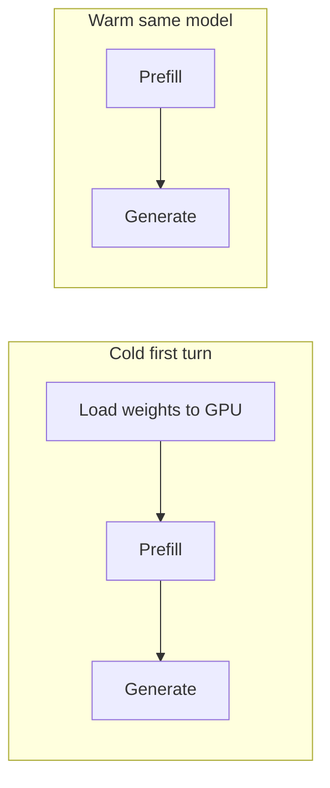

# Cold start, warm models, and latency in EduAI

**Maintenance:** Living reference — update when Ollama deployment, Auto routing tier pool, or warmup scripts change.

**Audience:** Developers and infra working on chat latency ([#203](https://github.com/EduAI-Lab/EduAI/issues/203)), Auto routing ([#197](https://github.com/EduAI-Lab/EduAI/issues/197)), or dev-server behaviour.

**See also:** [`MODEL_LATENCY_TRACKER.md`](./MODEL_LATENCY_TRACKER.md) (how to log cold/warm rows), [`eduai-summer-2026/TEAM_CHAT_LATENCY_SPRINT_GUIDE.md`](./eduai-summer-2026/TEAM_CHAT_LATENCY_SPRINT_GUIDE.md) (step **L05**), [`../routing/eduai-summer-2026/TEAM_ROUTING_LAYER_PLAN.md`](../routing/eduai-summer-2026/TEAM_ROUTING_LAYER_PLAN.md) (tier pool), [`../HOW_TO_USE_DEV_SERVER.md`](../HOW_TO_USE_DEV_SERVER.md) (s378 + cmps01).

---

## The short version

**Cold start** means the inference server must **load a model’s weights from disk into GPU memory** (and set up the runtime) before it can generate the first token. That one-time cost is often **many seconds** for local models — much larger than embedding search or a warm repeat request.

**Warm** means that **same model is already resident in GPU RAM** from a recent request. The next turn skips (most of) the load step, so **time-to-first-token (TTFT)** and total time drop sharply.

On EduAI, chat goes to **Ollama on cmps01** (`OLLAMA_BASE_URL`). **Auto routing** can pick different Ollama models per turn (`llama3.2:latest`, `deepseek-r1:8b`, `gemma4:31b`, …). Each switch can trigger a **new cold load** if the previous model was evicted to free VRAM.

---

## What happens on one chat turn

Latency is not a single number. For a typical `/api/chat` request to a **local** model, wall-clock time is roughly:

```text
Total ≈ (optional RAG embed + pgvector) + (model load if cold) + (prefill) + (generation)
```

| Phase | What it is | Typical scale (local) | EduAI notes |
| ----- | ---------- | --------------------- | ----------- |
| **RAG retrieval** | OpenRouter/Google embed of the question + pgvector search | ~0.5–1.5 s | Runs for course questions; **independent** of Ollama cold start. See [`../EMBEDDINGS.md`](../EMBEDDINGS.md). |
| **Model load (cold)** | Read weights from disk → GPU; allocate KV cache | **~5–60+ s** (model + GPU dependent) | Dominates “first request after reboot” or **first use of that model** after another model took the GPU. |
| **Prefill** | Process prompt + system + RAG context | Grows with context length | Large RAG injection increases this even when warm. |
| **Generation** | Decode output tokens | Grows with answer length | Non-streaming benches wait for **all** tokens (worst perceived delay). |

**Cloud models** (e.g. `google:gemini-2.5-flash`) usually do **not** show EduAI-scale cold start on our app server — their weights live on Google’s side. Latency there is mostly network + queue + generation. That is why [`MODEL_LATENCY_TRACKER.md`](./MODEL_LATENCY_TRACKER.md) treats “global” and Ollama separately.



---

## Cold vs warm — definitions

| Term | Meaning | How to recognize in testing |
| ---- | ------- | --------------------------- |
| **Cold** | First request to that **model id** after Ollama restart, GPU eviction, or long idle | First bench row ~10–12 s; first student message after deploy feels “stuck” |
| **Warm** | Same `provider:modelId` used again while still loaded | Second request same model often **much** faster (e.g. 2 s vs 11 s on small models) |
| **Model switch** | Auto routes to a **different** registry id | e.g. `llama3.2:latest` then `deepseek-r1:8b` — second model may cold-load even if first was warm |

Always tag rows in the latency ledger with **`cold` / `warm`** ([`MODEL_LATENCY_TRACKER.md`](./MODEL_LATENCY_TRACKER.md)). Comparing numbers without that tag is misleading.

---

## Why this matters for EduAI specifically

### 1. Remote Ollama (cmps01)

The web app on **dev.eduai.ok.ubc.ca** (s378) calls Ollama over the network. Network RTT is usually **small** compared to **GPU load + generation**. When users report “40–50 s” or “10 s before anything happens,” investigate **model load and output length**, not React or Postgres first.

### 2. Auto routing multiplies models

Phase 1 routing intentionally picks **tiered** models for sustainability:

| Tier (current plan) | Example | Role |
| ------------------- | ------- | ---- |
| 1 (~1–3B) | `ollama:llama3.2:latest` | Short factual, strong RAG |
| 2 (~8B) | `ollama:deepseek-r1:8b` | Default / long RAG |
| 3 (~31B) | `ollama:gemma4:31b` | Tool-calling / hard (manual or rare Auto) |

A single study session can **rotate models**. Each rotation is a candidate cold start unless those weights stay resident.

### 3. VRAM limits and eviction

Ollama keeps only so many models in GPU memory. If **gemma4:31b**, **deepseek-r1:8b**, and **llama3.2** are all pulled, the server may **unload** one to load another. Routing that alternates tiers feels like repeated cold starts even on a “warm” afternoon.

### 4. Bench vs UI

[`apps/core/scripts/routing-rag-bench.ts`](../../../apps/core/scripts/routing-rag-bench.ts) uses **non-streaming** HTTP and reports **total** time. That is valid for regression testing but **overstates** perceived latency vs streaming UI, where TTFT matters more.

**Example from a successful dev bench (2026-05-25, COSC 315):**

| Scenario | Model | HTTP total | Interpretation |
| -------- | ----- | ---------- | -------------- |
| S1 short factual | `llama3.2:latest` | ~11.3 s | Likely cold or heavy generation |
| C1 course policy (same small model) | `llama3.2:latest` | ~1.9 s | Same model **warm** + shorter answer |
| S2 default | `deepseek-r1:8b` | ~11.8 s | **Different** model → likely cold load for 8B |

Same routing logic, very different totals — cold/warm and **answer length** explain most of the gap.

---

## What cold start is *not*

| Misattribution | Reality |
| -------------- | ------- |
| “Postgres is slow” | RAG search was ~0.6–0.8 s in bench; not the 10 s problem |
| “Routing is broken” | Router + `X-Routed-Model` matched expected model when Ollama was registered |
| “Embeddings failed” | OpenRouter path returned 6 chunks; separate from LLM load |
| “Empty `apiKeys`” | Causes **no Ollama provider** (`NoSuchProviderError`), not cold start — fix registry, not GPU |

---

## How to measure

### In the UI (preferred for product)

1. **TTFT** — time from Send to **first visible character** (streaming on).
2. **Total** — until the stream ends.
3. Note **model** (“answered by …”) and **course** selected.
4. Note **cold** if first message after deploy or first time that model appears in the session.

Browser: Network tab → `POST /api/chat` → “Waiting for server response” approximates server + provider work before bytes arrive.

### With scripts (repeatable)

| Script | Command | What it measures |
| ------ | ------- | ---------------- |
| Routing + RAG + chat | `npm run bench:routing-rag` | Expected vs actual model, RAG ms, HTTP total, CSV export |
| Chat latency | `CHAT_BENCH_WARMUP=1 npm run bench:chat-latency` | Extra warmup request before timed rows |
| Router only (no LLM) | `npm run smoke:routing` | Rules + DB tiers only |

Set `CHAT_BENCH_WARMUP=1` to avoid classifying the **first** timed row as cold when you care about steady-state latency.

### In telemetry (future / research)

`AIInteraction.durationMs` is **end-to-end** for the turn. It does not yet split load vs generate. For Phase 2, consider logging **model id changes** per session to correlate “first use of model X” with duration spikes.

---

## Mitigations (practical)

### Ops — keep the right models warm (highest leverage)

On **cmps01** (Ollama host):

1. **Choose 1–2 models** that must stay hot for dev/demo (e.g. `llama3.2:latest` + `deepseek-r1:8b`).
2. **Do not expect** 31B + 120B + 8B + 3B all resident — plan for eviction.
3. After Ollama or GPU reboot, **warm manually**:

   ```bash
   ollama run llama3.2:latest
   # In another session or after exit, send a tiny generate via API
   curl http://localhost:11434/api/generate -d '{"model":"llama3.2:latest","prompt":"hi","stream":false}'
   ```

4. Use Ollama **`keep_alive`** on generate requests where supported so idle timeouts do not unload weights between classes.

Document baseline GPU model and who restarts Ollama in your team runbook.

### Routing / product — fewer surprise loads

| Approach | Latency | Sustainability |
| -------- | ------- | -------------- |
| Keep **31B / 120B** manual-only (`tier = null`) | Fewer huge loads | Auto stays green |
| Limit Auto pool to models you can keep warm | Predictable | Good |
| **Session stickiness** (same model for a chat) | Better | Less routing benefit |
| Route “hard” prompts to **cloud** Tier 2 | Avoids local 31B load | Different carbon story |

Align tier seeds in [`apps/core/prisma/seed.ts`](../../../apps/core/prisma/seed.ts) with what cmps01 can actually keep loaded.

### App — warmup and UX

| Idea | Status / notes |
| ---- | -------------- |
| **Startup warmup** — tiny POST to each default Ollama tier on server boot | Proposed; not required in MVP |
| **Stream all chat** | Improves perceived latency even when load is slow |
| **“Loading model…”** state | After model resolved, before first token |
| **Warm on course select** | Optional ping when course + Auto selected |

Embedding warmup (if present) does **not** warm chat LLMs.

### Engineering — registry

Ensure server `.env` has `OLLAMA_BASE_URL` and that empty client `apiKeys` still registers Ollama ([`apps/core/app/lib/ai/providers.ts`](../../../apps/core/app/lib/ai/providers.ts)). Otherwise you get errors, not cold start.

---

## Checklist for investigating a slow turn

1. Which **`modelUsed` / `X-Routed-Model`**? Local vs cloud?
2. **First time** that model in this session or after restart? → suspect cold.
3. **Course + RAG**? Add ~0.5–1 s embed search, not 10 s alone.
4. **Streaming or not?** Total 11 s with TTFT 2 s feels very different to users.
5. **Ollama logs / `ollama ps`** on cmps01 — which models are loaded?
6. **Answer length** — 700-word reply dominates total even when warm.

---

## Related GitHub / sprint items

| Item | Link |
| ---- | ---- |
| Latency sprint parent | [#203](https://github.com/EduAI-Lab/EduAI/issues/203) |
| Ollama warm-up step | [#209](https://github.com/EduAI-Lab/EduAI/issues/209) (L05 in sprint guide) |
| Routing parent | [#197](https://github.com/EduAI-Lab/EduAI/issues/197) |

---

## Summary

**Cold start** is the one-time cost of loading a local LLM into GPU memory. **Warm** requests reuse that memory and are much faster. EduAI’s combination of **remote Ollama**, **Auto tier switching**, and **large local models** makes cold start a first-class latency concern — separate from RAG embeddings and separate from cloud API latency. Measure with **cold/warm tags and TTFT**, keep a small set of models hot on cmps01, and align routing tiers with what the GPU can sustain.

---

*Last updated: 2026-05-25 — written from dev bench observations and latency sprint context.*
