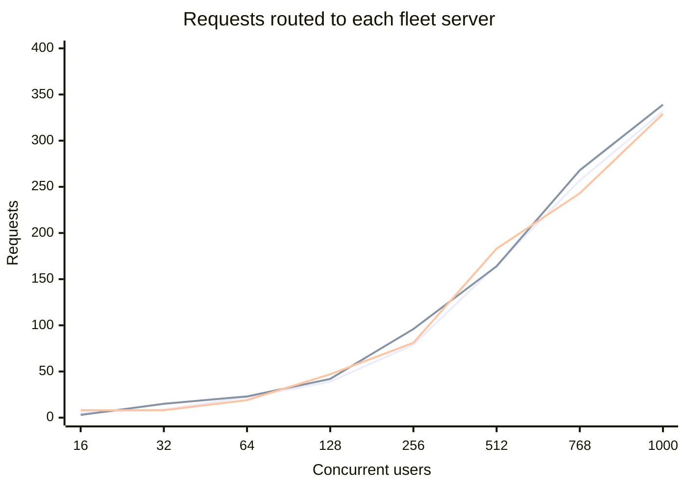
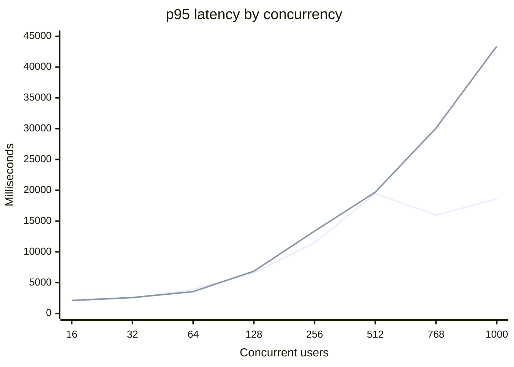
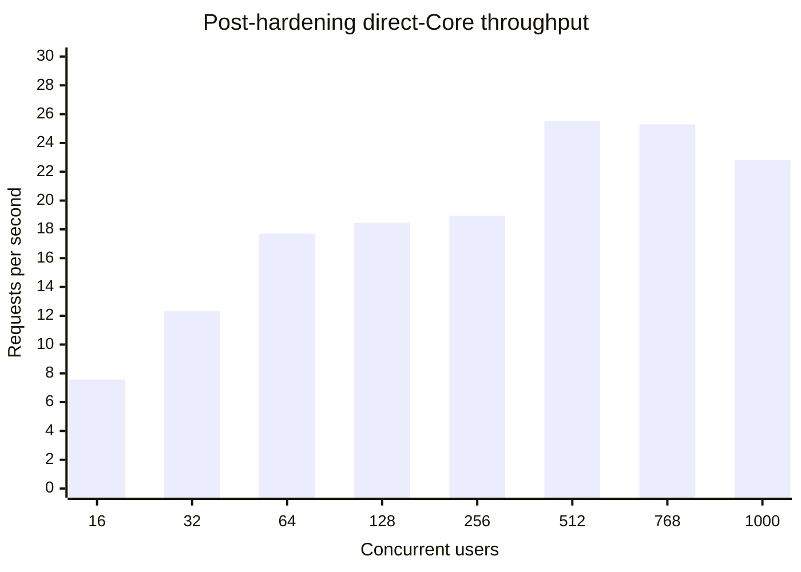
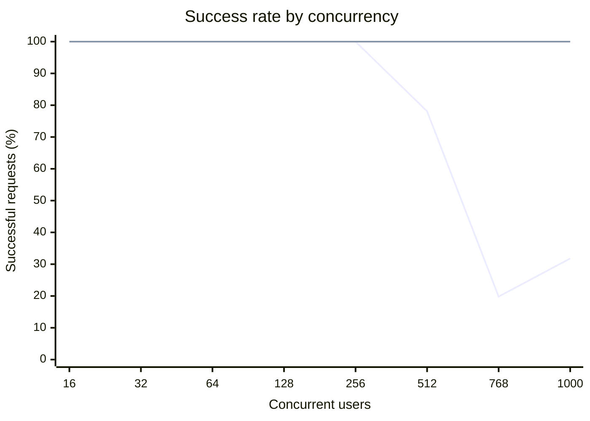
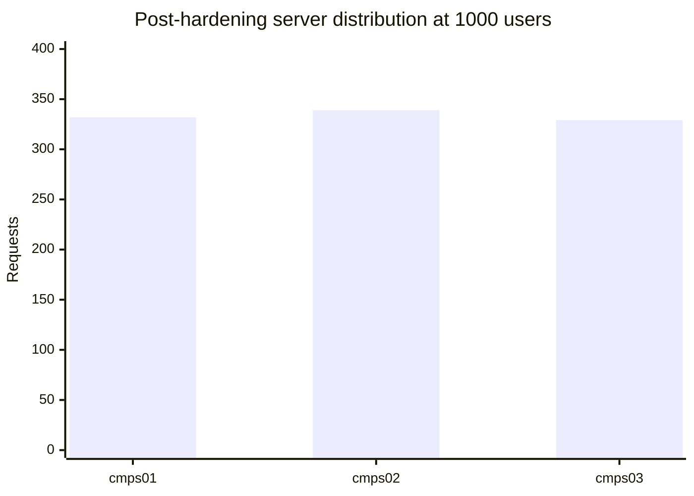

# EduAI Fleet Router: Consolidated Stress-Test Report

**Test date:** August 18–19, 2026 UTC  
**Environment:** `https://dev.eduai.ok.ubc.ca`, with direct-Core control runs on s378  
**Models:** Qwen 3.5 2B and Qwen 3.5 9B, split evenly across requests  
**Related work:** [Issue #893](https://github.com/EduAI-Lab/EduAI/issues/893), [router hardening issue #1581](https://github.com/EduAI-Lab/EduAI/issues/1581), [implementation PR #1582](https://github.com/EduAI-Lab/EduAI/pull/1582)

## Executive conclusion

The fleet router and Core application successfully sustained the complete 16-to-1000 concurrency ladder when tested directly against Core on s378: all 2,776 requests returned HTTP 200, including 1,000/1,000 at the maximum level. The public webapp path was healthy through 256 concurrent users, but higher levels exposed reverse-proxy failures and cumulative per-user rate-limit interference; those results describe the public ingress ceiling rather than a vLLM fleet failure. The router hardening improved repeat-turn locality through deterministic chat affinity and added failed-host ejection, while conversation correctness continued to rely on Core persistence rather than server-local memory. The fleet is promising for production deployment, but production readiness still depends on separately sizing the public proxy, admission policy, rate limits, and shared observability for real multi-process traffic.

## Results at a glance

| Measure | Baseline public path | Post-hardening direct Core path |
|---|---:|---:|
| Maximum tested concurrency | 1,000 attempted | 1,000 |
| Maximum-level success | 318/1,000* | **1,000/1,000** |
| Maximum-level p50 latency | Not interpretable* | 35.0 seconds |
| Maximum-level p95 latency | Not interpretable* | 43.4 seconds |
| Maximum-level throughput | Not interpretable* | 22.81 RPS |
| Model split | 50% 2B / 50% 9B | 50% 2B / 50% 9B |
| Context smoke | Same `chatId`; follow-up moved servers | Same `chatId`; follow-up stayed affinity-local |

\* The public ladder reused one authenticated user with the original rate-limit window, and the ingress proxy began returning 502/fetch failures. These points are retained as public-path evidence but should not be used as fleet-capacity measurements.

## 1. Qwen 3.5 2B/9B Chat API scaling summary

The controlled Chat API run used an even model split at every level: half of the requests selected `qwen3.5-2b-instruct` and half selected `qwen3.5-9b-instruct`. Both model groups remained available across cmps01, cmps02, and cmps03, and all requests completed successfully through 1,000 concurrent users.

| Concurrent users | 2B requests | 9B requests | cmps01 | cmps02 | cmps03 | Success | p95 latency | Throughput |
|---:|---:|---:|---:|---:|---:|---:|---:|---:|
| 16 | 8 | 8 | 5 | 3 | 8 | 16/16 | 2.11 s | 7.57 RPS |
| 32 | 16 | 16 | 9 | 15 | 8 | 32/32 | 2.59 s | 12.31 RPS |
| 64 | 32 | 32 | 22 | 23 | 19 | 64/64 | 3.54 s | 17.70 RPS |
| 128 | 64 | 64 | 39 | 42 | 47 | 128/128 | 6.86 s | 18.44 RPS |
| 256 | 128 | 128 | 79 | 96 | 81 | 256/256 | 13.37 s | 18.94 RPS |
| 512 | 256 | 256 | 165 | 164 | 183 | 512/512 | 19.70 s | 25.51 RPS |
| 768 | 384 | 384 | 257 | 268 | 243 | 768/768 | 30.09 s | 25.29 RPS |
| 1,000 | 500 | 500 | 332 | 339 | 329 | 1,000/1,000 | 43.39 s | 22.81 RPS |

### What the split demonstrated

- **Capacity:** the 2B/9B split sustained the entire controlled ladder with no Chat API failures, including 1,000 concurrent requests.
- **Model balance:** the scheduler maintained an exact 50/50 request split, so neither model tier was starved by the other.
- **Fleet balance:** at 1,000 users, cmps01 handled 33.2%, cmps02 33.9%, and cmps03 32.9% of requests. The largest observed skew at high load was modest: cmps03 handled 35.7% at 512 users.
- **Scaling shape:** throughput peaked at 25.51 RPS at 512 users and then flattened/slipped to 22.81 RPS at 1,000, while p95 latency rose to 43.39 seconds. This indicates queueing/compute saturation as concurrency increases, not a routing or server-failure problem.
- **Interpretation:** the split is operationally balanced and resilient in the direct-Core test, but 1,000 concurrent users is not a low-latency target. It is a stress ceiling: the fleet completed the work, but users would experience substantial waiting at the upper levels.

**Series order:** cmps01, cmps02, cmps03. The near-overlap at higher concurrency shows that the fleet router was sharing Chat API work rather than concentrating it on one server.

## 2. Post-hardening validation result

The router improvements were deployed temporarily to the development Core service and tested before the environment was restored. The hardened router completed every direct-Core ladder level successfully:

| Level | Result | p50 | p95 | RPS |
|---:|---:|---:|---:|---:|
| 16 | 16/16 HTTP 200 | 1.33 s | 2.11 s | 7.57 |
| 32 | 32/32 HTTP 200 | 1.80 s | 2.59 s | 12.31 |
| 64 | 64/64 HTTP 200 | 3.13 s | 3.54 s | 17.70 |
| 128 | 128/128 HTTP 200 | 4.99 s | 6.86 s | 18.44 |
| 256 | 256/256 HTTP 200 | 9.77 s | 13.37 s | 18.94 |
| 512 | 512/512 HTTP 200 | 17.45 s | 19.70 s | 25.51 |
| 768 | 768/768 HTTP 200 | 26.51 s | 30.09 s | 25.29 |
| 1,000 | **1,000/1,000 HTTP 200** | 35.04 s | 43.39 s | 22.81 |

The post-change authenticated smoke test also confirmed that the follow-up reused the same `chatId`, retained the RAG citation, and stayed on the same fleet server through deterministic affinity. The direct-Core ladder bypassed the public reverse proxy to isolate router and application capacity. A separate post-change public smoke succeeded and returned the expected `chatId`, citation/RAG metadata, and `X-Fleet-Server`; the broader public ladder was not repeated because its earlier high-concurrency results were confounded by ingress 502s and cumulative rate limiting.

## 3. Latency and throughput

The controlled direct-Core run completed every level successfully. Latency rises predictably as concurrency increases, while throughput reaches approximately 25 RPS around 512–768 concurrent requests and remains 22.8 RPS at 1,000.

### p95 latency by concurrency

The baseline series is shown for context only. It is **not** a valid latency A/B comparison: the baseline used the public reverse-proxy path, while the post-hardening ladder used direct Core on s378 to isolate router/application capacity. The hardening changes target routing locality and failure recovery, not token generation speed, so a large p95 reduction was not expected from this change alone.

**Series order:** baseline public path, post-hardening direct Core path. At 512 and above, the values are especially non-comparable because the baseline includes proxy failures, HTTP 502 responses, fetch failures, and rate limiting.

### Why p95 did not materially improve

The test exercised generation capacity more than routing overhead. Once concurrency increased, most elapsed time was spent waiting for model execution and admission/queue capacity; selecting a different healthy server does not make Qwen generation itself faster. In addition, the failure-ejection path had no opportunity to reduce latency because no vLLM host failed during the controlled run, and affinity was validated primarily through the follow-up smoke rather than repeated-turn latency measurement.

The small low-load differences are normal run-to-run variance: post-hardening p95 was 2.11 seconds at 16 users versus 2.24 seconds baseline, 3.54 versus 3.89 seconds at 64, and 13.37 versus 11.48 seconds at 256. These differences should not be interpreted as a regression or improvement without a same-path A/B rerun with warm models, isolated rate-limit buckets, and identical traffic.

### Direct-Core throughput

| Concurrent users | Success rate | p50 latency | p95 latency | Throughput |
|---:|---:|---:|---:|---:|
| 16 | 100% | 1.33 s | 2.11 s | 7.57 RPS |
| 32 | 100% | 1.80 s | 2.59 s | 12.31 RPS |
| 64 | 100% | 3.13 s | 3.54 s | 17.70 RPS |
| 128 | 100% | 4.99 s | 6.86 s | 18.44 RPS |
| 256 | 100% | 9.77 s | 13.37 s | 18.94 RPS |
| 512 | 100% | 17.45 s | 19.70 s | 25.51 RPS |
| 768 | 100% | 26.51 s | 30.09 s | 25.29 RPS |
| 1,000 | 100% | 35.04 s | 43.39 s | 22.81 RPS |

## 4. Success rate

**Series order:** baseline public path, post-hardening direct Core path. The direct-Core result is the important fleet/router capacity signal: no request failures were observed through 1,000 concurrent users.

## 5. Fleet distribution

At concurrency 1,000, the post-hardening direct run distributed requests almost evenly across the three servers:

The 2B/9B split was exactly balanced: 500 requests per model at the 1,000-user level. This indicates that model-aware eligibility and round-robin distribution were functioning as intended during the controlled run.

## 6. RAG and context validation

The authenticated smoke test verified:

- HTTP 200 on the first RAG turn and the follow-up;
- a stable `chatId` across both turns;
- a retrieved RAG chunk and similarity score;
- a response containing the fixture citation;
- an `X-Fleet-Server` response header;
- context continuity when the follow-up was routed to another server in the baseline run;
- affinity-local follow-up routing after the hardening change.

The important architectural result is that context correctness does not depend on a user remaining on one inference server. Core persists messages and reconstructs the conversation context. Affinity is still valuable because it can improve prefix/KV-cache locality and reduce unnecessary cross-host movement.

## 7. What changed in the router

The hardening work added:

1. Deterministic chat affinity using a stable chat/user key, while retaining round-robin for requests without affinity.
2. Bounded host ejection after an inference failure, preventing immediate reuse of a failed server while preserving alternate-host retry.
3. Configurable health-cache TTL, health-check timeout, and failure-ejection duration with bounded defaults.
4. RAG duration metadata in response JSON and headers for future per-request latency analysis.
5. Unit coverage for affinity and host ejection, plus a repeatable authenticated RAG stress harness.

## 8. Public-path bottleneck

The public baseline was healthy through 256 concurrent users. At 512, the test recorded 108 fetch failures and 4 HTTP 502 responses. At 768 and 1,000, the result was further distorted by the original `CHAT_RATE_LIMIT=20` window being reused across the same authenticated user and across ladder levels.

The next production-sizing exercise should test the public ingress independently with:

- a rate-limit budget aligned to the intended user population;
- fresh rate-limit buckets per level or an explicit reset between levels;
- proxy connection and upstream timeout metrics;
- concurrent real-user sessions rather than one shared identity;
- separate Core, proxy, Redis, database, and vLLM dashboards.

## 9. Supporting systems

The post-run snapshot showed:

- Redis: `rejected_connections=0`, `evicted_keys=0`, 6,366 keyspace hits, 25 misses;
- `eduai-redis`: approximately 15 MiB container memory;
- `eduai-db`: approximately 117 MiB container memory;
- no per-request DB query timing or GPU telemetry was emitted by the original harness.

These observations are useful health checks, but not a substitute for time-series capacity metrics.

## 10. Restoration and evidence

After testing, cmps02 GPU1 was restored to `Qwen/Qwen2.5-32B-Instruct-AWQ` served as `qwen2.5-32b-instruct`. Core was restored to its original `AI_MAX_INFLIGHT=8` and `CHAT_RATE_LIMIT=20` configuration. The temporary RAG course, model settings, cookies, and host-side test files were removed. Core was rebuilt and the public endpoint returned HTTP 200.

Raw machine-readable evidence is available in [`artifacts/`](./artifacts/), and the detailed test log is [FLEET_ROUTER_STRESS_2026-08-18.md](./FLEET_ROUTER_STRESS_2026-08-18.md).

## 11. Overall assessment

**Fleet/router capacity:** strong in the controlled direct-Core test through 1,000 concurrent requests.  
**Public production readiness:** not yet fully demonstrated; ingress, admission, rate-limit, and observability limits need independent sizing.  
**Context continuity:** correct through Core persistence; affinity improves locality but is not the source of truth.  
**Recommended next step:** run a proxy-inclusive test with corrected rate-limit isolation and instrumented DB, Redis, GPU, proxy, and vLLM metrics before production sign-off.
