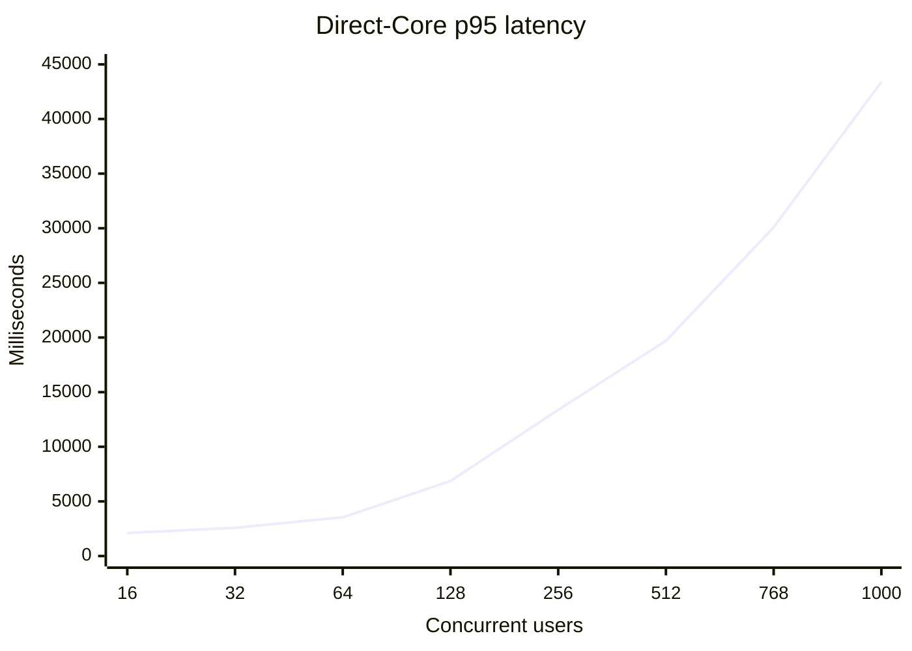
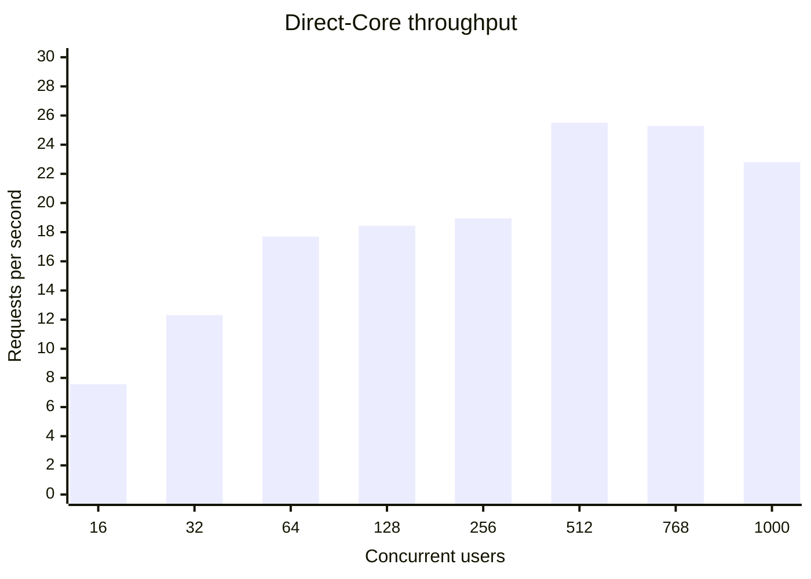
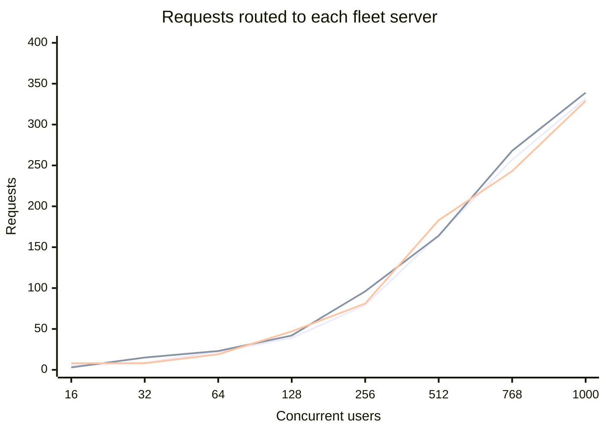
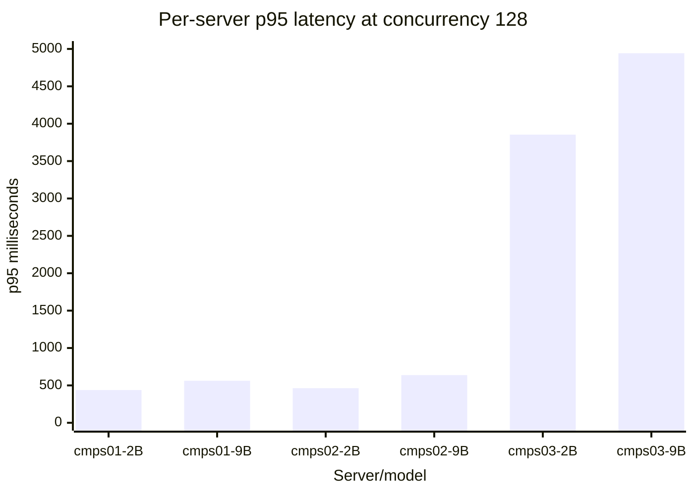

# EduAI Fleet Router — Data Report

**Test period:** August 18–19, 2026 UTC
**Environment:** `https://dev.eduai.ok.ubc.ca` plus direct Core on s378
**Models:** `qwen3.5-2b-instruct` and `qwen3.5-9b-instruct`
**Raw artifacts:** [`artifacts/`](./artifacts/)

## Test configuration

| Run | Request path | Purpose |
|---|---|---|
| Baseline | Public `https://dev.eduai.ok.ubc.ca` | Measure the existing webapp path |
| Post-hardening | Core at `127.0.0.1:3000` on s378 | Isolate Chat API/router capacity from the public proxy |
| Post-hardening smoke | Public `https://dev.eduai.ok.ubc.ca` | Confirm the webapp path still returns expected metadata |

Ladder: **16, 32, 64, 128, 256, 512, 768, 1,000** concurrent requests. Requests alternated evenly between the 2B and 9B models.

## Baseline public-path data

| Users | Successes | p50 ms | p95 ms | RPS | HTTP 429 | HTTP 502 | Fetch failures |
|---:|---:|---:|---:|---:|---:|---:|---:|
| 16 | 16/16 | 1,569 | 2,240 | 7.12 | 0 | 0 | 0 |
| 32 | 32/32 | 1,721 | 2,477 | 12.79 | 0 | 0 | 0 |
| 64 | 64/64 | 2,711 | 3,888 | 15.52 | 0 | 0 | 0 |
| 128 | 128/128 | 5,254 | 6,616 | 19.02 | 0 | 0 | 0 |
| 256 | 256/256 | 8,796 | 11,475 | 22.19 | 0 | 0 | 0 |
| 512 | 400/512 | 15,624 | 19,469 | 20.28 | 0 | 4 | 108 |
| 768 | 152/768 | 8,345 | 15,950 | 9.32 | 480 | 136 | 0 |
| 1,000 | 318/1,000 | 12,944 | 18,610 | 16.75 | 288 | 2 | 392 |

At 768 and 1,000 users, the same authenticated user had accumulated requests across ladder levels, so the original rate-limit window affected the result. The 512+ public values are therefore ingress observations, not isolated fleet-capacity measurements.

## Post-hardening direct-Core data

| Users | Successes | 2B | 9B | cmps01 | cmps02 | cmps03 | p50 ms | p95 ms | RPS |
|---:|---:|---:|---:|---:|---:|---:|---:|---:|---:|
| 16 | 16/16 | 8 | 8 | 5 | 3 | 8 | 1,326 | 2,106 | 7.57 |
| 32 | 32/32 | 16 | 16 | 9 | 15 | 8 | 1,802 | 2,586 | 12.31 |
| 64 | 64/64 | 32 | 32 | 22 | 23 | 19 | 3,132 | 3,543 | 17.70 |
| 128 | 128/128 | 64 | 64 | 39 | 42 | 47 | 4,990 | 6,861 | 18.44 |
| 256 | 256/256 | 128 | 128 | 79 | 96 | 81 | 9,772 | 13,373 | 18.94 |
| 512 | 512/512 | 256 | 256 | 165 | 164 | 183 | 17,451 | 19,699 | 25.51 |
| 768 | 768/768 | 384 | 384 | 257 | 268 | 243 | 26,513 | 30,089 | 25.29 |
| 1,000 | 1,000/1,000 | 500 | 500 | 332 | 339 | 329 | 35,036 | 43,394 | 22.81 |

## Graphs

### Direct-Core p95 latency

### Direct-Core throughput

### Fleet-server distribution

**Series order:** cmps01, cmps02, cmps03.

## Per-server cmps data

All three servers completed the independent 2B/9B direct-vLLM ladder through concurrency 128 with zero request errors. Values below are the endpoint results at the highest common per-server step.

| Server | Model | Requests at concurrency 128 | RPS | p50 ms | p95 ms | p99 ms | Errors |
|---|---|---:|---:|---:|---:|---:|---:|
| cmps01 | Qwen 3.5 2B | 256 | 368.88 | 250 | 438 | 445 | 0 |
| cmps01 | Qwen 3.5 9B | 256 | 250.98 | 440 | 562 | 569 | 0 |
| cmps02 | Qwen 3.5 2B | 256 | 306.59 | 352 | 463 | 488 | 0 |
| cmps02 | Qwen 3.5 9B | 256 | 225.75 | 425 | 638 | 649 | 0 |
| cmps03 | Qwen 3.5 2B | 256 | 59.07 | 1,959 | 3,854 | 3,881 | 0 |
| cmps03 | Qwen 3.5 9B | 256 | 41.01 | 2,879 | 4,943 | 4,971 | 0 |

The extended native-vLLM 1,000-request runs were completed on cmps01 and cmps03 before cmps02 was restored:

| Server | Model | Successes | RPS | TTFT p95 ms | E2E p95 ms |
|---|---|---:|---:|---:|---:|
| cmps01 | Qwen 3.5 2B | 1,000/1,000 | 73.34 | 12,054 | 13,482 |
| cmps01 | Qwen 3.5 9B | 1,000/1,000 | 17.48 | 51,644 | 56,938 |
| cmps03 | Qwen 3.5 2B | 1,000/1,000 | 72.14 | 12,317 | 13,707 |
| cmps03 | Qwen 3.5 9B | 1,000/1,000 | 16.43 | 54,919 | 60,601 |

## Authenticated RAG smoke data

| Check | Baseline | Post-hardening public smoke |
|---|---|---|
| First turn HTTP status | 200 | 200 |
| Follow-up HTTP status | 200 | 200 |
| Same `chatId` | Yes | Yes |
| RAG chunk on first turn | 1 | 1 |
| Citation present | Yes | Yes |
| `X-Fleet-Server` present | Yes | Yes |
| Follow-up server behavior | Moved to another server | Stayed affinity-local |

## Supporting-system snapshot

| Metric | Value |
|---|---:|
| Redis rejected connections | 0 |
| Redis evicted keys | 0 |
| Redis keyspace hits | 6,366 |
| Redis keyspace misses | 25 |
| Redis container memory | ~15 MiB |
| Database container memory | ~117 MiB |

Per-request database query timing, GPU utilization, power, KV-cache usage, and vLLM token rates were not captured by the original harness.

## Restoration record

cmps02 GPU1 was restored to `Qwen/Qwen2.5-32B-Instruct-AWQ`, Core was restored to its original settings, and the temporary fixture and host-side test files were removed after the run.
