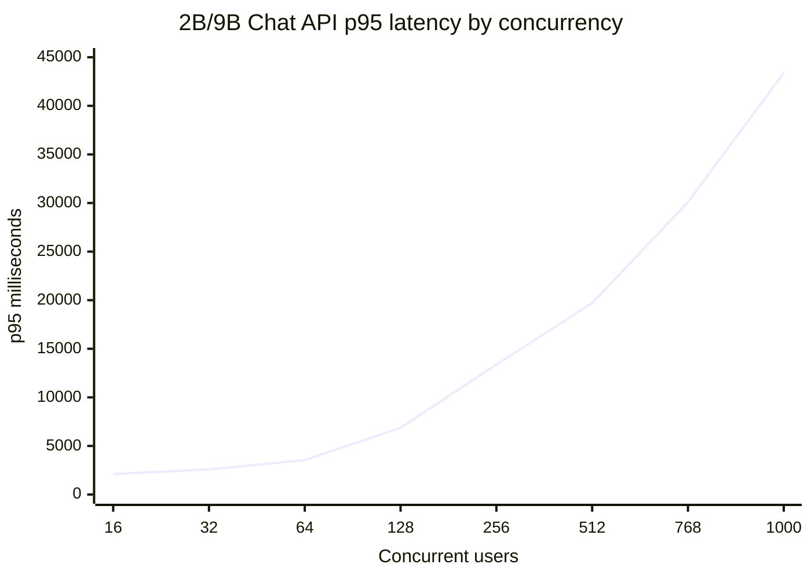
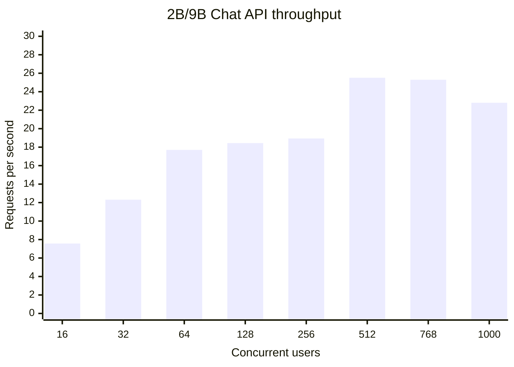
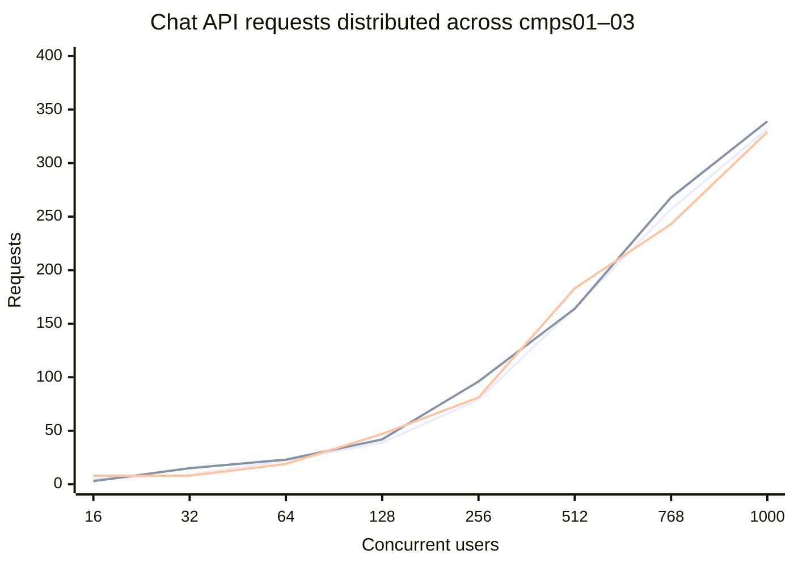
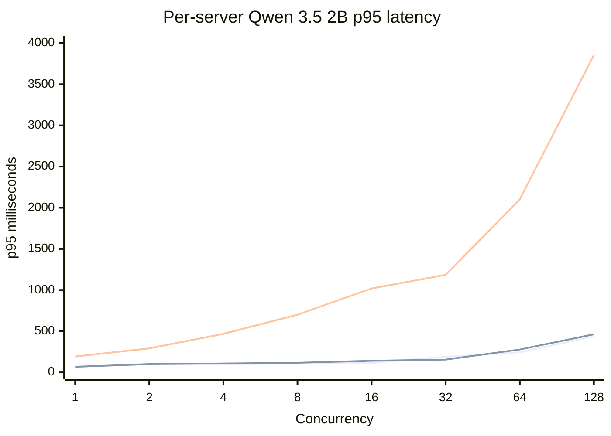
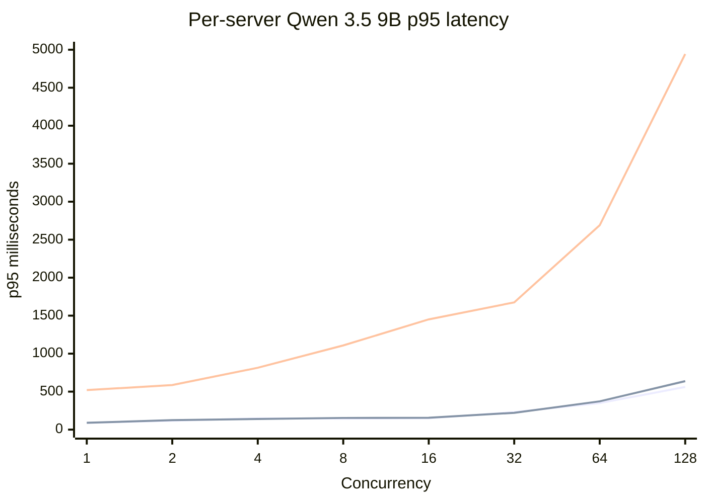
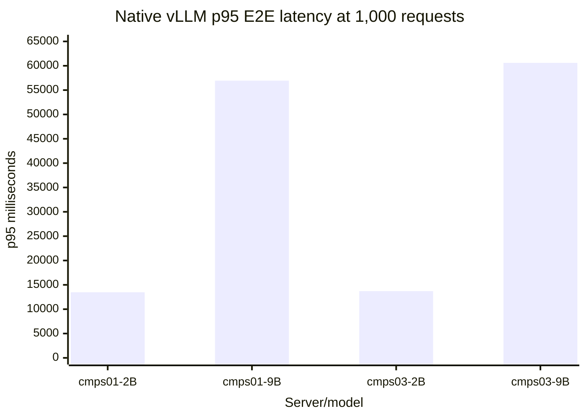

# EduAI Fleet Router — Executive Report

**Test period:** August 18–19, 2026 UTC  
**Environment:** `https://dev.eduai.ok.ubc.ca`  
**Configuration:** Qwen 3.5 2B/9B split across cmps01, cmps02, and cmps03  
**Related issue:** [#893](https://github.com/EduAI-Lab/EduAI/issues/893)

## Executive summary

The fleet successfully handled the complete controlled Chat API stress ladder from 16 to 1,000 concurrent users. The Qwen 3.5 2B/9B split remained exactly balanced at 50% per model, and requests were distributed evenly across cmps01, cmps02, and cmps03. At 1,000 concurrent users, all 1,000 direct-Core requests completed successfully, with 332 routed through cmps01, 339 through cmps02, and 329 through cmps03.

The public webapp path was healthy through 256 concurrent users. At higher levels, the public reverse proxy produced 502/fetch failures and the original per-user rate limit interfered with later ladder points. These public-path failures should be treated as ingress and configuration limits, not as evidence that the 2B/9B fleet stopped functioning.

## 1. Chat API scaling with the 2B/9B split

The controlled Chat API run used the direct Core path and exercised the Qwen 3.5 2B/9B split across cmps01, cmps02, and cmps03. The split stayed exactly 50/50 at every load step. The fleet completed all 2,776 requests from 16 through 1,000 concurrent users with HTTP 200 responses.

| Concurrent users | Successes | 2B / 9B requests | cmps01 / cmps02 / cmps03 | p95 ms | RPS |
|---:|---:|---:|---:|---:|---:|
| 16 | 16/16 | 8 / 8 | 5 / 3 / 8 | 2,106 | 7.57 |
| 32 | 32/32 | 16 / 16 | 9 / 15 / 8 | 2,586 | 12.31 |
| 64 | 64/64 | 32 / 32 | 22 / 23 / 19 | 3,543 | 17.70 |
| 128 | 128/128 | 64 / 64 | 39 / 42 / 47 | 6,861 | 18.44 |
| 256 | 256/256 | 128 / 128 | 79 / 96 / 81 | 13,373 | 18.94 |
| 512 | 512/512 | 256 / 256 | 165 / 164 / 183 | 19,699 | 25.51 |
| 768 | 768/768 | 384 / 384 | 257 / 268 / 243 | 30,089 | 25.29 |
| 1,000 | 1,000/1,000 | 500 / 500 | 332 / 339 / 329 | 43,394 | 22.81 |

### Fleet p95 latency and throughput

**Server-series order:** cmps01, cmps02, cmps03. At 1,000 users, routing was effectively even: 332 / 339 / 329 requests. The limiting signal was latency saturation, not request loss: p95 reached 43.4 seconds while the direct-Core run still returned 1,000/1,000 successes.

## 2. Individual-server stress testing

Each server was tested independently with both deployed models through concurrency 128 using direct authenticated vLLM requests. All individual-server ladders completed without request errors, OOMs, crashes, or container restarts. cmps03 was the clear performance outlier, especially under concurrent load.

### p95 latency by server — Qwen 3.5 2B

### p95 latency by server — Qwen 3.5 9B

**Server-series order:** cmps01, cmps02, cmps03. At concurrency 128, the measured p95/RPS pairs were:

| Server | Qwen 3.5 2B | Qwen 3.5 9B |
|---|---:|---:|
| cmps01 | 438 ms / 368.88 RPS | 562 ms / 250.98 RPS |
| cmps02 | 463 ms / 306.59 RPS | 638 ms / 225.75 RPS |
| cmps03 | 3,854 ms / 59.07 RPS | 4,943 ms / 41.01 RPS |

The extended native-vLLM 1,000-request runs were later completed on cmps01 and cmps03. They also completed with zero errors, but showed severe queueing at this load:

| Server | Model | Successes | p95 E2E ms | RPS |
|---|---|---:|---:|---:|
| cmps01 | Qwen 3.5 2B | 1,000/1,000 | 13,482 | 73.34 |
| cmps01 | Qwen 3.5 9B | 1,000/1,000 | 56,938 | 17.48 |
| cmps03 | Qwen 3.5 2B | 1,000/1,000 | 13,707 | 72.14 |
| cmps03 | Qwen 3.5 9B | 1,000/1,000 | 60,601 | 16.43 |

cmps02 was restored to Qwen 2.5 32B after the fleet run, so no comparable native 2B/9B 1,000-request pair was collected there. Its complete per-server 2B/9B ladder through concurrency 128 is included above.

## Key findings

- The fleet router shared Chat API traffic evenly across all three servers.
- The 2B/9B model split maintained an exact 50/50 request allocation at every test level.
- The controlled direct-Core run completed 2,776/2,776 requests successfully across the full ladder.
- The authenticated RAG smoke test preserved `chatId`, citations, RAG results, and `X-Fleet-Server`.
- Follow-up context remained correct when routed to another server because Core persists conversation history.
- The 1,000-user test is a stress ceiling, not a recommended low-latency operating target.

## Production assessment

The fleet/router behavior is promising for production use under the tested workload, but production sign-off should wait for a separate public-ingress capacity test. That test should isolate rate-limit buckets, measure proxy and upstream timeouts, and collect synchronized Core, Redis, database, GPU, and vLLM metrics.

The current results support the one-model-per-GPU 2B/9B topology. They do not establish that multiple model instances on one GPU would improve performance; that remains a separate VRAM-budget and latency experiment.

## Restoration

After testing, cmps02 GPU1 was restored to Qwen 2.5 32B, Core was restored to its original concurrency and rate-limit settings, and the temporary RAG fixture and stress-test files were removed.

See the companion [fleet and cmps data report](./FLEET_ROUTER_DATA_REPORT_2026-08-19.md#per-server-cmps-data) for the complete measurements, per-server tables, raw artifacts, and supporting-system data.
