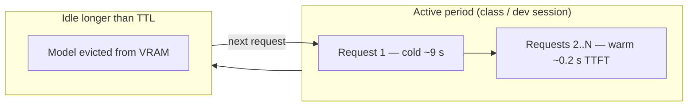
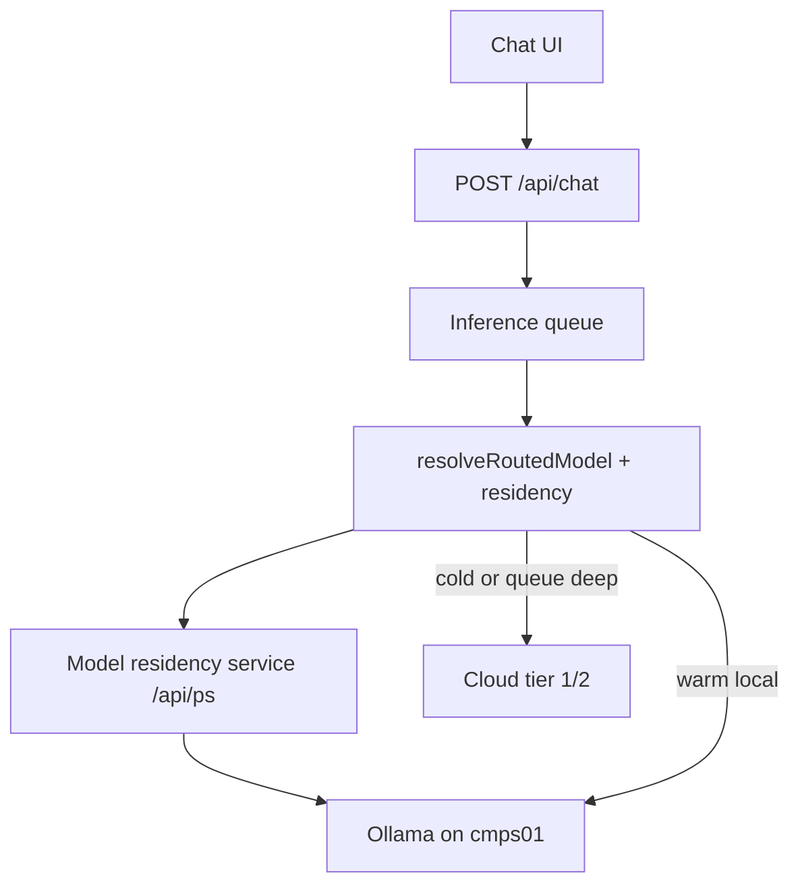

# EduAI chat latency — solutions plan

**Audience:** Full EduAI dev team + ops + research lead  
**Status:** Proposed — builds on closed investigation in `[FINDINGS.md](./FINDINGS.md)`  
**Last updated:** 2026-05-29 (related work added)  
**Related:** [Findings](./FINDINGS.md) · [Routing Phase 0/1](../../routing/eduai-summer-2026/TEAM_PHASE_0_AND_1_GUIDE.md) · [Tools track](./TEAM_CHAT_LATENCY_AND_TOOLS.md) · [#197 routing](https://github.com/EduAI-Lab/EduAI/issues/197) · [#203 latency](https://github.com/EduAI-Lab/EduAI/issues/203)

> **Benchmark data:** Raw JSON/CSV and bench logs are **not** in this branch. They live on git branch **`troubleshoot-RAG-delay`** at [`apps/core/output/`](https://github.com/EduAI-Lab/EduAI/tree/troubleshoot-RAG-delay/apps/core/output). Full session index: [appendix — Data files](./FINDINGS_APPENDIX.md#data-files-on-troubleshoot-rag-delay).

---

## The problem in one paragraph

Benchmarks show that slow chat is **not** caused by EduAI Core/RAG (pre-LLM work is under 15 ms). The dominant cost is **GPU cold start** (~9–10 s before the first token when a model was evicted from VRAM). Warm models respond at ~130 tokens/s; long or reasoning-heavy replies add seconds on top. Ollama behaves the same whether called from EduAI or directly — it is a runtime detail, not the root cause. **Keeping Ollama loaded 24/7 is not a production strategy** on a shared GPU: VRAM is fixed, concurrent users contend, and cost does not scale. The solution is **TTL-based persistence during activity**, **residency-aware routing**, **honest UX under load**, and **cloud or dedicated inference when local is cold or saturated**.

---

## Design principle: persist with TTL, not always-on

| Approach                       | What it means                                                 | Production?                               |
| ------------------------------ | ------------------------------------------------------------- | ----------------------------------------- |
| `**keep_alive: -1` (forever)** | Model never unloads                                           | No — wastes VRAM; blocks other models     |
| `**keep_alive: 30m` (TTL)**    | Model stays loaded while users are active; unloads after idle | Yes for dev / small cohort                |
| **Pre-warm on intent**         | Load when user opens chat or selects a course — not on a cron | Yes — complements TTL                     |
| **Cloud when cold/busy**       | Auto routes away from cold local GPU for that request         | Yes — needs privacy review for course RAG |

During a lab hour, requests naturally reset the TTL. After class, VRAM is freed. No daemon required.

---

## What we are optimizing (from findings)

| Factor                         | Typical impact            | Owner                 | Fix in this plan?                                                   |
| ------------------------------ | ------------------------- | --------------------- | ------------------------------------------------------------------- |
| GPU cold start                 | +~9–10 s TTFT             | Ops + Engineering     | **Yes** — TTL, pre-warm, routing, UX                                |
| Token count / reasoning models | Linear decode time        | Product + Engineering | **Yes** — caps, house model choice                                  |
| EduAI pipeline overhead        | ~60–70 ms                 | —                     | No rewrite needed                                                   |
| Ollama vs vLLM                 | Unknown                   | Infra (later)         | Phase D — benchmark before prod commit                              |
| Tool-path multi-step loops     | Extra seconds (Session 8) | Separate track        | See [tools doc](./eduai-summer-2026/TEAM_CHAT_LATENCY_AND_TOOLS.md) |

**Target (product):** ~**3–4 s** perceived for typical warm tutoring turns. Cold starts should be **expected and visible**, not mistaken for a broken app.

---

## Solution architecture (three layers)

### Layer 1 — Model residency service (foundation)

Ollama exposes `GET /api/ps` — which models are in VRAM, `expires_at`, and VRAM usage. The latency bench already probes this (`apps/core/scripts/chat-latency-bench.mjs`). Promote that into Core:

| Component                    | Responsibility                                                                              |
| ---------------------------- | ------------------------------------------------------------------------------------------- |
| **Residency cache**          | Poll `/api/ps` (or on-demand before route); map `modelId → { resident, expiresAt, vramMb }` |
| **Per-request `keep_alive`** | Pass configured TTL (e.g. `30m`) on every Ollama chat call from `chat.ts`                   |
| **Internal API**             | `isResident(modelId)`, `listResidentModels()` for router and UX                             |
| **Telemetry**                | Log `modelWasResident`, `residentModelsAtRouteTime` in `AIInteraction.routerFeatures`       |

**Why first:** Cold-load UX and residency-aware routing both depend on knowing what is warm *right now*.

### Layer 2 — Residency-aware model routing

Extends [model routing plan](../routing/eduai-summer-2026/TEAM_ROUTING_LAYER_PLAN.md). Sustainability/tier logic stays; add **latency/residency** as a tie-breaker.

**Revised rule order** (capability gates unchanged; residency inserted after them):

| Order | Rule                          | Notes                                                                                            |
| ----- | ----------------------------- | ------------------------------------------------------------------------------------------------ |
| 1     | Images attached               | Cheapest tier ≥ 2 with vision                                                                    |
| 2     | Tools required                | Cheapest tier ≥ 2 with tools                                                                     |
| 3     | **Resident-local preference** | Among tier-valid candidates, prefer models currently in VRAM                                     |
| 4     | **Cold-local penalty**        | Best local match is cold and cloud tier 1/2 can handle the turn → route cloud for *this request* |
| 5     | Short factual prompt          | Tier 1                                                                                           |
| 6     | Strong RAG hit                | Tier 1                                                                                           |
| 7     | Heavy RAG context             | Tier 2                                                                                           |
| 8     | Default                       | Tier 2 — lowest carbon among **warm** candidates first, then cold                                |

**Example:** `deepseek-r1:8b` is warm (house model during lab). Auto would normally pick `gemma4:31b` for a harder prompt. Router sees gemma is **not resident** (+~9 s) and deepseek **is** → use warm tier 1, or cloud tier 2 if capability requires it.

**Manual override:** If the user explicitly picks a cold local model, honor it — show “Loading model (~10 s)…” and optionally suggest Auto.

More planning on this part is needed

### Layer 3 — Classroom concurrency (shared single GPU)

One GPU cannot serve 30 parallel large-model inferences honestly. Design for **fair serialization + smart defaults**.

| Mechanism                      | Effect                                                                          |
| ------------------------------ | ------------------------------------------------------------------------------- |
| **Inference queue**            | One (or N) GPU slots; FIFO with backpressure — prevents OOM and model thrashing |
| **Queue UX**                   | “Position 3 · ~8 s” instead of a silent 40 s hang                               |
| **Single house model**         | One default local model per GPU during active hours — fewer swaps               |
| **Activity-extended TTL**      | Each request resets `keep_alive` — a busy class keeps the model warm naturally  |
| **Cloud overflow (Auto only)** | Queue depth or estimated wait above threshold → cloud tier 1/2                  |
| **Pre-warm on intent**         | Lightweight ping when user opens chat, selects course, or picks a local model   |

Note: CTL servers can host some of our AI models in future
---

## Phased rollout

Work is ordered by impact and dependency. Phases A–C can overlap across owners.

### Phase A — Dev / small cohort (~1–2 weeks)

Quick wins; no routing MVP required.

| ID  | Task                                                                     | Owner         | Done when                                          |
| --- | ------------------------------------------------------------------------ | ------------- | -------------------------------------------------- |
| A1  | Set `OLLAMA_KEEP_ALIVE=30m` on `cmps01` (TTL, **not** `-1`)              | Ops           | Env documented; model stays warm during active dev |
| A2  | **One house model** — e.g. `qwen2.5:7b` instruct (not reasoning default) | Ops / Product | Single primary local on shared GPU                 |
| A3  | Cap `**maxTokens`** for chat (512–1024 vs 8192)                          | Engineering   | Worst-case turns bounded                           |
| A4  | **Cold-load UX** — “Loading model…” when `resident=false` or TTFT > ~3 s | Engineering   | Users see expected delay, not a freeze             |
| A5  | Pass `**keep_alive`** on Ollama requests from Core                       | Engineering   | TTL applies per chat turn, not server-only         |

**Success:** Warm probe ~2–4 s total; cold first request ~10 s but labeled in UI.

### Phase B — Residency + router integration (~2–3 weeks)

Align with routing Phase 0/1 ([#197](https://github.com/EduAI-Lab/EduAI/issues/197)).

| ID  | Task                                                              | Owner              | Blocked by      |
| --- | ----------------------------------------------------------------- | ------------------ | --------------- |
| B1  | `ModelResidencyService` in Core (reuse bench `/api/ps` logic)     | Backend            | A5              |
| B2  | Telemetry: `modelWasResident`, cold-start flag on `AIInteraction` | Backend            | Phase 0 schema  |
| B3  | Router rules 3–4 (resident preference, cold penalty)              | Backend            | B1, routing MVP |
| B4  | UI: loading state + optional “answered by {model}”                | Frontend           | B1              |
| B5  | Pre-warm endpoint or client call on chat open / course select     | Backend + Frontend | B1              |

**Success:** During an active lab, Auto picks a warm local model ≥80% of turns; P95 TTFT improves vs tier-only rules.

### Phase C — Classroom scale (~3–4 weeks)

| ID  | Task                                                             | Owner          | Notes                                                                     |
| --- | ---------------------------------------------------------------- | -------------- | ------------------------------------------------------------------------- |
| C1  | **GPU inference queue** (semaphore before Ollama call)           | Backend        | Critical for 20–30 concurrent users                                       |
| C2  | **Cloud overflow** policy for Auto when queue deep or local cold | Backend + Lead | Privacy review for course RAG text                                        |
| C3  | Load test: ~30 synthetic concurrent users                        | QA             | Record P50/P95 TTFT + queue wait in [tracker](./MODEL_LATENCY_TRACKER.md) |
| C4  | Optional: extend TTL during burst (e.g. >5 req/min → 60m)        | Backend        | Only if C1–C3 show idle gaps mid-class                                    |

**Success:** No OOM under spike; queue wait visible; P95 total under agreed SLA for Auto + cloud path.

### Phase D — Production infrastructure (before large cohort)

Schedule after Phase B/C data exists.

| Option                                | When to choose                                                      |
| ------------------------------------- | ------------------------------------------------------------------- |
| **vLLM / SGLang** (OpenAI-compatible) | Local GPU is “premium tier”; need concurrent batching               |
| **Managed API default**               | Prod SLA; privacy policy allows                                     |
| **Horizontal GPU pool**               | Multiple sections / institution-wide                                |
| **Dev vs prod split**                 | Shared Ollama for research; cloud or dedicated cluster for students |

Benchmark vLLM (or cloud) vs Ollama on the **same prompts** before committing to local-first production. See [FINDINGS — what we did not prove](./FINDINGS.md#what-we-did-not-prove).

---

## Classroom walkthrough (30 students, one GPU)

| Time                                    | What happens                                                                                             |
| --------------------------------------- | -------------------------------------------------------------------------------------------------------- |
| **Class starts (model idle overnight)** | Student A sends first message → cold ~9 s, UI shows “Loading model…”; `keep_alive: 30m` starts           |
| **Active lab (min 1–50)**               | Students B–Z hit warm path → ~2–4 s typical; five simultaneous sends → queue serializes with position UI |
| **Auto routing**                        | Prefers warm `qwen2.5:7b` over cold `gemma4:31b` unless tools/RAG require tier 2+                        |
| **Break (idle > 30 min)**               | Model evicted; VRAM freed                                                                                |
| **After break**                         | Next request cold again, **or** Auto uses cloud if overflow policy enabled                               |

---

## How routing and latency fit together

| Concern                       | Routing epic ([#197](https://github.com/EduAI-Lab/EduAI/issues/197)) | Latency epic ([#203](https://github.com/EduAI-Lab/EduAI/issues/203)) |
| ----------------------------- | -------------------------------------------------------------------- | -------------------------------------------------------------------- |
| Which tier / model?           | Tier rules, carbon, capabilities                                     | —                                                                    |
| Which instance is fast *now*? | Residency tie-break (Phase B3)                                       | Residency service (Phase B1)                                         |
| User waiting with no tokens?  | Cloud overflow decision                                              | Queue + cold-load UX                                                 |
| Telemetry                     | `routerFeatures`, energy estimates                                   | `modelWasResident`, `queueWaitMs`                                    |

Use **one** telemetry path (`AIInteraction`) — do not duplicate logging.

---

## Team decisions (fill in at kickoff)

| ID  | Question                                         | Recommendation                                                         | Decision |
| --- | ------------------------------------------------ | ---------------------------------------------------------------------- | -------- |
| S1  | House model on shared GPU?                       | Small **instruct** (7–8B), e.g. `qwen2.5:7b`                           |          |
| S2  | Cloud cold fallback for **Auto**?                | Yes for chat-only; gated for sensitive course RAG until policy signed  |          |
| S3  | Under load: queue or fail?                       | Queue with position UI                                                 |          |
| S4  | Pre-warm trigger?                                | Chat page load + course selected                                       |          |
| S5  | Is 3–4 s SLA for **local Ollama** or cloud only? | Local = best effort + honest UX; cloud/Auto = SLA target               |          |
| S6  | Ship residency service before or with router?    | Residency first (A5 + B1), then router rules (B3) — same epic, two PRs |          |

---

## What we are not doing

- Rewriting Core/RAG for speed (proved <15 ms pre-LLM)
- `keep_alive: -1` / Ollama 24/7 on shared GPU
- Multiple large locals resident without eviction policy
- “SSH keeps it warm” as production behaviour
- Ollama vs vLLM debate **before** residency + queue are in place

---

## Suggested tasks this week

| Priority | Task                                                               | Owner              |
| -------- | ------------------------------------------------------------------ | ------------------ |
| 1        | Ops: `OLLAMA_KEEP_ALIVE=30m` + one house model on `cmps01`         | Ops                |
| 2        | Engineering: residency probe service + `keep_alive` from `chat.ts` | Backend            |
| 3        | Engineering: cold-load UX + `maxTokens` cap                        | Backend + Frontend |
| 4        | Routing: add residency fields to Phase 0 schema spec               | Backend            |
| 5        | Spike: 10 concurrent requests with/without queue                   | QA / Backend       |

---

## Related work

Literature and deployments that informed this plan (May 2026). Most projects solve **one piece** of the puzzle; EduAI combines several on a **single shared university GPU**.

### Summary — how our plan compares

| EduAI pillar | Precedent strength | Closest examples |
| ------------ | ------------------ | ---------------- |
| TTL `keep_alive` (not 24/7) | Strong — standard Ollama ops | Ollama docs, [ML Journey keep-alive guide](https://mljourney.com/ollama-keep-alive-and-model-preloading-eliminate-cold-start-latency/) |
| Pre-warm on intent / startup | Strong | Empty-prompt preload, [Ollama timeout fix guide](https://www.aimadetools.com/blog/ollama-api-timeout-fix/) |
| Tier-based model routing | Strong — research + production | [FrugalGPT](https://arxiv.org/abs/2305.05176), [RouteLLM](https://github.com/lm-sys/RouteLLM), [LiteLLM Router](https://docs.litellm.ai/docs/routing) |
| Route by GPU residency (`/api/ps`) | Moderate — emerging at scale | [llm-d](https://llm-d.ai/blog/predicted-latency-based-scheduling-for-llms), [Tuna](https://github.com/Tandemn-Labs/tandemn-tuna), Open WebUI `/api/ps` discussions |
| Classroom queue on one GPU | Moderate | [KatherLab LLM-Scheduler](https://github.com/KatherLab/LLM-Scheduler) |
| Edu RAG + sustainability routing | Weak as one system — **EduAI differentiator** | [LAMB](https://github.com/LucasImpulse/lamb), [Dartmouth Chat](https://dl.acm.org/doi/full/10.1145/3708035.3736076) (partial) |

**Takeaway:** Phase A–B choices are well validated. **Residency-aware tier routing on one shared GPU for course-aware chat** is less common — reasonable research contribution ([#197](https://github.com/EduAI-Lab/EduAI/issues/197)).

---

### Cold start and TTL persistence (Phase A)

Ollama unloads models after **~5 minutes** idle by default; reload costs **~3–10+ s** depending on model size — consistent with our [FINDINGS](./FINDINGS.md) (~9–10 s on `cmps01`).

Community practice matches our TTL approach:

- Set **`OLLAMA_KEEP_ALIVE=30m`** (or per-request `keep_alive`) — not `-1` on shared hardware ([Markaicode](https://www.markaicode.com/ollama-keep-alive-memory-management/))
- Probe residency via **`GET /api/ps`** (`expires_at`, VRAM) — same pattern as `chat-latency-bench.mjs`
- Pre-warm with a minimal request when the user opens chat or on app startup
- **One primary model** pinned longer; secondary models shorter TTL — pinning multiple large models with `keep_alive: -1` causes OOM on one GPU

Open WebUI multi-user setups often combine `OLLAMA_KEEP_ALIVE`, `OLLAMA_NUM_PARALLEL`, and `OLLAMA_MAX_LOADED_MODELS` ([devbox ollama-optimization](https://github.com/gl0bal01/devbox/blob/main/docs/ollama-optimization.md)). Load-balancing across multiple Ollama instances serving the **same** model is still a known weak spot ([multi-instance writeup](https://medium.com/codex/one-ollama-is-not-enough-multi-instance-ollama-open-webui-gateway-for-text-and-vision-models-da276cbbe0ba)).

---

### Model routing (Phase B — tier + capability)

**Research**

| Project | Approach | Lesson for EduAI |
| ------- | -------- | ---------------- |
| [FrugalGPT](https://arxiv.org/abs/2305.05176) (2023) | Sequential cascade: cheap model first, escalate if quality score low | Same *idea* as tiers; **poor for latency** — hard queries pay twice |
| [RouteLLM](https://github.com/lm-sys/RouteLLM) | Router picks strong vs weak model; ~85% cost reduction | Close to Phase 1 Auto; **no GPU residency signal** |
| Hybrid LLM follow-ups | ~20% of queries need the large model | Supports “most turns on tier 1” |

**Use predictive routing** (pick model before `streamText`), not sequential cascade, for student chat ([cascading vs routing](https://www.sandgarden.com/learn/model-cascading)).

**Production gateways**

| Project | Pattern | EduAI parallel |
| ------- | ------- | -------------- |
| [LiteLLM Router](https://docs.litellm.ai/docs/routing) | Fallbacks, cooldowns, health-check routing | Cloud overflow when local cold/busy (Phase C2) |
| [RouteLabs Router](https://github.com/routelabsai/router) | Local-first + cloud fallback + Ollama discovery | Hybrid local/cloud Auto |
| [hybrid-router-oss](https://github.com/adongwanai/hybrid-router-oss) | Privacy/complexity → Ollama / vLLM / cloud | Privacy-aware local preference for course RAG |

---

### Residency-aware routing (Phase B3 — our addition)

Production schedulers route on **load + cache state**, not just model tier:

| System | Signal | Scale vs EduAI |
| ------ | ------ | -------------- |
| [llm-d / Inference Scheduler](https://www.redhat.com/en/blog/same-16-gpus-twice-users-inference-aware-routing-llm-clusters) | Queue depth, KV cache, load | K8s cluster — same *philosophy*, heavier infra |
| [NVIDIA Dynamo](https://github.com/steved/dynamo/blob/main/docs/architecture/kv_cache_routing.md) | Global KV cache + worker metrics | Multi-node production |
| [Tuna](https://github.com/Tandemn-Labs/tandemn-tuna) | **COLD → WARMING → READY** state machine | **Closest UX pattern**: fast path while GPU boots |

At single-Ollama scale, a full KV indexer is overkill. **`/api/ps` + cold penalty → warm tier-1 or cloud** is the proportional version of what larger systems do.

---

### Classroom concurrency (Phase C)

Benchmarks support **queue now, vLLM later** for 20–30 simultaneous users:

| Source | Finding |
| ------ | ------- |
| [Red Hat Ollama vs vLLM](https://developers.redhat.com/articles/2025/08/08/ollama-vs-vllm-deep-dive-performance-benchmarking) | Under concurrency, Ollama **queues/throttles** — TTFT spikes; vLLM uses continuous batching |
| [Particula serving comparison](https://particula.tech/blog/vllm-vs-ollama-vs-tensorrt-model-serving) | Reports **2 s → 45+ s** with ~10 concurrent users on Ollama |
| [KatherLab LLM-Scheduler](https://github.com/KatherLab/LLM-Scheduler) | Shared GPU lab: Slurm bookings, timeline UI, one model slot — **closest org pattern to cmps01** |

**Interim:** inference queue + position UI on Ollama (Phase C1). **Before large cohort:** benchmark vLLM/TGI (Phase D), as [Dartmouth](#university--education-deployments) does for hot models.

---

### University / education deployments

**[Dartmouth Chat](https://dl.acm.org/doi/full/10.1145/3708035.3736076)** (PEARC 2025) — strongest institutional parallel:

- ~3,100 users; Open WebUI frontend; token tracking; RAG via external services
- **Hot models → TGI on dedicated GPUs**; **rare/retired models → Ollama**
- Explicit: *“Ollama … does not include the sophisticated features required for deployments at scale”*
- **Parallel:** cmps01 Ollama = their Ollama tier; production path = TGI/vLLM + gateway (our Phase D)

**[LAMB](https://github.com/LucasImpulse/lamb)** (UPC / Basque Country):

- LMS-integrated teaching assistants, RAG, self-hosted models, Open WebUI backend
- Similar **product shape**; latency/residency architecture not documented in depth

---

### What similar projects do not cover (EduAI gaps)

1. **Course-aware RAG signals in the router** — most routers use prompt length/complexity, not chunk similarity + course context (our Phase 1 rules 5–7).
2. **Sustainability / carbon per tier** — RouteLLM optimizes cost; we add estimated carbon ([#197](https://github.com/EduAI-Lab/EduAI/issues/197)).
3. **Single shared dev GPU** — most writeups assume K8s or multi-GPU; KatherLab is the closest “one lab server, many users” model.
4. **Tool-path latency (Session 8)** — agent schedulers (e.g. SAGA) target multi-step graphs, not EduAI’s Ollama tool-reliability issue; see [tools track](./eduai-summer-2026/TEAM_CHAT_LATENCY_AND_TOOLS.md).

---

### Validated vs caution (from the landscape)

| Keep (validated) | Borrow | Avoid |
| ---------------- | ------ | ----- |
| TTL + pre-warm | Tuna COLD/WARMING/READY UX | `keep_alive: -1` on shared GPU |
| Predictive tier routing (not cascade) | KatherLab scheduling metaphor for cmps01 | Ollama alone at classroom concurrency without queue |
| LiteLLM-style cloud fallback | Dartmouth TGI/Ollama split | Sequential cascade for latency-sensitive chat |
| House model + token caps | RouteLLM for Phase 3 classifier | Ollama vs vLLM debate before Phase B/C data |

---

## Related docs

| Doc                                                                                                                    | Role                                         |
| ---------------------------------------------------------------------------------------------------------------------- | -------------------------------------------- |
| `[FINDINGS.md](./FINDINGS.md)`                                                                                         | Measured root causes — investigation closed  |
| `[FINDINGS_APPENDIX.md](./FINDINGS_APPENDIX.md)`                                                                       | Session tables, methodology, re-run commands |
| `[MODEL_LATENCY_TRACKER.md](./MODEL_LATENCY_TRACKER.md)`                                                               | Log TTFT/Total after each change             |
| `[eduai-summer-2026/TEAM_CHAT_LATENCY_SPRINT_GUIDE.md](./eduai-summer-2026/TEAM_CHAT_LATENCY_SPRINT_GUIDE.md)`         | Delegatable L00–L09 tasks                    |
| `[../routing/eduai-summer-2026/TEAM_PHASE_0_AND_1_GUIDE.md](../routing/eduai-summer-2026/TEAM_PHASE_0_AND_1_GUIDE.md)` | Router implementation steps                  |
| `[../routing/eduai-summer-2026/TEAM_ROUTING_LAYER_PLAN.md](../routing/eduai-summer-2026/TEAM_ROUTING_LAYER_PLAN.md)`   | Routing phases 0–4 overview                  |

---

*Derived from latency investigation findings and team routing plan. Update this doc when decisions S1–S6 are made or phases ship.*