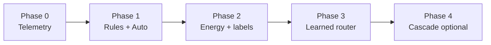
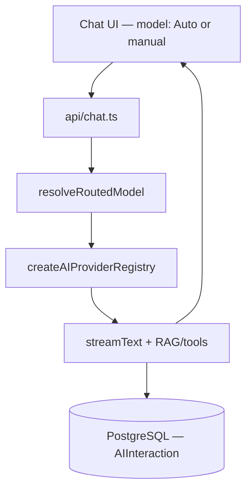

# EduAI — Sustainability-aware model routing (team guide)

**Audience:** EduAI development team  
**Repository:** [EduAI-Lab/EduAICore](https://github.com/EduAI-Lab/EduAICore) (monorepo: `apps/core` for EduAI)  
**Tracking:** [GitHub Project — Edu AI Summer 2026](https://github.com/orgs/EduAI-Lab/projects/8)  
**Immediate work:** See `[TEAM_PHASE_0_AND_1_GUIDE.md](./TEAM_PHASE_0_AND_1_GUIDE.md)` and parent issue [#197](https://github.com/EduAI-Lab/EduAICore/issues/197)

---

## Context — why we are building this

Today, EduAI lets users pick a model from a dropdown. That works, but it puts the burden on students and instructors to guess which model is “good enough” — and the largest model is often chosen by default, which uses more GPU time and energy than necessary.

**Model routing** means: when a user selects **Auto** (or does not override), EduAI chooses a concrete model for each prompt — preferring the **smallest tier that can still answer well**. The primary goal for this project is **sustainability** (lower energy and estimated carbon) without unacceptable loss of educational quality.

This is also a **research platform**: every routed request should eventually be measurable (tokens, latency, routing decision, energy) so we can evaluate routing policies and improve them over time.

**What routing is not (for now):**

- Retraining or fine-tuning models  
- CUDA/kernel optimization  
- Replacing the existing RAG pipeline (that is a separate evaluation track)

**How this fits the current codebase:**

- Chat already flows through `app/routes/api/chat.ts` (model string → provider registry → `streamText`).  
- RAG already exists (`app/lib/ai/embedding.ts`, material chunks in PostgreSQL/pgvector). The router **reads** RAG metadata; it does not rebuild RAG.  
- Local models go through **Ollama**; cloud models through the existing AI SDK providers.

---

## Context — how routing will evolve (phases)

We are building in **phases** so the team can ship value early and collect data before investing in ML.

### Phase 0 — Telemetry foundation

Before we can route intelligently or prove energy savings, we need to measure what happens on every chat turn. Phase 0 extends the database and chat API so each request logs timing, tokens, which model was used, routing metadata, and estimated energy/carbon. Structured logging (pino) is part of this. There is no smart routing yet—only reliable data collection.

---

### Phase 1 — Rule-based Auto routing

This is the first user-facing routing release. Students get an **Auto** option in the model picker (default on). Simple rules pick a tier (small / medium / large model) based on things like images, tools, prompt length, and RAG context. The UI shows which model actually answered. Routing is explainable and hand-tuned, not machine learning. This is what the team is building now (GitHub parent issue [#197](https://github.com/EduAI-Lab/EduAICore/issues/197)).

---

### Phase 2 — Real measurement and training data

Phase 1 uses estimated energy from token counts. Phase 2 adds real hardware measurement where possible (GPU/CPU via a sidecar on the inference host) and builds labeled datasets—for example replaying prompts and optional LLM-judge quality scores—so we can train a smarter router later. This phase depends on knowing where Ollama runs (same machine vs remote) and having weeks of Phase 0/1 telemetry.

---

### Phase 3 — Learned router and carbon-aware policy

Instead of only fixed rules, we train a small model (for example a classifier on prompt embeddings plus context features) to predict the best tier. On top of that, we optimize for energy and carbon versus quality trade-offs (stricter quality in some courses, greener defaults in others). This is where the research contribution gets stronger: evidence-based routing, not just heuristics.

---

### Phase 4 — Cascade and adaptation

Advanced mode: start with a cheap model and escalate to a larger one only when confidence is low or the answer looks risky. Can also include ongoing monitoring and retraining as student usage drifts. This is harder for streaming chat UX, so it is often kept behind an admin flag or deferred.

---

### How the phases fit together

- **Phase 0** — you can measure.
- **Phase 1** — you can route and demo Auto.
- **Phase 2** — you can trust the numbers and collect labels.
- **Phase 3** — you can route smarter and optimize for carbon.
- **Phase 4** — you can handle hard edge cases and long-term drift.

| Phase | Focus                                | Team outcome                                                                           |
| ----- | ------------------------------------ | -------------------------------------------------------------------------------------- |
| **0** | Telemetry + schema                   | Every chat turn is logged with timing, tokens, routing fields, estimated energy/carbon |
| **1** | Rules + **Auto** UX                  | Simple rule-based router; Auto in dropdown; user sees which model answered             |
| **2** | Measurement + labels                 | GPU energy tracker (where possible); labeled data for training                         |
| **3** | Learned router + carbon-aware policy | Classifier (or hybrid) trained on real traffic; optimize energy vs quality             |
| **4** | Optional cascade                     | Start cheap, escalate if confidence is low (admin-gated initially)                     |

**Phase 0 + Phase 1 (rules only)** are what we implement **first** — detailed in the team Phase 0/1 guide. Embedding kNN and trained classifiers come **after** we have enough telemetry.

---

## Context — architecture at a glance

When a student sends a chat message with **Auto** selected:

1. Request hits `POST /api/chat` (`chat.ts`).
2. **Router** (`resolveRoutedModel`) picks a `provider:modelId` string using cheap signals (tools, images, prompt shape, RAG metadata).
3. Existing **provider registry** and **streamText** run unchanged in spirit.
4. Response streams to the browser; header/body can include which model was used.
5. **After** the stream finishes, telemetry is written to `AIInteraction` (non-blocking).

---

## Context — model tiers (initial pool)

Models are grouped into **tiers** for routing. Tier 1 is smallest/cheapest; Tier 3 is largest/most capable.

| Tier  | Role                               | Examples in current plan                                            |
| ----- | ---------------------------------- | ------------------------------------------------------------------- |
| **1** | Small / factual / strong RAG match | `ollama:deepseek-r1:8b`                                             |
| **2** | Mid — default for harder prompts   | `ollama:gemma4:31b`, `google:gemini-2.5-flash`, `glm:glm-4.7-flash` |
| **3** | Large baseline                     | `ollama:gpt-oss:120b`                                               |

Tier assignments and per-token energy/carbon estimates live in the database (`AIModel` seed data). The router picks the **lowest-cost** candidate within the tier that satisfies capabilities (e.g. tools, images).

**Important nuance:** A large **local** model on BC Hydro can look similar in *carbon per token* to a smaller **cloud** model in a dirtier grid — the router still prefers Tier 2 for capability reasons, but our write-ups should not assume “small always means green.”

---

## Context — Phase 1 routing rules (summary)

Until we have a trained classifier, routing uses **interpretable rules** (order matters):

1. **Images attached** → cheapest tier ≥ 2 with image support (e.g. Gemini Flash).
2. **Tools required** (web search / fetch enabled or prompt implies lookup) → cheapest tier ≥ 2 with tools.
3. **Short factual prompt** (e.g. “what is…”, under ~120 chars) → Tier 1.
4. **Strong RAG hit** (high similarity, few chunks) → Tier 1.
5. **Heavy RAG context** (many chunks) → Tier 2 (prefer lowest carbon in tier).
6. **Default** → Tier 2 (lowest carbon in tier).

Rule outputs and inputs are stored in `AIInteraction.routerFeatures` as JSON for later analysis.

Full pseudocode and file references live in the Phase 0/1 guide and in `ROUTING_LAYER_PLAN.md` (research copy).

---

## Context — data we collect (shared schema)

Routing and sustainability share one telemetry story. Key ideas:

- `**AIInteraction`** — extended with routing version, chosen tier, tokens, duration, `energyJoules`, `carbonGramsCO2`, `energySource` (e.g. `ESTIMATED_FROM_TOKENS` until we measure on GPU).  
- `**energySource**` — tells analysts how much to trust a number (measured vs estimated).

In-app thumbs up/down feedback is **out of scope** for the current Phase 0/1 slice (may return in a later phase for quality tuning).

Phase 2 adds a **sidecar** on the inference host for real GPU/CPU joules when deployment (Q1: same machine as Ollama vs remote) is settled.

---

## Context — UX expectations

| Behavior      | Detail                                                                                                                   |
| ------------- | ------------------------------------------------------------------------------------------------------------------------ |
| Default model | **Auto** for new sessions (with env kill-switch `ROUTER_AUTO_DEFAULT=false`)                                             |
| Transparency  | Show “answered by {model}” on assistant messages                                                                         |
| Override      | User can always pick a specific model in the dropdown                                                                    |
| Safety        | If routing quality is poor in testing, tune rules or fall back via kill-switch (operational playbook in Phase 0/1 guide) |

---

## Context — evaluation (later phases)

When Phases 2–3 are active, we will compare routing policies against baselines:

- Always Tier 3 (large only)  
- Always Tier 1  
- Rules-only (Phase 1)  
- Learned router (Phase 3)

Metrics: energy per request, latency (P50/P95), quality (offline LLM judge / human eval on held-out prompts). Educational benchmarks (e.g. TutorBench) supplement course Q&A — not MMLU alone.

---

## Task — what each role should know

### All developers

- Read `**[TEAM_PHASE_0_AND_1_GUIDE.md](./TEAM_PHASE_0_AND_1_GUIDE.md)`** before picking up routing issues.  
- Use branch `**feat/routing-mvp**` (or the branch named in the active PR).  
- Every unit of work should have a **GitHub issue** on the project board (see `docs/issue-template.md`).

### Backend

- Own `app/routes/api/chat.ts`, `app/lib/ai/routing/`*, Prisma schema/migrations, telemetry `onFinish`.

### Frontend

- Own Auto in model list (`app/routes/chat.tsx`), routed-model label on messages.

### Infra / AI lead

- Ollama deployment topology (Q1), dev GPU server for tests, coordination with CTL/LTIC capacity (separate from this doc).

---

## Task — roadmap after Phase 0/1 (not started yet)

These are **planned** follow-ups — do not block the current sprint unless explicitly prioritized.

| Phase | Task (high level)                                      | Depends on                         |
| ----- | ------------------------------------------------------ | ---------------------------------- |
| **2** | Energy measurement sidecar; replay + labeling pipeline | Q1 deployment; weeks of telemetry  |
| **2** | Embedding kNN router (Phase 1.5 in research plan)      | Seed examples + embeddings         |
| **3** | Train small classifier; ship weights to Node           | Thousands of labeled rows          |
| **3** | Carbon-aware optimizer (course-level trade-offs)       | Classifier + grid/carbon constants |
| **4** | Cascade / escalation                                   | Streaming UX + confidence signals  |

Open decisions to resolve with the team (not blocking Phase 0/1):

| ID  | Question                                                       |
| --- | -------------------------------------------------------------- |
| Q1  | Is Ollama on the same host as the web app (for RAPL/NVML)?     |
| Q3  | Data retention / PII policy for prompts and telemetry          |
| Q4  | Which model to use as LLM judge for offline labels             |
| Q6  | How many phases fit the summer calendar vs research milestones |

---

## Code map (quick reference)

| Area                               | Path                                |
| ---------------------------------- | ----------------------------------- |
| Chat endpoint (insert router here) | `apps/core/app/routes/api/chat.ts`  |
| Provider registry                  | `apps/core/app/lib/ai/providers.ts` |
| Embeddings / RAG                   | `apps/core/app/lib/ai/embedding.ts` |
| Router (new)                       | `apps/core/app/lib/ai/routing/`     |
| Chat UI / model list               | `apps/core/app/routes/chat.tsx`     |
| Schema                             | `apps/core/prisma/schema.prisma`    |

---

## Related documents

| Document                                                             | Purpose                                                              |
| -------------------------------------------------------------------- | -------------------------------------------------------------------- |
| `[TEAM_ROUTING_PHASES_SUMMARY.md](./TEAM_ROUTING_PHASES_SUMMARY.md)` | **Plain summary** — what each phase (0–4) is in plain language       |
| `[TEAM_PHASE_0_AND_1_GUIDE.md](./TEAM_PHASE_0_AND_1_GUIDE.md)`       | **Start here** — sprint-sized tasks for Phase 0 + rule-based Phase 1 |
| `[IMPLEMENTATION_PLAN_MVP.md](./IMPLEMENTATION_PLAN_MVP.md)`         | Detailed technical spec (authoritative for field names)              |
| `[ROUTING_LAYER_PLAN.md](./ROUTING_LAYER_PLAN.md)`                   | Full research + architecture reference                               |
| `[MULTI_SERVER_ROUTING_PLAN.md](./MULTI_SERVER_ROUTING_PLAN.md)`   | **Multi-server** fleet routing — which GPU host (`JobType` pools)    |
| `[../memory.md](../memory.md)`                                       | Agent/project context                                                |
| GitHub [#197](https://github.com/EduAI-Lab/EduAICore/issues/197)     | Parent issue + sub-issues #182–#192                                  |

---

*Last updated: 2026-05-18 — team-facing summary derived from routing layer research plans.*