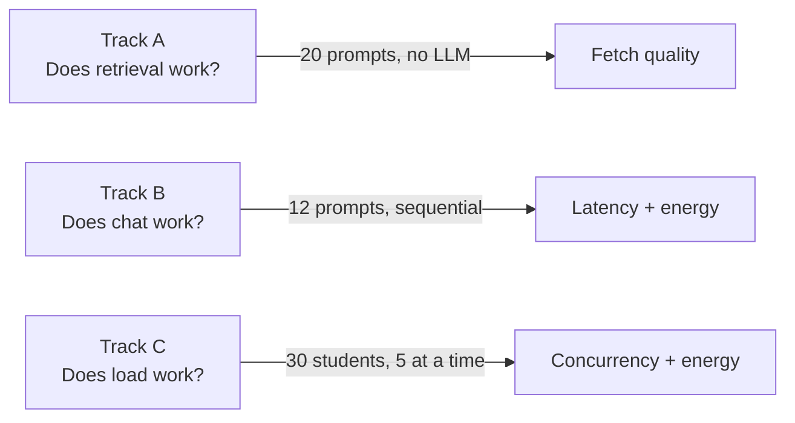
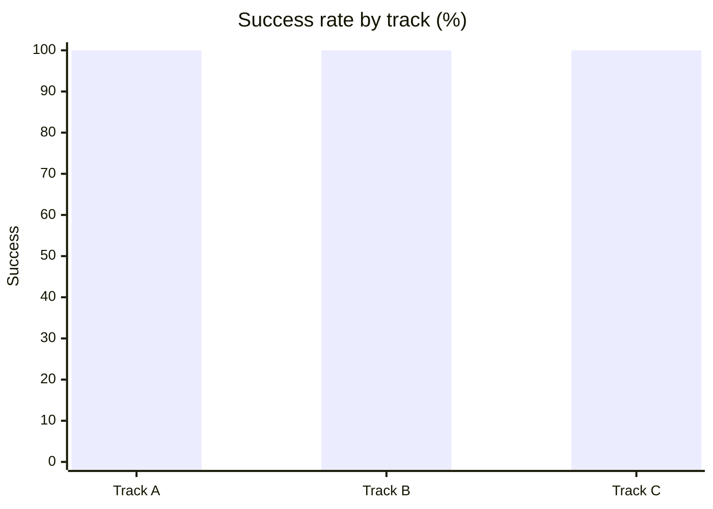
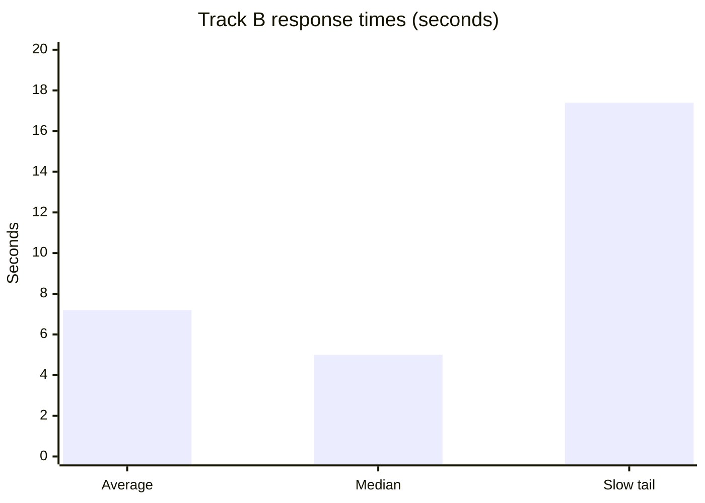
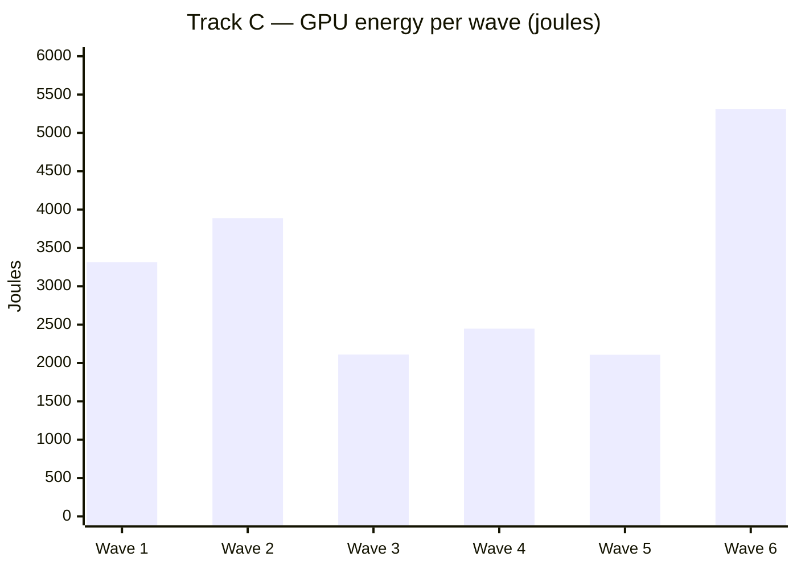
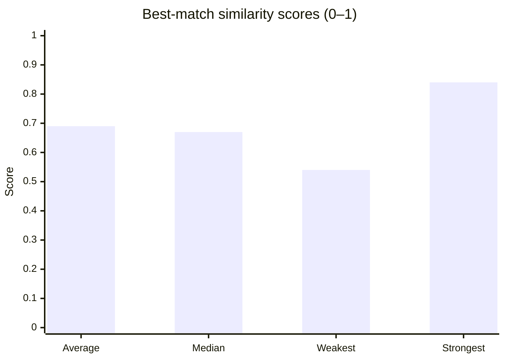
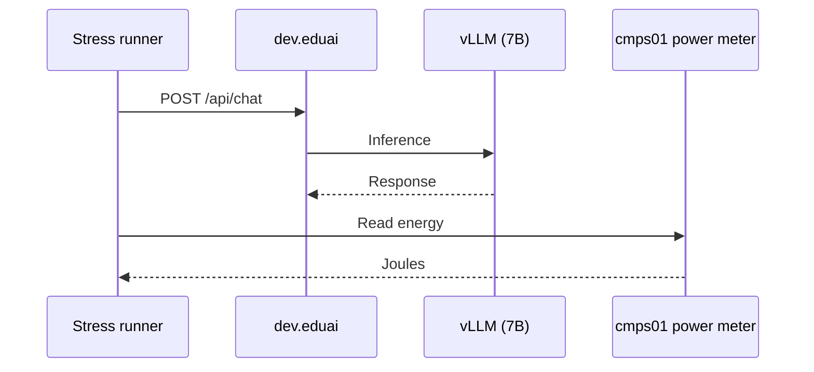

# Issue #501 — Trimmed RAG Stress Test

**EduAI URA · June 2026**

| | |
|---|---|
| **Environment** | `dev.eduai.ok.ubc.ca` (s378) |
| **Pipeline** | `latest` — `feat/501-rag-stress-test` @ `02c8929a` |
| **Model** | Qwen 2.5 7B (fixed, no auto-routing) |
| **Energy** | cmps01 GPU power meter (`:8001/energy`) |
| **Issue** | [GitHub #501](https://github.com/EduAI-Lab/EduAICoreLearning/issues/501) |

> **Interactive slides:** [issue-501-trim-report.canvas.tsx](file:///C:/Users/SyedS/.cursor/projects/c-Users-SyedS-Documents-UBCO-Courses-URA-EduAICoreLearning/canvases/issue-501-trim-report.canvas.tsx)

---

## Bottom line

We ran a **15–30 minute** stress test of the latest RAG pipeline on dev. **All chat and load tests passed.** RAG fetch quality on **COSC 121** (the only course with indexed materials on dev) was **strong across all 20 prompts**. A **main-baseline** run on my.eduai is still needed before we can claim pipeline improvements.

| Result | Value |
|--------|------:|
| Sequential chat success (Track B) | **12 / 12** |
| Classroom load success (Track C) | **30 / 30** |
| RAG chunk fetch success (Track A, COSC 121) | **20 / 20** |
| Average best-chunk match score (Track A) | **0.69** (scale 0–1) |
| Combined GPU energy (B + C) | **~45 kilojoules** |
| Latest vs main comparison | **Not yet run** |

---

## What we tested

Three tracks, each answering a different question:



| Track | Question | Volume | Measures fetch quality? |
|-------|----------|--------|:-----------------------:|
| **A** — Retrieval | Can we find relevant course chunks? | 20 prompts, COSC 121 only | **Yes** |
| **B** — Sequential chat | Does `/api/chat` work end-to-end? | 12 prompts | No |
| **C** — Classroom load | Can we handle concurrent students? | 30 students | No |

Track A used **COSC 121 only** — the only course with uploaded and indexed materials on dev.

**Scope vs full #501:** We skipped the 32B model, 96-prompt sweep, and 100-student stress tests to fit a single meeting slot.

---

## Results summary



| | Track A | Track B | Track C |
|---|:---:|:---:|:---:|
| **Passed** | 20/20 fetches | 12/12 chats | 30/30 students |
| **Median response time** | 100 ms | 5.0 s | 6.1 s |
| **Slow tail (95th percentile)** | 132 ms | 17.4 s | 13.3 s |
| **GPU energy** | — | ~25.8 kJ | ~19.2 kJ |

*95th percentile = only 5% of requests were slower than this value.*

---

## Finding 1 — Chat and classroom load are stable

Tracks B and C exercise the full `/api/chat` path under sequential and concurrent load. **Every request succeeded.**

### Track B — 12 sequential prompts (7B)

| Metric | Result |
|--------|--------|
| Success | **12 / 12 (100%)** |
| Average response time | 7.2 s |
| Median response time | **5.0 s** |
| Slow tail (95th percentile) | **17.4 s** |
| Fastest / slowest | 1.7 s / 17.4 s |
| Energy per prompt | ~2,149 joules |
| Total GPU energy | **~25.8 kilojoules (~7.2 watt-hours)** |



### Track C — 30 students, 5 at a time

| Metric | Result |
|--------|--------|
| Success | **30 / 30 (100%)** |
| Total wall time | **59 seconds** (6 waves) |
| Average response time | 6.3 s |
| Median response time | **6.1 s** |
| Slow tail (95th percentile) | **13.3 s** |
| Longest single response | 15.3 s |
| Total GPU energy | **~19.2 kilojoules (~5.3 watt-hours)** |



Track B and C are **reliability and performance** tests. They are not scored on fetch quality.

---

## Finding 2 — RAG fetch quality (COSC 121)

Track A calls `findRelevantContent` directly — no language model — so results isolate **whether the right course material is found**.

### Fetch success

| Metric | Result | What it means |
|--------|--------|---------------|
| **Chunk fetch rate** | **20 / 20 (100%)** | Every prompt returned at least one chunk |
| **Chunks per query** | **6** | Full result set returned each time |
| **Errors** | **0** | No database or embedding failures |

### Match quality (similarity scores)

Each query is compared to stored chunks. The **best match score** (0 = unrelated, 1 = near-identical) measures how closely the top chunk fits the question. We use **0.5** as the minimum acceptable match.

| Metric | Result | What it means |
|--------|--------|---------------|
| **Strong match rate** (score ≥ 0.5) | **20 / 20 (100%)** | Top chunk cleared the quality bar every time |
| **High-confidence matches** (score ≥ 0.7) | **8 / 20 (40%)** | Top chunk was a close semantic fit |
| **Very strong matches** (score ≥ 0.8) | **3 / 20 (15%)** | Top chunk was an excellent fit |
| **Average best-match score** | **0.69** | Typical relevance across all prompts |
| **Median best-match score** | **0.67** | Half of prompts scored above this |
| **Strongest match** | **0.84** | Test-driven development prompt |
| **Weakest match** | **0.54** | Operator overloading prompt (still above threshold) |



### Which course materials were fetched?

The top-ranked chunk came from **5 different COSC 121 units**:

| Course material (top match) | Times ranked #1 |
|-----------------------------|----------------:|
| Recursion & binary search | 7 |
| Data structures (arrays & linked lists) | 4 |
| Object-oriented programming & encapsulation | 4 |
| Testing & test-driven development | 3 |
| Algorithm analysis & linear search | 2 |

This shows retrieval pulls from **multiple units** across the course, not a single document every time.

### Fetch speed

| Metric | Result |
|--------|--------|
| Average fetch time | 100 ms |
| Median fetch time | 100 ms |
| Slow tail (95th percentile) | 132 ms |
| Fastest fetch | 49 ms |
| Slowest fetch | 176 ms |

### Quality caveat

Similarity scores measure **semantic closeness**, not guaranteed teaching correctness. For example, the polymorphism question matched the recursion unit at **0.59** — above threshold, but not the ideal source. **Human spot-checks** on a sample of prompts are recommended before claiming answer grounding quality.

---

## Finding 3 — GPU energy is measurable



| | Detail |
|---|--------|
| **Source** | GPU power integration on cmps01 (inference host) |
| **Path** | nginx port 8001, `/energy` route |
| **Granularity** | Per prompt (Track B), per wave (Track C) |
| **Limitation** | Language model did not return token counts — energy per token was not available |

| Track | Total GPU energy |
|-------|----------------:|
| B (12 prompts) | ~25.8 kilojoules |
| C (30 students) | ~19.2 kilojoules |
| **Combined** | **~45 kilojoules** |

---

## What's still open

| Priority | Action | Why |
|:--------:|--------|-----|
| **1** | Run **main-baseline** trim on my.eduai | Required for latest vs main comparison |
| **2** | Run compare script | Side-by-side table for issue #501 |
| **3** | Enable token usage in model responses | Unlock energy-per-token metrics |
| **4** | Optional: index more dev courses | Broader cross-course fetch evaluation |
| **5** | Optional: full #501 batch | 32B model, 96 prompts, 100-student stress |

**Cannot claim yet:** "Latest pipeline improves retrieval" — we only have latest results.

---

## Standup one-liner

> Latest trim on dev: **100% chat success**, **~45 kilojoules GPU energy captured**, **20/20 RAG fetches on COSC 121** with **0.69 average match score**. Main baseline still needed for comparison.

---

## Appendix

### Data files

```
docs/research/data/runs/issue-501-trim/
  track-a-latest-cosc121.jsonl      ← RAG fetch quality
  track-a-latest-cosc121-summary.txt
  track-b-7b-latest.jsonl           ← chat + energy
  track-c1-7b-latest.jsonl          ← classroom load + energy
  track-c1-7b-latest.txt
```

Server log: `/tmp/issue-501-trim-latest.log` on s378

### Track B prompt IDs (fixed for reproducibility)

`ts-020, ts-023, ts-025, ts-033, ts-044, ts-047, ts-070, ts-075, ts-081, ts-087, ts-104, ts-111`

### Reproduce Track A (COSC 121) on dev

```bash
cd apps/core
set -a && . ./.env && set +a
export RESEARCH_PROMPTS_FILE=scripts/research/data/task-suite/prompts-cosc121-rag.v1.jsonl
export RESEARCH_RUN_LIMIT=20   # dev .env defaults to 2
export RESEARCH_EVAL_RAG_OUT=../../docs/research/data/runs/issue-501-trim/track-a-latest-cosc121.jsonl
npm run research:eval-rag
```

### Full trim runbook

See [`ISSUE_501_TRIM.md`](./ISSUE_501_TRIM.md) for commands, energy setup, and main-baseline instructions.

---

*URA team · Raw JSONL and reproduction steps available on request.*
