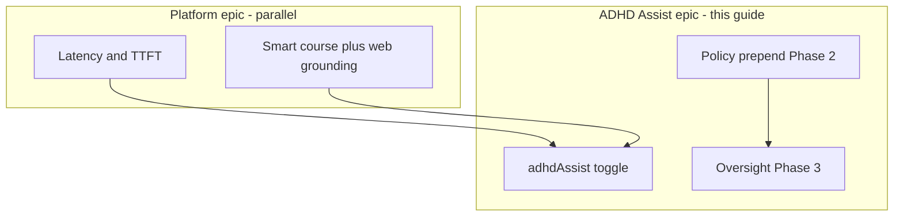
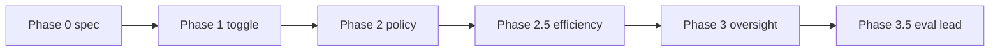
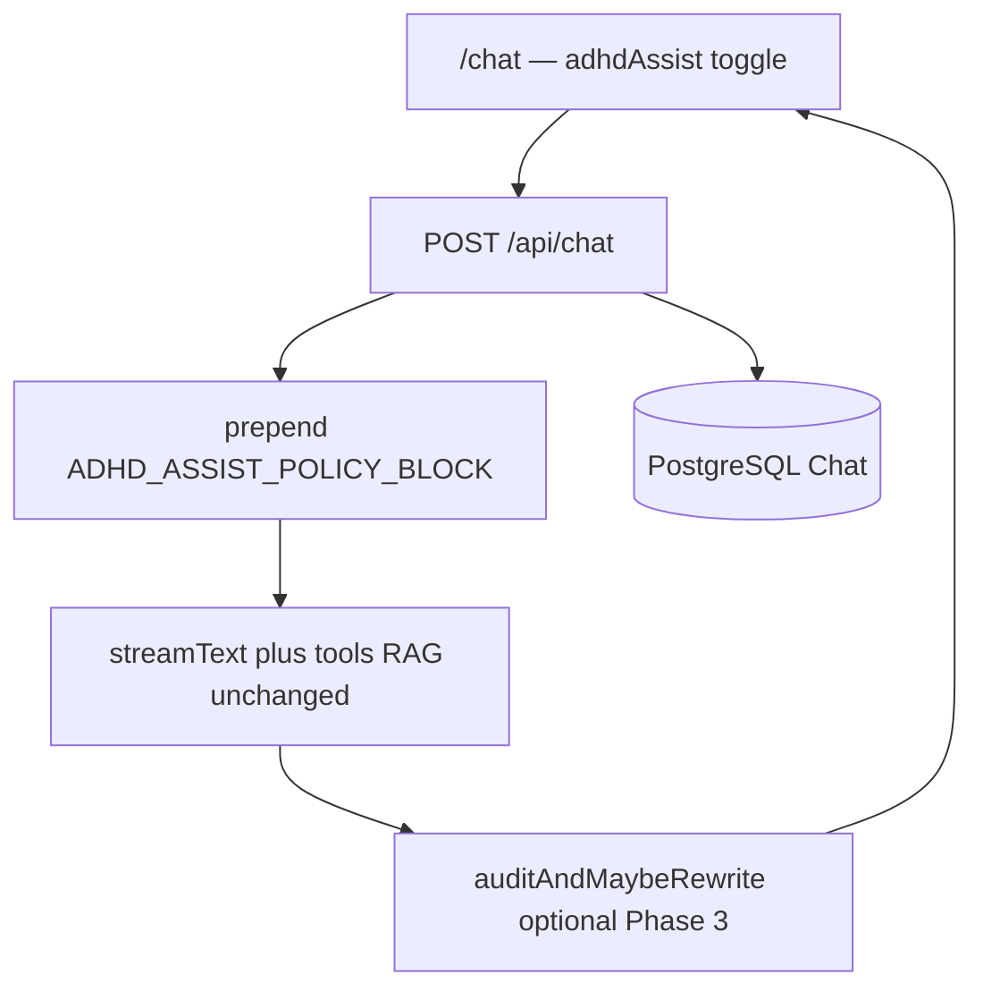

# EduAI — ADHD Assist (team guide)

**Audience:** EduAI development team  
**Repository:** EduAICore monorepo — app code in `apps/core`  
**Tracking:** GitHub Project + parent issue `#TBD` (create before sprint)  
**Start here for coding:** [`TEAM_PHASE_1_2_3_GUIDE.md`](./TEAM_PHASE_1_2_3_GUIDE.md)  
**Platform latency (assign to teammates):** [`TEAM_CHAT_LATENCY_SPRINT_GUIDE.md`](./TEAM_CHAT_LATENCY_SPRINT_GUIDE.md) · background: [`TEAM_CHAT_LATENCY_AND_TOOLS.md`](./TEAM_CHAT_LATENCY_AND_TOOLS.md)

---

## Context — why we are building this

**ADHD Assist** is a research-backed chat mode for the IURA Form A programme (RQ1–RQ3): same EduAI model, RAG, and tools as baseline, but with a **structured response policy** (Top summary, Step ladder, Next?) and optional **second-pass oversight** (RQ3).

It is **not** a new model or app. It is a **boolean toggle** + system-prompt prepend + (Phase 3) policy audit.

**What ADHD Assist is NOT:**

- A fix for chat latency or tool routing (see parallel doc above)
- A “disable tools for speed” switch
- A clinical diagnosis or surveillance product

---

## Context — platform problems the team must not ignore

The research lead tried to speed up chat on the **AI enhancement branch** (local Ollama: Gemma ~31B, DeepSeek). Results:

- **40–50 s** end-to-end waits were common — far from the **3–4 s** product goal.
- Most perceived delay: **server / model load** before the UI shows text (poor time-to-first-token).
- In `apps/core/app/routes/api/chat.ts`, when `modelSupportsTools` is **false**, the API uses a faster **hybrid_rag** path without `webSearch` / `getInformation` tools → fast but **not** full course-aware EduAI.
- When tools are **on**, behaviour is correct but slow; tightening the prompt to “only search when the user says search the web” made it faster but **broke** normal course questions.

**Team rule:** Do not conflate **`adhdAssist`** with disabling tools. Any latency work happens under the **Chat latency & tools** epic ([`TEAM_CHAT_LATENCY_AND_TOOLS.md`](./TEAM_CHAT_LATENCY_AND_TOOLS.md)), with rows logged in [`../model-latency-tracker.md`](../model-latency-tracker.md).

---

## Context — how ADHD Assist phases map to the build

| Phase | Focus | Team outcome |
| ----- | ----- | ------------- |
| **0** | Spec freeze | Done — [`../literature/`](../literature/) |
| **1** | Toggle + plumbing | Visible toggle; `adhdAssist` E2E; **no** prompt change yet |
| **2** | Policy IV | Prepend `ADHD_ASSIST_POLICY_BLOCK`; word caps |
| **2.5** | Form A §3b efficiency | Bounded history; cap tool payloads — **helps latency** for long threads |
| **3** | RQ3 oversight | `auditAndMaybeRewrite()` — **adds ~1–3 s**; badge UX |
| **3.5** | Synthetic eval | **Research lead only** — expert rubrics, scenarios |
| **4–6** | Reflection, BREB QA, fine-tune | Later / conditional |

---

## Form A research questions (why Phase 3 is mandatory)

| RQ | Question | Code |
| -- | -------- | ---- |
| **RQ1** | What patterns support ADHD learners? | Principles + policy (P0–2) |
| **RQ2** | Does the model **maintain** patterns (drift)? | P2 + synthetic multi-turn (P3.5) |
| **RQ3** | Does **AI oversight** beat prompt-only? | P3 + ablation in P3.5 |

If Phase 3 slips, the IURA report must **narrow RQ3** — do not claim in-app oversight without shipping it.

---

## Architecture at a glance

**Manual rule:** Baseline vs Assist must use the **same** model, course, and tool configuration. Only `adhdAssist` and policy/oversight differ.

---

## Code map

| Area | Path |
| ---- | ---- |
| Chat UI | `apps/core/app/routes/chat.tsx` |
| Chat API | `apps/core/app/routes/api/chat.ts` |
| Tool vs hybrid branch | `supportsTools` check ~line 725 in `chat.ts` |
| Policy module (new) | `apps/core/app/lib/ai/adhd-assist.ts` |
| Tests (new) | `apps/core/app/lib/ai/__tests__/adhd-assist.test.ts` |
| Schema | `apps/core/prisma/schema.prisma` |
| Latency ledger | `docs/model-latency-tracker.md` |
| Chat persistence | `apps/core/docs/chat-history.md` |

---

## Task — what each role should know

### All developers

- Read [`TEAM_PHASE_1_2_3_GUIDE.md`](./TEAM_PHASE_1_2_3_GUIDE.md) before picking up issues.
- Read [`TEAM_CHAT_LATENCY_AND_TOOLS.md`](./TEAM_CHAT_LATENCY_AND_TOOLS.md) — at least the “two toggles” section.
- Branch: `feat/adhd-assist-mvp` (or name in parent issue).
- Every PR: link a GitHub issue; log latency row if touching `chat.ts`.

### Backend

- Own `chat.ts`, `adhd-assist.ts`, Prisma, oversight streaming path.

### Frontend

- Own toggle in `chat.tsx`, `useChat` body, a11y, survey screenshot alignment (“top of homepage chat” = `/chat`).

### Research lead (not junior backlog)

- Phase 3.5 eval, Form A, expert rubrics, [`../literature/form-a-*`](../literature/).
- Facilitate **latency/tools** design meeting (options in discussion doc).

---

## Decisions already made (implement as written)

| Topic | Decision |
| ----- | -------- |
| IV | Same model, RAG, tools; only `adhdAssist` + policy differ |
| Policy text | Verbatim §3 in code — [`../literature/adhd-assist-prompt-policy.md`](../literature/adhd-assist-prompt-policy.md) |
| Persistence | `Chat.adhdAssist` column, default `false` |
| Phase 1 | Flag only — **identical** output on/off |
| Tools | **Never** turn off globally for ADHD Assist |
| Phase 4 reflection | **Off** for study builds (default) |
| Latency regression | See discussion doc — 15% rule on S1 probe |

---

## Roadmap after MVP (separate epics)

| Epic | Owner | Depends on |
| ---- | ----- | ---------- |
| **Chat latency & smart grounding** | **Teammates (this week)** | [`TEAM_CHAT_LATENCY_SPRINT_GUIDE.md`](./TEAM_CHAT_LATENCY_SPRINT_GUIDE.md) |
| **Phase 2.5** efficiency | Backend | Phase 2 merged |
| **Phase 4** reflection | Product + research | BREB scope |
| **Model routing (Auto)** | Sibling project | Friend’s routing plan — do not duplicate |

---

## Related documents

| Document | Purpose |
| -------- | ------- |
| [`TEAM_PHASE_1_2_3_GUIDE.md`](./TEAM_PHASE_1_2_3_GUIDE.md) | Sprint steps 00–14 |
| [`TEAM_CHAT_LATENCY_AND_TOOLS.md`](./TEAM_CHAT_LATENCY_AND_TOOLS.md) | 40–50 s local, tools trade-off, team options |
| [`../literature/adhd-assist-architecture-phases.md`](../literature/adhd-assist-architecture-phases.md) | Full PI spec |
| [`../literature/adhd-assist-prompt-policy.md`](../literature/adhd-assist-prompt-policy.md) | Verbatim policy + oversight |
| [`../model-latency-tracker.md`](../model-latency-tracker.md) | TTFT/Total measurements |

---

*Last updated: 2026-05-19*
