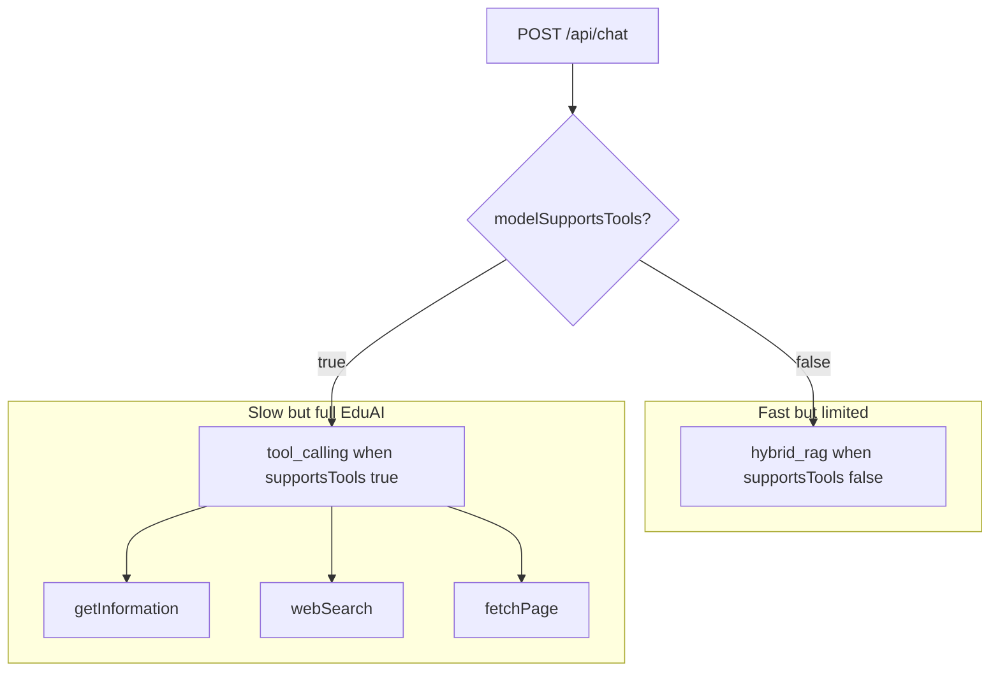
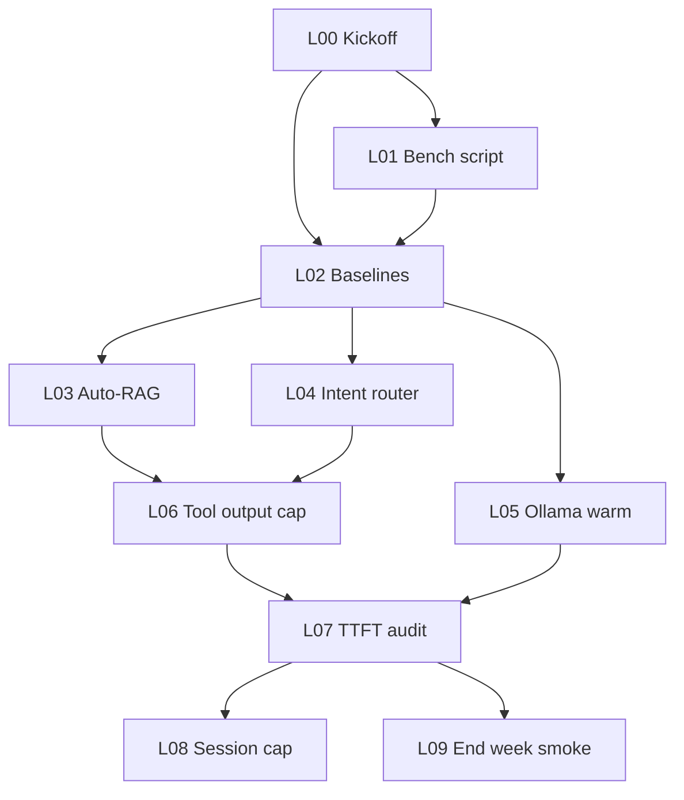

# EduAI chat latency — team sprint guide (this week)

**Audience:** Teammates implementing **faster chat** (you are **not** on ADHD Assist — lead owns that separately)  
**Parent issue:** [#203 — Chat latency & smart grounding sprint](https://github.com/EduAI-Lab/EduAI/issues/203)  
**Related:** [#195](https://github.com/EduAI-Lab/EduAI/issues/195) (small-model tools), [#196](https://github.com/EduAI-Lab/EduAI/issues/196) (TTFB investigation)  
**Discussion / context:** [`TEAM_CHAT_LATENCY_AND_TOOLS.md`](./TEAM_CHAT_LATENCY_AND_TOOLS.md)  
**Measurement ledger:** [`../model-latency-tracker.md`](../model-latency-tracker.md)  
**Base branch:** `feat/local-models-and-ai-enhancement` (merged work from `AI-enhancement`) — **build on top of this**, do not restart from scratch unless PI says so  
**Target branch for PRs:** `feat/chat-latency-week` (create from base above)  
**Product goal:** Typical turns feel **~3–4 s** where possible; **first visible token** early; course + web still work **without** magic phrases like “search the web”

---

## What the lead already shipped (read before coding)

Most of this landed in commit **`c158023`** (`feat(chat): tool error envelopes, RAG/env tuning, materials admin access, observability`) on the AI enhancement line, now on **`feat/local-models-and-ai-enhancement`**.

### Already in the codebase

| Area | What changed | Why it matters |
| ---- | ------------- | -------------- |
| **`apps/core/app/routes/api/chat.ts`** | `TOOL_MAX_STEPS` default **3** (env `CHAT_TOOL_MAX_STEPS`); tightened system prompt (“prefer ZERO tool calls”) | Cut speculative tool chains (~11 s → ~3 s on **cloud** Gemini in May session) |
| | `CHAT_LLM_MAX_RETRIES` (default 2 → up to 3 HTTP tries); set **`CHAT_LLM_MAX_RETRIES=0`** on free tier | Stops burning quota on 429 retries |
| | Hybrid RAG caps: `CHAT_HYBRID_RAG_MAX_CHUNKS`, `CHAT_HYBRID_RAG_MAX_CONTEXT_CHARS`, `CHAT_TOOL_RAG_MAX_CHARS_PER_CHUNK` | Stops huge course blobs from flooding the model |
| | `buildCappedRagContextText` / `capRagHitsForTool` | Bounded context for local LLM prefill |
| | Parallel **course + chat** Prisma lookups before LLM | Saves ~30–150 ms TTFT on first message |
| | **`await` user message persist** before `streamText` | Durability; slight add vs fire-and-forget |
| | Tool path uses `runTool` / `toolError` envelope | No stuck “Ready” tool card on missing Firecrawl / course |
| | `formatChatStreamError` + APICallError details to client | Easier debugging slow/failed streams |
| **`apps/core/app/lib/ai/tool-result.ts`** | New — structured tool errors + `logToolOutcome` | Production-safe failures |
| **`apps/core/app/lib/ai/tools/web-search.ts`**, **`fetch-page.ts`** | Return envelopes instead of throwing | Same |
| **`apps/core/app/lib/ai/warmup.server.ts`** | Boot-time embedding call for HTTPS keepalive | Cold TCP/TLS on first embedding |
| **`apps/core/app/lib/ai/providers.ts`** | 5-minute cache for `modelSupportsTools` | Avoid DB hit every turn |
| **`apps/core/app/lib/prisma.server.ts`** | Boot connection warmup | Faster first DB read |
| **`apps/core/app/routes/chat.tsx`** | `getEffectiveParts` + typing phases (“Searching…”) | UX during tool latency |
| **`apps/core/app/components/chat/chat-input.tsx`** | Submit lock + disable while loading | Fewer duplicate sends |
| | Error `Alert` on failed stream | |
| **`docs/model-latency-tracker.md`** | Live probe table + FAQ | Operational record |

### Measured results (cloud — May 2026, see ledger)

| Probe | Before (approx.) | After (approx.) |
| ----- | ---------------- | --------------- |
| Simple factual (no tools) | ~11 s cold | **~2.6–3.3 s** |
| Web search turn | stuck / broken | **~4–6 s** |
| Long chat summary | — | **~9.9 s** (context size) |

### Still broken (why this sprint exists)

| Problem | Detail |
| ------- | ------ |
| **Local Ollama (Gemma ~31B, DeepSeek)** | Lead still sees **40–50 s** total; fixes above helped **cloud** more than local |
| **Server wait before UI text** | Feels like “waiting for server to load” / no early tokens |
| **Tool vs speed trade-off** | `supportsTools: true` → full tool path (slow but correct); `false` → fast hybrid RAG only, **no web** |
| **Course/web UX** | Students must say “search the web” / “check course materials” unless heuristics fire |
| **Prompt-only workaround** | “Only call tools when user explicitly asks” → faster but breaks ~90% course-aware usage |

**Forbidden fix:** Globally disable tools or set all models `supportsTools: false` to hit 3–4 s.

### Optional asset to restore

Commit **`de20b42`** added `apps/core/scripts/chat-latency-bench.mjs` + npm script — **may not be on your branch**. Cherry-pick or copy from that commit if missing; needed for step **L01**.

---

## Architecture reminder

**Sprint goal:** Make the **tool_calling** path feel closer to hybrid speed **without** losing course + web when appropriate.

---

## This week — steps for teammates

**Rough squad budget:** ~**15–25 h** across 2–3 devs (parallel where noted).  
**Done when:** Ledger rows prove improvement on **both** (1) cloud Gemini S1 probe and (2) local Ollama S1 probe, plus one course-RAG and one web probe — without disabling tools.

---

## Step L00 — Kickoff & branch

**GitHub:** [#204](https://github.com/EduAI-Lab/EduAI/issues/204) · **Size:** S (~1h)

### Context

Lead owns ADHD Assist separately. Your epic is **platform speed + smart grounding** only.

### Task

1. Read [`TEAM_CHAT_LATENCY_AND_TOOLS.md`](./TEAM_CHAT_LATENCY_AND_TOOLS.md) and the “Already shipped” section above.
2. `git fetch` && checkout `feat/local-models-and-ai-enhancement` (or latest team integration branch).
3. Create `feat/chat-latency-week` from that tip.
4. Record `git rev-parse --short HEAD` in the parent issue.

### Done when

- Branch pushed; everyone on same SHA.

---

## Step L01 — Latency benchmark script in repo

**GitHub:** [#205](https://github.com/EduAI-Lab/EduAI/issues/205) · **Size:** S (~1–2h) · **Blocked by:** #204

### Context

Repeatable numbers beat gut feel. Script existed in **`de20b42`**; restore if missing.

### Task

1. Add `apps/core/scripts/chat-latency-bench.mjs` (from commit `de20b42` or equivalent).
2. Add npm script in `apps/core/package.json`, e.g. `"chat:latency-bench": "node ./scripts/chat-latency-bench.mjs"`.
3. Document env vars in `apps/core/.env.example` (`CHAT_BENCH_URL`, `CHAT_BENCH_MODEL`, `CHAT_BENCH_API_KEYS`, optional `CHAT_BENCH_COURSE_CODE`).
4. Run once against local dev; paste summary (median ms) into parent issue.

### Done when

- Teammate can run bench without asking lead for curl recipes.

---

## Step L02 — Baseline matrix (cloud + local)

**GitHub:** [#206](https://github.com/EduAI-Lab/EduAI/issues/206) · **Size:** S (~2h) · **Blocked by:** #205

### Context

We need before/after on the **same** prompts and models.

### Task

Run and append rows to [`../model-latency-tracker.md`](../model-latency-tracker.md):

| Probe ID | Prompt (short) | Model | Course | supportsTools path |
| -------- | -------------- | ----- | ------ | ------------------- |
| **S1** | What is gradient descent? | `google:gemini-2.5-flash` | none | tool_calling |
| **S1-local** | Same | `ollama:…` (team default) | none | tool_calling |
| **C1** | What did chapter 3 say about X? | same local | **selected** | tool_calling |
| **W1** | Find recent papers on gradient descent | same local | none | tool_calling |

Capture **TTFT** (stopwatch or Network) and **Total** per [`model-latency-tracker.md`](../model-latency-tracker.md).

### Done when

- Four rows with git SHA; note if Total > 10 s on local (expected problem statement).

---

## Step L03 — Auto-RAG when course is selected (spike)

**GitHub:** [#207](https://github.com/EduAI-Lab/EduAI/issues/207) · **Size:** M (~4h) · **Blocked by:** #206 · **Owner:** backend

### Context

Today, tool-capable models only get course context if the model calls `getInformation` or user uses magic words. Hybrid path auto-injects RAG when `courseCode` is set but **only** when `supportsTools === false`.

### Task

In `apps/core/app/routes/api/chat.ts` **tool_calling** branch:

1. If `effectiveCourseId` is set, run `findRelevantContent` **before** `streamText` (same caps as hybrid).
2. Inject capped excerpts into the system prompt (reuse `buildCappedRagContextText`).
3. Keep tools registered; prompt: “Course excerpts already provided; use `getInformation` only if excerpts are insufficient.”
4. Measure **C1** probe before/after.

### Done when

- With course selected, “What did chapter 3 say…” works **without** the phrase “check course materials”.
- No regression on S1 Total > 15% on cloud.

---

## Step L04 — Lightweight intent routing (web vs chat-only)

**GitHub:** [#208](https://github.com/EduAI-Lab/EduAI/issues/208) · **Size:** M (~4h) · **Blocked by:** #206 · **Owner:** backend

### Context

90% of turns need course and/or web, but not every turn. Speculative `webSearch` is expensive.

### Task

Add `apps/core/app/lib/ai/chat-intent.ts` (name flexible) with pure functions, e.g.:

- `needsWebSearch(message): boolean` — recent/current/events/papers/news URL patterns.
- `needsCourseRag(message, hasCourse): boolean` — extend beyond hybrid keyword list.

In `chat.ts`, when `supportsTools`:

- Optionally pass a **subset** of tools OR add a system-line hint: “Web tools enabled for this turn” vs disabled.
- **Do not** remove tools entirely for course-selected turns.

Document rules in PR; add unit tests for 10 example strings.

### Done when

- S1 does **not** call webSearch.
- W1 **does** call webSearch without user saying “search the web”.
- Unit tests pass.

---

## Step L05 — Local Ollama: warm model & dev defaults

**GitHub:** [#209](https://github.com/EduAI-Lab/EduAI/issues/209) · **Size:** S (~2h) · **Blocked by:** #206 · **Owner:** infra / backend

### Context

40–50 s on 31B is often **model load + generation**, not TypeScript. Smaller default + keep-alive helps dev iteration.

### Task

1. Document in `docs/team/` or README: `ollama run <model>` keep-alive, GPU memory, first-token expectations.
2. Propose seed/admin default for **local dev**: e.g. `deepseek-r1:8b` for speed tests, `gemma` 31B for quality tests — separate profiles.
3. Optional: env `OLLAMA_KEEP_ALIVE` / compose note if team uses Docker.
4. Re-run **S1-local** after warm model; log row.

### Done when

- Written runbook + one measured warm vs cold row in ledger.

---

## Step L06 — Shrink tool payloads before next model step

**GitHub:** [#210](https://github.com/EduAI-Lab/EduAI/issues/210) · **Size:** M (~3h) · **Blocked by:** #207 or #208

### Context

Large Firecrawl JSON or RAG dumps force slow second steps (see 9.9 s summary turn).

### Task

1. After each tool returns, summarize or truncate structured result before appending to the model context (cap e.g. 2–4k chars per tool — tune via env).
2. Reuse / extend `capRagHitsForTool` patterns.
3. Re-run **W1** and long-thread summary probe; log Total.

### Done when

- Tool turn Total improves measurably OR documented trade-off in PR.

---

## Step L07 — TTFT / streaming audit

**GitHub:** [#211](https://github.com/EduAI-Lab/EduAI/issues/211) · **Size:** M (~3h) · **Blocked by:** #206 · **Owner:** frontend + backend pair

### Context

Lead perceived delay before **any** text appears — may be server buffering, not model only.

### Task

1. DevTools: measure “Waiting for server response” vs first streamed chunk on `/api/chat`.
2. Confirm `toolCallStreaming` / AI SDK path forwards partial tokens when tools are idle.
3. If first byte is late only when tools run, improve typing indicator copy (already partially done in `chat.tsx`).
4. File issue if proxy/nginx buffers streaming (document host).

### Done when

- Short report in parent issue: where TTFT is spent (DB / embed / tools / model).
- One screenshot of Network timing tab.

---

## Step L08 — Session context cap (long threads)

**GitHub:** [#212](https://github.com/EduAI-Lab/EduAI/issues/212) · **Size:** M (~4h) · **Blocked by:** #211 · **Label:** optional if week runs long

### Context

`MAX_CONTEXT_MESSAGES = 20` + full tool outputs → slow “summarise this chat” turns.

### Task

1. Rolling summary or stricter trim of old tool messages before `streamText`.
2. Env-tunable `CHAT_MAX_CONTEXT_MESSAGES` or char budget.
3. Re-run long-thread probe from latency doc (~9.9 s case); target meaningful drop.

### Done when

- Documented env knobs + one ledger row.

---

## Step L09 — End-of-week smoke & handoff

**GitHub:** [#213](https://github.com/EduAI-Lab/EduAI/issues/213) · **Size:** S (~2h) · **Blocked by:** #207–#211 (whatever merged)

### Task

Checklist on parent issue:

- [ ] S1 cloud ≤ **4 s** warm Total (or documented why not)
- [ ] S1-local improved vs L02 baseline **or** documented hardware limit
- [ ] C1 works without magic course phrase
- [ ] W1 works without “search the web”
- [ ] No global `supportsTools: false` hack
- [ ] All PRs link sub-issues; ledger updated

### Done when

- Lead can demo to PI with numbers, not adjectives.

---

## Code map (quick reference)

| Area | Path |
| ---- | ---- |
| Chat API (main surgery) | `apps/core/app/routes/api/chat.ts` |
| Hybrid vs tools branch | ~line 725 `modelSupportsTools` |
| Tool envelope | `apps/core/app/lib/ai/tool-result.ts` |
| Web / fetch tools | `apps/core/app/lib/ai/tools/` |
| Embeddings / RAG | `apps/core/app/lib/ai/embedding.ts` |
| Boot warmup | `apps/core/app/lib/ai/warmup.server.ts` |
| Chat UI / TTFT perception | `apps/core/app/routes/chat.tsx` |
| Bench script (restore) | `apps/core/scripts/chat-latency-bench.mjs` |
| Env knobs | `apps/core/.env.example` |

---

## How to pick up work

1. Claim **#204–#213** on parent [#203](https://github.com/EduAI-Lab/EduAI/issues/203); do **not** pick ADHD Assist issues.
2. Branch `feat/chat-latency-week` from `feat/local-models-and-ai-enhancement`.
3. Every PR: **Context → Task → Done when**; append latency rows.
4. Questions on product trade-offs → lead. Ollama hardware → infra.

---

## Relationship to other docs

| Doc | Who uses it |
| --- | ----------- |
| [`TEAM_ADHD_ASSIST_PLAN.md`](./TEAM_ADHD_ASSIST_PLAN.md) | Lead only (this week) |
| [`TEAM_PHASE_1_2_3_GUIDE.md`](./TEAM_PHASE_1_2_3_GUIDE.md) | Lead reference / later |
| **This file** | **Teammates — latency sprint** |
| [`TEAM_CHAT_LATENCY_AND_TOOLS.md`](./TEAM_CHAT_LATENCY_AND_TOOLS.md) | Background + open decisions L1–L5 |

---

*Last updated: 2026-05-19 — built from `c158023` / AI-enhancement work + lead local Ollama findings.*
