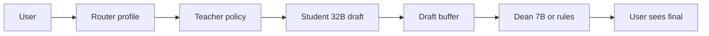

# ADHD Assist — week progress brief (prof presentation)

**Study:** H26-00906 · **Form A** RQ1–RQ3 · **Week of June 15–22, 2026**  
**Full metrics:** [`h26-track-b-participant-metrics.md`](./h26-track-b-participant-metrics.md)

---

## 1. What we did (research + build)

### Research programme (two tracks)

| Track | What | Status |
| ----- | ---- | ------ |
| **Track A — Form A / IURA** | Synthetic scenarios + expert rubric + three-arm ablation (Baseline / Assist prompt-only / Assist + oversight) | Eval harness shipped ([#645](https://github.com/EduAI-Lab/EduAI/pull/645)); ~95% structural pass with oversight |
| **Track B — BREB humans** | Within-person Qualtrics: NASA-TLX, SUS, comprehension, preference | **5 finished** / 7 started (preview distribution) |

### What we built in EduAI

1. **ADHD Assist toggle** — same model, RAG, tools; only response **style** differs (IV).
2. **Policy block (Teacher)** — literature-derived rules: Top summary, Step ladder, **Next?**, word caps, drift redirect ([`adhd-assist-design-pillars.md`](../../../docs/literature/adhd-assist-design-pillars.md)).
3. **Phase 3 oversight (Dean)** — `auditAndMaybeRewrite()` second pass before the user sees text.
4. **Turn profiles (Router, PR #714)** — classify turn *before* generation; structure only on tutoring/clarification, not on “hi” or redirect.
5. **Cross-chat digest (PR #720)** — prior-thread summary when starting a new chat.
6. **Model sizing study** — 7B vs 32B Student/Dean roles on dev vLLM ([`model-role-sizing-findings.md`](./model-role-sizing-findings.md)).

### Struggles we overcame

- **Latency ≠ ADHD Assist** — 40–50 s waits were Ollama 31B/120B infra, not the toggle. Split epics; never disable tools for Assist.
- **Prompt-only drift** — policy alone ~80% compliance; ~20% fails on multi-turn / step ladders without Dean.
- **One-size-fits-all structure** — forcing Top summary on greetings and redirect turns hurt UX; fixed with turn profiles.
- **False “full history”** — system prompt claimed memory new chats didn’t have; fixed with bounded prior-chat digest.

---

## 2. Research findings

### A. Literature → design (RQ1)

| Paper | Finding | → Our design |
| ----- | ------- | ------------ |
| **Zhu et al. CHI’26** (ADHD co-design) | Bullets, limited agenda, progressive tasks, gentle redirect | Top summary, Next?, single-focus |
| **Cowan / Sweller (CLT)** | ~3–5 WM chunks | 250-word cap |
| **W3C COGA** | Dense text = extraneous load | Markdown structure, bold terms |
| **SocraticLM (NeurIPS’24)** | **Dean** revises Teacher on policy violation | Phase 3 oversight |
| **LEAP (ICLR’25)** | Privileged teacher sees **full draft** before emit; audit then ship | **Draft buffer layer** (below) |
| **Can LMs Teach (NeurIPS’23)** | Misaligned teacher harms trajectory | Second pass mandatory for RQ3 |
| **Science Tutors (ICML’24)** | Style-only tuning risks wrong facts | Oversight changes **structure only** |

### B. Synthetic / expert — Track A

| Metric | Baseline | Assist (prompt) | Assist + oversight |
| ------ | -------- | --------------- | ------------------ |
| Structural predictability (E2) | 2.4 | 4.6 | **~4.9** |
| Structural pass rate | ~15% | ~80% | **~95%** |
| S2 drift (tax injection) | Merged topics | Redirect held | Redirect + **Next?** |

Source: [`expert-scores-external-claude.md`](./expert-scores-external-claude.md), [`qa-checklist-policy-s9-results.md`](./qa-checklist-policy-s9-results.md)

### C. Human participants — Track B (n=5 finished)

| Finding | Result |
| ------- | ------ |
| Prefer Assist (Q23) | **4/5** (1 no preference) |
| Easier to scan (Q25) | **5/5** Assist |
| Back on task (Q24) | **4/5** Assist |
| Comprehension | Assist **+0.8** (1–7), Cohen's d ≈ **−0.30** (small) |
| TLX workload (aggregate) | **Flat** (2.95 vs 3.05) |
| SUS (aggregate) | **Flat** (69.7 vs 66.7) |

**Honest read:** Preference and comprehension favor Assist; workload/SUS are **mixed** at n=5. P1 showed strong wins (+20 SUS, −29% TLX); one participant preferred Assist in words but rated **higher** Assist workload.

### D. Model routing — 7B vs 32B (June 19–21)

Tested on dev vLLM (`qwen2.5-7b` vs `qwen2.5-32b-instruct`):

| Role | 7B | 32B |
| ---- | -- | --- |
| **Student** (first draft + tools) | Fast (~2–4 s warm); **failed S2 step ladder** even with Assist + Dean | **Only tier with tool calling** on dev; passes multi-step structure |
| **Teacher** (policy in system prompt) | Same model as Student | Stronger instruction-following for caps/ladder |
| **Dean** (oversight rewrite) | Good **candidate** for v2 (narrow formatting task) | Overkill; many fixes are **deterministic** (no LLM) |
| **Ollama 31B / 120B** | — | **40–50 s** — ruled out for interactive chat |

**Recommendation (v2, not fully shipped):**

```
Router (rules) → 32B Student+Teacher on tutoring turns → 7B or rules-only Dean → user
                 → skip Dean on greeting / confirmation / meta
                 → 7B Student optional for short, tool-free Q&A
```

Tracked: epic [#715](https://github.com/EduAI-Lab/EduAI/issues/715) — separate `ADHD_OVERSIGHT_MODEL` ([#716](https://github.com/EduAI-Lab/EduAI/issues/716)), profile-based Student routing ([#717](https://github.com/EduAI-Lab/EduAI/issues/717)).

---

## 3. Fixes we implemented (from findings + papers)

### Fix 1 — Full-draft buffer before Dean (LEAP + SocraticLM)

**Problem:** Streaming first-pass tokens to the user let policy violations appear live; Dean couldn’t audit a complete answer.

**Paper basis:** LEAP “privileged teacher” and SocraticLM Dean both require the **complete draft** as input to the review step — not token-by-token oversight.

**What we shipped (Phase 3):**

```
User message
  → Router (turn profile)
  → Teacher policy prepended to system prompt
  → Student: streamText accumulates draft SERVER-SIDE ONLY
  → [FULL DRAFT BUFFER]  ← this layer
  → Dean: auditAndMaybeRewrite(draft)
  → User sees FINAL text only (policy-checked)
```

Code: `apps/core/app/routes/api/chat.ts` (~997–1032) · `adhd-oversight.ts`

**Cost:** ~1–3 s latency on tutoring turns; **skip Dean** on greeting/confirmation (v1 profiles).

---

### Fix 2 — Turn profiles before Teacher/Dean (Approach A, PR #714)

**Problem:** Dean enforced Top summary on every turn → wrong on redirects and “hi”.

**Fix:** Rules-based `resolveAdhdTurnProfile()` **before** policy slice and generation:

| Profile | Dean? | Top summary? |
| ------- | ----- | ------------ |
| `full_tutoring`, `brief_clarification` | yes if fail | yes |
| `redirect` | yes if fail | no (§5 drift template) |
| `greeting`, `confirmation`, `meta` | **no** | no |

---

### Fix 3 — Three-arm eval for RQ3 ([#645](https://github.com/EduAI-Lab/EduAI/pull/645))

`baseline` · `assist-prompt-only` · `assist-oversight` — same turns, only oversight delta for RQ3 evidence.

---

### Fix 4 — Participant-feedback policy v1.1 (PR #722, stacked on #714)

Anti-urgency, no condescension, `Sources:` footer, concept-first tutoring; `policy_version = "1.1"` on telemetry for cohort separation.

---

### Fix 5 — Cross-chat memory (PR #720)

Prior-thread digest on first turn of a new chat; system prompt no longer claims full history it doesn’t receive.

---

## 4. Demo / proof

### A. Live product demo (2 min)

1. Open **`/chat`** → toggle **Assistive mode On**.
2. Ask: *“Explain gradient descent simply.”*
3. **Baseline OFF:** prose paragraph, no signposts.
4. **Assist ON:** **Top summary** → **Step ladder** → **Next?**
5. **Drift probe:** *“Also explain tax brackets in the same answer as dish steps.”* → gentle redirect, no merge.

### B. Architecture slide (one diagram)



### C. Numbers slide

| Evidence | Headline |
| -------- | -------- |
| Track A oversight | **80% → ~95%** structural pass |
| Track B preference | **4/5** prefer Assist; **5/5** easier to scan |
| Track B comprehension | **+0.8** Assist (small d) |
| Model routing | **32B** tutoring / **7B** Dean (planned v2) |
| P1 spotlight | SUS 53→73, TLX 4.25→3.00 |

### D. Artifacts in repo

| Artifact | Path |
| -------- | ---- |
| Participant metrics (Cohen's d, SD) | [`h26-track-b-participant-metrics.md`](./h26-track-b-participant-metrics.md) |
| Model 7B/32B study | [`model-role-sizing-findings.md`](./model-role-sizing-findings.md) |
| Three-condition + literature map | [`three-condition-sus-tlx-comparison.md`](./three-condition-sus-tlx-comparison.md) |
| Design pillars + papers | [`docs/literature/adhd-assist-design-pillars.md`](../../../docs/literature/adhd-assist-design-pillars.md) |
| Qualtrics raw (7 rows) | [`apps/core/docs/H26-00906 … 16.36.csv`](../../../apps/core/docs/H26-00906%20EduAI%20ADHD%20Assist%20Study%20%E2%80%94%201st%20Participant_June%2022,%202026_16.36.csv) |

Screenshot for prof: Qualtrics dashboard **7 responses**, **5 finished**.

---

## 5. One-line bottom line

We turned ADHD literature into a **toggle + Teacher policy + full-draft Dean layer**, proved **~95% structure compliance** synthetically and **4/5 user preference** at small n, and identified **32B Student / 7B Dean** routing as the next latency-quality win — with the **draft buffer** (LEAP/SocraticLM) as the key architectural fix that makes oversight honest.

---

## 6. Caveats to say out loud

- n=5 finished, all **preview** distribution — descriptive, not confirmatory.
- Aggregate TLX/SUS **not** uniformly better; preference + comprehension + synthetic compliance are the strong signals.
- Model split (32B/7B) is **recommended v2**, not fully deployed in production yet.
