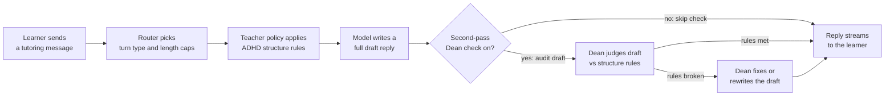

# Draft: §1 Introduction

**Status:** Human voice rewrite v2 · **approved** · mid-intro Figure 1 added · 2026-07-14  
**Rule:** `.cursor/rules/paper1-human-voice-rewrite.mdc`  
**Flow:** problem → why prompts fail → what we do / enforcement → named system → Dean + Fig 1 → not AiTutor → RQs → contributions

---

## 1. Introduction

Students already treat LLM chat as an ordinary study tool. The product shows up as a blank box and a stream of answers. That would be fine if every answer were easy to scan and easy to re-enter.

It is not. Default replies look like essays: long continuous prose, several threads in one answer, almost no help if you leave and come back. The design assumes the reader can hold attention, keep the answer in working memory, and pick up after a distraction. For many students with ADHD, those assumptions are where accessibility breaks. Walls of text raise extraneous load. Missing signposts make tab-switching expensive. Compound answers invite more drift on the next turn.

So people try prompts. Students with ADHD (and instructors trying to help) ask the model to "summarize first," "use three bullets," "take one step at a time," or "don't digress." That can work for a turn. It rarely sticks for a session. The model is trained to sound helpful and fluent; multi-turn context pulls it back toward verbosity, topic-merge, and essay form. If ADHD support only works when the user re-pleads for structure on every message, accessibility depends on perfect prompting. That is not a reliable interactive system.

The interface question, then, is larger than one better system prompt. What should the tutoring product do when dialogue context drifts? We argue it has to **steer and check** generative replies, not just ask politely.

**What this work does.** Instead of accepting long, unstructured answers that can overwhelm students with ADHD, we apply research-backed structure rules so tutoring replies stay focused and clearly shaped. Then we verify each draft with a second AI before the student sees it. Asking the model once to "stay short" is prompting. Writing those rules into the system and checking every reply against them before emit is **enforcement**. Making ADHD-supportive LLM tutoring reliable is an enforcement problem, not a prompting problem.

That claim has consequences we can measure. Unconstrained models almost never hold the scaffold we need. Putting the rules in the prompt recovers most of it. A second-pass checker can add a further adherence gain without changing the underlying model, retrieval, or tools. We also ran a small ADHD human pilot (overload, comprehension, usability) as an early step toward inclusive AI tutoring. In this paper that pilot is **feasibility only**. It is not confirmatory proof that Assist reduces cognitive load.

We build the idea inside **EduAI** as **ADHD Assist**. Assist is a response-shape policy grounded in the literature (five pillars), not a second chat product.

The enforcement piece is a Router→Teacher→Student→**Dean** pipeline adapted from Liu et al.'s (2024) oversight pattern. The Dean's job is narrow. It judges a full draft against a written constitution for structure (length, summary / Next?, turn profile). When Assist+oversight is on, it may revise that draft *before* the learner sees it. Figure 1 shows the path from learner message to stream-out.

**Figure 1.** How ADHD Assist runs in EduAI chat. A learner message is typed; the Router picks the turn type and length caps; the Teacher policy applies the ADHD structure rules; the model writes a full draft. If second-pass Dean checking is on, the Dean judges that draft against those rules and may fix or rewrite it before anything streams to the learner. If Dean is off, the draft goes out without that audit. Adapted from Liu et al.'s (2024) Dean oversight cadence. Source: `paper-1/figures/fig1-pipeline.mmd`.

One boundary matters up front. Guided Socratic discovery in a separate AiTutor extension is related platform work. This paper's contribution is the structural Assist layer in core chat. We do not claim that pedagogy here.

### Research questions

We keep four questions from our Form A programme. They are not equal empirical claims in this paper.

| Form A | Role here | Home |
| ------ | --------- | ---- |
| **RQ1** Which response attributes support ADHD learners? | Design rationale (pillars + technique×symptom mesh; mesh cells argued, not measured) | §3 |
| **RQ2** Can an LLM keep those patterns across multi-turn use? | Supporting result (baseline drift vs assist arms) | §5 |
| **RQ3** Does a second oversight layer improve adherence over prompting alone? | **Primary research question** | §4–§5 |
| **RQ4** Does Assist improve load / learning for ADHD students vs baseline? | Protocol feasibility + descriptive human metrics only; **not** confirmatory | §6 |

**Primary RQ (this paper):** Does a second-pass oversight layer improve structural scaffold adherence over prompting alone when multi-turn interaction causes drift?

### Contributions

1. **Design (§3).** Five ADHD Assist pillars (concise, structured, progressively disclosed, single-focus, gentle redirect) and a theoretical technique × symptom mesh that states which deficits each pillar is meant to repair, including honest under-coverage (reward / deep metacognition).
2. **System (§4).** An interactive control path in EduAI: same model, retrieval, tools, and temperature across arms; Assist = policy prepend ± Dean audit on a full draft before stream-out to the learner (style-only IV).
3. **Measured ablation (§5).** On Form A multi-turn probes (5× repeats, Gemini 2.5 Flash), baseline structural pass is **0%**; assist-prompt-only reaches **67% strict / 76% profile**; assist+oversight reaches **71% strict / 80% profile** (late-turn profile **86% → 89%**). Oversight lift is real but modest. We lead with profile pass for assist comparisons because strict scoring under-credits correct redirects.
4. **Feasibility boundary (§6).** A short within-person ADHD pilot (H26-00906; analyzed **n = 6**, preview-heavy) shows the protocol and Assist toggle are operable. Descriptives lean Assist-ward; they are **not** confirmatory evidence of reduced load. Powered human outcomes and ADHD × non-ADHD interaction remain Paper 2.

Roadmap: related work and gap (§2), design (§3), system (§4), Study 1 (§5), human feasibility (§6), discussion (§7), limitations (§8).

---

## Voice-edit checklist

- [x] Each body paragraph opens with the point (ahh-makes-sense)
- [x] EduAI / Dean / AiTutor are separate beats, not one splat
- [x] No em dashes
- [x] Freeze numbers unchanged
- [x] Mid-intro Figure 1 (pipeline) after Dean beat
- [ ] User approved Figure 1 caption before §2
