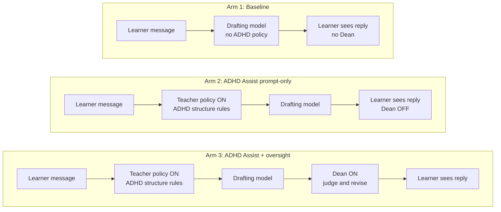

# Draft: §4 System (EduAI instantiation)

**Status:** Human voice rewrite v2 · **Figure 2 approved** · awaiting full §4 verify · 2026-07-14  
**Rule:** `.cursor/rules/paper1-human-voice-rewrite.mdc`

---

## 4. System: Instantiation in EduAI

ADHD Assist is not a second chat product. It is a mode inside EduAI chat: a toggle, a structure policy, and an optional second-pass check before the learner sees the reply.

When the mode is off, EduAI tutors as usual. When it is on, the model, retrieval, tools, and temperature stay the same. What changes is whether replies are asked to follow an ADHD-supportive shape, and whether that shape is checked before emit.

### 4.1 The Dean-guided pipeline

Liu et al. (2024) use a **Dean-Teacher-Student** pipeline for tutoring dialogues. Three LLM agents interact. The Dean judges whether the Teacher's turn meets stated teaching requirements and may revise that turn before the Student sees it. That judge-and-revise step is the piece we keep.

We adapt the pattern for ADHD Assist in EduAI. Two differences matter:

1. Our final audience is a **human learner**, not a simulated Student agent.
2. We add a **Router** that decides turn type before generation. SocraticLM does not have that gate.

Study 1 then turns the adapted stack into three enforcement depths. Figure 2 is that comparison (Figure 1 in §1 is the single runtime flowchart with Router detail).

**Figure 2.** Three Study 1 arms on the Teacher-Dean control stack. **Baseline:** drafting model only; learner sees the raw style. **ADHD Assist prompt-only:** Teacher policy is on (ADHD structure rules), Dean is off. **ADHD Assist + oversight:** Teacher policy and Dean are both on; the Dean may judge and revise before the learner sees the reply. Same drafting model in all arms. Visual: `paper-1/figures/fig2-three-arms.png` (source mermaid: `fig2-dean-pipeline.mmd`).

#### Router

The Router runs first on Assist-on turns. It assigns a turn profile (full tutoring, brief clarification, redirect, greeting, confirmation, meta). That profile decides whether the full scaffold is required and whether the Dean may intervene. Without it, Assist would hang a tutoring template on everyday "thanks" messages. Baseline skips Assist, so it also skips this Assist-scoped routing.

#### Teacher

When Assist is on, the ADHD Assist policy is prepended to the system prompt (scoped by profile). Those rules are the requirements the Dean later checks. In Study 1, the **prompt-only** arm stops here: Teacher on, Dean off.

#### Drafting model

EduAI's ordinary generation path writes the first-pass reply in every arm. When oversight is on, the draft is held server-side so the Dean sees a complete answer, not a half-streamed fragment. The learner does not read the raw first pass when the Dean is scheduled to run.

#### Dean

The Dean is the oversight role. It judges whether the draft meets the ADHD Assist constitution for this profile. If not, it revises before presentation: deterministic structural fixes when possible, otherwise a second model rewrite. Greeting, confirmation, and meta turns skip the Dean. We supervise **structure**, not Socratic questioning style. In the runs reported here, the Dean uses the same model as the drafting model (`google:gemini-2.5-flash`). A separately sized Dean is possible in the architecture but is not evaluated in Study 1; see Limitations for exploratory capacity notes and the quality–latency–cost follow-on. The Dean appears only in the oversight arm of Figure 2.

| Arm | Teacher policy | Dean | Learner sees |
| --- | --- | --- | --- |
| Baseline | off | off | raw draft style |
| Prompt-only | on | off | draft after policy only |
| Oversight | on | on | draft after Dean check |

### 4.2 Style is the only planned difference

Across Study 1 arms we freeze the chat model, retrieval, tools, temperature, and streaming contract. We only change whether the Teacher policy is prepended and whether the Dean runs. Second-pass latency (about 1–3 s on tutoring turns in our current stack) is an engineering cost of oversight, not a second research factor.

This paper claims the ADHD Assist structural layer in EduAI core chat. Guided discovery on a separate tutoring surface is related platform work, not this contribution.

### 4.3 Turn profiles

| Profile | Full scaffold? | Dean? |
| --- | --- | --- |
| Full tutoring, brief clarification | yes | yes, if the draft fails |
| Redirect | no (one-topic boundary template) | yes, if that template fails |
| Greeting, confirmation, meta | no | no |

That is why Study 1 leads with **profile pass** when comparing assist arms. A correct redirect should not be forced into a Top summary block. The interface may show TLDR / Continue; metrics still use Top summary / Next?.

### 4.4 What the Dean may change

The constitution asks three questions:

1. Does the draft match the shape required for this profile?
2. Is it under the word cap and single-focus rules when those apply?
3. Can we restore compliance without inventing course facts?

The Dean may restore markers, trim over-cap text, and push redirects onto the boundary template. It is not a second tutor rewriting pedagogy. Until a sampled content-parity audit is published, Results claim scaffold adherence only, not that structure changes never touch facts.

### 4.5 Hand-off to Study 1

Same machine. Same synthetic turns. Same model. Three enforcement depths: baseline, prompt-only, oversight. That is the primary research question.

---

## Voice-edit checklist

- [ ] Role subsections readable like Liu 3.2
- [ ] Figure 2 embedded; no Form A / PR jargon
- [ ] No em dashes
- [ ] User approved before §5
